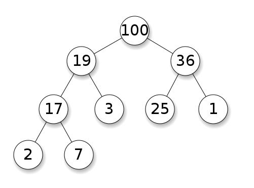

AI roadmap https://github.com/apachecn/ai-roadmap/tree/master/v1.0
deep learning book online - need code implementation

https://github.com/MichalDanielDobrzanski/DeepLearningPython35/blob/master/network.py
https://github.com/antonvladyka/neuralnetworksanddeeplearning.com.pdf
zip=pair-up element-wise
on page 100

CNN - vision; 3 layers: convolution, pooling, full connection
RNN - sequence analysis/NLP, keras

1. 斯坦福CS231N计算机视觉作业讲解
2 layer net has both forward and backward gradient calc
https://github.com/L1aoXingyu/cs231n-assignment-solution/blob/master/assignment1/two_layer_net.ipynb
https://www.bilibili.com/video/BV1t4411U78z?p=6 batch normalization (reached)
https://github.com/L1aoXingyu/cs231n-assignment-solution/blob/master/assignment2/cs231n/layers.py has batchnorm_backward
and batchnorm_forward; batch norm vs layer norm; batchnorm_backward_alt is 1.4 times faster than batchnorm_backward;
layernorm_forward() and layernorm_backward() implemented

https://github.com/L1aoXingyu/cs231n-assignment-solution/blob/master/assignment2/cs231n/classifiers/fc_net.py
is about dropout for fc_net.py
Fully-connected nets with Dropout
CNN

2. andrew ng machine learning assignment solutions python; exercise 4 has NN for both forward and backpropagation
video - https://www.bilibili.com/video/BV124411A75S?p=6
code -
only feedforward - https://github.com/Akpandita/Andrew-NG-ML-Python-Solutions/blob/master/Exercise3/exercise3.ipynb
feedforward and backpropagation https://github.com/suraggupta/coursera-machine-learning-solutions-python/blob/master/Exercise4/exercise4.ipynb

https://github.com/shamiul94/Machine-Learning-Coursera-Assignments-Solution/blob/master/Assignment-4/Given-Materials-Python/exercise4.ipynb

https://github.com/DantesHub/my-coursera-machine-learning-solutions-python/blob/master/Exercise4/exercise4.ipynb

3. tensorflow DFN model:
https://github.com/apachecn/misc-docs-zh/blob/master/docs/python-programming-net/python-programming-net-ml/4.md
stock price forecasting:
https://github.com/apachecn/misc-docs-zh/blob/master/docs/python-programming-net/python-programming-net-ml/1.md

source is at pythonprogramming.net, the NN started at:

https://pythonprogramming.net/tensorflow-deep-neural-network-machine-learning-tutorial/

and ended at:

https://pythonprogramming.net/data-size-example-tensorflow-deep-learning-tutorial/?completed=/train-test-tensorflow-deep-learning-tutorial/

https://github.com/apachecn/misc-docs-zh/blob/master/docs/first_contact_with_tensorFlow/4.md

弱鸡才用tensorflow，强者一个numpy就够：从零开始神经网络第一期
https://www.bilibili.com/video/BV1m4411x7KU/?spm_id_from=333.788.videocard.7
https://peigizhu.gitee.io/2020/07/23/%E5%8D%B7%E7%A7%AF%E7%A5%9E%E7%BB%8F%E7%BD%91%E7%BB%9C%E5%AD%A6%E4%B9%A0%E7%AC%94%E8%AE%B0/
https://www.bilibili.com/video/BV1z4411e7WE
https://gitee.com/peigizhu/NeuralNetworks/blob/master/DeeplearningPro.py

知识体系、算法题、教程、面经，这是一份超赞的AI资源列
https://cloud.tencent.com/developer/article/1472683

https://www.bilibili.com/video/BV1t4411U78z?p=1
code https://github.com/L1aoXingyu/cs231n-assignment-solution/blob/master/assignment1/softmax.ipynb
https://www.bilibili.com/video/BV1t4411U78z?p=4
https://nndl.github.io/ 复旦 good book
https://github.com/nndl/exercise/blob/master/chap2_linear_regression/linear_regression-tf2.0.ipynb

https://towardsdatascience.com/building-neural-network-from-scratch-9c88535bf8e9
https://github.com/jldbc/numpy_neural_net/blob/master/four_layer_network.py

not sure https://github.com/JGuymont/numpy-multilayer-perceptron/blob/master/neural_network/mlp.py
https://github.com/MingchaoZhu/DeepLearning/blob/master/code/chapter6.py#L52
http://deeplearning.net/tutorial/code/mlp.py

chap 6 deep feedforward networks = feedforward neural networks = multi-layer perceptrons (MLP)
math/linear algebra/probability/statistics are so complicated now only computer can understand them.
no programming no math; math should be done by computer, not human!
bagging=bootstrap aggregating
ROC=receiver operating characteristic curve
AUC = area under curve

3blue1brown, aops, brilliant.org/3b1b
https://www.youtube.com/watch?v=XkY2DOUCWMU&list=PLZHQObOWTQDPD3MizzM2xVFitgF8hE_ab&index=4
natural pattern - pattern recognition
addition, multiplication, composition = 3 ways to get a new function; sum rule, product rule, chain rule
taylor series = radius of convergence; ln(x) diverges; e^x converges
visual=graph=geometry; number=algebra=literal=language
fourier transform=everything is rotations https://www.youtube.com/watch?v=r6sGWTCMz2k

https://brilliant.org/principles/
The mind is not a vessel to be filled, but a fire to be kindled.”
— Plutarch
passion - Effective math and science learning…
Excites.
The greatest challenges to education are disinterest and apathy.

Cultivates curiosity.
Questions and storytelling that cultivate natural curiosity are better than the threat of a test.

Is active.
Effective learning is active, not passive. Watching a video is not enough.

Is applicable.
Use it or lose it: it is essential to apply what you're learning as you learn it.

Is community driven.
A community that challenges and inspires you is invaluable.

Doesn't discriminate.
Your age, country, and gender don't determine what you are capable of learning.

Allows for failure.
The best learners allow themselves to make many mistakes along their journey.

Sparks questions.
The culmination of a great education isn't knowing all the answers — it's knowing what to ask.

Brought to you by you: http://3b1b.co/alt-calc-thanks
And by Brilliant: https://brilliant.org/3b1b
Home page: https://www.3blue1brown.com
Essence of calculus series:
http://3b1b.co/calculus
Really nice applet made based on this video by Reddit user Larconneur:
https://www.geogebra.org/m/rftwacsy
Various social media stuffs:
Website: https://www.3blue1brown.com
Twitter: https://twitter.com/3blue1brown
Patreon: https://patreon.com/3blue1brown
Facebook: https://www.facebook.com/3blue1brown
Reddit: https://www.reddit.com/r/3blue1brown
An animated introduction to the Fourier Transform.
Home page: https://www.3blue1brown.com/
Brought to you by you: http://3b1b.co/fourier-thanks

Follow-on video about the uncertainty principle: https://youtu.be/MBnnXbOM5S4

Interactive made by a viewer inspired by this video:
https://prajwalsouza.github.io/Experiments/Fourier-Transform-Visualization.html
https://prajwalsouza.github.io/Experi...

Also, take a look at this Jupyter notebook implementing this idea in a way you can play with:
https://github.com/thatSaneKid/fourie...
https://github.com/thatSaneKid/fourier/blob/master/Fourier%20Transform%20-%20A%20Visual%20Introduction.ipynb

------------------
Animations largely made using manim, a scrappy open-source python library.  https://github.com/3b1b/manim


https://www.math.uwaterloo.ca/~hwolkowi/matrixcookbook.pdf 2012
http://www.cs.toronto.edu/~bonner/courses/2018s/csc338/matrix_cookbook.pdf 2006
https://www.ics.uci.edu/~welling/teaching/KernelsICS273B/MatrixCookBook.pdf 2005

读Ian Goodfellow 深度学习教科书：图解版
https://www.bilibili.com/video/BV1uW411g7im?p=10
https://www.bilibili.com/video/BV1uW411g7im/?spm_id_from=333.788.videocard.6

《深度学习》花书啃书指导！大佬级up主：同济子豪兄出任导师哦~【完结】
https://www.bilibili.com/video/BV1kE4119726?p=6
https://github.com/exacity/deeplearningbook-chinese
https://github.com/MingchaoZhu/DeepLearning
https://zhuanlan.zhihu.com/p/38431213 深度学习花书读书笔记目录

https://www.asimovinstitute.org/neural-network-zoo/
https://towardsdatascience.com/the-mostly-complete-chart-of-neural-networks-explained-3fb6f2367464
https://www.deeplearningbook.org/

google embedding projector
https://www.naftaliharris.com/blog/visualizing-k-means-clustering/
https://stanford.edu/class/engr108/visualizations/kmeans/kmeans.htmld

深度之眼官方账号【0基础小白学习公开课/书籍进阶之路】
1、机器学习入门：
吴恩达《机器学习》公开课，作业讲解： BV124411A75S
2、机器学习进阶：
周志华《机器学习》西瓜书，啃书指导： BV1wx411o7CK
李航《统计学习方法》，啃书指导：BV1i4411G7Xv
《机器学习实战》，啃书指导：BV1y4411g7ia
3、深度学习入门：
神经网络基础 :http://suo.im/69ytXN
4、深度学习框架学习：
PyTorch框架实战 http://suo.im/5UAGgp
TensorFlow2.0框架班:http://suo.im/5UAGv5
5、深度学习进阶：
《深度学习》花书，啃书指导： BV1kE4119726
6、深度学习应用：
斯坦福李飞飞《计算机视觉》CS231N公开课作业讲解 BV1t4411U78z
斯坦福CS224N《自然语言处理》公开课作业讲解 BV1X4411977R
7、求职面试：
《百面机器学习》葫芦书 啃书指导: BV1gt41157eq
求职分享区 BV1Vt411F7NW
经验分享区 BV1J4411B72T
（ 备注:获取以上电子书, 加我微信:  deepshare1010  ）
P1
深度学习花书-开场白
01:44
P2
花书全书内容概览
04:21
P3
花书参考资料盘点
03:43
P4
第一章-深度学习导论
35:59
P5
第二章-线性代数
22:31
P6
第三章-概率论和信息论
21:24
P7
第四章-数值计算
22:51
P8
第五章-机器学习基础
33:48
P9
第六章 深度前馈神经网络
31:46
P10
第七章 深度学习的正则化
31:01
P11
第八章 深度学习的训练优化
36:45
P12
第九章 卷积神经网络
23:02
P13
第十章 序列模型-循环神经网络和递归神经网络
22:11
P14
第十一章-训练调优实战方法
34:50
P15
第十二章-深度学习应用
28:17
P16
第十三章-线性因子模型
11:47
P17
第十四章-自动编码器
19:44
P18
第十五章-表示学习
28:39
P19
第十六章-结构化概率模型
16:05
P20
第十七章-蒙特卡洛方法
21:41
P21
第十八章-配分函数
15:33
P22
第十九章-近似推断
17:54
P23
第二十章-深度生成模型-生成模型综述
26:00
P24
第二十章-深度生成模型-生成对抗网络GAN
18:42


git filter-branch -f --index-filter 'git rm --cached --ignore-unmatch file'

洛谷 P1551. 并查集板子（亲戚）题解 
https://www.acwing.com/file_system/file/content/whole/index/content/1415047/

【一起啃书】机器学习西瓜书白话解读
https://www.bilibili.com/video/BV17J411C7zZ/?spm_id_from=333.788.videocard.0
https://www.bilibili.com/video/BV1wx411o7CK?p=3

trie, union find,heap 第二章 数据结构（二）

trie - efficient store and find string set
in dictionary order;
https://www.geeksforgeeks.org/trie-insert-and-search/


台湾大学林轩田机器学习笔记
https://github.com/apachecn/ntu-hsuantienlin-ml

(上海交通大学张志华)机器学习导论

https://www.bilibili.com/video/BV1jt411b76n/?spm_id_from=333.788.videocard.0
same as not much content http://ocw.sjtu.edu.cn/G2S/OCW/cn/CourseDetails.htm?Id=397

<<<<<<< HEAD
foundations of machine learning book https://cs.nyu.edu/~mohri/mlbook/

=======
>>>>>>> 4ce3a9db7aa3cc1482630adf91fe787828ed5d79
taiwan
https://www.youtube.com/watch?v=9kra9i6jS1g&list=PLk5MIQ__5Xo02mG9liAPl5vpjup7LapFr&index=1

# -*- coding: UTF-8 -*-

import pickle
然后选几样您喜欢的小菜，统统装进【葫芦】里。

food = ["白萝卜", "白菜", "黄瓜", "卷心菜", "海带"]
接下来，只要把食物放进去，封口(dump)，找个地方放着就成了。讲究点的，也会专门在冰箱或者储物柜里留个包场，就像这样：

pickle.dump(food, open("./data/food", "w"))
赶明儿和客人谈得热闹，就可以摆上两三小菜，再来两盅老酒，一杯清茶：

import pickle

food = pickle.load(open("./data/food", "r"))
不过啊，这样做出来的小菜，放哪儿都一样，太平淡了，比洋人的可乐炸鸡还标准：

【./data/food】（in python2）


这样做菜快是快了，却少了点咱传统里，高山流水酬知音那味儿，总觉不够尽心。

因此小店总是按客人的口味，多配几种【盐(salt)】。这便是小店的【绝密拍黄瓜(EncryptedPickle)】。

客人爱吃榴莲口儿的，就记上, salt = “榴莲”

#!/bin/env python2

#encoding=utf-8

from encryptedpickle import encryptedpickle

salt = '\0' * 26 + '榴莲'

passphrases = {

0: salt

}

food = ["白萝卜", "白菜", "黄瓜", "卷心菜", "海带"]

encoder = encryptedpickle.EncryptedPickle(

signature_passphrases=passphrases,

encryption_passphrases=passphrases

)

special_pickle = encoder.seal(food)

with open('./data/food_with_salt', 'w') as f:

f.write(special_pickle)
别的客人要想打开看看坛子里装的什么内容，可就没那么容易了。

【./data/food_with_salt】（in python2）

EPAQAAAAABAAAAPPkdEWPeLgAdqqGIV3CbNy-wJqTvVX_vw-fvcdTJt0lnHUtAG8K3yKyNwoGK9QDFN1cLj4Ba7eXJqRKEiamAB2uQdUsgvKHgICQYxdT_7cJXLb3M9wj76b6E0-gPBlD-GDu7iOaZH2nWMGJJn_we3QC9Lnmlfek-GbrAJYvcDSDLxtdo9CXtPkAc9Ah0dHehFapOk2YMXYCPxaU5kGX1S53ekqMoNAcRuQ7_i42ccyONoyeyvr_s8MwhrZugUU3a2Z0gArhHEyH3hQBUAMtSwg
这salt的内容，可是咱们之间的秘密。

来，尝尝这为您私人订制的小菜：

encoder.unseal(special_pickle)

https://www.acwing.com/file_system/file/content/whole/index/content/1386881/


https://www.youtube.com/watch?v=0ttRHJUHZog&list=PLXVfgk9fNX2L9tQhO-Tqk58TzC6mTJ7OV&index=7
https://github.com/yiaktan/NLP-Stock-Prediction/blob/master/Data%20Collection%20%26%20PreProcessing.ipynb

https://github.com/decentralion/RoboBuffett not working
machine learning stock analysis edgar github

https://www.csie.ntu.edu.tw/~htlin/course/ml20fall/
Hsuan-Tien Lin

probability to the rescue - hoeffding inequality!!!
https://www.youtube.com/watch?v=MgAihqFPkZc&list=PLXVfgk9fNX2L9tQhO-Tqk58TzC6mTJ7OV&index=6

P[|m-n|>e] <= 2 exp (-2*e^2*N)
N is sample size; m is real unknown out-of-sample mean; n is the in-sample nu;
does not depend on mu, no need to know mu!
probably approximately correct (PAC)

https://www.youtube.com/watch?v=0ttRHJUHZog&list=PLXVfgk9fNX2L9tQhO-Tqk58TzC6mTJ7OV&index=7

iid=independent and identically distributed

Textbook: Learning from Data, by Yaser Abu-Mostafa, Malik Magdon-Ismail and Hsuan-Tien Lin
has Hoeffding inequality

DSA:
Textbook: Data Structures and Algorithms in C++, 2nd Edition by Goodrich, Tamassia and Mount

pattern=function=model?

Russell and Norvig. Artificial Intelligence: A Modern Approach. A comprehensive reference for all the AI topics that we will cover.
Koller and Friedman. Probabilistic Graphical Models. Covers factor graphs and Bayesian networks (this is the textbook for CS228).
Sutton and Barto. Reinforcement Learning: An Introduction. Covers Markov decision processes and reinforcement learning. Available free online.
Hastie, Tibshirani, and Friedman. The elements of statistical learning. Covers machine learning. Available free online.
Tsang. Foundations of constraint satisfaction. Covers constraint satisfaction problems. Available free online.
https://stanford-cs221.github.io/autumn2020/

Statistical Learning Theory
https://github.com/percyliang/cs229t/blob/master/lectures/notes.pdf


ML for Edgar:
https://github.com/yiaktan/NLP-Stock-Prediction/blob/master/Data%20Collection%20%26%20PreProcessing.ipynb

python3 -m venv myenv
source myenv/bin/activate
#jupyter notebook test.ipynb will start safari 
jupyter notebook Data\ Collection\ \&\ PreProcessing.ipynb


利用STL::allocator分配特定类型的数组
小小蒟蒻的头像小小蒟蒻
16小时前
#include <memory>
#include <iostream>
#include <string>
using namespace std;
const int MAX_LEN = 10;

int main()
{
    // 利用stl的allocator构造int数组
    allocator<int> type_int;
    int* a = type_int.allocate(MAX_LEN);
    for (int i = 0; i < MAX_LEN; i++)
    {
        type_int.construct(a + i, i);
        cout << a[i] << " ";
    }
    cout << endl;

    for (int i = 0; i < MAX_LEN; i++)
    {
        type_int.destroy(a + i);
    }
    type_int.deallocate(a, MAX_LEN);

    return 0;
}


美团机试题 求助
来日可期_7的头像来日可期_7
12小时前
我们称一个长度为n的序列为正则序列，当且仅当该序列是一个由1~n组成的排列，即该序列由n个正整数组成，取值在[1,n]范围，且不存在重复的数，同时正则序列不要求排序。
有一天小团得到了一个长度为n的任意序列，他需要在有限次操作内，将这个序列变成一个正则序列，每次操作他可以任选序列中的一个数字，并将该数字加一或者减一。请问他最少用多少次操作可以把这个序列变成正则序列。

输入描述：
输入第一行仅包含一个正整数n,表示任意序列的长度。(1<=n<= 20000)
输入第二行包含n个整数，空格隔开，表示给出的序列，每个数的绝对值都小于10000。


trinity 2015 taiwan
AI, data mining, stats
theory : hoeffding, multi-bin hoeffding, vc
linear models: PLA/pocket, linear regression, logistic regression
tools: feature transform,regularization, validation
future: transform, regularization,less label
KDDCup2011
https://www.youtube.com/watch?v=jIpwy-mPvIA&list=PLXVfgk9fNX2IQOYPmqjqWsNUFl2kpk1U2&index=65
matrix factorization, restricted boltzmann machine, k NN, prob latent semantic analsys
linear regression, NNet, GBDT
2012 linear blending of models without overfitting
random forest, GBDT variants, designing features
construct features w/ domain knowledge
ICDM 2006 -decision tree, k-means,SVM, apriori - for frequent iemset mining
EM - alternating optimation
pagerank - link-analysis, matrix factorization
adaboost
knn
naive bayes
c&rt - data mining
missing linreg, logreg,random forst, nnet, gbdt
machine learning jungle
1126 is a lunck number?

https://www.bilibili.com/video/BV1aE411o7qd?p=130
机器学习-白板推导系列-合集
共23个系列, 130个视频
pla- perceptron linear algorithm

caltech cs156 yaser on ML: 2012
baysian - just watch the last video - reverse the order!
google earth, brain
entropy = VC dimension, hypothesis testing
stem=reductionism=god
multimeter + co detector

airplane wheels
trinity - data snooping/honesty, razor, sampling bias, ; newton 3; 
pattern, data

https://clist.by/

An awesome list for competitive programming! https://codeforces.com/blog/entry/23054
LIST OF AWESOME LEARNING RESOURCES https://www.topcoder.com/thrive/articles/List%20of%20awesome%20learning%20resources

https://hihocoder.com/
https://github.com/zbh24/hihocoder

http://web.stanford.edu/class/cs97si/ 
https://github.com/prakhar1989/awesome-courses#algorithms
https://github.com/tgnco1218/10-Algo book
https://www.quora.com/What-is-coordinate-compression-and-what-is-it-used-for
https://discuss.codechef.com/t/data-structures-and-algorithms/6599
contest calendar - https://clist.by/

https://www.quora.com/How-do-I-start-competitive-programming-5
https://www.quora.com/How-can-I-become-good-at-competitive-programming-Are-there-any-courses-that-will-take-me-one-step-forward-before-I-start-doing-SPOJ-or-TopCoder-problems
https://www.quora.com/How-is-competitive-programming-different-from-real-life-programming
https://www.quora.com/What-have-you-gained-from-competitive-programming

Algorithhms 4th Edition by Robert Sedgewick, Kevin Wayne
https://drive.google.com/file/d/1UgJDvc4pPDJgqA0bcH_M2NQ75S6_P27F/view?usp=sharing


后台开发技术博客汇总 list of tech notes http://www.linya.pub/
华为消费者BG推荐算法面经
https://www.acwing.com/file_system/file/content/whole/index/content/1293884/
深信服“算法大牛计划”面经 已拿意向书
https://www.acwing.com/file_system/file/content/whole/index/content/1293850/
知乎后端开发工程师 交叉面（第一次面试遇到架构师）
https://www.acwing.com/file_system/file/content/whole/index/content/1295875/

CH/POJ? in comments https://www.acwing.com/solution/content/826/

刷LeetCode的方式：先从Top100 liked 的tag开始刷（这个tag的题我刷了好几遍）。刷完之后按topic的tag刷过一段时间，后来改成了选择难度之后按顺序刷。一开始就按照ac率从高到低乱刷，后面就只刷点赞比点踩多不少的题。有一段时间每周的周赛基本都参加，不过最后也就是2000分的水准，比较弱。我一道题如果较长时间想不出来（比如半小时到一小时），就会去看discussion，主要是太懒了不想动脑子。自己A了的题也会去看discussion，去学别人比较好的解法（后来是学写法），然后自己照着敲一遍。不会或者不是最优解法的题，过一段时间如果记得的话就再做一遍，不过一般都是不记得了：(

作者：胡津铭
链接：https://www.zhihu.com/question/32019460/answer/887877092
来源：知乎
 。

leetcode 136 137 260 - single number in an array

https://github.com/ZJULearning
http://dengcai.zjulearning.org.cn/
https://www.zhihu.com/question/32019460/answer/887877092
https://youtu.be/U6r3R87AKHI 第1175期 沈向洋：有效的科研法则

interviews-
https://www.acwing.com/file_system/file/content/whole/index/content/1293307/
https://www.acwing.com/file_system/file/content/whole/index/content/1293224/
https://www.acwing.com/file_system/file/content/whole/index/content/1293200/
https://www.acwing.com/file_system/file/content/whole/index/content/1293036/
https://www.acwing.com/blog/content/19/ hulu by yxc
https://www.acwing.com/blog/content/3042/


derivative/calculus https://www.quora.com/How-would-you-find-the-original-function-given-the-derivative-of-that-function-For-example-find-f-x-if-f-x-x-2-1

DNS why use UDP?
https://www.geeksforgeeks.org/why-does-dns-use-udp-and-not-tcp/
https://www.quora.com/Why-does-DNS-use-UDP#:~:text=DNS%20uses%20the%20User%20Datagram,UDP%20reply%20from%20the%20server.

good solutions - 

https://www.acwing.com/solution/content/19076/
https://www.acwing.com/solution/content/804/

time is a much more limited resource than space!!!

tree - recursion defined; 2 split if having monotonicity;

way to think - silu = ideas  

BFS can get shortest path; DFS can't; this is b/c BFS has distance info, DFS doesn't. DFS is easier to implement, it uses recursion.
bfs uses priority queue - Handbook chap 12 has best explanation

A queue is a data structure that contains some elements, and the only way the contents of the structure change are by popping elements off of the front of the queue, or by pushing elements onto the back. Elements are popped off in the order that they’re pushed, so for example the first element that’s pushed will be the first element that’s popped, and the last will be the last.

In a priority queue, each element has some type of value that can be ordered with respect to other values of the same type (like a number, or a string [strings can be ordered lexicographically]). As elements are pushed onto the back or popped off of the front, the priority queue re-orders itself to make the front of the queue contain the element with the smallest value (or the largest, if the priority is defined to be in descending order).

So, if you pop all of the elements off of a priority queue, their values will always come out in either ascending or descending order. But if you do that with a queue — elements come out in FIFO (first in first out) order

https://www.acwing.com/file_system/file/content/whole/index/content/1291720/

matrix rank - https://www.mathsisfun.com/algebra/matrix-rank.html

```
#include <bits/stdc++.h>
using namespace std;
#define ll long long
#define fir(i,a,b) for(ll i=a;i<=b;i++)

const int N = 1e5+10;

ll n,m,t,a[N],b[N],s[N],x,y;
ll calc(ll a[], ll n){
fir(i,1,n){
    a[i]-=(a[0]/n);
    s[i]=s[i-1]+a[i];
}
sort(s+1,s+n+1);
ll mid=(n+1)>>1,ans=0;
fir(i,1,n) ans+=abs(s[mid]-s[i]);
return ans;
}

int main(){
    cin>>n>>m>>t;
    fir(i,1,t){scanf("%d%d",&x,&y); a[x]++;b[y]++;}
    fir(i,1,n) a[0]+=a[i];
    fir(i,1,m) b[0]+=b[i];

    ll as=a[0]%n,bs=b[0]%m;
    if(!as && !bs) cout<<"both "<<calc(a,n)+calc(b,m);
    else if(!as) cout<<"row "<<calc(a,n);
    else if(!bs)cout<<"column "<<calc(b,m);
    else cout<<"impossible";

    return 0;
}
'''
行列变换互不影响，转换成环形纸牌分配问题，排序找中位数
'''

m, n, p = map(int, input().split())

row_cnt = [0] * m   # 每一行的点数量
col_cnt = [0] * n   # 每一列的点数量
for _ in range(p):
    a, b = map(int, input().split())
    a, b = a-1, b-1
    row_cnt[a] += 1
    col_cnt[b] += 1

if p % m != 0 and p % n != 0:
    print('impossible')

else:
    cnt1, cnt2 = None, None
    if p % m == 0:
        mean = p // m
        arr = [0]
        S1, S2 = 0, 0
        for i in range(m-1):
            S1 += row_cnt[i]
            S2 += mean
            arr.append(S1-S2)

        arr.sort()
        mid_val = arr[m//2]         # 中位数
        cnt1 = 0
        for val in arr:
            cnt1 += abs(val - mid_val)

    if p % n == 0:
        mean = p // n
        arr = [0]
        S1, S2 = 0, 0
        for i in range(n - 1):
            S1 += col_cnt[i]
            S2 += mean
            arr.append(S1 - S2)

        arr.sort()
        mid_val = arr[n // 2]       # 中位数
        cnt2 = 0
        for val in arr:
            cnt2 += abs(val - mid_val)

    if cnt2 is None:
        print(f'row {cnt1}')
    elif cnt1 is None:
        print(f'column {cnt2}')
    else:
        print(f'both {cnt1 + cnt2}')
        
#include<iostream>
#include<math.h>
using namespace std;
typedef long long ll;

//get x^y in log(y) time by converting power to multiplication
ll qexp(ll x, ll y){
        ll ans=1;
        while(y){
                if(y&1) ans=ans*x;
                x*=x;
                y>>=1;
        }
        return ans;
}

//base and exponent

//multiplicand and multiplier

//get x*y in log(y) time by converting multiplication to addition
ll qmulti(ll x, ll y){
        ll ans=0;
        while(y){
                if(y&1) ans=ans+x;
                x+=x;
                y>>=1;
        }
        return ans;
}

int main()
{
    long long x,y;
    cin>>x>>y;
    long long res=1;

    res=qexp(x,y);
    cout<<res<<endl;
    res=qmulti(x,y);
    cout<<res<<endl;

    res=1;
        //get x^y in log N time by converting power to multiplication
    while(y)
    {
        if(y&1) res=res*x;
        x=x*x;
        y>>=1;
    }
    cout<<res<<endl;
    return 0;
}
```

```
#include<iostream>
#include<math.h>
using namespace std;
int main()
{
    long long a,b,q;
    cin>>a>>b>>q;
    long long res=1%q;
    while(b)
    {
        if(b&1) res=res*a%q;
        a=a*a%q;
        b>>=1;
    }
    cout<<res;
    return 0;
}
```

786. 第k个数，
三数排序 - 75？

鸿蒙 OS 开源项目：https://www.openatom.org/openharmony
鸿蒙 OS 代码仓库：https://openharmony.gitee.com/

LeetCode 326. 3的幂
作者：    yxc ,  2020-09-10 21:08:09 ,  阅读 2

0


class Solution {
public:
    bool isPowerOfThree(int n) {
        return n > 0 && 1162261467 % n == 0;
    }
};


LeetCode 324. 摆动排序 II
作者：    yxc ,  2020-09-10 21:04:23 ,  阅读 5

0


class Solution {
public:
    void wiggleSort(vector<int>& nums) {
        int n = nums.size();
        auto midptr = nums.begin() + n / 2;
        nth_element(nums.begin(), midptr, nums.end());
        int mid = *midptr;

        #define A(i) nums[(i * 2 + 1) % (n | 1)]

        for (int i = 0, j = 0, k = n - 1; i <= k;) {
            if (A(i) > mid) swap(A(i ++ ), A(j ++ ));
            else if (A(i) < mid) swap(A(i), A(k -- ));
            else i ++ ;
        }
    }
};

作者：yxc
链接：https://www.acwing.com/activity/content/code/content/477154/

https://tengine.taobao.org/
https://github.com/alibaba/tengine


topcoder is an app - C problem do 100 of them

快速幂 - convert power to multiplication, express power number in binary and use it
龟速乘 - convert multiplication to addition, express the multiplicant in binary to add

拓扑排序Topological sort 本质就是图的遍历~ Traversal of graph
遍历完所有的边而不能有重复，即所谓“一笔画问题”或“欧拉路径”；【完全解决】
遍历完所有的顶点而没有重复，即所谓“哈密尔顿问题”。【部分可解】
遍历完所有的边而可以有重复，即所谓“中国邮递员问题”；【完全解决】
遍历完所有的顶点而可以重复，即所谓“旅行推销员问题”。【部分可解】
暴搜、暴搜


HackerRank: https://www.hackerrank.com/
Learn typing: https://www.keybr.com/
Scratch: https://scratch.mit.edu/
Learn C++: https://www.youtube.com/watch?v=mUQZ1qmKlLY
Competitive Programmer's Handbook: https://cses.fi/book/book.pdf
GeeksForGeeks: https://www.geeksforgeeks.org/fundamentals-of-algorithms/
A2OJ Ladders: https://www.a2oj.com/Ladders.html
Mostafa Saad's Junior Training Sheet: https://goo.gl/unDETI
Discord server for discussions and more: https://discord.gg/AneA5wg
https://www.instagram.com/tmwilliamli...

/* 
https://oj.uz/submission/292972
https://oj.uz/submissions?handle=tmwilliamlin168&problem=

https://www.youtube.com/watch?v=kCqf6dvadlQ
https://www.hackerrank.com/contests

https://atcoder.jp/contests/

*/

算法竞赛进阶指南_含目录.pdf
https://drive.google.com/file/d/1rH6Jodk-XSzm6Kdq8Lyzzpx-yOhecbU4/view?usp=sharing
信息学奥赛一本通（C++）第五版.pdf
https://drive.google.com/file/d/14KsgMAQMax9ZHcfIeK9o5Rbwas-mhkhs/view?usp=sharing
剑指OFFER 名企面试官精讲典型编程题 第2版.pdf
https://drive.google.com/file/d/1bLZjeTzLe31xpZxNSXU93bVLTlXI0KNk/view?usp=sharing
C++与数据结构
https://drive.google.com/file/d/1DVbjLIktdJcXvj3-Qn7F0yJQrHvL7zE3/view?usp=sharing


```
'''
简单快速幂运算
所有可能的排列数减去不发生冲突的排列数就是
答案

'''

MOD = 100003
def pow_mod(a, k, p):
    t = []
    pow_val = 1             # 2的次幂数, 初始是2^0 = 1
    a_pow = a % p           # a^(2 ^ i)的数值, 初始是a^(2^0) = a
    while pow_val <= k:
        t.append(a_pow)
        a_pow = (a_pow*a_pow) % p
        pow_val <<= 1

    ans = 1
    for i in range(len(t)):
        if k & 1:
            ans = (ans * t[i]) % p
        k >>= 1
    return ans


m, n = map(int, input().split())
print( ((m % MOD) * (pow_mod(m, n-1, MOD) - pow_mod(m-1, n-1, MOD))) % MOD )


```


# C++ QUICK REFERENCE / C++ CHEATSHEET
Based on <a href="http://www.pa.msu.edu/~duxbury/courses/phy480/Cpp_refcard.pdf">Phillip M. Duxbury's C++ Cheatsheet</a> and edited by Morten Nobel-Jørgensen.
The cheatsheet focus is both on the language as well as common classes from the standard library.
C++11 additions is inspired by <a href="https://isocpp.org/blog/2012/12/c11-a-cheat-sheet-alex-sinyakov">ISOCPP.org C++11 Cheatsheet</a>).

The goal is to give a concise overview of basic, modern C++ (C++14).

The document is hosted on https://github.com/mortennobel/cpp-cheatsheet. Any comments and feedback are appreciated.

## Preprocessor

```cpp
                            // Comment to end of line
                            /* Multi-line comment */
#include  <stdio.h>         // Insert standard header file
#include "myfile.h"         // Insert file in current directory
#define X some text         // Replace X with some text
#define F(a,b) a+b          // Replace F(1,2) with 1+2
#define X \
 some text                  // Multiline definition
#undef X                    // Remove definition
#if defined(X)              // Conditional compilation (#ifdef X)
#else                       // Optional (#ifndef X or #if !defined(X))
#endif                      // Required after #if, #ifdef
```

## Literals

```cpp
255, 0377, 0xff             // Integers (decimal, octal, hex)
2147483647L, 0x7fffffffl    // Long (32-bit) integers
123.0, 1.23e2               // double (real) numbers
'a', '\141', '\x61'         // Character (literal, octal, hex)
'\n', '\\', '\'', '\"'      // Newline, backslash, single quote, double quote
"string\n"                  // Array of characters ending with newline and \0
"hello" "world"             // Concatenated strings
true, false                 // bool constants 1 and 0
nullptr                     // Pointer type with the address of 0
```

## Declarations

```cpp
int x;                      // Declare x to be an integer (value undefined)
int x=255;                  // Declare and initialize x to 255
short s; long l;            // Usually 16 or 32 bit integer (int may be either)
char c='a';                 // Usually 8 bit character
unsigned char u=255;
signed char s=-1;           // char might be either
unsigned long x =
  0xffffffffL;              // short, int, long are signed
float f; double d;          // Single or double precision real (never unsigned)
bool b=true;                // true or false, may also use int (1 or 0)
int a, b, c;                // Multiple declarations
int a[10];                  // Array of 10 ints (a[0] through a[9])
int a[]={0,1,2};            // Initialized array (or a[3]={0,1,2}; )
int a[2][2]={{1,2},{4,5}};  // Array of array of ints
char s[]="hello";           // String (6 elements including '\0')
std::string s = "Hello"     // Creates string object with value "Hello"
std::string s = R"(Hello
World)";                    // Creates string object with value "Hello\nWorld"
int* p;                     // p is a pointer to (address of) int
char* s="hello";            // s points to unnamed array containing "hello"
void* p=nullptr;            // Address of untyped memory (nullptr is 0)
int& r=x;                   // r is a reference to (alias of) int x
enum weekend {SAT,SUN};     // weekend is a type with values SAT and SUN
enum weekend day;           // day is a variable of type weekend
enum weekend{SAT=0,SUN=1};  // Explicit representation as int
enum {SAT,SUN} day;         // Anonymous enum
enum class Color {Red,Blue};// Color is a strict type with values Red and Blue
Color x = Color::Red;       // Assign Color x to red
typedef String char*;       // String s; means char* s;
const int c=3;              // Constants must be initialized, cannot assign to
const int* p=a;             // Contents of p (elements of a) are constant
int* const p=a;             // p (but not contents) are constant
const int* const p=a;       // Both p and its contents are constant
const int& cr=x;            // cr cannot be assigned to change x
int8_t,uint8_t,int16_t,
uint16_t,int32_t,uint32_t,
int64_t,uint64_t            // Fixed length standard types
auto it = m.begin();        // Declares it to the result of m.begin()
auto const param = config["param"];
                            // Declares it to the const result
auto& s = singleton::instance();
                            // Declares it to a reference of the result
```

## STORAGE Classes

```cpp
int x;                      // Auto (memory exists only while in scope)
static int x;               // Global lifetime even if local scope
extern int x;               // Information only, declared elsewhere
```

## Statements

```cpp
x=y;                        // Every expression is a statement
int x;                      // Declarations are statements
;                           // Empty statement
{                           // A block is a single statement
    int x;                  // Scope of x is from declaration to end of block
}
if (x) a;                   // If x is true (not 0), evaluate a
else if (y) b;              // If not x and y (optional, may be repeated)
else c;                     // If not x and not y (optional)

while (x) a;                // Repeat 0 or more times while x is true

for (x; y; z) a;            // Equivalent to: x; while(y) {a; z;}

for (x : y) a;              // Range-based for loop e.g.
                            // for (auto& x in someList) x.y();

do a; while (x);            // Equivalent to: a; while(x) a;

switch (x) {                // x must be int
    case X1: a;             // If x == X1 (must be a const), jump here
    case X2: b;             // Else if x == X2, jump here
    default: c;             // Else jump here (optional)
}
break;                      // Jump out of while, do, or for loop, or switch
continue;                   // Jump to bottom of while, do, or for loop
return x;                   // Return x from function to caller
try { a; }
catch (T t) { b; }          // If a throws a T, then jump here
catch (...) { c; }          // If a throws something else, jump here
```

## Functions

```cpp
int f(int x, int y);        // f is a function taking 2 ints and returning int
void f();                   // f is a procedure taking no arguments
void f(int a=0);            // f() is equivalent to f(0)
f();                        // Default return type is int
inline f();                 // Optimize for speed
f() { statements; }         // Function definition (must be global)
T operator+(T x, T y);      // a+b (if type T) calls operator+(a, b)
T operator-(T x);           // -a calls function operator-(a)
T operator++(int);          // postfix ++ or -- (parameter ignored)
extern "C" {void f();}      // f() was compiled in C
```

Function parameters and return values may be of any type. A function must either be declared or defined before
it is used. It may be declared first and defined later. Every program consists of a set of a set of global variable
declarations and a set of function definitions (possibly in separate files), one of which must be:

```cpp
int main()  { statements... }     // or
int main(int argc, char* argv[]) { statements... }
```

`argv` is an array of `argc` strings from the command line.
By convention, `main` returns status `0` if successful, `1` or higher for errors.

Functions with different parameters may have the same name (overloading). Operators except `::` `.` `.*` `?:` may be overloaded.
Precedence order is not affected. New operators may not be created.

## Expressions

Operators are grouped by precedence, highest first. Unary operators and assignment evaluate right to left. All
others are left to right. Precedence does not affect order of evaluation, which is undefined. There are no run time
checks for arrays out of bounds, invalid pointers, etc.

```cpp
T::X                        // Name X defined in class T
N::X                        // Name X defined in namespace N
::X                         // Global name X

t.x                         // Member x of struct or class t
p-> x                       // Member x of struct or class pointed to by p
a[i]                        // i'th element of array a
f(x,y)                      // Call to function f with arguments x and y
T(x,y)                      // Object of class T initialized with x and y
x++                         // Add 1 to x, evaluates to original x (postfix)
x--                         // Subtract 1 from x, evaluates to original x
typeid(x)                   // Type of x
typeid(T)                   // Equals typeid(x) if x is a T
dynamic_cast< T>(x)         // Converts x to a T, checked at run time.
static_cast< T>(x)          // Converts x to a T, not checked
reinterpret_cast< T>(x)     // Interpret bits of x as a T
const_cast< T>(x)           // Converts x to same type T but not const

sizeof x                    // Number of bytes used to represent object x
sizeof(T)                   // Number of bytes to represent type T
++x                         // Add 1 to x, evaluates to new value (prefix)
--x                         // Subtract 1 from x, evaluates to new value
~x                          // Bitwise one's complement of x (just flip bits) aka 'compl'
!x                          // true if x is 0, else false (1 or 0 in C)
-x                          // Unary minus
+x                          // Unary plus (default)
&x                          // Address of x
*p                          // Contents of address p (*&x equals x)
new T                       // Address of newly allocated T object
new T(x, y)                 // Address of a T initialized with x, y
new T[x]                    // Address of allocated n-element array of T
delete p                    // Destroy and free object at address p
delete[] p                  // Destroy and free array of objects at p
(T) x                       // Convert x to T (obsolete, use .._cast<T>(x))

x * y                       // Multiply
x / y                       // Divide (integers round toward 0)
x % y                       // Modulo (result has sign of x)

x + y                       // Add, or \&x[y]
x - y                       // Subtract, or number of elements from *x to *y
x << y                      // x shifted y bits to left (x * pow(2, y))
x >> y                      // x shifted y bits to right (x / pow(2, y))

x < y                       // Less than
x <= y                      // Less than or equal to
x > y                       // Greater than
x >= y                      // Greater than or equal to

x & y                       // Bitwise and (3 & 6 is 2)
x ^ y                       // Bitwise exclusive or (3 ^ 6 is 5)
x | y                       // Bitwise or (3 | 6 is 7)
x && y                      // x and then y (evaluates y only if x (not 0))
x || y                      // x or else y (evaluates y only if x is false (0))
x = y                       // Assign y to x, returns new value of x
x += y                      // x = x + y, also -= *= /= <<= >>= &= |= ^=
x ? y : z                   // y if x is true (nonzero), else z
throw x                     // Throw exception, aborts if not caught
x , y                       // evaluates x and y, returns y (seldom used)
```

## Classes

```cpp
class T {                   // A new type
private:                    // Section accessible only to T's member functions
protected:                  // Also accessible to classes derived from T
public:                     // Accessible to all
    int x;                  // Member data
    void f();               // Member function
    void g() {return;}      // Inline member function
    void h() const;         // Does not modify any data members
    int operator+(int y);   // t+y means t.operator+(y)
    int operator-();        // -t means t.operator-()
    T(): x(1) {}            // Constructor with initialization list
    T(const T& t): x(t.x) {}// Copy constructor
    T& operator=(const T& t)
    {x=t.x; return *this; } // Assignment operator
    ~T();                   // Destructor (automatic cleanup routine)
    explicit T(int a);      // Allow t=T(3) but not t=3
    T(float x): T((int)x) {}// Delegate constructor to T(int)
    operator int() const
    {return x;}             // Allows int(t)
    friend void i();        // Global function i() has private access
    friend class U;         // Members of class U have private access
    static int y;           // Data shared by all T objects
    static void l();        // Shared code.  May access y but not x
    class Z {};             // Nested class T::Z
    typedef int V;          // T::V means int
};
void T::f() {               // Code for member function f of class T
    this->x = x;}           // this is address of self (means x=x;)
int T::y = 2;               // Initialization of static member (required)
T::l();                     // Call to static member
T t;                        // Create object t implicit call constructor
t.f();                      // Call method f on object t

struct T {                  // Equivalent to: class T { public:
  virtual void i();         // May be overridden at run time by derived class
  virtual void g()=0; };    // Must be overridden (pure virtual)
class U: public T {         // Derived class U inherits all members of base T
  public:
  void g(int) override; };  // Override method g
class V: private T {};      // Inherited members of T become private
class W: public T, public U {};
                            // Multiple inheritance
class X: public virtual T {};
                            // Classes derived from X have base T directly
```

All classes have a default copy constructor, assignment operator, and destructor, which perform the
corresponding operations on each data member and each base class as shown above. There is also a default no-argument
constructor (required to create arrays) if the class has no constructors. Constructors, assignment, and
destructors do not inherit.

## Templates

```cpp
template <class T> T f(T t);// Overload f for all types
template <class T> class X {// Class with type parameter T
  X(T t); };                // A constructor
template <class T> X<T>::X(T t) {}
                            // Definition of constructor
X<int> x(3);                // An object of type "X of int"
template <class T, class U=T, int n=0>
                            // Template with default parameters
```

## Namespaces

```cpp
namespace N {class T {};}   // Hide name T
N::T t;                     // Use name T in namespace N
using namespace N;          // Make T visible without N::
```

## `memory` (dynamic memory management)

```cpp
#include <memory>           // Include memory (std namespace)
shared_ptr<int> x;          // Empty shared_ptr to a integer on heap. Uses reference counting for cleaning up objects.
x = make_shared<int>(12);   // Allocate value 12 on heap
shared_ptr<int> y = x;      // Copy shared_ptr, implicit changes reference count to 2.
cout << *y;                 // Dereference y to print '12'
if (y.get() == x.get()) {   // Raw pointers (here x == y)
    cout << "Same";  
}  
y.reset();                  // Eliminate one owner of object
if (y.get() != x.get()) { 
    cout << "Different";  
}  
if (y == nullptr) {         // Can compare against nullptr (here returns true)
    cout << "Empty";  
}  
y = make_shared<int>(15);   // Assign new value
cout << *y;                 // Dereference x to print '15'
cout << *x;                 // Dereference x to print '12'
weak_ptr<int> w;            // Create empty weak pointer
w = y;                      // w has weak reference to y.
if (shared_ptr<int> s = w.lock()) { // Has to be copied into a shared_ptr before usage
    cout << *s;
}
unique_ptr<int> z;          // Create empty unique pointers
unique_ptr<int> q;
z = make_unique<int>(16);   // Allocate int (16) on heap. Only one reference allowed.
q = move(z);                // Move reference from z to q.
if (z == nullptr){
    cout << "Z null";
}
cout << *q;
shared_ptr<B> r;
r = dynamic_pointer_cast<B>(t); // Converts t to a shared_ptr<B>

```

## `math.h`, `cmath` (floating point math)

```cpp
#include <cmath>            // Include cmath (std namespace)
sin(x); cos(x); tan(x);     // Trig functions, x (double) is in radians
asin(x); acos(x); atan(x);  // Inverses
atan2(y, x);                // atan(y/x)
sinh(x); cosh(x); tanh(x);  // Hyperbolic sin, cos, tan functions
exp(x); log(x); log10(x);   // e to the x, log base e, log base 10
pow(x, y); sqrt(x);         // x to the y, square root
ceil(x); floor(x);          // Round up or down (as a double)
fabs(x); fmod(x, y);        // Absolute value, x mod y
```

## `assert.h`, `cassert` (Debugging Aid)

```cpp
#include <cassert>        // Include iostream (std namespace)
assert(e);                // If e is false, print message and abort
#define NDEBUG            // (before #include <assert.h>), turn off assert
```

## `iostream.h`, `iostream` (Replaces `stdio.h`)

```cpp
#include <iostream>         // Include iostream (std namespace)
cin >> x >> y;              // Read words x and y (any type) from stdin
cout << "x=" << 3 << endl;  // Write line to stdout
cerr << x << y << flush;    // Write to stderr and flush
c = cin.get();              // c = getchar();
cin.get(c);                 // Read char
cin.getline(s, n, '\n');    // Read line into char s[n] to '\n' (default)
if (cin)                    // Good state (not EOF)?
                            // To read/write any type T:
istream& operator>>(istream& i, T& x) {i >> ...; x=...; return i;}
ostream& operator<<(ostream& o, const T& x) {return o << ...;}
```

## `fstream.h`, `fstream` (File I/O works like `cin`, `cout` as above)


```cpp
#include <fstream>          // Include filestream (std namespace)
ifstream f1("filename");    // Open text file for reading
if (f1)                     // Test if open and input available
    f1 >> x;                // Read object from file
f1.get(s);                  // Read char or line
f1.getline(s, n);           // Read line into string s[n]
ofstream f2("filename");    // Open file for writing
if (f2) f2 << x;            // Write to file
```

## `string` (Variable sized character array)

```cpp
#include <string>         // Include string (std namespace)
string s1, s2="hello";    // Create strings
s1.size(), s2.size();     // Number of characters: 0, 5
s1 += s2 + ' ' + "world"; // Concatenation
s1 == "hello world"       // Comparison, also <, >, !=, etc.
s1[0];                    // 'h'
s1.substr(m, n);          // Substring of size n starting at s1[m]
s1.c_str();               // Convert to const char*
s1 = to_string(12.05);    // Converts number to string
getline(cin, s);          // Read line ending in '\n'
```

## `vector` (Variable sized array/stack with built in memory allocation)

```cpp
#include <vector>         // Include vector (std namespace)
vector<int> a(10);        // a[0]..a[9] are int (default size is 0)
vector<int> b{1,2,3};        // Create vector with values 1,2,3
a.size();                 // Number of elements (10)
a.push_back(3);           // Increase size to 11, a[10]=3
a.back()=4;               // a[10]=4;
a.pop_back();             // Decrease size by 1
a.front();                // a[0];
a[20]=1;                  // Crash: not bounds checked
a.at(20)=1;               // Like a[20] but throws out_of_range()
for (int& p : a)
  p=0;                    // C++11: Set all elements of a to 0
for (vector<int>::iterator p=a.begin(); p!=a.end(); ++p)
  *p=0;                   // C++03: Set all elements of a to 0
vector<int> b(a.begin(), a.end());  // b is copy of a
vector<T> c(n, x);        // c[0]..c[n-1] init to x
T d[10]; vector<T> e(d, d+10);      // e is initialized from d
```

## `deque` (Array stack queue)

`deque<T>` is like `vector<T>`, but also supports:

```cpp
#include <deque>          // Include deque (std namespace)
a.push_front(x);          // Puts x at a[0], shifts elements toward back
a.pop_front();            // Removes a[0], shifts toward front
```

## `utility` (pair)

```cpp
#include <utility>        // Include utility (std namespace)
pair<string, int> a("hello", 3);  // A 2-element struct
a.first;                  // "hello"
a.second;                 // 3
```

## `map` (associative array - usually implemented as binary search trees - avg. time complexity: O(log n))

```cpp
#include <map>            // Include map (std namespace)
map<string, int> a;       // Map from string to int
a["hello"] = 3;           // Add or replace element a["hello"]
for (auto& p:a)
    cout << p.first << p.second;  // Prints hello, 3
a.size();                 // 1
```

## `unordered_map` (associative array - usually implemented as hash table - avg. time complexity: O(1))

```cpp
#include <unordered_map>  // Include map (std namespace)
unordered_map<string, int> a; // Map from string to int
a["hello"] = 3;           // Add or replace element a["hello"]
for (auto& p:a)
    cout << p.first << p.second;  // Prints hello, 3
a.size();                 // 1
```

## `set` (store unique elements - usually implemented as binary search trees - avg. time complexity: O(log n))

```cpp
#include <set>            // Include set (std namespace)
set<int> s;               // Set of integers
s.insert(123);            // Add element to set
if (s.find(123) != s.end()) // Search for an element
    s.erase(123);
cout << s.size();         // Number of elements in set
```

## `unordered_set` (store unique elements - usually implemented as a hash set - avg. time complexity: O(1))

```cpp
#include <unordered_set>  // Include set (std namespace)
unordered_set<int> s;     // Set of integers
s.insert(123);            // Add element to set
if (s.find(123) != s.end()) // Search for an element
    s.erase(123);
cout << s.size();         // Number of elements in set
```

## `algorithm` (A collection of 60 algorithms on sequences with iterators)

```cpp
#include <algorithm>      // Include algorithm (std namespace)
min(x, y); max(x, y);     // Smaller/larger of x, y (any type defining <)
swap(x, y);               // Exchange values of variables x and y
sort(a, a+n);             // Sort array a[0]..a[n-1] by <
sort(a.begin(), a.end()); // Sort vector or deque
reverse(a.begin(), a.end()); // Reverse vector or deque
```

## `chrono` (Time related library)
```cpp
#include <chrono>         // Include chrono
using namespace std::chrono; // Use namespace
auto from =               // Get current time_point
  high_resolution_clock::now();
// ... do some work       
auto to =                 // Get current time_point
  high_resolution_clock::now();
using ms =                // Define ms as floating point duration
  duration<float, milliseconds::period>;
                          // Compute duration in milliseconds
cout << duration_cast<ms>(to - from)
  .count() << "ms";
```

## `thread` (Multi-threading library)
```cpp
#include <thread>         // Include thread
unsigned c = 
  hardware_concurrency(); // Hardware threads (or 0 for unknown)
auto lambdaFn = [](){     // Lambda function used for thread body
    cout << "Hello multithreading";
};
thread t(lambdaFn);       // Create and run thread with lambda
t.join();                 // Wait for t finishes

// --- shared resource example ---
mutex mut;                         // Mutex for synchronization
condition_variable cond;           // Shared condition variable
const char* sharedMes              // Shared resource
  = nullptr;
auto pingPongFn =                  // thread body (lambda). Print someone else's message
  [&](const char* mes){
    while (true){
      unique_lock<mutex> lock(mut);// locks the mutex 
      do {                
        cond.wait(lock, [&](){     // wait for condition to be true (unlocks while waiting which allows other threads to modify)        
          return sharedMes != mes; // statement for when to continue
        });
      } while (sharedMes == mes);  // prevents spurious wakeup
      cout << sharedMes << endl;
      sharedMes = mes;       
      lock.unlock();               // no need to have lock on notify 
      cond.notify_all();           // notify all condition has changed
    }
  };
sharedMes = "ping";
thread t1(pingPongFn, sharedMes);  // start example with 3 concurrent threads
thread t2(pingPongFn, "pong");
thread t3(pingPongFn, "boing");
```

## `future` (thread support library)
```cpp
#include <future>         // Include future
function<int(int)> fib =  // Create lambda function
  [&](int i){
    if (i <= 1){
      return 1;
    }
    return fib(i-1) 
         + fib(i-2);
  };
future<int> fut =         // result of async function
  async(launch::async, fib, 4); // start async function in other thread
// do some other work 
cout << fut.get();        // get result of async function. Wait if needed.
```
# C++ Syntax Cheat Sheet

## Preface
Since the C++ language varies so heavily between versions (e.g. C++0x, C++11, C++17, etc.), I will preface this cheat sheet by saying that the majority of the examples here target C++0x or c++11, as those are the versions that I am most familiar with. I come from the aerospace industry (embedded flight software) in which we purposefully don't use the latest technologies for safety reasons, so most of the code I write is in C++0x and sometimes C++11. Nevertheless, the basic concepts of C++ and object oriented programming still generally apply to both past and future versions of the language.

## Table of Contents

<!-- TOC depthFrom:1 depthTo:6 withLinks:1 updateOnSave:0 orderedList:0 -->

- [C++ Syntax Cheat Sheet](#c-syntax-cheat-sheet)
    - [Table of Contents](#table-of-contents)
    - [1.0 C++ Classes](#10-c-classes)
        - [1.1 Class Syntax](#11-class-syntax)
            - [1.1.1 Class Declaration (`.h` file)](#111-class-declaration-h-file)
            - [1.1.2 Class Definition (`.cpp` file)](#112-class-definition-cpp-file)
            - [1.1.3 Class Utilization (Another `.cpp` file)](#113-class-utilization-another-cpp-file)
            - [1.1.4 Getters and Setters](#114-getters-and-setters)
        - [1.2 Inheritance](#12-inheritance)
            - [1.2.1 `Rectangle` Declaration (`.h` file)](#121-rectangle-declaration-h-file)
            - [1.2.2 `Rectangle` Definition (`.cpp` file)](#122-rectangle-definition-cpp-file)
            - [1.2.3 `Rectangle` Utilization (Another `.cpp` file)](#123-rectangle-utilization-another-cpp-file)
        - [1.3 Class Polymorphism](#13-class-polymorphism)
            - [1.3.1 Motivation](#131-motivation)
            - [1.3.2 Virtual Methods](#132-virtual-methods)
        - [1.4 Special Methods (Constructor, Destructor, ...)](#14-special-methods)
            - [1.4.1 Constructor and Destructor](#141-constructor-and-destructor)
                - [1.4.1.1 Use of `explicit` in Constructors](#1411-use-of-explicit-in-constructors)
                - [1.4.1.2 Member Initializer List](#1412-member-initializer-list)
            - [1.4.2. `new` and `delete`](#142-new-and-delete)
            - [1.4.3. Copy Constructor and Copy Assignment](#143-copy-constructor-and-copy-assignment)
            - [1.4.4. Move Constructor and Move Assignment](#144-move-constructor-and-move-assignment)
        - [1.5 Operator Overloading](#15-operator-overloading)
        - [1.6 Templates](#16-templates)
    - [2.0 General C++ Syntax](#20-general-c-syntax)
        - [2.1 Namespaces](#21-namespaces)
        - [2.2 References/Pointers](#22-references-and-pointers)
        - [2.3 Keywords](#23-keywords)
            - [2.3.1 General keywords](#231-general-keywords)
            - [2.3.2 Storage class specifiers](#232-storage-class-specifiers)
            - [2.3.3  `const` and `dynamic` Cast Conversion](#233-const-and-dynamic-cast-conversion)
        - [2.4 Preprocessor Tokens](#24-preprocessor-tokens)
        - [2.5 Strings ](#25-strings-stdstring)
        - [2.6 Iterators](#26-iterators-stditerator)
        - [2.7 Exceptions](#27-exceptions)
        - [2.8 Lambdas](#28-lambdas)

<!-- /TOC -->


## 1.0 C++ Classes
### 1.1 Class Syntax
#### 1.1.1 Class Declaration (`.h` file)
Here's a simple class representing a polygon, a shape with any number of sides.

The class *declaration* typically goes in the header file, which has the extension `.h` (or, less commonly, `.hpp` to distinguish from C headers). The *declaration* gives the class name, any classes it may extend, declares the members and methods, and declares which members/methods are public, private, or protected. You can think of the declaration as sort of saying: "there will be a thing and here's how it will look like". The declaration is used to inform the compiler about the future essence and use of a particular symbol.

```c++
// File: polygon.h

#include <string>

class Polygon {

// Private members and methods are only accessible via methods in the class definition
private:
    int num_sides;    	// Number of sides

// Protected members and methods are only accessible in the class definition or by classes who extend this class
protected:
    std::string name;   // Name of the polygon

// Public members and methods are accessible to anyone who creates an instance of the class
public:
    // Constructors
    Polygon(const int num_sides, const std::string & name); // <--- This constructor takes the number of sides and name as arguments

    // Getters and Setters
    int GetNumSides(void) const;
    void SetNumSides(const int num_sides);

    std::string & GetName(void) const;
    void SetName(const std::string & name);

}; // <--- Don't forget the semicolon!
```

#### 1.1.2 Class Definition (`.cpp` file)
The class *definition* typically goes in the `.cpp` file. The *definition* extends the declaration by providing an actual implementation of whatever it is that you're building. Continuing the example from the declaration, the definition can be thought of as saying: "Right, that thing I told you briefly about earlier? Here's how it actually functions". The definition thus provides the compileable implementation.

```c++
// File: polygon.cpp

#include <string>	// <--- Required for std::string

#include "polygon.h"    // <--- Obtains the class declaration

// Constructor
// You must scope the method definitions with the class name (Polygon::)
// Also, see the section on the 'explicit' keyword for a warning about constructors with exactly one argument
Polygon::Polygon(const int num_sides, const std::string & name) {
    this->num_sides = num_sides;	// 'this' is a pointer to the instance of the class. Members are accessed via the -> operator
    this->name = name;			// In this case you need to use 'this->...' to avoid shadowing the member variable since the argument shares the same name
}

// Get the number of sides
int Polygon::GetNumSides(void) const {	// The 'const' here tells the compiler that you guarantee that you won't modify the object when this function is called. This allows it to perform optimizations that it otherwise may not be able to do
    return this->num_sides;
}

// Set the number of sides
void Polygon::SetNumSides(const int num_sides) {
    this->num_sides = num_sides;
}

// Get the polygon name
std::string & Polygon::GetName(void) const {
    return this->name;
}

// Set the polygon name
void Polygon::SetName(const std::string & name) {
    this->name = name;
}
```

The getters and setters here don't do much, but you could imagine limiting the number of sides such that it must have at least 3 sides to be a useful polygon, in which case you could enforce that in `Polygon::SetNumSides()`. Of course, you'd also need to modify the constructor, which could then call `SetNumSides()` instead of setting the variable directly.

> NOTE: Regarding the use of `this->` in a class definition, there are places where it's strictly necessary for readability, e.g. when your method parameter shares the exact same name as a member variable, you use `this->` to avoid what's called shadowing. However, some prefer to always use `this->` explicitly regardless of whether it's necessary.

#### 1.1.3 Class Utilization (Another `.cpp` file)
```c++
// File: main.cpp

#include <string>
#include <iostream>

#include "Polygon.h"    // <--- Obtains the class declaration

int main(int argc, char * argv[]) {
    // Create a polygon with 4 sides and the name "Rectangle"
    Polygon polygon = Polygon(4, "Rectangle");

    // Check number of sides -- Prints "Rectangle has 4 sides"
    std::cout << polygon.GetName() << " has " << polygon.GetNumSides() << " sides"<< std::endl;

    // Change number of sides to 3 and rename to "Triangle"
    polygon.SetNumSides(3);
    polygon.SetName("Triangle");
}
```

#### 1.1.4 Getters and Setters
A shortcut often used for Getters/Setters is to define them in the class declaration (`.h`) file as follows:
```c++
// File: car.h

#include <string>

class Car {
private:
    int year;
    std::string make;

public:
    int GetYear(void) const { return this->year; }
    void SetYear(const int year) { this->year = year; }
    std::string & GetMake(void) const { return this->make; }
    void SetMake(const std::string & make) { this->make = make; }
};
```

This is often used for very basic getters and setters, and also for basic constructors. In contrast, you'll nearly always find more complex methods defined in the `.cpp` file. One exception to this is with class templates, in which the entire templated class declaration and definition must reside in the header file.

Another important consideration: If you have getters and setters for all of your members, you may want to reconsider the design of your class. Sometimes having getters and setters for every member is indicative of poor planning of the class design and interface. In particular, setters should be used more thoughtfully. Could a variable be set once in the constructor and left constant thereafter? Does it need to be modified at all? Is it set somewhere else in another method, perhaps even indirectly?

### 1.2 Inheritance
A class can extend another class, meaning that the new class inherits all of the data from the other class, and can also override its methods, add new members, etc. Inheritance is the key feature required for [polymorphism](#13-class-polymorphism).

It is important to note that this feature is often overused by beginners and sometimes unnecessary hierarchies are created, adding to the overally complexity. There are some good alternatives such as [composition](https://en.wikipedia.org/wiki/Composition_over_inheritance) and [aggregation](https://stackoverflow.com/a/269535), although, of course, sometimes inheritance is exactly what is needed.

**Example:** the class `Rectangle` can inherit from the class `Polygon`. You would then say that a `Rectangle` extends from a `Polygon`, or that class `Rectangle` is a sub-class of `Polygon`. In plain English, this means that a `Rectangle` is a more specialized version of a `Polygon`. Thus, all rectangles are polygons, but not all polygons are rectangles.

#### 1.2.1 `Rectangle` Declaration (`.h` file)
```c++
// File: rectangle.h

#include <string>       // <--- Explicitly include the string header, even though polygon.h also includes it

#include "polygon.h"	// <--- You must include the declaration in order to extend the class

// We extend from Polygon by using the colon (:) and specifying which type of inheritance
// will be used (public inheritance, in this case)

class Rectangle : public Polygon {
private:
    int length;
    int width;

    // <--- NOTE: The member variables 'num_sides' and 'name' are already inherited from Polygon
    //            it's as if we sort of get them for free, since we are a sub-class

public:
    // Constructors
    explicit Rectangle(const std::string &name);
    Rectangle(const std::string &name, const int length, const int width);

    // Getters and Setters
    const int GetLength(void) const { return this->length; }
    void SetLength(const int) { this->length = length; }

    const int GetWidth(void) const { return this->width; }
    void SetWidth(const int) { this->width = width; }

    // <--- NOTE: Again, the getters/setters for 'num_sides' and 'name' are already inherited from Polygon

    // Other Methods
    const int Area(void) const;
};
```

> NOTE: The inheritance access specifier (`public`, `protected`, or `private`) is used to determine the [type of inheritance](https://www.tutorialspoint.com/cplusplus/cpp_inheritance.htm). If this is omitted then `private` inheritance is used by default. **Public inheritance is by far the most common type of inheritance**.

#### 1.2.2 `Rectangle` Definition (`.cpp` file)
```c++
// File: rectangle.cpp

#include "rectangle.h"	// <--- Only need to include 'Rectangle', since 'Polygon' is included in 'rectangle.h'

// This constructor calls the superclass (Polygon) constructor and sets the name and number of sides to '4', and then sets the length and width
Rectangle::Rectangle(const std::string &name, const int length, const int width) : Polygon(4, name) {
    this->length = length;
    this->width = width;
}

// This constructor calls the superclass (Polygon) constructor, but sets the length and width to a constant value
// The explicit keyword is used to restrict the use of the constructor. See section below for more detail
explicit Rectangle::Rectangle(const std::string &name) : Polygon(4, name) {
    this->length = 1;
    this->width = 1;
}

// Compute the area of the rectangle
int Rectangle::Area(void) const {
    return length * width;		// <--- Note that you don't explicitly need 'this->', you can directly use the member variables
}
```

#### 1.2.3 `Rectangle` Utilization (Another `.cpp` file)
```c++
// File: main.cpp

#include <iostream>

#include "Rectangle.h"

int main(int argc, char *argv[]) {
    Rectangle rectangle = Rectangle("Square", 6, 6);

    // Prints "Square has 4 sides, and an area of 36"
    std::cout << rectangle.GetName() << " has " << rectangle.GetNumSides() << " sides, and an area of " << rectangle.Area() << std::endl;
}
```

### 1.3 Class Polymorphism
Polymorphism describes a system in which a common interface is used to manipulate objects of different types. In essence various classes can inherit from a common interface through which they make certain guarantees about which methods/variables are available for use. By adhering to this common interface, one can use a pointer to an object of the base interface type to call the methods of any number of extending classes. Using polymorphism one can say "I don't care what type this really is; I know it implements `Foo()` and `Bar()` because it inherits from this interface", which is a pretty nifty feature.

The `virtual` keyword is used to ensure runtime polymorphism for class methods. Additionally, an overriding method can be forced by the compiler by not providing a default implementation in the interface, which is done by setting the method to `= 0`, as will be shown later.

#### 1.3.1 Motivation
Let's consider a similar class hierarchy using shapes as previously discussed. Considering a shape to be any 3 or more sided polygon from which we can compute certain attributes (like the shape's area), let's extend from it to create a rectangle class from which we can set the length/width and a circle class in which you can set the radius. **In both cases, we want to be able to compute the area of the shape.** This is a key observation that we will expand upon later.

For now, this (poorly implemented) shape class will suffice:

```c++
// File: shape.h

#include <cmath> 	// needed for M_PI constant

class Shape {
    // We'll leave Shape empty for now... not very interesting yet
};

class Rectangle : public Shape {
private:
    double length;
    double width;

public:
    // Constructor using a member initializer list instead of assignment in the method body
    Rectangle(const double w, const double l) : width(w), length(l) {}

    // Compute the area of a rectangle
    double Area(void) const {
        return length * width;
    }
};

class Circle : public Shape {
private:
    double radius;

public:
    explicit Circle(double r) : radius(r) {}

    // Compute the area of a circle
    double Area(void) const {
        return M_PI * radius * radius;  // pi*r^2
    }
};
```

> NOTE: As shown here, you can put multiple classes in a single header, although in practice unless you have a good reason for doing so it's probably best to use a separate header file per class.

> NOTE: I'm not using default value initialization for member variables (i.e. `double length = 0;`) and I'm using parentheses `()` instead of braces `{}` for the initializer list since older compilers (pre-C++11) may not support the new syntax.

So, we have our two classes, `Rectangle` and `Circle`, but in this case inheriting from `Shape` isn't really buying us anything. To make use of polymorphism we need to pull the common `Area()` method into the base class as follows, by using virtual methods.

#### 1.3.2 Virtual Methods
Imagine you want to have a pointer to a shape with which you want to compute the area of that shape. For example, maybe you want to hold shapes in some sort of data structure, but you don't want to limit yourself to just rectangles or just circles; you want to support all objects that call themselves a 'Shape'. Something like:

```c++
Rectangle rectangle(2.0, 5.0);
Circle circle(1.0);

// Point to the rectangle
Shape * unknown_shape = &rectangle; // Could point to *any* shape, Rectangle, Circle, Triangle, Dodecagon, etc.

unknown_shape->Area();  // Returns 10.0

// Point to the circle
unknown_shape = &circle;
unknown-shape->Area();  // Returns 3.14...
```

The way to achieve this is to use the `virtual` keyword on the base class methods, which specifies that when a pointer to a base class invokes the method of an object that it points to, it should determine, at runtime, the correct method to invoke. That is, when `unknown_shape` points to a `Rectangle` it invokes `Rectangle::Area()` and if `unknown_shape` points to a `Circle` it invokes `Circle::Area()`.

Virtual methods are employed as follows:

```c++
#include <cmath>

class Shape {
public:
    // Virtual destructor (VERY IMPORTANT, SEE NOTE BELOW)
    virtual ~Area() {}

    // Virtual area method
    virtual double Area() const {
        return 0.0;
    }
};

class Rectangle : public Shape {
private:
    double length;
    double width;

public:
    Rectangle(double w, double l) : width(w), length(l) {}

    // Override the Shape::Area() method with an implementation specific to Rectangle
    double Area() const override {
        return length * width;
    }
};

class Circle : public Shape {
private:
    double radius;

public:
    explicit Circle(double t) : radius(r) {}

    // Override the Shape::Area() method with an implementation specific to Circle
    //
    // NOTE: there is an 'override' keyword that was introduced in C++11 and is optional: it is used
    // to enforce that the method is indeed an overriding method of a virtual base method at compile time
    // and is used as follows:
    double Area() const override {
        return M_PI * radius * radius; // pi*r^2
    }
};
```

> NOTE: It is very important that a default virtual destructor was included after adding the virtual `Area()` method to the base class. Whenever a base class includes even a single virtual method, it must include a virtual destructor so that the correct destructor(s) are called in the correct order when the object is eventually deleted.

This is called runtime polymorphism because the decision of which implementation of the `Area()` method to use is determined during program execution based on the type that the base is pointing at. It is implemented using [the virtual table](https://www.learncpp.com/cpp-tutorial/125-the-virtual-table/) mechanism. In a nutshell: it is a little more expensive to use but it can be immensely useful. There is also compile-time polymorphism. Here is more on the [differences between them](https://www.geeksforgeeks.org/polymorphism-in-c/).

In the example above, if a class extends from `Shape` but does not include an override of `Area()` then calling the `Area()` method will invoke the base class method which (in the implementation above) returns `0.0`.

In some cases, you may want to **enforce** that sub-classes implement this method. This is done by not providing a default implementation, thus making it what is called a *pure virtual* method.

```c++
class Shape {
public:
    virtual ~Area() {}
    virtual double Area() const = 0;
};
```

In general a class with only pure virtual methods and a virtual destructor is called an *abstract class* or *interface* and is typically named as such (e.g. `ButtonInterface`, or similar). An interface class guarantees that all extending classes implement a specific method with a specific method signature.

### 1.4 Special Methods
#### 1.4.1 Constructor and Destructor
All classes have at least one constructor and a destructor, even if they are not explicitly defined. The constructor and destructor
assist in managing the lifetime of the object. The constructor is invoked when an object is created and the destructor is invoked
when an object is destroyed (either by going out of scope or explicitly using `delete`).

The constructor establishes a [class invariant](https://softwareengineering.stackexchange.com/a/32755), a set of assertions guaranteed to be true during the lifetime of the object, which is then removed when the destructor is called.

##### 1.4.1.1 Use of `explicit` in Constructors
The `explicit` keyword should be used in single-argument constructors to avoid a situation in which the constructor is implicitly invoked when a single argument is given in place of an object. Consider the following `Array` class:

```c++
class Array {
private:
    int size;

public:
    // Constructor
    Array(int size) {
        this->size = size;
    }

    // Destructor
    ~Array() {}

    // Print the contents of the array
    Print(const Array & array) {
        // ...
    }
};
```

The following is now legal but ambiguous:
```c++
Array array = 12345;
```

It ends up being the equivalent of this:
```c++
Array array = Array(12345);
```

Perhaps that's okay, but what about the following:
```c++
array.Print(12345);
```

Uh-oh. That's now legal, compileable code, but what does it mean? It is extremely unclear to the user.

To fix this, declare the single-argument `Array` constructor as `explicit`:
```c++
class Array {
    int size;
public:
    explicit Array(int size) {
        this->size = size;
    }

    // ...
};
```

Now you can only use the print method as follows:
```c++
array.Print(Array(12345));
```

and the previous `array.Print(12345)` is now a syntax error.

##### 1.4.1.2 Member Initializer Lists
Member initializer lists allow you to initialize member variables in the definition of a method. This turns out to provide
some performance benefits for class-type member variables, since a call to the default constructor is avoided. For POD (plain old data)
like ints and floats, though, it is the same as initializing them in the body of the method.

```c++
class Car {
private:
    int year;
    int miles;
    std::string make;

public:
    Car(const int year, const int miles, const std::string & make) : year(year), miles(miles), make(make) {}
};
```

Using the initializer list is basically the same as the following more verbose constructor implementation, notwithstanding the note above regarding performance:

```c++
Car(const int year, const int miles, const std::string & make) {
    this->year = year;
    this->miles = miles;
    this->make = make;
}
```

Since C++11 initializer lists have some added functionality and curly braces `{}` can be used instead of parentheses `()` in the
initializer list, but to maintain compatibility with older compilers you may want to use parentheses. The same applies in general
to initialization syntax when creating objects. Many people prefer braces, and in some cases it's necessary (e.g. vector containing [100, 1] or a vector of one hundred 1s?), but to support older compilers you may consider using parentheses.

#### 1.4.2 `new` and `delete`
The `new` and `delete` operators (and their array counterparts, `new[]` and `delete[]`) are operators used to dynamically allocate
memory for objects, much like C's `malloc()` and `free()`.

More on these operators can be found [here](https://www.geeksforgeeks.org/new-and-delete-operators-in-cpp-for-dynamic-memory/).

When manually allocating memory dynamically, it is the responsibility of the programmer to manage the memory and properly
delete objects that have been allocated.

#### 1.4.3 Copy Constructor and Copy Assignment
Copy constructors and copy assigment operators allow one object to be constructed or assigned a copy of another object directly:
```c++
Foo a(10);
Foo b(a);   // (1): Copy via constructor
Foo c = a;	// (2): Copy via assignment operator
```

This is accomplished by supplying a copy constructor and an assigment operator overload, both of which have a special syntax
where they accept a const reference to an object of their same type.

```c++
class Foo {
private:
    int data;

public:
    // Default (no argument) constructor
    Foo() : data(0) {}

    // Single argument constructor
    explicit Foo(const int v) : data(v) {}

    // Copy constructor
    Foo(const Foo & f) : data(f.data) {}

    // Copy assignment operator
    Foo & operator=(const Foo & f) {
        data = f.data;
        return *this;
    }
};
```

Note that the compiler will always provide a default constructor, a default copy constructor, and a default copy assignment operator, so for simple cases (like this trivial example) you will not have to implement them yourself. More info on this can be found [here](https://stackoverflow.com/questions/4172722/what-is-the-rule-of-three).

#### 1.4.4 Move Constructor and Move Assignment
Sometimes instead of performing a copy you instead wish to completely move data from one object to another. This requires the use
of a move constructor and move assignement operator.

```c++
class Movable {
private:
    Foo * data_ptr;

public:
    Movable(Foo data) : data_ptr(new Foo(data)) {}

    // Move constructor
    Movable(Movable && m) {
        // Point to the other object's data
        data_ptr = m.data_ptr;

        // Remove the other object's data pointer by
        // setting it to nullptr
        m.data_ptr = nullptr;
    }

    // Move assignment operator
    Movable & operator=(Movable && m) {
        data_ptr = m.data_ptr;
        m.data_ptr = nullptr;
        return *this;
    }

    ~Movable() {
        delete data_ptr;
    }
};
```

The move constructor and assignment operator can be used as follows:

```c++
Movable Bar() {
    // ...
}

int main() {
    Movable a(Bar());       // Using the move constructor
    Movable b = Bar();		// Using the move assignment operator
}
```

Since `Bar()` creates an object that won't be used elsewhere and is deleted after the call, we can use the move constructor or
move assignment operator to move the data to our object.

A programming idiom called ['copy and swap'](https://stackoverflow.com/questions/3279543/what-is-the-copy-and-swap-idiom) makes use of the move constructor and can be a useful idiom.

### 1.5 Operator Overloading
Operators such as `+`, `-`, `*`, etc. are familiar and ubiquitous when working with simple data types like integers and floating point
numbers. These operators as well as others can also be overloaded to provide a clear syntactic meaning to your own classes. For example,
when working with linear algebra you can overload the `+` operator to perform an element-wise addition of two vectors. Here's a brief
example using complex numbers that allows you to use the `+` and `-` operators to easily add and subtract two complex numbers.

There are two main ways to do operator overloading. The first is using normal member functions. The second uses the `friend` keyword and non-member methods that have access to the private member variables of the class.

Using normal member functions (requires a getter method for the member variables):

```c++
// File: complex.h

class Complex {
private:
    double r = 0.0; // Real part, defaults to 0.0
    double i = 0.0; // Imaginary part, defaults to 0.0

public:
    Complex(const double r, const double i) : r(r), i(i) {}

    // Accessor methods
    double GetReal(void) const { return r; }
    double GetImaginary(void) const { return i; }

    // + Operator
    Complex operator+(const Complex & a, const Complex & b) {
        return Complex(a.GetReal() + b.GetReal(), a.GetImaginary() + b.GetImaginary());
    }

    // - Operator
    Complex operator-(const Complex& a, const Complex& b) {
        return Complex(a.GetReal() - b.GetReal(), a.GetImaginary() - b.GetImaginary());
    }
};
```

Using `friend` methods:

```c++
// File: complex.h

class Complex {
private:
    double r = 0.0; // Real part, defaults to 0.0
    double i = 0.0; // Imaginary part, defaults to 0.0

public:
    Complex(const double r, const double i) : r(r), i(i) {}

    // + Operator (declaration only)
    friend Complex operator+(const Complex & a, const Complex & b);

    // - Operator (declaration only)
    friend Complex operator-(const Complex& a, const Complex& b);
};

// These are NOT member functions
// They can also be defined inside the class body but leaving them outside
// is a clearer reminder that they are not part of the class
Complex operator+(const Complex & a, const Complex & b) {
    return Complex(a.r + b.r, a.i + b.i);
}

Complex operator-(const Complex& a, const Complex& b) {
    return Complex(a.r - b.r, a.i - b.i);
}
```

In either case, the new operators can be used as follows:

```c++
int main() {
    Complex a(1, 2);    //  1 + 2i
    Complex b(5, 3);    //  5 + 3i

    Complex c = a + b;	//  6 + 5i
    Complex d = a - b;	// -4 - 1i
}
```

It's also often useful to overload the output stream operator to provide a custom output string displaying the object's
internal state in a human-readable format. This is done by overloading the `<<` operator and requires using the `<iostream>`
functionality.

```c++
#include <iostream>

class Complex {
private:
    // ...
public:
    // ...

    friend std::ostream & operator<<(std::ostream & os, const Complex & c);
};

// Definition
// Again, this is NOT a member function!
std::ostream & operator<<(std::ostream & os, const Complex & c) {
    os << c.r << " + " << c.i << "i";
    return os;
}

int main() {
    Complex a {1, 2};
    Complex b {5, 3};

    std::cout << a;     // Prints: 1 + 2i
    std::cout << a + b; // Prints: 6 + 5i
}
```

You can also similiarly overload the input stream operator (`>>`), and can read more about the various operators [here](http://en.cppreference.com/w/cpp/language/operators).

### 1.6 Templates
Templates are a very powerful abstraction allowing you to generate compile-time methods/classes/etc. for any number of types while
writing only one implementation.

Say you have a method that adds two floating point number together, and another to add two integers together:

```c++
double Add(const double a, const double b) {
    return a + b;
}

int Add(const int a, const int b) {
    return a + b;
}
```

That's great, but since both floating point numbers and integers implement the `+` operator you can use a template to instead
write one generic implementation of a method that can operate on doubles, ints, floats, and (in this case) any other type that
implements the `+` operator.

A simple templatized version of `Add` would look something like this:

```c++
template <typename T>   // T becomes whatever type is used at compile-time
T Add(const T & a, const T & b) {
    return a + b;   // The type T must support the + operator
}

// Usages
int main() {
    Add<int>(3, 5);		    // int version
    Add<double>(3.2, 5.8);  // double
    Add(3.45f, 5.0f);	    // implicit float version: we leave off the <float> here, since it can deduce the type from the context

    Complex a {1, 2};	    // Custom class
    Complex b {5, 3};
    Add(a, b);	            // Works because we added support for the + operator!
}
```

In this simple example the compiler would generate four different methods, one for each type. Templating allows you to write more
concise and modular code at the expense of generating a larger executable (code bloat).

Templates are especially useful to create class templates. Class templates must be completely defined in a single header file.

```c++
// File: storage.h

template <class T>      // <--- 'class' is synonymous with 'typename'
class Container {
private:
    T data;
public:
    explicit Container(const T & d) : data(d) {}
};

// Usage
int main() {
    Container<int> a(1);
    Container<float> b(10.0f);
    Container<Container<int>> c(a);
}
```

> NOTE: More coming soon on templates...

Read more about templates [here](https://www.geeksforgeeks.org/templates-cpp/) and [here](http://en.cppreference.com/w/cpp/language/templates).

## 2.0 General C++ Syntax
### 2.1 Namespaces
In a large production project you may have thousands of symbols for various types, variables, methods, and so on. To avoid symbol names conflicting
with one another you can use namespaces to logically separate symbol names in to broad categories. Namespaces are an inherent feature of C++; when you
create a class and refer to a method as `ClassName::Method()` you are essentially using a namespace feature intrinsic to classes.

For a brief namespace example, suppose that you have two data structures, both of which implement a `Node` class. In the following code, namespaces
are used to allow the compiler (and the programmer) to distinguish between the two types.

```c++
// File: list.h

namespace list {

template <typename T>
struct Node {
    Node * next;
    Node * prev;
    T data;
};

}; // namespace
```

```c++
// File: bst.h

namespace bst {

template <typename T>
struct Node {
    Node * left;
    Node * right;
    T data;
};

}; // namespace
```

```c++
// File: main.cpp
#include "list.h"
#include "bst.h"

int main() {
    list::Node<int> a;
    bst::Node<int> b;
};
```

The standard C++ library uses the namespace `std`, e.g. `std::cout`, `std::string`, `std::endl`, etc. While you can use a `using namespace foo;` directive to address
symbols directly in the `foo` namespace without prefixing the `foo::` qualifier, this is generally considered bad practice as it pollutes the global namespace and
sort of undermines the point of using namespaces in the first place.

```c++
#include <iostream>
using namespace std;

cout << "Hello, World" << endl;             // <--- BAD: pollutes the global namespace
```

```c++
#include <iostream>

std::cout << "Hello, World" << std::endl;   // <--- GOOD: It's clear that you're using symbols from the standard namespace
```

### 2.2 References and Pointers
Those familiar with C will be very intimately acquainted with pointers. C++ adds the concept of references, which is a powerful way to have *some* of the features of
pointers while avoiding some of the pitfalls. Later versions of C++ also add [smart pointers](https://docs.microsoft.com/en-us/cpp/cpp/smart-pointers-modern-cpp?view=vs-2019),
which allow for better memory management and scoping via `std::unique_ptr`, `std::shared_ptr`, and `std::weak_ptr`, as compared to traditional raw pointers.

Raw pointers in C++ behave exactly the same way as they do in C: a pointer variable stores the address of whatever it is pointing to. You can think of pointers as
essentially storing a link to another piece of data. You can access the data that the pointer points to with the `->` operator, or dereference it with the `*` operator.

References are more akin to an alias. References cannot be `NULL` or `nullptr`, and references cannot be reassigned to reference something else after they have been created.
Additionally, references do not take up extra memory; they share the same address as whatever they reference to. References cannot have multiple levels of indirection (pointers can),
and there is no reference arithmetic like there is for pointers. You can access the underlying data of a reference directly by using the reference itself: that is, if it's a reference
to an integer it can be used as an integer. If it's a reference to a class you can access the class members directly with the `.` operator.

Although pointers are incredibly powerful, references are generally much safer, especially when passing objects to methods using pass-by-reference. It is very common in
C++ code to pass an object as a `const` reference (if the data should be unmutable within the method) or a non-const reference rather than a raw pointer as is required in C.

More on [references vs pointers here](https://stackoverflow.com/a/57492).

In the following code, assume a 32-bit system, in which case the size of a pointer variable is 4 bytes, and that the stack grows towards higher memory addresses.

```c++
// Pointers
int a = 10;                     // Ends up at memory address '0x2A000084', for example
int b = 20;                     // Ends up at memory address '0x2A000088'

int * ptr = nullptr;            // ptr is a separate variable whose type is 'pointer to int' and whose value has been initialized to '0x00000000'
printf("ptr = %p\n");           // Prints: 0x0

ptr = &a;                       // The value of ptr is now the address of the variable 'a'
std::cout << p << std::endl;    // Prints: 0x2a000084
std::cout << *p << std::endl;   // Prints: 10

ptr = &b;                       // The value of ptr is now the address of the variable 'b'
std::cout << p << std::endl;    // Prints: 0x2a000088
std::cout << *p << std::endl;   // Prints: 20
```

```c++
// References
int a = 10;                         // Ends up at memory address '0x2A000084', for example
int b = 20;                         // Ends up at memory address '0x2A000088'

int & ref_a = a;                    // ref_a is an alias of (reference to) the variable a
int & ref_b = b;                    // ref_b is an alias of (reference to) the variable b

std::cout << ref_a << std::endl;    // Prints: 10
std::cout << ref_b << std::endl;    // Prints: 20

std::cout << &ref_a << std::endl;   // Prints: 0x2a000084
std::cout << &ref_b << std::endl;   // Prints: 0x2a000088

ref_a = b;                          // SETS THE VALUE OF 'a' TO THE VALUE OF 'b'!

std::cout << ref_a << std::endl;    // Prints: 20
std::cout << a << std::endl;        // ALSO PRINTS: 20 !

int & ref_c;                        // ERROR! References must be initialized at their declaration
```

Perhaps the most widely used aspect of references is to pass objects by reference (sometimes constant reference) to a method. To avoid hammering the stack with
large objects when you pass them by value it is nearly always preferrable to pass by reference, which is the term used when using either a reference *or* a pointer.
Using a reference allows you to pass any size object by reference, while still allowing you to access the object directly.

```c++
// Pass by reference using a const reference
void Foo(const Bar & bar) {
    int a = bar.GetValue();

    if (bar.SomeMethod()) {
        // ...
    }

    bar.SetValue(10);   // ERROR! Cannot modify a const reference!
}

// Pass by reference using a non-const reference
void Foo(Bar & bar) {
    int a = bar.GetValue();

    if (bar.SomeMethod()) {
        // ...
    }

    bar.SetValue(10);   // Modifies 'bar' and thus whatever 'bar' references
}
```

By passing an object by reference using a reference instead of a pointer you:
* Don't need to check for `NULL` or `nullptr` since references cannot be null
* Can access the referenced object's data directly instead of using the `->` operator or dereferencing a pointer
* Make it clearer which parameters are meant to be *input* parameters and which are meant to be *output* parameters by using
  `const` to denote strictly input parameters
* Gain the benefits of both passing by value and passing by reference since you don't need to use a lot of memory on the stack for your object

Thus, passing by reference using a `const` reference is essentially the same as passing by value, but you avoid copying the object onto the stack. Passing by reference
using a non-const reference is essentially the same as passing by reference using a pointer, but you are guaranteed that it is not null and it's as if the pointer
is effectively dereferenced.

### 2.3 Keywords
[Reference](http://en.cppreference.com/w/cpp/keyword)

#### 2.3.1 General Keywords
[`asm`](http://en.cppreference.com/w/cpp/language/asm)
[`auto`](http://en.cppreference.com/w/cpp/language/auto)
[`const`](http://en.cppreference.com/w/cpp/language/cv)
[`constexpr` (*since C++11*)](http://en.cppreference.com/w/cpp/language/constexpr)
[`explicit`](http://en.cppreference.com/w/cpp/language/explicit)
[`export` (*until C++11*)](http://en.cppreference.com/w/cpp/keyword/export)
[`extern` (*language linkage*)](http://en.cppreference.com/w/cpp/language/language_linkage)
[`friend`](http://en.cppreference.com/w/cpp/language/friend)
[`inline`](http://en.cppreference.com/w/cpp/language/inline)
[`mutable`](http://en.cppreference.com/w/cpp/language/cv)
[`noexcept` (*operator*)](http://en.cppreference.com/w/cpp/language/noexcept)
[`noexcept` (*function specifier*)](http://en.cppreference.com/w/cpp/language/noexcept_spec)
[`nullptr`](http://en.cppreference.com/w/cpp/language/nullptr)
[`override`](http://en.cppreference.com/w/cpp/language/override)
[`static` (*class member specifier*)](http://en.cppreference.com/w/cpp/language/static)
[`template`](http://en.cppreference.com/w/cpp/language/templates)
[`this`](http://en.cppreference.com/w/cpp/language/this)
[`virtual` (*function specifier*)](http://en.cppreference.com/w/cpp/language/virtual)
[`virtual` (*base class specifier*)](http://en.cppreference.com/w/cpp/language/derived_class)
[`volatile`](http://en.cppreference.com/w/cpp/language/cv)

#### 2.3.2 Storage Class Specifiers
[Reference](http://en.cppreference.com/w/cpp/language/storage_duration)
* `auto` (*until C++11*)
* `register` (*until C++17*)
* `static`
* `extern`
* `thread_local` (*since C++11*)

#### 2.3.3 `const` and `dynamic` Cast Conversion
* [`const_cast`](http://en.cppreference.com/w/cpp/language/const_cast)
* [`dynamic_cast`](http://en.cppreference.com/w/cpp/language/dynamic_cast)

### 2.4 Preprocessor Tokens
* `#if`: Preprocessor version of `if(...)`
* `#elif`: Preprocessor version of `else if(...)`
* `#else`: Preprocessor version of `else`
* `#endif`: Used to end an `#if`, `#ifdef`, or `#ifndef`
* `defined()`: Returns true if the macro is defined
* `#ifdef`: Same as `#if defined(...)`
* `#ifndef`: Same as `#if !defined(...)`
* `#define`: Defines a text macro. See [here](http://en.cppreference.com/w/cpp/preprocessor/replace) for full explanation, including macro functions and predefined macros.
* `#undef`: Un-defines a text macro
* `#include`: Includes a source file
* `#line`: Changes the current file name and line number in the preprocessor
* `#error`: Prints an error message and stops compilation
* `#pragma`: Non-standard, can be used instead of header guards (`#ifndef HEADER_H` ...)

### 2.5 Strings (`std::string`)
[Reference](http://en.cppreference.com/w/cpp/string/basic_string)

### 2.6 Iterators (`std::iterator<...>`)
[Reference](http://en.cppreference.com/w/cpp/concept/Iterator)

### 2.7 Exceptions
[Reference](http://en.cppreference.com/w/cpp/error/exception)

### 2.8 Lambdas
[Reference](https://en.cppreference.com/w/cpp/language/lambda)
# C++ Data Structures and Algorithms Cheat Sheet

## Table of Contents

<!-- TOC depthFrom:1 depthTo:6 withLinks:1 updateOnSave:1 orderedList:0 -->

- [C++ Data Structures and Algorithms Cheat Sheet](#c-data-structures-and-algorithms-cheat-sheet)
	- [Table of Contents](#table-of-contents)
	- [1.0 Data Structures](#10-data-structures)
		- [1.1 Overview](#11-overview)
		- [1.2 Vector `std::vector`](#12-vector-stdvector)
		- [1.3 Deque `std::deque`](#13-deque-stddeque)
		- [1.4 List `std::list` and `std::forward_list`](#14-list-stdlist-and-stdforward_list)
		- [1.5 Map `std::map` and `std::unordered_map`](#15-map-stdmap-and-stdunordered_map)
		- [1.6 Set `std::set`](#16-set-stdset)
		- [1.7 Stack `std::stack`](#17-stack-stdstack)
		- [1.8 Queue `std::queue`](#18-queue-stdqueue)
		- [1.9 Priority Queue `std::priority_queue`](#19-priority-queue-stdpriority_queue)
		- [1.10 Heap `std::priority_queue`](#110-heap-stdpriority_queue)
	- [2.0 Trees](#20-trees)
		- [2.1 Binary Tree](#21-binary-tree)
		- [2.2 Balanced Trees](#22-balanced-trees)
		- [2.3 Binary Search](#23-binary-search)
		- [2.4 Depth-First Search](#24-depth-first-search)
		- [2.5 Breadth-First Search](#25-breadth-first-search)
	- [3.0 NP Complete Problems](#30-np-complete-problems)
		- [3.1 NP Complete](#31-np-complete)
		- [3.2 Traveling Salesman Problem](#32-traveling-salesman-problem)
		- [3.3 Knapsack Problem](#33-knapsack-problem)
	- [4.0 Algorithms](#40-algorithms)
		- [4.1 Insertion Sort](#41-insertion-sort)
		- [4.2 Selection Sort](#42-selection-sort)
		- [4.3 Bubble Sort](#43-bubble-sort)
		- [4.4 Merge Sort](#44-merge-sort)
		- [4.5 Quicksort](#45-quicksort)

<!-- /TOC -->


## 1.0 Data Structures
### 1.1 Overview


-------------------------------------------------------
### 1.2 Vector `std::vector`
**Use for**
* Simple storage
* Adding but not deleting
* Serialization
* Quick lookups by index
* Easy conversion to C-style arrays
* Efficient traversal (contiguous CPU caching)

**Do not use for**
* Insertion/deletion in the middle of the list
* Dynamically changing storage
* Non-integer indexing

**Time Complexity**

| Operation    | Time Complexity |
|--------------|-----------------|
| Insert Head  |          `O(n)` |
| Insert Index |          `O(n)` |
| Insert Tail  |          `O(1)` |
| Remove Head  |          `O(n)` |
| Remove Index |          `O(n)` |
| Remove Tail  |          `O(1)` |
| Find Index   |          `O(1)` |
| Find Object  |          `O(n)` |

**Example Code**
```c++
std::vector<int> v;

//---------------------------------
// General Operations
//---------------------------------

// Insert head, index, tail
v.insert(v.begin(), value);             // head
v.insert(v.begin() + index, value);     // index
v.push_back(value);                     // tail

// Access head, index, tail
int head = v.front();       // head
int value = v.at(index);    // index
int tail = v.back();        // tail

// Size
unsigned int size = v.size();

// Iterate
for(std::vector<int>::iterator it = v.begin(); it != v.end(); it++) {
    std::cout << *it << std::endl;
}

// Remove head, index, tail
v.erase(v.begin());             // head
v.erase(v.begin() + index);     // index
v.pop_back();                   // tail

// Clear
v.clear();
```
-------------------------------------------------------
### 1.3 Deque `std::deque`
**Use for**
* Similar purpose of `std::vector`
* Basically `std::vector` with efficient `push_front` and `pop_front`

**Do not use for**
* C-style contiguous storage (not guaranteed)

**Notes**
* Pronounced 'deck'
* Stands for **D**ouble **E**nded **Que**ue

**Example Code**
```c++
std::deque<int> d;

//---------------------------------
// General Operations
//---------------------------------

// Insert head, index, tail
d.push_front(value);                    // head
d.insert(d.begin() + index, value);     // index
d.push_back(value);                     // tail

// Access head, index, tail
int head = d.front();       // head
int value = d.at(index);    // index
int tail = d.back();        // tail

// Size
unsigned int size = d.size();

// Iterate
for(std::deque<int>::iterator it = d.begin(); it != d.end(); it++) {
    std::cout << *it << std::endl;
}

// Remove head, index, tail
d.pop_front();                  // head
d.erase(d.begin() + index);     // index
d.pop_back();                   // tail

// Clear
d.clear();
```
-------------------------------------------------------
### 1.4 List `std::list` and `std::forward_list`
**Use for**
* Insertion into the middle/beginning of the list
* Efficient sorting (pointer swap vs. copying)

**Do not use for**
* Direct access

**Time Complexity**

| Operation    | Time Complexity |
|--------------|-----------------|
| Insert Head  |          `O(1)` |
| Insert Index |          `O(n)` |
| Insert Tail  |          `O(1)` |
| Remove Head  |          `O(1)` |
| Remove Index |          `O(n)` |
| Remove Tail  |          `O(1)` |
| Find Index   |          `O(n)` |
| Find Object  |          `O(n)` |

**Example Code**
```c++
std::list<int> l;

//---------------------------------
// General Operations
//---------------------------------

// Insert head, index, tail
l.push_front(value);                    // head
l.insert(l.begin() + index, value);     // index
l.push_back(value);                     // tail

// Access head, index, tail
int head = l.front();                                           // head
int value = std::next(l.begin(), index);		        // index
int tail = l.back();                                            // tail

// Size
unsigned int size = l.size();

// Iterate
for(std::list<int>::iterator it = l.begin(); it != l.end(); it++) {
    std::cout << *it << std::endl;
}

// Remove head, index, tail
l.pop_front();                  // head
l.erase(l.begin() + index);     // index
l.pop_back();                   // tail

// Clear
l.clear();

//---------------------------------
// Container-Specific Operations
//---------------------------------

// Splice: Transfer elements from list to list
//	splice(iterator pos, list &x)
//  	splice(iterator pos, list &x, iterator i)
//  	splice(iterator pos, list &x, iterator first, iterator last)
l.splice(l.begin() + index, list2);

// Remove: Remove an element by value
l.remove(value);

// Unique: Remove duplicates
l.unique();

// Merge: Merge two sorted lists
l.merge(list2);

// Sort: Sort the list
l.sort();

// Reverse: Reverse the list order
l.reverse();
```
-------------------------------------------------------
### 1.5 Map `std::map` and `std::unordered_map`
**Use for**
* Key-value pairs
* Constant lookups by key
* Searching if key/value exists
* Removing duplicates
* `std::map`
    * Ordered map
* `std::unordered_map`
    * Hash table

**Do not use for**
* Sorting

**Notes**
* Typically ordered maps (`std::map`) are slower than unordered maps (`std::unordered_map`)
* Maps are typically implemented as *binary search trees*

**Time Complexity**

**`std::map`**

| Operation           | Time Complexity |
|---------------------|-----------------|
| Insert              |     `O(log(n))` |
| Access by Key       |     `O(log(n))` |
| Remove by Key       |     `O(log(n))` |
| Find/Remove Value   |     `O(log(n))` |

**`std::unordered_map`**

| Operation           | Time Complexity |
|---------------------|-----------------|
| Insert              |          `O(1)` |
| Access by Key       |          `O(1)` |
| Remove by Key       |          `O(1)` |
| Find/Remove Value   |              -- |

**Example Code**
```c++
std::map<std::string, std::string> m;

//---------------------------------
// General Operations
//---------------------------------

// Insert
m.insert(std::pair<std::string, std::string>("key", "value"));

// Access by key
std::string value = m.at("key");

// Size
unsigned int size = m.size();

// Iterate
for(std::map<std::string, std::string>::iterator it = m.begin(); it != m.end(); it++) {
    std::cout << *it << std::endl;
}

// Remove by key
m.erase("key");

// Clear
m.clear();

//---------------------------------
// Container-Specific Operations
//---------------------------------

// Find if an element exists by key
bool exists = (m.find("key") != m.end());

// Count the number of elements with a certain key
unsigned int count = m.count("key");
```
-------------------------------------------------------
### 1.6 Set `std::set`
**Use for**
* Removing duplicates
* Ordered dynamic storage

**Do not use for**
* Simple storage
* Direct access by index

**Notes**
* Sets are often implemented with binary search trees

**Time Complexity**

| Operation    | Time Complexity |
|--------------|-----------------|
| Insert       |     `O(log(n))` |
| Remove       |     `O(log(n))` |
| Find         |     `O(log(n))` |

**Example Code**
```c++
std::set<int> s;

//---------------------------------
// General Operations
//---------------------------------

// Insert
s.insert(20);

// Size
unsigned int size = s.size();

// Iterate
for(std::set<int>::iterator it = s.begin(); it != s.end(); it++) {
    std::cout << *it << std::endl;
}

// Remove
s.erase(20);

// Clear
s.clear();

//---------------------------------
// Container-Specific Operations
//---------------------------------

// Find if an element exists
bool exists = (s.find(20) != s.end());

// Count the number of elements with a certain value
unsigned int count = s.count(20);
```
-------------------------------------------------------
### 1.7 Stack `std::stack`
**Use for**
* First-In Last-Out operations
* Reversal of elements

**Time Complexity**

| Operation    | Time Complexity |
|--------------|-----------------|
| Push         |          `O(1)` |
| Pop          |          `O(1)` |
| Top          |          `O(1)` |

**Example Code**
```c++
std::stack<int> s;

//---------------------------------
// Container-Specific Operations
//---------------------------------

// Push
s.push(20);

// Size
unsigned int size = s.size();

// Pop
s.pop();

// Top
int top = s.top();
```
-------------------------------------------------------
### 1.8 Queue `std::queue`
**Use for**
* First-In First-Out operations
* Ex: Simple online ordering system (first come first served)
* Ex: Semaphore queue handling
* Ex: CPU scheduling (FCFS)

**Notes**
* Often implemented as a `std::deque`

**Example Code**
```c++
std::queue<int> q;

//---------------------------------
// General Operations
//---------------------------------

// Insert
q.push(value);

// Access head, tail
int head = q.front();       // head
int tail = q.back();        // tail

// Size
unsigned int size = q.size();

// Remove
q.pop();
```
-------------------------------------------------------
### 1.9 Priority Queue `std::priority_queue`
**Use for**
* First-In First-Out operations where **priority** overrides arrival time
* Ex: CPU scheduling (smallest job first, system/user priority)
* Ex: Medical emergencies (gunshot wound vs. broken arm)

**Notes**
* Often implemented as a `std::vector`

**Example Code**
```c++
std::priority_queue<int> p;

//---------------------------------
// General Operations
//---------------------------------

// Insert
p.push(value);

// Access
int top = p.top();  // 'Top' element

// Size
unsigned int size = p.size();

// Remove
p.pop();
```
-------------------------------------------------------
### 1.10 Heap `std::priority_queue`
**Notes**
* A heap is essentially an instance of a priority queue
* A **min** heap is structured with the root node as the smallest and each child subsequently larger than its parent
* A **max** heap is structured with the root node as the largest and each child subsequently smaller than its parent
* A min heap could be used for *Smallest Job First* CPU Scheduling
* A max heap could be used for *Priority* CPU Scheduling

**Max Heap Example (using a binary tree)**


-------------------------------------------------------
## 2.0 Trees
### 2.1 Binary Tree
* A binary tree is a tree with at most two (2) child nodes per parent
* Binary trees are commonly used for implementing `O(log(n))` operations for ordered maps, sets, heaps, and binary search trees
* Binary trees are **sorted** in that nodes with values greater than their parents are inserted to the **right**, while nodes with values less than their parents are inserted to the **left**

**Binary Search Tree**


-------------------------------------------------------
### 2.2 Balanced Trees
* Balanced trees are a special type of tree which maintains its balance to ensure `O(log(n))` operations
* When trees are not balanced the benefit of `log(n)` operations is lost due to the highly vertical structure
* Examples of balanced trees:
    * AVL Trees
    * Red-Black Trees

-------------------------------------------------------
### 2.3 Binary Search
**Idea:**
1. If current element, return
2. If less than current element, look left
3. If more than current element, look right
4. Repeat

**Data Structures:**
* Tree
* Sorted array

**Space:**
* `O(1)`

**Best Case:**
* `O(1)`

**Worst Case:**
* `O(log n)`

**Average:**
* `O(log n)`

**Visualization:**


-------------------------------------------------------
### 2.4 Depth-First Search
**Idea:**
1. Start at root node
2. Recursively search all adjacent nodes and mark them as searched
3. Repeat

**Data Structures:**
* Tree
* Graph

**Space:**
* `O(V)`, `V = number of verticies`

**Performance:**
* `O(E)`, `E = number of edges`

**Visualization:**


-------------------------------------------------------
### 2.5 Breadth-First Search
**Idea:**
1. Start at root node
2. Search neighboring nodes first before moving on to next level

**Data Structures:**
* Tree
* Graph

**Space:**
* `O(V)`, `V = number of verticies`

**Performance:**
* `O(E)`, `E = number of edges`

**Visualization:**


-------------------------------------------------------
## 3.0 NP Complete Problems
### 3.1 NP Complete
* **NP Complete** means that a problem is unable to be solved in **polynomial time**
* NP Complete problems can be *verified* in polynomial time, but not *solved*

-------------------------------------------------------
### 3.2 Traveling Salesman Problem

-------------------------------------------------------
### 3.3 Knapsack Problem

[Implementation](knapsack01-simple/)

-------------------------------------------------------

## 4.0 Algorithms
###  4.1 Insertion Sort
#### Idea
1. Iterate over all elements
2. For each element:
    * Check if element is larger than largest value in sorted array
3. If larger: Move on
4. If smaller: Move item to correct position in sorted array

#### Details
* **Data structure:** Array
* **Space:** `O(1)`
* **Best Case:** Already sorted, `O(n)`
* **Worst Case:** Reverse sorted, `O(n^2)`
* **Average:** `O(n^2)`

#### Advantages
* Easy to code
* Intuitive
* Better than selection sort and bubble sort for small data sets
* Can sort in-place

#### Disadvantages
* Very inefficient for large datasets

#### Visualization


-------------------------------------------------------
### 4.2 Selection Sort
#### Idea
1. Iterate over all elements
2. For each element:
    * If smallest element of unsorted sublist, swap with left-most unsorted element

#### Details
* **Data structure:** Array
* **Space:** `O(1)`
* **Best Case:** Already sorted, `O(n^2)`
* **Worst Case:** Reverse sorted, `O(n^2)`
* **Average:** `O(n^2)`

#### Advantages
* Simple
* Can sort in-place
* Low memory usage for small datasets

#### Disadvantages
* Very inefficient for large datasets

#### Visualization


-------------------------------------------------------
### 4.3 Bubble Sort
#### Idea
1. Iterate over all elements
2. For each element:
    * Swap with next element if out of order
3. Repeat until no swaps needed

#### Details
* **Data structure:** Array
* **Space:** `O(1)`
* **Best Case:** Already sorted `O(n)`
* **Worst Case:** Reverse sorted, `O(n^2)`
* **Average:** `O(n^2)`

#### Advantages
* Easy to detect if list is sorted

#### Disadvantages
* Very inefficient for large datasets
* Much worse than even insertion sort

#### Visualization


-------------------------------------------------------
### 4.4 Merge Sort
#### Idea
1. Divide list into smallest unit (1 element)
2. Compare each element with the adjacent list
3. Merge the two adjacent lists
4. Repeat

#### Details
* **Data structure:** Array
* **Space:** `O(n) auxiliary`
* **Best Case:** `O(nlog(n))`
* **Worst Case:** Reverse sorted, `O(nlog(n))`
* **Average:** `O(nlog(n))`

#### Advantages
* High efficiency on large datasets
* Nearly always O(nlog(n))
* Can be parallelized
* Better space complexity than standard Quicksort

#### Disadvantages
* Still requires O(n) extra space
* Slightly worse than Quicksort in some instances

#### Visualization


-------------------------------------------------------
### 4.5 Quicksort
#### Idea
1. Choose a **pivot** from the array
2. Partition: Reorder the array so that all elements with values *less* than the pivot come before the pivot, and all values *greater* than the pivot come after
3. Recursively apply the above steps to the sub-arrays

#### Details
* **Data structure:** Array
* **Space:** `O(n)`
* **Best Case:** `O(nlog(n))`
* **Worst Case:** All elements equal, `O(n^2)`
* **Average:** `O(nlog(n))`

#### Advantages
* Can be modified to use O(log(n)) space
* Very quick and efficient with large datasets
* Can be parallelized
* Divide and conquer algorithm

#### Disadvantages
* Not stable (could swap equal elements)
* Worst case is worse than Merge Sort

#### Optimizations
* Choice of pivot:
    * Choose median of the first, middle, and last elements as pivot
    * Counters worst-case complexity for already-sorted and reverse-sorted

#### Visualization


```
开放寻址法
#include <cstring>
#include <iostream>

using namespace std;

const int N = 200003, null = 0x3f3f3f3f;

int h[N];

int find(int x)
{
    int t = (x % N + N) % N;
    while (h[t] != null && h[t] != x)
    {
        t ++ ;
        if (t == N) t = 0;
    }
    return t;
}

int main()
{
    memset(h, 0x3f, sizeof h); //memset can't handle vector

    int n;
    scanf("%d", &n);

    while (n -- )
    {
        char op[2];
        int x;
        scanf("%s%d", op, &x);
        if (*op == 'I') h[find(x)] = x;
        else
        {
            if (h[find(x)] == null) puts("No");
            else puts("Yes");
        }
    }

    return 0;
}
拉链法
#include <cstring>
#include <iostream>

using namespace std;

const int N = 100003;

int h[N], e[N], ne[N], idx;

void insert(int x)
{
    int k = (x % N + N) % N;
    e[idx] = x;
    ne[idx] = h[k];
    h[k] = idx ++ ;
}

bool find(int x)
{
    int k = (x % N + N) % N;
    for (int i = h[k]; i != -1; i = ne[i])
        if (e[i] == x)
            return true;

    return false;
}

int main()
{
    int n;
    scanf("%d", &n);

    memset(h, -1, sizeof h);

    while (n -- )
    {
        char op[2];
        int x;
        scanf("%s%d", op, &x);

        if (*op == 'I') insert(x);
        else
        {
            if (find(x)) puts("Yes");
            else puts("No");
        }
    }

    return 0;
}
//negative mod in C++ is different from math definition; need to %N +N %N again
作者：yxc
链接：https://www.acwing.com/activity/content/code/content/45308/
```

data structure 3 first hour is about hash; second hour 1:13:00 later is STL
discretization is a very special case of hash, could have just used hash; no need for discretization; no need to have special item in basic knowledge

william lin tracking - codes save his past contests
lower_bound, upper_bound() must be on sorted vector
https://www.geeksforgeeks.org/upper_bound-and-lower_bound-for-non-increasing-vector-in-c/
https://www.geeksforgeeks.org/upper_bound-and-lower_bound-for-vector-in-cpp-stl/
reverse()
https://www.geeksforgeeks.org/stdreverse-in-c/
summary and take notes - so no need to study again!

quick sort and merge sort are only two sorts he talked about: both
divide and conquer, both recursion

prefix sum - used to get section sum s[l][r]=a[l]+...a[r] by preprocessing an additiona
array s[i]=a[0]+a[1]+...a[i], s[l][r] = s[r]-s[l-1]; prefix sum index starts
from 1 not 0. It takes O(n) time to build, but takes O(1) time to use

difference is the reverse operation of prefix sum;
a[i] to b[i]=a[i]-a[i-1];
O(n) time to get original array a[i] 
use - takes O(1) time to add a constant to a section in middle of 
a[l] to a[r]

the idea is to get prepared first, to get O(1) in use
2d application of prefix sum and difference

325 problems in li yudong book - daka, jinjie; if done IO can do

for 10^6 I/O java is a nightmare; lowered to 10^5 just for java; 
java big array easily leads to OOM	

python to do unique as in c++:     x=list(set(x))


first check data range to decide what algorithm to use - 
100 = n^3 floyd

826 problem -
Problem video list - 
https://www.acwing.com/user/myspace/video/1/14/
Code - 
https://www.acwing.com/activity/content/activity_person/content/1349/9/

Code template
https://www.acwing.com/user/myspace/blog/1/

Leetcode code-
https://www.acwing.com/activity/content/activity_person/content/29799/1/

https://github.com/oeddyo/algorithm
https://botao.hu/

https://github.com/oeddyo/algorithm/blob/master/resources/%E7%89%9B%E4%BA%BA%E8%B0%88ACM%E7%BB%8F%E9%AA%8C(%E5%8C%85%E6%8B%AC%E5%9B%BD%E5%AE%B6%E9%9B%86%E8%AE%AD%E9%98%9F%E8%AE%BA%E6%96%87)/%E5%9B%BD%E5%AE%B6%E9%9B%86%E8%AE%AD%E9%98%9F%E8%AE%BA%E6%96%87/%E5%9B%BD%E5%AE%B6%E9%9B%86%E8%AE%AD%E9%98%9F2007%E8%AE%BA%E6%96%87%E9%9B%86/day2/7.%E8%83%A1%E4%BC%AF%E6%B6%9B%E3%80%8A%E6%9C%80%E5%B0%8F%E5%89%B2%E6%A8%A1%E5%9E%8B%E5%9C%A8%E4%BF%A1%E6%81%AF%E5%AD%A6%E7%AB%9E%E8%B5%9B%E4%B8%AD%E7%9A%84%E5%BA%94%E7%94%A8%E3%80%8B.pdf

Meituan interview one problem - 
https://www.jianshu.com/p/5d10b4cf1753
https://www.jianshu.com/u/c6ad3f2ed2d6
https://mp.weixin.qq.com/s?__biz=MzUyNjQxNjYyMg==&mid=2247484350&idx=1&sn=fc88aa125f5a5269575b4c4d83774f41&chksm=fa0e6c3fcd79e5297257a05b8c75898b4059b1193956c702ff5ef3f2d8d46432bb7484bf6428&token=110841213&lang=zh_CN#rd


da ka
https://www.acwing.com/activity/content/activity_person/content/1349/7/


huo dong - activity
https://www.acwing.com/activity/content/discuss/31/1/


personal space-
https://www.acwing.com/user/myspace/video/1/14/

Cin can filter spaces; scanf %c can't filter space;
Scanf is faster than cin; 

Int/bool %d
Float %f
Double %lf
Char %c

Long long %lld

Xueqiu
https://xueqiu.com/u/1247347556

Basic ideas everyone has, it's how to use/apply that matters

Knapsack 1
https://www.acwing.com/problem/content/video/2/


https://v.douyu.com/author/PDAPVoKO3wxN
Usaco 2060
https://www.acwing.com/problem/41/

Usaco 1339
https://www.acwing.com/problem/27/


FFT in c++
https://www.bilibili.com/video/BV1Y7411W73U

OIer -

https://github.com/Tony031218
https://space.bilibili.com/171431343/album

https://github.com/GolemHerry/manim-on-macOS
http://bhowell4.com/manic-install-tutorial-for-mac/

python manim.py p/old/PeriodicTable/PeriodicTable.py
/Users/rsdata/manim

My websites:
https://sites.google.com/site/mathcounts2020
https://sites.google.com/view/procoding
https://sites.google.com/view/theknowledge-lewis
https://sites.google.com/iu.edu/programming

Douyu yxc AcWing videos - 
https://v.douyu.com/author/PDAPVoKO3wxN
2018-06-18-19pm 数论问题讲解 - euler phi, factor counting
2018-06-25/26-20pm 最小生成树算法及IndeedTokyo笔试题讲解; prim() kruskal(), indeed interview
2018-07-02-20pm 动态规划 - leetcode mostly and one toutiao interview question
2018-07-09-20pm 二分专题
2018-07-16-20pm 暑期LeetCode打卡——Week1，链表(1/2), 22pm 暑期LeetCode打卡——Week1，链表(2/2)

2018-07-23-20pm 暑期LeetCode打卡——Week2，递归(1/2), 22pm; leetcode 17 46 dfs 47 78

2018-07-30-19pm Week3 树专题+KickStart D轮讲解（1/2, 21pm Week3 树专题+KickStart D轮讲解（2/2）
2018-08-06-3 parts Week4 动态规划专题 (5/5)
2018-08-13-19pm Week5 字符串处理专题 (1/2), 21pm
2018-08-20-20pm Week6 二分与单调队列/栈专题(1/2)， 2018-08-20-22pm Week6 二分与单调队列/栈专题(2/2)
2018-08-30 20pm, 22pm Week7 哈希表专题
2018-09-3 20p Week8 动态规划专题II (1/2)
2018-09-10 20pm 22pm Week8 动态规划专题II (1/2); leetcode 专题打卡， 第一，第二期； #19- 复杂度分析

2018-09-17 20pm leetcode 第二期Week1——深搜/宽搜专题, flood fill
2018-09-24-20pm 第二期Week2——位运算专题
2018-10-01-20pm 第二期Week3——贪心专题; leetcode 2nd season has only 3 weeks
2018-10-08 outage
2018-10-15-20pm 背包九讲(1/2), 21pm 背包九讲(1/2)
2018-10-23-20pm 背包九讲(2/2) 
2018/10/23 LeetCode season 3 刷题打卡Week1题目走 2018-10-23 20点场
2018-10-30-20pm 刷题活动第三期Week2 DFS专题 2018-10-30 20点场
2018-11-05 20点场 刷题活动第三期Week3 数学专题 2018-11-05 20点场
2018-11-19 19点场 leetcode 刷题第四期Week1 Google专题 2018-11-19 19点场
2018-11-26 19点场 leetcode 刷题第四期Week2Facebook专题 2018-11-26 19点场
2018-12-03 20点场 leetcode 刷题第四期Week3FGoogle专题 2018-12-03 20点场
2018-12-17 20点场 浅谈排序算法 2018-12-17 20点场
2018-12-24 20点场 浅谈排序算法（下） 2018-12-24 20点场
2018-12-31 17点场 剑指Offer-Week1 2018-12-31 17点场
剑指Offer-Week2 2019-01-07 20点场
剑指Offer-Week3 2019-01-14 19点场
0x00基本算法--0x01 位运算 2019-01-15 19点场
0x00基本算法--0x02递推与递归 2019-01-18 19点场
0x00基本算法--0x03前缀和与差分 2019-01-20 20点场
《剑指Offer》打卡活动——Week4 2019-01-21 20点场,  《剑指Offer》打卡活动——Week4 2019-01-21 22点场
《算法竞赛进阶指南》0x04. 二分 2019-01-22 19点场
《算法竞赛进阶指南》0x05. 排序 2019-01-24 21点场
牛客寒假算法基础集训营1 2019-01-25 20点场
牛客寒假算法基础集训营1 2019-01-26 19点场
算法竞赛进阶指南 0x06 倍增 2019-01-27 21点场
牛客寒假算法基础集训营2讲解 2019-02-02 20点场, 牛客寒假算法基础集训营2讲解 2019-02-02 21点场, 牛客寒假算法基础集训营2讲解 2019-02-02 22点场
牛客寒假算法基础集训营2讲解 2019-02-07 20点场, 牛客寒假算法基础集训营2讲解 2019-02-07 21点场
剑指Offer打卡活动——Week5 2019-02-24 20点场, 剑指Offer打卡活动——Week5 2019-02-24 22点场
算法竞赛进阶指南 0x07 贪心 2019-02-26 19点场, 算法竞赛进阶指南 0x07 贪心 2019-02-26 21点场
算法竞赛进阶指南 0x08 练习 2019-03-03 20点场, 算法竞赛进阶指南 0x08 练习 2019-03-03 22点场
算法竞赛进阶指南 0x08 练习 2019-03-06 18点场, 
蓝桥杯 B 组！ 2019-03-24 21点场, 蓝桥杯 B 组！ 2019-03-24 23点场, 
算法竞赛进阶指南 第二章 总结与练习 2019-05-07 20点场, 算法竞赛进阶指南 第二章 总结与练习 2019-05-07 22点场


2019-02-02, 
19-01-24, Week7 哈希表专题; 
19-01-26 19pm 200k data will blow up stack; don't use dfs recursion; use bfs
https://v.douyu.com/show/DrwnvzygQDlWPNaX 2018-6-18
2019-11-22 has 5-bit numbering

Wfc to fido move
你在乎孩子，TA不在乎你

Week1完成情况：0/14
链表专题07/09 00:00:00 - 07/15 23:59:59
星期一
LeetCode 19. Remove Nth Node From End of List418人打卡
LeetCode 83. Remove Duplicates from Sorted List373人打卡
星期二
LeetCode 206. Reverse Linked List346人打卡
LeetCode 92. Reverse Linked List II300人打卡
星期三
LeetCode 61. Rotate List291人打卡
LeetCode 143. Reorder List252人打卡
星期四
LeetCode 21. Merge Two Sorted Lists269人打卡
LeetCode 160. Intersection of Two Linked Lists258人打卡
星期五
LeetCode 141. Linked List Cycle258人打卡
LeetCode 147. Insertion Sort List239人打卡
星期六
LeetCode 138. Copy List with Random Pointer182人打卡
LeetCode 142. Linked List Cycle II217人打卡
星期天
LeetCode 148. Sort List179人打卡
LeetCode 146. LRU Cache

作者：AcWing
链接：https://www.acwing.com/activity/content/punch_the_clock/1/
  
 。

Week2完成情况：0/14
DFS+回溯专题07/16 00:00:00 - 07/22 23:59:59
星期一
LeetCode 17. Letter Combinations of a Phone Number359人打卡
LeetCode 46. Permutations340人打卡
星期二
LeetCode 47. Permutations II311人打卡
LeetCode 78. Subsets313人打卡
星期三
LeetCode 90. Subsets II294人打卡
LeetCode 39. Combination Sum298人打卡
星期四
LeetCode 40. Combination Sum II279人打卡
LeetCode 216. Combination Sum III269人打卡
星期五
LeetCode 22. Generate Parentheses258人打卡
LeetCode 473. Matchsticks to Square215人打卡
星期六
LeetCode 52. N-Queens II184人打卡
LeetCode 37. Sudoku Solver146人打卡
星期天
LeetCode 282. Expression Add Operators102人打卡
LeetCode 301. Remove Invalid Parentheses

链接：https://www.acwing.com/activity/content/punch_the_clock/1/


平衡都是短暂的，不进则退
找不到朋友
炮兵怕碰标兵

google kickstart-
	546	糖果	42.07%	中等
547	滑翔伞	11.76%	简单
548	最有趣的单词搜索	80.00%

Week3完成情况：0/14
树专题07/23 00:00:00 - 07/29 23:59:59
星期一
LeetCode 101. Symmetric Tree307人打卡
LeetCode 104. Maximum Depth of Binary Tree306人打卡
星期二
LeetCode 145. Binary Tree Postorder Traversal266人打卡
LeetCode 105. Construct Binary Tree from Preorder and Inorder Traversal257人打卡
星期三
LeetCode 331. Verify Preorder Serialization of a Binary Tree228人打卡
LeetCode 102. Binary Tree Level Order Traversal248人打卡
星期四
LeetCode 653. Two Sum IV - Input is a BST243人打卡
LeetCode 236. Lowest Common Ancestor of a Binary Tree239人打卡
星期五
LeetCode 543. Diameter of Binary Tree224人打卡
LeetCode 124. Binary Tree Maximum Path Sum206人打卡
星期六
LeetCode 87. Scramble String134人打卡
LeetCode 117. Populating Next Right Pointers in Each Node II170人打卡
星期天
hardest one - LeetCode 99. Recover Binary Search Tree111人打卡
LeetCode 337. House Robber III

没有自己的东西
如果没见过，一般做不出来
没有见过，，所以不知道

trie tree, union find set, heap, 
jichuke - wk3 xitike


十大经典排序算法（动图演示）

https://www.cnblogs.com/onepixel/p/7674659.html
quicksort - not same as below

```
// 快速幂，求a^b mod p
int power(int a, int b, int p) {
	int ans = 1;
	for (; b; b >>= 1) {
		if (b & 1) ans = (long long)ans * a % p;
		a = (long long)a * a % p;
	}
	return ans;
}

// 64位整数乘法的O(log b)算法
long long mul(long long a, long long b, long long p) {
	long long ans = 0;
	for (; b; b >>= 1) {
		if (b & 1) ans = (ans + a) % p;
		a = a * 2 % p;
	}
	return ans;
}

// 64位整数乘法的long double算法
typedef unsigned long long ull;
ull mul(ull a, ull b, ull p) {
	a %= p, b %= p;  // 当a,b一定在0~p之间时，此行不必要
	ull c = (long double)a * b / p;
	ull x = a * b, y = c * p;
	long long ans = (long long)(x % p) - (long long)(y % p);
	if (ans < 0) ans += p;
	return ans;
}

// hamilton路径
int f[1 << 20][20];
int hamilton(int n, int weight[20][20]) {
	memset(f, 0x3f, sizeof(f));
	f[1][0] = 0;
	for (int i = 1; i < 1 << n; i++)
		for (int j = 0; j < n; j++)
			if (i >> j & 1)
				for (int k = 0; k < n; k++)
					if (i >> k & 1)
						f[i][j] = min(f[i][j], f[i ^ 1 << j][k] + weight[k][j]);
	return f[(1 << n) - 1][n - 1];
}

// lowbit运算，找到二进制下所有是1的位
int H[37];
// 预处理
for (int i = 0; i < 36; i++) H[(1ll << i) % 37] = i;
// 对多次询问进行求解
while (cin >> n) {
	while (n > 0) {
		cout << H[(n & -n) % 37] << ' ';
		n -= n & -n;
	}
	cout << endl;
}

// 随机数据生成模板
#include<cstdlib>
#include<ctime>

int random(int n) {
    return (long long)rand() * rand() % n;
}

int main() {
    srand((unsigned)time(0));
    // ...具体内容...
}

// 实例：随机生成整数序列
// 不超过100000个绝对值在1000000000内的整数
int n = random(100000) + 1;
int m = 1000000000;
for (int i = 1; i <= n; i++) {
    a[i] = random(2 * m + 1) - m;
}

// 实例：随机生成区间列
for (int i = 1; i <= m; i++) {
    int l = random(n) + 1;
    int r = random(n) + 1;
    if (l > r) swap(l, r);
    printf("%d %d\n", l, r);
}

// 实例：随机生成树
for (int i = 2; i <= n; i++) {
    // 从 2~n 之间的每个点 i 向 1~i-1 之间的点随机连一条边
    int fa = random(i - 1) + 1;
    int val = random(1000000000) + 1;
    printf("%d %d %d\n", fa, i, val);
}

// 实例：随机生成图
// 无向图，连通，不含重边、自环
pair<int, int> e[1000005]; // 保存数据
map< pair<int, int>, bool > h; // 防止重边
// 先生成一棵树，保证连通
for (int i = 1; i < n; i++) {
    int fa = random(i) + 1;
    e[i] = make_pair(fa, i + 1);
    h[e[i]] = h[make_pair(i + 1, fa)] = 1;
}
// 再生成剩余的 m-n+1 条边
for (int i = n; i <= m; i++) {
    int x, y;
    do {
        x = random(n) + 1, y = random(n) + 1;
    } while (x == y || h[make_pair(x, y)]);
    e[i] = make_pair(x, y);
    h[e[i]] = h[make_pair(y, x)] = 1;
}
// 随机打乱，输出
random_shuffle(e + 1, e + m + 1);
for (int i = 1; i <= m; i++)
    printf("%d %d\n", e[i].first, e[i].second);


// Windows系统对拍程序
#include<cstdlib>
#include<cstdio>
#include<ctime>
int main() {
    for (int T = 1; T <= 10000; T++) {
        // 自行设定适当的路径
        system("C:\\random.exe");
        // 返回当前程序已经运行的CPU时间，windows下单位ms，类unix下单位s
        double st = clock();
        system("C:\\sol.exe");
        double ed = clock();
        system("C:\\bf.exe");
        if (system("fc C:\\data.out C:\\data.ans")) {
            puts("Wrong Answer");
            // 程序立即退出，此时data.in即为发生错误的数据，可人工演算、调试
            return 0;
        }
        else {
            printf("Accepted, 测试点 #%d, 用时 %.0lfms\n", T, ed - st);
        }
    }
}
// 递归实现指数型枚举
vector<int> chosen;
void calc(int x) {
	if (x == n + 1) {
		for (int i = 0; i < chosen.size(); i++)
			printf("%d ", chosen[i]);
		puts("");
		return;
	}
	calc(x + 1);
	chosen.push_back(x);
	calc(x + 1);
	chosen.pop_back();
}

// 递归实现组合型枚举
vector<int> chosen; 
void calc(int x) {
	if (chosen.size() > m || chosen.size() + (n - x + 1) < m) return;
	if (x == n + 1) {
		for (int i = 0; i < chosen.size(); i++)
			printf("%d ", chosen[i]);
		puts("");
		return;
	}
	calc(x + 1);
	chosen.push_back(x);
	calc(x + 1);
	chosen.pop_back();
}

// 递归实现排列型枚举
int order[20];
bool chosen[20];
void calc(int k) {
	if (k == n + 1) {
		for (int i = 1; i <= n; i++)
			printf("%d ", order[i]);
		puts("");
		return;
	}
	for (int i = 1; i <= n; i++) {
		if (chosen[i]) continue;
		order[k] = i;
		chosen[i] = 1;
		calc(k + 1);
		chosen[i] = 0;
		order[k] = 0;
	}
}


// 模拟机器实现，把组合型枚举改为非递归
vector<int> chosen;
int stack[100010], top = 0, address = 0;

void call(int x, int ret_addr) { // 模拟计算机汇编指令call
	int old_top = top;
	stack[++top] = x; // 参数x
	stack[++top] = ret_addr; // 返回地址标号
	stack[++top] = old_top; // 在栈顶记录以前的top值
}

int ret() { // 模拟计算机汇编指令ret
	int ret_addr = stack[top - 1];
	top = stack[top]; // 恢复以前的top值
	return ret_addr;
}

int main() {
	int n, m;
	cin >> n >> m;
	call(1, 0); // calc(1)
	while (top) {
		int x = stack[top - 2]; // 获取参数
		switch (address) {
		case 0:
			if (chosen.size() > m || chosen.size() + (n - x + 1) < m) {
				address = ret(); // return
				continue;
			}
			if (x == n + 1) {
				for (int i = 0; i < chosen.size(); i++)
					printf("%d ", chosen[i]);
				puts("");
				address = ret(); // return
				continue;
			}
			call(x + 1, 1); // 相当于calc(x + 1)，返回后会从case 1继续执行
			address = 0;
			continue; // 回到while循环开头，相当于开始新的递归
		case 1:
			chosen.push_back(x);
			call(x + 1, 2); // 相当于calc(x + 1)，返回后会从case 2继续执行
			address = 0;
			continue; // 回到while循环开头，相当于开始新的递归
		case 2:
			chosen.pop_back();
			address = ret(); // 相当于原calc函数结尾，执行return
		}
	}
}

// 在单调递增序列a中查找>=x的数中最小的一个（即x或x的后继）
while (l < r) {
	int mid = (l + r) / 2;
	if (a[mid] >= x) r = mid; else l = mid + 1;
}

// 在单调递增序列a中查找<=x的数中最大的一个（即x或x的前驱）
while (l < r) {
	int mid = (l + r + 1) / 2;
	if (a[mid] <= x) l = mid; else r = mid - 1;
}

// 实数域二分，设置eps法
while (l + eps < r) {
	double mid = (l + r) / 2;
	if (calc(mid)) r = mid; else l = mid; 
}

// 实数域二分，规定循环次数法
for (int i = 0; i < 100; i++) {
	double mid = (l + r) / 2;
	if (calc(mid)) r = mid; else l = mid;	
}

// 把n本书分成m组，每组厚度之和<=size，是否可行
bool valid(int size) {
	int group = 1, rest = size;
	for (int i = 1; i <= n; i++) {
		if (rest >= a[i]) rest -= a[i];
		else group++, rest = size - a[i];
	}
	return group <= m;
}

// 二分答案，判定“每组厚度之和不超过二分的值”时能否在m组内把书分完
int l = 0, r = sum_of_Ai;
while (l < r) {
	int mid = (l + r) / 2;
	if (valid(mid)) r = mid; else l = mid + 1;
}
cout << l << endl;

// 离散化
void discrete() {
	sort(a + 1, a + n + 1);
	for (int i = 1; i <= n; i++) // 也可用STL中的unique函数
		if (i == 1 || a[i] != a[i - 1])
			b[++m] = a[i];
}

// 离散化后，查询x映射为哪个1~m之间的整数
void query(int x) {
	return lower_bound(b + 1, b + m + 1, x) - b;
}


// 归并排序求逆序对
void merge(int l, int mid, int r) {
	// 合并a[l~mid]与a[mid+1~r]
	// a是待排序数组, b是临时数组, cnt是逆序对个数
	int i = l, j = mid + 1;
	for (int k = l; k <= r; k++)
		if (j > r || i <= mid && a[i] < a[j]) b[k] = a[i++];
		else b[k] = a[j++], cnt += mid - i + 1;
	for (int k = l; k <= r; k++) a[k] = b[k];
}

// 区间最值问题的ST算法
void ST_prework() {
	for (int i = 1; i <= n; i++) f[i][0] = a[i];
	int t = log(n) / log(2) + 1;
	for (int j = 1; j < t; j++)
		for (int i = 1; i <= n - (1<<j) + 1; i++)
			f[i][j] = max(f[i][j-1], f[i + (1<<(j-1))][j-1]);
}

int ST_query(int l, int r) {
	int k = log(r - l + 1) / log(2);
	return max(f[l][k], f[r - (1<<k) + 1][k]);
}

// 递归法求中缀表达式的值，O(n^2)
int calc(int l, int r) {
	// 寻找未被任何括号包含的最后一个加减号
	for (int i = r, j = 0; i >= l; i--) {
		if (s[i] == '(') j++;
		if (s[i] == ')') j--;
		if (j == 0 && s[i] == '+') return calc(l, i - 1) + calc(i + 1, r);
		if (j == 0 && s[i] == '-') return calc(l, i - 1) - calc(i + 1, r);
	}
	// 寻找未被任何括号包含的最后一个乘除号
	for (int i = r, j = 0; i >= l; i--) {
		if (s[i] == '(') j++;
		if (s[i] == ')') j--;
		if (j == 0 && s[i] == '*') return calc(l, i - 1) * calc(i + 1, r);
		if (j == 0 && s[i] == '/') return calc(l, i - 1) / calc(i + 1, r);
	}
	// 首尾是括号
	if (s[l] == '('&&s[r] == ')') return calc(l + 1, r - 1);
	// 是一个数
	int ans = 0;
	for (int i = l; i <= r; i++) ans = ans * 10 + s[i] - '0';
	return ans;
}

// ----------------------------------------------------
// 后缀表达式转中缀表达式，同时求值，O(n)

// 数值栈 
vector<int> nums; 
// 运算符栈 
vector<char> ops;

// 优先级 
int grade(char op) {
	switch (op) {
	case '(':
		return 1;
	case '+':
	case '-':
		return 2;
	case '*':
	case '/':
		return 3;
	}
	return 0;
}

// 处理后缀表达式中的一个运算符 
void calc(char op) {
	// 从栈顶取出两个数 
	int y = *nums.rbegin();
	nums.pop_back();
	int x = *nums.rbegin();
	nums.pop_back();
	int z;
	switch (op) {
	case '+':
		z = x + y;
		break;
	case '-':
		z = x - y;
		break;
	case '*':
		z = x * y;
		break;
	case '/':
		z = x / y;
		break;
	}
	// 把运算结果放回栈中 
	nums.push_back(z);	
}

// 中缀表达式转后缀表达式，同时对后缀表达式求值 
int solve(string s) {
	nums.clear();
	ops.clear();
	int top = 0, val = 0;
	for (int i = 0; i < s.size(); i++) {
		// 中缀表达式的一个数字 
		if (s[i] >= '0' && s[i] <= '9') {
			val = val * 10 + s[i] - '0';
			if (s[i+1] >= '0' && s[i+1] <= '9') continue;
			// 后缀表达式的一个数，直接入栈 
			nums.push_back(val);
			val = 0;
		}
		// 中缀表达式的左括号 
		else if (s[i] == '(') ops.push_back(s[i]);
		// 中缀表达式的右括号 
		else if (s[i] == ')') {
			while (*ops.rbegin() != '(') {
				// 处理后缀表达式的一个运算符 
				calc(*ops.rbegin());
				ops.pop_back();
			}
			ops.pop_back();
		}
		// 中缀表达式的加减乘除号 
		else {
			while (ops.size() && grade(*ops.rbegin()) >= grade(s[i])) {
				calc(*ops.rbegin());
				ops.pop_back();
			}
			ops.push_back(s[i]);
		} 
	}
	while (ops.size()) {
		calc(*ops.rbegin());
		ops.pop_back();
	}
	// 后缀表达式栈中最后剩下的数就是答案 
	return *nums.begin();
}

// ----------------------------------------------------
// 单调栈
a[n + 1] = p = 0;
for (int i = 1; i <= n + 1; i++) {
	if (a[i] > s[p]) {
		s[++p] = a[i], w[p] = 1;
	} else {
		int width=0;
		while (s[p] > a[i]) {
			width += w[p];
			ans = max(ans, (long long)width * s[p]);
			p--;
		}
		s[++p] = a[i], w[p] = width + 1;
	}
}
// 单调队列
int l = 1, r = 1;
q[1] = 0; // save choice j=0
for(int i = 1; i <= n; i++)
{
	while (l <= r && q[l] < i - m) l++;
	ans = max(ans, sum[i] - sum[q[l]]);
	while (l <= r && sum[q[r]] >= sum[i]) r--;
	q[++r] = i;
}

// 双向链表
struct Node {
	int value; // data
	Node *prev, *next; // pointers
};
Node *head, *tail;

void initialize() { // create an empty list
	head = new Node();
	tail = new Node();
	head->next = tail;
	tail->prev = head;
}

void insert(Node *p, int value) { // insert data after p
	q = new Node();
	q->value = value;
	p->next->prev = q; q->next = p->next;
	p->next = q; q->prev = p;
}

void remove(Node *p) { // remove p
	p->prev->next = p->next;
	p->next->prev = p->prev;
	delete p;
}

void recycle() { // release memory
	while (head != tail) {
		head = head->next;
		delete head->prev;
	}
	delete tail;
}

// 数组模拟链表
struct Node {
	int value;
	int prev, next;
} node[SIZE];
int head, tail, tot;

int initialize() {
	tot = 2;
	head = 1, tail = 2;
	node[head].next = tail;
	node[tail].prev = head;
}

int insert(int p, int value) {
	q = ++tot;
	node[q].value = value;
	node[node[p].next].prev = q;
	node[q].next = node[p].next;
	node[p].next = q; node[q].prev = p;
}

void remove(int p) {
	node[node[p].prev].next = node[p].next;
	node[node[p].next].prev = node[p].prev;
}


// 邻接表：加入有向边(x, y)，权值为z
void add(int x, int y, int z) {
	ver[++tot] = y, edge[tot] = z; // 真实数据
	next[tot] = head[x], head[x] = tot; // 在表头x处插入
}

// 邻接表：访问从x出发的所有边
for (int i = head[x]; i; i = next[i]) {
	int y = ver[i], z = edge[i];
	// 一条有向边(x, y)，权值为z
}

// Hash 例题：兔子与兔子
char s[1000010];
unsigned long long f[1000010], p[1000010];
int n, q;
int main() {
	scanf("%s", s + 1);
	n = strlen(s + 1);
	cin >> q;
	p[0] = 1; // 131^0
	for (int i = 1; i <= n; i++) {
		f[i] = f[i-1] * 131 + (s[i]-'a'+1); // hash of 1~i
		p[i] = p[i-1] * 131; // 131^i
	}
	for (int i = 1; i <= q; i++) {
		int l1, r1, l2, r2;
		scanf("%d%d%d%d", &l1, &r1, &l2, &r2);
		if (f[r1] - f[l1-1] * p[r1-l1+1] == // hash of l1~r1
			f[r2] - f[l2-1] * p[r2-l2+1]) { // hash of l2~r2
			puts("Yes");
		} else {
			puts("No");
		}
	}
}

// KMP
next[1] = 0;
for (int i = 2, j = 0; i <= n; i++) {
	while (j > 0 && a[i] != a[j+1]) j = next[j];
	if (a[i] == a[j+1]) j++;
	next[i] = j;
}

for (int i = 1, j = 0; i <= m; i++) {
	while (j > 0 && (j == n || b[i] != a[j+1])) j = next[j];
	if (b[i] == a[j+1]) j++;
	f[i] = j;
	// if (f[i] == n)，此时就是A在B中的某一次出现
}


// 最小表示法
int n = strlen(s + 1);
for (int i = 1; i <= n; i++) s[n+i] = s[i];
int i = 1, j = 2, k;
while (i <= n && j <= n) {
	for (k = 0; k < n && s[i+k] == s[j+k]; k++);
	if (k == n) break; // s likes "aaaaa"
	if (s[i+k] > s[j+k]) {
		i = i + k + 1;
		if (i == j) i++;
	} else {
		j = j + k + 1;
		if (i == j) j++;
	}
}
ans = min(i, j);

// 假设字符串由小写字母构成
int trie[SIZE][26], tot = 1;

// Trie的插入
void insert(char* str) {
	int len = strlen(str), p = 1;
	for (int k = 0; k < len; k++) {
		int ch = str[k]-'a';
		if (trie[p][ch] == 0) trie[p][ch] = ++tot;
		p = trie[p][ch];
	}
	end[p] = true;
}

// Trie的检索
bool search(char* str) {
	int len = strlen(str), p = 1;
	for (int k = 0; k < len; k++) {
		p = trie[p][str[k]-'a'];
		if (p == 0) return false;
	}
	return end[p];
}
// 二叉堆
int heap[SIZE], n;
void up(int p) {
	while (p > 1) {
		if (heap[p] > heap[p/2]) {
			swap(heap[p], heap[p/2]);
			p/=2;
		}
		else break;
	}	
}
void down(int p) {
	int s = p*2;
	while (s <= n) {
		if (s < n && heap[s] < heap[s+1]) s++;
		if (heap[s] > heap[p]) {
			swap(heap[s], heap[p]);
			p = s, s = p*2;
		}
		else break;
	}
}
void Insert(int val) {
	heap[++n] = val;
	up(n);
}
int GetTop() {
	return heap[1];
}
void Extract() {
	heap[1] = heap[n--];
	down(1);
}
void Remove(int k) {
	heap[k] = heap[n--];
	up(k), down(k);
}

// 深度优先遍历框架
void dfs(int x) {
	v[x] = 1;
	for (int i = head[x]; i; i = next[i]) {
		int y = ver[i];
		if (v[y]) continue;
		dfs(y);
	}
}

// DFS序
void dfs(int x) {
	a[++m] = x;
	v[x] = 1;
	for (int i = head[x]; i; i = next[i]) {
		int y = ver[i];
		if (v[y]) continue;
		dfs(y);
	}
	a[++m] = x;
}

// 求树中各点的深度
void dfs(int x) {
	v[x] = 1;
	for (int i = head[x]; i; i = next[i]) {
		int y = ver[i];
		if (v[y]) continue; // 点y已经被访问过了
		d[y] = d[x] + 1;
		dfs(y);
	}
}

// 求树的重心
void dfs(int x) {
	v[x] = 1; size[x] = 1; // 子树x的大小
	int max_part = 0; // 删掉x后分成的最大子树的大小
	for (int i = head[x]; i; i = next[i]) {
		int y = ver[i];
		if (v[y]) continue; // 点y已经被访问过了
		dfs(y);
		size[x] += size[y];
		max_part = max(max_part, size[y]);
	}
	max_part = max(max_part, n - size[x]);
	if (max_part < ans) {
		ans = max_part;
		pos = x;
	}
}

// 划分图的连通块
void dfs(int x) {
	v[x] = cnt;
	for (int i = head[x]; i; i = next[i]) {
		int y = ver[i];
		if (v[y]) continue;
		dfs(y);
	}
}
for (int i = 1; i <= n; i++)
	if (!v[i]) {
		cnt++;
		dfs(i);
	}

//bfs from darren yao
void bfs(int start){
	memset(dist, -1, sizeof dist);
	queue<int> q;
	dist[start]=0;
	q.push(start);
	while(!q.empty()){
		int v=q.front();q.pop();
		for(int e:adj[v]){
			if(dist[e]==-1){
				dist[e]=dist[v+1];
				q.push(e);
			}
		}
	}
}
// 广度优先遍历框架 lyd code
//use distance not visited
void bfs() {
	memset(d, 0, sizeof(d));
	queue<int> q;
	q.push(1); d[1] = 1;
	while (q.size()) {
		int x = q.front(); q.pop();
		for (int i = head[x]; i; i = next[i]) {
			int y = ver[i];
			if (d[y]) continue;
			d[y] = d[x] + 1;
			q.push(y);
		}
	}
}
//bfs from cp handbook ch 12; adjacency list graph
void bfs(){
	queue<int> q;
	bool visited[N];
	int distance[N];

	visited[x]=true;
	distance[x]=0;
	q.push(x);
	while(!q.empty()){
		int s=q.front(); q.pop();
		for(auto u: adj[s]){
			if(visited[u]) continue;
			visited[u]=true;
			distance[u]=distance[s]+1;
			q.push(u);
		}
	}
}


// 拓扑排序
void add(int x, int y) { // 在邻接表中添加一条有向边
	ver[++tot] = y, next[tot] = head[x], head[x] = tot;
	deg[y]++;
}
void topsort() {
	queue<int> q;
	for (int i = 1; i <= n; i++)
		if (deg[i] == 0) q.push(i);
	while (q.size()) {
		int x = q.front(); q.pop();
		a[++cnt] = x;
		for (int i = head[x]; i; i = next[i]) {
			int y = ver[i];
			if (--deg[y] == 0) q.push(y);
		}
	}
}
int main() {
	cin >> n >> m; // 点数、边数
	for (int i = 1; i <= m; i++) {
		int x, y;
		scanf("%d%d", &x, &y);
		add(x, y);
	}
	topsort();
	for (int i = 1; i <= cnt; i++)
		printf("%d ", a[i]);
	cout << endl;
}
// 试除法判断n是否为质数
bool is_prime(int n) {
    if (n < 2) return false;
    for (int i = 2; i <= sqrt(n); i++)
        if (n % i == 0) return false;
    return true;
}

// Eratosthenes筛法
void primes(int n) {
    memset(v, 0, sizeof(v)); // 合数标记
    for (int i = 2; i <= n; i++) {
        if (v[i]) continue;
        cout << i << endl; // i是质数
        for (int j = i; j <= n/i; j++) v[i*j] = 1;
    }
}

// 线性筛法
int v[MAX_N], prime[MAX_N];
void primes(int n) {
	memset(v, 0, sizeof(v)); // 最小质因子
	m = 0; // 质数数量
	for (int i = 2; i <= n; i++) {
		if (v[i] == 0) { // i是质数
			v[i] = i;
			prime[++m] = i;
		}
		// 给当前的数i乘上一个质因子
		for (int j = 1; j <= m; j++) {
			// i有比prime[j]更小的质因子，或者超出n的范围
			if (prime[j] > v[i] || prime[j] > n/i) break;
			// prime[j]是合数i*prime[j]的最小质因子
			v[i*prime[j]] = prime[j];
		}
	}
	for (int i = 1; i <= m; i++)
		cout << prime[i] << endl;
}

// 试除法分解质因数
void divide(int n) {
    m = 0;
    for (int i = 2; i*i <= n; i++) {
        if (n % i == 0) { // i是质数
            p[++m] = i, c[m] = 0;
            while (n % i == 0) n /= i, c[m]++; // 除掉所有的i
        }
    }
    if (n > 1) // n是质数
        p[++m] = n, c[m] = 1;
    for (int i = 1; i <= m; i++)
        cout << p[i] << '^' << c[i] <<endl;
}
//https://github.com/lydrainbowcat/tedukuri/blob/master/%E9%85%8D%E5%A5%97%E5%85%89%E7%9B%98/%E6%AD%A3%E6%96%87%E5%8C%85%E5%90%AB%E7%9A%84%E7%A8%8B%E5%BA%8F%E7%89%87%E6%AE%B5/0x31%20prime.cpp

// 快速排序算法模板; with double pointer starting on each end
// pivot using one number x=q[left]

void quicksort(int q[], int l, int r)
{
    if (l >= r) return;
    // sect into two parts
    int i = l - 1, j = r + 1, x = q[l];
    while (i < j)
    {
        do i ++ ; while (q[i] < x);
        do j -- ; while (q[j] > x);
        if (i < j) swap(q[i], q[j]); // or int t=q[i];q[i]=q[j];q[j]=t;
        else break;
    }
    quicksort(q, l, j), quicksort(q, j + 1, r); // use j not i-1, i where x=q[r]
}

// 归并排序算法模板
// get/use mid-point index first; sort left and right; then merge
// also has double pointer

void mergesort(int q[], int l, int r)
{
    if (l >= r) return;
    
    int mid = l + r >> 1;
    mergesort(q, l, mid);
    mergesort(q, mid + 1, r);

    // below is merge two sorted parts into one - 二路归并
    
	int k = 0, i = l, j = mid + 1;
    while (i <= mid && j <= r)
        if (q[i] < q[j]) tmp[k ++ ] = q[i ++ ];
        else tmp[k ++ ] = q[j ++ ];
    
    while (i <= mid) tmp[k ++ ] = q[i ++ ];
    while (j <= r) tmp[k ++ ] = q[j ++ ];
    
    for (i = l, j = 0; i <= r; i ++, j ++ ) q[i] = tmp[j];
}

#include <iostream>

using namespace std;

const int N = 1e5 + 10;

int a[N], tmp[N];

void merge_sort(int q[], int l, int r)
{
    if (l >= r) return;

    int mid = l + r >> 1;

    merge_sort(q, l, mid), merge_sort(q, mid + 1, r);

    int k = 0, i = l, j = mid + 1;
    while (i <= mid && j <= r)
        if (q[i] <= q[j]) tmp[k ++ ] = q[i ++ ];
        else tmp[k ++ ] = q[j ++ ];
    while (i <= mid) tmp[k ++ ] = q[i ++ ];
    while (j <= r) tmp[k ++ ] = q[j ++ ];

    for (i = l, j = 0; i <= r; i ++, j ++ ) q[i] = tmp[j];
}

int main()
{
    int n;
    scanf("%d", &n);
    for (int i = 0; i < n; i ++ ) scanf("%d", &a[i]);

    merge_sort(a, 0, n - 1);

    for (int i = 0; i < n; i ++ ) printf("%d ", a[i]);

    return 0;
}

//https://www.acwing.com/activity/content/code/content/39790/


// 整数二分算法模板
// https://www.youtube.com/watch?v=IQzU6rjV_Gs

bool check(int x) {/* ... */} // 检查x是否满足某种性质

// 区间[l, r]被划分成[l, mid]和[mid + 1, r]时使用：
int bsearch_1(int l, int r)
{
    while (l < r)
    {
        int mid = l + r >> 1;
        if (check(mid)) r = mid;    // check()判断mid是否满足性质
        else l = mid + 1;			// TLE for leetcode LIS
    }
    return l;
}
// 区间[l, r]被划分成[l, mid - 1]和[mid, r]时使用：
int bsearch_2(int l, int r)
{
    while (l < r)
    {
        int mid = l + r + 1 >> 1;
        if (check(mid)) l = mid;
        else r = mid - 1;
    }
    return l;
}

// 浮点数二分算法模板

bool check(double x) {/* ... */} // 检查x是否满足某种性质

double bsearch_3(double l, double r)
{
    const double eps = 1e-6;   // eps 表示精度，取决于题目对精度的要求
    while (r - l > eps)
    {
        double mid = (l + r) / 2;
        if (check(mid)) r = mid;
        else l = mid;
    }
    return l;
}

// 高精度加法
// C = A + B, A >= 0, B >= 0
vector<int> add(vector<int> &A, vector<int> &B)
{
    if (A.size() < B.size()) return add(B, A);
    
    vector<int> C;
    int t = 0;
    for (int i = 0; i < A.size(); i ++ )
    {
        t += A[i];
        if (i < B.size()) t += B[i];
        C.push_back(t % 10);
        t /= 10;
    }
    
    if (t) C.push_back(t);
    return C;
}

// 高精度减法
// C = A - B, 满足A >= B, A >= 0, B >= 0
vector<int> sub(vector<int> &A, vector<int> &B)
{
    vector<int> C;
    for (int i = 0, t = 0; i < A.size(); i ++ )
    {
        t = A[i] - t;
        if (i < B.size()) t -= B[i];
        C.push_back((t + 10) % 10);
        if (t < 0) t = 1;
        else t = 0;
    }

    while (C.size() > 1 && C.back() == 0) C.pop_back();
    return C;
}

// 高精度乘低精度
// C = A * b, A >= 0, b > 0
vector<int> mul(vector<int> &A, int b)
{
    vector<int> C;
    int t = 0;
    for (int i = 0; i < A.size() || t; i ++ )
    {
        if (i < A.size()) t += A[i] * b;
        C.push_back(t % 10);
        t /= 10;
    }
    
    return C;
}

// 高精度除以低精度
// A / b = C ... r, A >= 0, b > 0
vector<int> div(vector<int> &A, int b, int &r)
{
    vector<int> C;
    r = 0;
    for (int i = A.size() - 1; i >= 0; i -- )
    
	{
        r = r * 10 + A[i];
        C.push_back(r / b);
        r %= b;
    }
    reverse(C.begin(), C.end());
    while (C.size() > 1 && C.back() == 0) C.pop_back();
    return C;
}

// 一维前缀和
// S[i] = a[1] + a[2] + ... a[i]
// a[l] + ... + a[r] = S[r] - S[l - 1]
// 二维前缀和
// S[i, j] = 第i行j列格子左上部分所有元素的和
// 以(x1, y1)为左上角，(x2, y2)为右下角的子矩阵的和为 
// S[x2, y2] - S[x1 - 1, y2] - S[x2, y1 - 1] + S[x1 - 1, y1 - 1]

// 一维差分
// B[i] = a[i] - a[i - 1]
// 给区间[l, r]中的每个数加上c：B[l] += c, B[r + 1] -= c
// 二维差分
// 给以(x1, y1)为左上角，(x2, y2)为右下角的子矩阵中的所有元素加上c：
// S[x1, y1] += c, S[x2 + 1, y1] -= c, S[x1, y2 + 1] -= c, S[x2 + 1, y2 + 1] += c


1， 位运算
	求n的第k位数字: n >> k & 1
	返回n的最后一位1：lowbit(n) = n & -n

2. 双指针算法
	for (int i = 0, j = 0; i < n; i ++ )
	{
		while (j < i && check(i, j)) j ++ ;
		
		// 具体问题的逻辑
	}
	常见问题分类：
		(1) 对于一个序列，用两个指针维护一段区间
		(2) 对于两个序列，维护某种次序，比如归并排序中合并两个有序序列的操作

3. 离散化
	vector<int> alls; // 存储所有待离散化的值
	sort(alls.begin(), alls.end()); // 将所有值排序
	alls.erase(unique(alls.begin(), alls.end()), alls.end());	// 去掉重复元素
	
	// 二分求出x对应的离散化的值; can use lower_bound()=binary search
	int find(int x)
	{
		int l = 0, r = alls.size() - 1;
		while (l < r)
		{
			int mid = l + r >> 1;
			if (alls[mid] >= x) r = mid;
			else l = mid + 1;
		}
		return r + 1;
	}


// 离散化
void discrete() {
	sort(a + 1, a + n + 1);
	for (int i = 1; i <= n; i++) // 也可用STL中的unique函数
		if (i == 1 || a[i] != a[i - 1])
			b[++m] = a[i];
}

// 离散化后，查询x映射为哪个1~m之间的整数
void query(int x) {
	return lower_bound(b + 1, b + m + 1, x) - b;
}

4. 区间合并
	
	// 将所有存在交集的区间合并
	void merge(vector<PII> &segs)
	{
		vector<PII> res;

		sort(segs.begin(), segs.end());

		int st = -2e9, ed = -2e9;
		for (auto seg : segs)
			if (ed < seg.first)
			{
				if (st != -2e9) res.push_back({st, ed});
				st = seg.first, ed = seg.second;
			}
			else ed = max(ed, seg.second);

		if (st != -2e9) res.push_back({st, ed});

		segs = res;
	}


1. 单链表
// head存储链表头，e[]存储节点的值，ne[]存储节点的next指针，idx表示当前用到了哪个节点
int head, e[N], ne[N], idx;

// 初始化
void init()
{
    head = -1;
    idx = 0;
}

// 在链表头插入一个数a
void insert(int a)
{
    e[idx] = a, ne[idx] = head, head = idx ++ ;
}

// 将头结点删除，需要保证头结点存在
void remove()
{
    head = ne[head];
}


2. 双链表
// e[]表示节点的值，l[]表示节点的左指针，r[]表示节点的右指针，idx表示当前用到了哪个节点
int e[N], l[N], r[N], idx;

// 初始化
void init()
{
    //0是左端点，1是右端点
    r[0] = 1, l[1] = 0;
    idx = 2;
}

// 在节点a的右边插入一个数x
void insert(int a, int x)
{
    e[idx] = x;
    l[idx] = a, r[idx] = r[a];
    l[r[a]] = idx, r[a] = idx ++ ;
}

// 删除节点a
void remove(int a)
{
    l[r[a]] = l[a];
    r[l[a]] = r[a];
}


3. 栈
// tt表示栈顶
int stk[N], tt = 0;

// 向栈顶插入一个数
stk[ ++ tt] = x;

// 从栈顶弹出一个数
tt -- ;

// 栈顶的值
stk[tt];

// 判断栈是否为空
if (tt > 0)
{
    
}


4. 队列
// hh 表示队头，tt表示队尾
int q[N], hh = 0, tt = -1;

// 向队尾插入一个数
q[ ++ tt] = x;

// 从队头弹出一个数
hh ++ ;

// 队头的值
q[hh];

// 判断队列是否为空
if (hh <= tt)
{
    
}


5. 单调栈
	常见模型：找出每个数左边离它最近的比它大/小的数
	int tt = 0;
	for (int i = 1; i <= n; i ++ )
	{
		while (tt && check(q[tt], i)) tt -- ;
		stk[ ++ tt] = i;
	}


6. 单调队列
	常见模型：找出滑动窗口中的最大值/最小值
	int hh = 0, tt = -1;
	for (int i = 0; i < n; i ++ )
	{
		while (hh <= tt && check_out(q[hh])) hh ++ ;  // 判断队头是否滑出窗口
		while (hh <= tt && check(q[tt], i)) tt -- ;
		q[ ++ tt] = i;
	}


7. KMP
	求Next数组：
	// s[]是模式串，p[]是模板串, n是s的长度，m是p的长度
	for (int i = 2, j = 0; i <= m; i ++ )
	{
		while (j && p[i] != p[j + 1]) j = ne[j];
		if (p[i] == p[j + 1]) j ++ ;
		ne[i] = j;
	}

	// 匹配
	for (int i = 1, j = 0; i <= n; i ++ )
	{
		while (j && s[i] != p[j + 1]) j = ne[j];
		if (s[i] == p[j + 1]) j ++ ;
		if (j == m)
		{
			j = ne[j];
			// 匹配成功后的逻辑
		}
	}

 1. Trie树

	int son[N][26], cnt[N], idx;
	// 0号点既是根节点，又是空节点
	// son[][]存储树中每个节点的子节点
	// cnt[]存储以每个节点结尾的单词数量

	// 插入一个字符串
	void insert(char *str)
	{
		int p = 0;
		for (int i = 0; str[i]; i ++ )
		{
			int u = str[i] - 'a';
			if (!son[p][u]) son[p][u] = ++ idx;
			p = son[p][u];
		}
		cnt[p] ++ ;
	}

	// 查询字符串出现的次数
	int query(char *str)
	{
		int p = 0;
		for (int i = 0; str[i]; i ++ )
		{
			int u = str[i] - 'a';
			if (!son[p][u]) return 0;
			p = son[p][u];
		}
		return cnt[p];
	}


2. 并查集

	(1)朴素并查集：

		int p[N]; //存储每个点的祖宗节点

		// 返回x的祖宗节点
		int find(int x)
		{
			if (p[x] != x) p[x] = find(p[x]);
			return p[x];
		}

		// 初始化，假定节点编号是1~n
		for (int i = 1; i <= n; i ++ ) p[i] = i;

		// 合并a和b所在的两个集合：
		p[find(a)] = find(b);


	(2)维护size的并查集：

		int p[N], size[N];
		//p[]存储每个点的祖宗节点, size[]只有祖宗节点的有意义，表示祖宗节点所在集合中的点的数量

		// 返回x的祖宗节点
		int find(int x)
		{
			if (p[x] != x) p[x] = find(p[x]);
			return p[x];
		}

		// 初始化，假定节点编号是1~n
		for (int i = 1; i <= n; i ++ )
		{
			p[i] = i;
			size[i] = 1;
		}

		// 合并a和b所在的两个集合：
		p[find(a)] = find(b);
		size[b] += size[a];


	(3)维护到祖宗节点距离的并查集：

		int p[N], d[N];
		//p[]存储每个点的祖宗节点, d[x]存储x到p[x]的距离

		// 返回x的祖宗节点
		int find(int x)
		{
			if (p[x] != x)
			{
				int u = find(p[x]);
				d[x] += d[p[x]];
				p[x] = u;
			}
			return p[x];
		}

		// 初始化，假定节点编号是1~n
		for (int i = 1; i <= n; i ++ )
		{
			p[i] = i;
			d[I] = 0;
		}

		// 合并a和b所在的两个集合：
		p[find(a)] = find(b);
		d[find(a)] = distance; // 根据具体问题，初始化find(a)的偏移量


3. 堆
	// h[N]存储堆中的值, h[1]是堆顶，x的左儿子是2x, 右儿子是2x + 1
	// ph[k]存储第k个插入的点在堆中的位置
	// hp[k]存储堆中下标是k的点是第几个插入的
	int h[N], ph[N], hp[N], size;

	// 交换两个点，及其映射关系
	void heap_swap(int a, int b)
	{
		swap(ph[hp[a]],ph[hp[b]]);
		swap(hp[a], hp[b]);
		swap(h[a], h[b]);
	}

	void down(int u)
	{
		int t = u;
		if (u * 2 <= size && h[u * 2] < h[t]) t = u * 2;
		if (u * 2 + 1 <= size && h[u * 2 + 1] < h[t]) t = u * 2 + 1;
		if (u != t)
		{
			heap_swap(u, t);
			down(t);
		}
	}

	void up(int u)
	{
		while (u / 2 && h[u] < h[u / 2])
		{
			heap_swap(u, u / 2);
			u >>= 1;
		}
	}
	
	// O(n)建堆
	for (int i = n / 2; i; i -- ) down(i);

1. 哈希
	一般哈希
		(1) 拉链法
			int h[N], e[N], ne[N], idx;

			// 向哈希表中插入一个数
			void insert(int x)
			{
				int k = (x % N + N) % N;
				e[idx] = x;
				ne[idx] = h[k];
				h[k] = idx ++ ;
			}

			// 在哈希表中查询某个数是否存在
			bool find(int x)
			{
				int k = (x % N + N) % N;
				for (int i = h[k]; i != -1; i = ne[i])
					if (e[i] == x)
						return true;

				return false;
			}
		
		(2) 开放寻址法
			int h[N];

			// 如果x在哈希表中，返回x的下标；如果x不在哈希表中，返回x应该插入的位置
			int find(int x)
			{
				int t = (x % N + N) % N;
				while (h[t] != null && h[t] != x)
				{
					t ++ ;
					if (t == N) t = 0;
				}
				return t;
			}
	
	字符串哈希
		核心思想：将字符串看成P进制数，P的经验值是131或13331，取这两个值的冲突概率低
		小技巧：取模的数用2^64，这样直接用unsigned long long存储，溢出的结果就是取模的结果
	
		typedef unsigned long long ULL;
		ULL h[N], p[N]; // h[k]存储字符串前k个字母的哈希值, p[k]存储 P^k mod 2^64
		
		// 初始化
		p[0] = 1;
		for (int i = 1; i <= n; i ++ )
		{
			h[i] = h[i - 1] * P + str[i];
			p[i] = p[i - 1] * P;
		}
		
		// 计算子串 str[l ~ r] 的哈希值
		ULL get(int l, int r)
		{
			return h[r] - h[l - 1] * p[r - l + 1];
		}

2. C++ STL简介
	vector, 变长数组，倍增的思想
		size()  返回元素个数
		empty()  返回是否为空
		clear()  清空
		front()/back()
		push_back()/pop_back()
		begin()/end()
		[]
		支持比较运算，按字典序

	pair<int, int>
		first, 第一个元素
		second, 第二个元素
		支持比较运算，以first为第一关键字，以second为第二关键字（字典序）

	string，字符串
		szie()/length()  返回字符串长度
		empty()
		clear()
		substr(起始下标，(子串长度))  返回子串
		c_str()  返回字符串所在字符数组的起始地址

	queue, 队列
		size()
		empty()
		push()  向队尾插入一个元素
		front()  返回队头元素
		back()  返回队尾元素
		pop()  弹出队头元素

	priority_queue, 优先队列，默认是大根堆
		push()  插入一个元素
		top()  返回堆顶元素
		pop()  弹出堆顶元素
		定义成小根堆的方式：priority_queue<int, vector<int>, greater<int>> q;

	stack, 栈
		size()
		empty()
		push()  向栈顶插入一个元素
		top()  返回栈顶元素
		pop()  弹出栈顶元素

	deque, 双端队列
		size()
		empty()
		clear()
		front()/back()
		push_back()/pop_back()
		push_front()/pop_front()
		begin()/end()
		[]

	set, map, multiset, multimap, 基于平衡二叉树（红黑树），动态维护有序序列
		size()
		empty()
		clear()
		begin()/end()
		++, -- 返回前驱和后继，时间复杂度 O(logn)
		
		set/multiset
			insert()  插入一个数
			find()  查找一个数
			count()  返回某一个数的个数
			erase()
				(1) 输入是一个数x，删除所有x   O(k + logn)
				(2) 输入一个迭代器，删除这个迭代器
			lower_bound()/upper_bound()
				lower_bound(x)  返回大于等于x的最小的数的迭代器 //后继 包括x; page 25 of blue book
				upper_bound(x)  返回大于x的最小的数的迭代器 //后继 不包括x; page 25 of blue book
		map/multimap
			insert()  插入的数是一个pair
			erase()  输入的参数是pair或者迭代器
			find()
			[]   时间复杂度是 O(logn)
			lower_bound()/upper_bound()

	unordered_set, unordered_map, unordered_multiset, unordered_multimap, 哈希表
		和上面类似，增删改查的时间复杂度是 O(1)
		不支持 lower_bound()/upper_bound()， 迭代器的++，--

	bitset, 圧位
		bitset<10000> s;
		~, &, |, ^
		>>, <<
		==, !=
		[]
		
		count()  返回有多少个1
		
		any()  判断是否至少有一个1
		none()  判断是否全为0
		
		set()  把所有位置成1
		set(k, v)  将第k位变成v
		reset()  把所有位变成0
		flip()  等价于~
		flip(k) 把第k位取反

1. 树与图的存储
	树是一种特殊的图，与图的存储方式相同。
	对于无向图中的边ab，存储两条有向边a->b, b->a。
	因此我们可以只考虑有向图的存储。
	
	(1) 邻接矩阵：g[a][b] 存储边a->b
	
	(2) 邻接表：
		
		// 对于每个点k，开一个单链表，存储k所有可以走到的点。h[k]存储这个单链表的头结点
		int h[N], e[N], ne[N], idx;
		
		// 添加一条边a->b
		void add(int a, int b)
		{
			e[idx] = b, ne[idx] = h[a], h[a] = idx ++ ;
		}

2. 树与图的遍历
	(1) 深度优先遍历 dfs
		int dfs(int u)
		{
			st[u] = true; // st[u] 表示点u已经被遍历过

			for (int i = h[u]; i != -1; i = ne[i])
			{
				int j = e[i];
				if (!st[j]) dfs(j);
			}
		}
	
	(2) 宽度优先遍历 bfs
	
		queue<int> q;
		st[1] = true; // 表示1号点已经被遍历过
		q.push(1);

		while (q.size())
		{
			int t = q.front();
			q.pop();

			for (int i = h[t]; i != -1; i = ne[i])
			{
				int j = e[i];
				if (!s[j]) //wrong, s[j] should be st[j]! yxc mistake
				{
					st[j] = true; // 表示点j已经被遍历过
					q.push(j);
				}
			}
		}
	
3. 拓扑排序
	bool topsort()
	{
		int hh = 0, tt = -1;

		// d[i] 存储点i的入度
		for (int i = 1; i <= n; i ++ )
			if (!d[i])
				q[ ++ tt] = i;

		while (hh <= tt)
		{
			int t = q[hh ++ ];

			for (int i = h[t]; i != -1; i = ne[i])
			{
				int j = e[i];
				if (-- d[j] == 0)
					q[ ++ tt] = j;
			}
		}

		// 如果所有点都入队了，说明存在拓扑序列；否则不存在拓扑序列。
		return tt == n - 1;
	}

1. 朴素dijkstra算法

	int g[N][N];  // 存储每条边
	int dist[N];  // 存储1号点到每个点的最短距离
	bool st[N];   // 存储每个点的最短路是否已经确定

	// 求1号点到n号点的最短路，如果不存在则返回-1
	int dijkstra()
	{
		memset(dist, 0x3f, sizeof dist);
		dist[1] = 0;
		
		for (int i = 0; i < n - 1; i ++ )
		{
			int t = -1;		// 在还未确定最短路的点中，寻找距离最小的点
			for (int j = 1; j <= n; j ++ )
				if (!st[j] && (t == -1 || dist[t] > dist[j]))
					t = j;
			
			// 用t更新其他点的距离
			for (int j = 1; j <= n; j ++ )
				dist[j] = min(dist[j], dist[t] + g[t][j]);
			
			st[t] = true;
		}
		
		if (dist[n] == 0x3f3f3f3f) return -1;
		return dist[n];
	}


2. 堆优化版dijkstra
	typedef pair<int, int> PII;

	int n;		// 点的数量
	int h[N], w[N], e[N], ne[N], idx;		// 邻接表存储所有边
	int dist[N];		// 存储所有点到1号点的距离
	bool st[N];		// 存储每个点的最短距离是否已确定

	// 求1号点到n号点的最短距离，如果不存在，则返回-1
	int dijkstra()
	{
		memset(dist, 0x3f, sizeof dist);
		dist[1] = 0;
		priority_queue<PII, vector<PII>, greater<PII>> heap;
		heap.push({0, 1});		// first存储距离，second存储节点编号
		
		while (heap.size())
		{
			auto t = heap.top();
			heap.pop();
			
			int ver = t.second, distance = t.first;
			
			if (st[ver]) continue;
			st[ver] = true;
			
			for (int i = h[ver]; i != -1; i = ne[i])
			{
				int j = e[i];
				if (dist[j] > distance + w[i])
				{
					dist[j] = distance + w[i];
					heap.push({dist[j], j});
				}
			}
		}
		
		if (dist[n] == 0x3f3f3f3f) return -1;
		return dist[n];
	}


3. Bellman-Ford算法
	int n, m;		// n表示点数，m表示边数
	int dist[N];		// dist[x]存储1到x的最短路距离

	struct Edge		// 边，a表示出点，b表示入点，w表示边的权重
	{
		int a, b, w;
	}edges[M];

	// 求1到n的最短路距离，如果无法从1走到n，则返回-1。
	int bellman_ford()
	{
		memset(dist, 0x3f, sizeof dist);
		dist[1] = 0;
		
		// 如果第n次迭代仍然会松弛三角不等式，就说明存在一条长度是n+1的最短路径，由抽屉原理，
		// 路径中至少存在两个相同的点，说明图中存在负权回路。
		for (int i = 0; i < n; i ++ )
		{
			for (int j = 0; j < m; j ++ )
			{
				int a = edges[j].a, b = edges[j].b, w = edges[j].w;
				if (dist[b] > dist[a] + w)
					dist[b] = dist[a] + w;
			}
		}
		
		if (dist[n] == 0x3f3f3f3f) return -1;
		return dist[n];
	}


4. spfa 算法（队列优化的Bellman-Ford算法）
	int n;		// 总点数
	int h[N], w[N], e[N], ne[N], idx;		// 邻接表存储所有边
	int dist[N];		// 存储每个点到1号点的最短距离
	bool st[N];		// 存储每个点是否在队列中

	// 求1号点到n号点的最短路距离，如果从1号点无法走到n号点则返回-1
	int spfa()
	{
		memset(dist, 0x3f, sizeof dist);
		dist[1] = 0;
		
		queue<int> q;
		q.push(1);
		st[1] = true;
		
		while (q.size())
		{
			auto t = q.front();
			q.pop();
			
			st[t] = false;
			
			for (int i = h[t]; i != -1; i = ne[i])
			{
				int j = e[i];
				if (dist[j] > dist[t] + w[i])
				{
					dist[j] = dist[t] + w[i];
					if (!st[j])		// 如果队列中已存在j，则不需要将j重复插入
					{
						q.push(j);
						st[j] = true;
					}
				}
			}
		}
		
		if (dist[n] == 0x3f3f3f3f) return -1;
		return dist[n];
	}


5. spfa判断图中是否存在负环
	int n;		// 总点数
	int h[N], w[N], e[N], ne[N], idx;		// 邻接表存储所有边
	int dist[N], cnt[N];		// dist[x]存储1号点到x的最短距离，cnt[x]存储1到x的最短路中经过的点数
	bool st[N];		// 存储每个点是否在队列中

	// 如果存在负环，则返回true，否则返回false。
	bool spfa()
	{
		// 不需要初始化dist数组
		// 原理：如果某条最短路径上有n个点（除了自己），那么加上自己之后一共有n+1个点，
		// 由抽屉原理一定有两个点相同，所以存在环。
	
		queue<int> q;
		for (int i = 1; i <= n; i ++ )
		{
			q.push(i);
			st[i] = true;
		}
		
		while (q.size())
		{
			auto t = q.front();
			q.pop();
			
			st[t] = false;
			
			for (int i = h[t]; i != -1; i = ne[i])
			{
				int j = e[i];
				if (dist[j] > dist[t] + w[i])
				{
					dist[j] = dist[t] + w[i];
					cnt[j] = cnt[t] + 1;
					if (cnt[j] >= n) return true;		
					// 如果从1号点到x的最短路中包含至少n个点（不包括自己），则说明存在环
					if (!st[j])
					{
						q.push(j);
						st[j] = true;
					}
				}
			}
		}
		
		return false;
	}


6. floyd算法

	初始化：
		for (int i = 1; i <= n; i ++ )
			for (int j = 1; j <= n; j ++ )
				if (i == j) d[i][j] = 0;
				else d[i][j] = INF;

	// 算法结束后，d[a][b]表示a到b的最短距离
	void floyd()
	{
		for (int k = 1; k <= n; k ++ )
			for (int i = 1; i <= n; i ++ )
				for (int j = 1; j <= n; j ++ )
					d[i][j] = min(d[i][j], d[i][k] + d[k][j]);
	}

1. prim算法
	int n;		// n表示点数
	int g[N][N];		// 邻接矩阵，存储所有边
	int dist[N];		// 存储其他点到当前最小生成树的距离
	bool st[N];		// 存储每个点是否已经在生成树中


	// 如果图不连通，则返回INF(值是0x3f3f3f3f), 否则返回最小生成树的树边权重之和
	int prim()
	{
		memset(dist, 0x3f, sizeof dist);
		
		int res = 0;
		for (int i = 0; i < n; i ++ )
		{
			int t = -1;
			for (int j = 1; j <= n; j ++ )
				if (!st[j] && (t == -1 || dist[t] > dist[j]))
					t = j;
			
			if (i && dist[t] == INF) return INF;
			
			if (i) res += dist[t];
			st[t] = true;
			
			for (int j = 1; j <= n; j ++ ) dist[j] = min(dist[j], g[t][j]);
		}
		
		return res;
	}


2. Kruskal算法
	int n, m;		// n是点数，m是边数
	int p[N];		// 并查集的父节点数组

	struct Edge		// 存储边
	{
		int a, b, w;
		
		bool operator< (const Edge &W)const
		{
			return w < W.w;
		}
	}edges[M];

	int find(int x)		// 并查集核心操作
	{
		if (p[x] != x) p[x] = find(p[x]);
		return p[x];
	}

	int kruskal()
	{
		sort(edges, edges + m);
		
		for (int i = 1; i <= n; i ++ ) p[i] = i;    // 初始化并查集
		
		int res = 0, cnt = 0;
		for (int i = 0; i < m; i ++ )
		{
			int a = edges[i].a, b = edges[i].b, w = edges[i].w;
			
			a = find(a), b = find(b);
			if (a != b)		// 如果两个连通块不连通，则将这两个连通块合并
			{
				p[a] = b;
				res += w;
				cnt ++ ;
			}
		}
		
		if (cnt < n - 1) return INF;
		return res;
	}


3. 染色法判别二分图
	int n;		// n表示点数
	int h[N], e[M], ne[M], idx;		// 邻接表存储图
	int color[N];		// 表示每个点的颜色，-1表示为染色，0表示白色，1表示黑色

	// 参数：u表示当前节点，father表示当前节点的父节点（防止向树根遍历），c表示当前点的颜色
	bool dfs(int u, int father, int c)
	{
		color[u] = c;
		for (int i = h[u]; i != -1; i = ne[i])
		{
			int j = e[i];
			if (color[j] == -1)
			{
				if (!dfs(j, u, !c)) return false;
			}
			else if (color[j] == c) return false;
		}
		
		return true;
	}

	bool check()
	{
		memset(color, -1, sizeof color);
		bool flag = true;
		for (int i = 1; i <= n; i ++ )
			if (color[i] == -1)
				if (!dfs(i, -1, 0))
				{
					flag = false;
					break;
				}
		return flag;
	}


4. 匈牙利算法
	int n;		// n表示点数
	int h[N], e[M], ne[M], idx;		// 邻接表存储所有边
	int match[N];		// 存储每个点当前匹配的点
	bool st[N];		// 表示每个点是否已经被遍历过
	
	bool find(int x)
	{
		for (int i = h[x]; i != -1; i = ne[i])
		{
			int j = e[i];
			if (!st[j])
			{
				st[j] = true;
				if (match[j] == 0 || find(match[j]))
				{
					match[j] = x;
					return true;
				}
			}
		}
		
		return false;
	}
	
	// 求最大匹配数
	int res = 0;
    for (int i = 1; i <= n; i ++ )
	{
		memset(st, false, sizeof st);
		if (find(i)) res ++ ;
	}

1. 试除法判定质数
bool is_prime(int x)
{
    if (x < 2) return false;
    for (int i = 2; i <= x / i; i ++ )
        if (x % i == 0)
            return false;
    return true;
}


2. 试除法分解质因数
void divide(int x)
{
    for (int i = 2; i <= x / i; i ++ )
        if (x % i == 0)
        {
            int s = 0;
            while (x % i == 0) x /= i, s ++ ;
            cout << i << ' ' << s << endl;
        }
    if (x > 1) cout << x << ' ' << 1 << endl;
    cout << endl;
}


3. 朴素筛法求素数
int primes[N], cnt;		// primes[]存储所有素数
bool st[N];			// st[x]存储x是否被筛掉

void get_primes(int n)
{
    for (int i = 2; i <= n; i ++ )
    {
        if (st[i]) continue;
        primes[cnt ++ ] = i;
        for (int j = i; j <= n; j += i)
            st[j] = true;
    }
}


4. 线性筛法求素数
int primes[N], cnt;		// primes[]存储所有素数
bool st[N];			// st[x]存储x是否被筛掉

void get_primes(int n)
{
    for (int i = 2; i <= n; i ++ )
    {
        if (!st[i]) primes[cnt ++ ] = i;
        for (int j = 0; primes[j] <= n / i; j ++ )
        {
            st[primes[j] * i] = true;
            if (i % primes[j] == 0) break;
        }
    }
}


5. 试除法求所有约数
vector<int> get_divisors(int x)
{
    vector<int> res;
    for (int i = 1; i <= x / i; i ++ )
        if (x % i == 0)
        {
            res.push_back(i);
            if (i != x / i) res.push_back(x / i);
        }
    sort(res.begin(), res.end());
    return res;
}


6. 约数个数和约数之和
	如果 N = p1^c1 * p2^c2 * ... *pk^ck
	约数个数： (c1 + 1) * (c2 + 1) * ... * (ck + 1)
	约数之和： (p1^0 + p1^1 + ... + p1^c1) * ... * (pk^0 + pk^1 + ... + pk^ck)


7. 欧几里得算法
int gcd(int a, int b)
{
    return b ? gcd(b, a % b) : a;
}


8. 求欧拉函数
int phi(int x)
{
    int res = x;
    for (int i = 2; i <= x / i; i ++ )
        if (x % i == 0)
        {
            res = res / i * (i - 1);
            while (x % i == 0) x /= i;
        }
    if (x > 1) res = res / x * (x - 1);
    
    return res;
}


9. 筛法求欧拉函数
int primes[N], cnt;		// primes[]存储所有素数
int euler[N];			// 存储每个数的欧拉函数
bool st[N];			// st[x]存储x是否被筛掉


void get_eulers(int n)
{
    euler[1] = 1;
    for (int i = 2; i <= n; i ++ )
    {
        if (!st[i])
        {
            primes[cnt ++ ] = i;
            euler[i] = i - 1;
        }
        for (int j = 0; primes[j] <= n / i; j ++ )
        {
            int t = primes[j] * i;
            st[t] = true;
            if (i % primes[j] == 0)
            {
                euler[t] = euler[i] * primes[j];
                break;
            }
            euler[t] = euler[i] * (primes[j] - 1);
        }
    }
}


10. 快速幂
求 m^k mod p，时间复杂度 O(logk)。

int qmi(int m, int k, int p)
{
    int res = 1%p, t = m;
    while (k)
    {
        if (k&1) res = res * t % p;
        t = t * t % p;
        k >>= 1;
    }
    return res;
}


11. 扩展欧几里得算法

// 求x, y，使得ax + by = gcd(a, b)
int exgcd(int a, int b, int &x, int &y)
{
    if (!b)
    {
        x = 1; y = 0;
        return a;
    }
    int d = exgcd(b, a % b, y, x);
    y -= (a/b) * x;
    return d;
}

NIM游戏
	给定N堆物品，第i堆物品有Ai个。两名玩家轮流行动，每次可以任选一堆，取走任意多个物品，可把一堆取光，
	但不能不取。取走最后一件物品者获胜。两人都采取最优策略，问先手是否必胜。
	
	我们把这种游戏称为NIM博弈。把游戏过程中面临的状态称为局面。整局游戏第一个行动的称为先手，第二个行动的称为后手。
	若在某一局面下无论采取何种行动，都会输掉游戏，则称该局面必败。
	所谓采取最优策略是指，若在某一局面下存在某种行动，使得行动后对面面临必败局面，则优先采取该行动。同时，
	这样的局面被称为必胜。我们讨论的博弈问题一般都只考虑理想情况，即两人均无失误，都采取最优策略行动时游戏的结果。
	NIM博弈不存在平局，只有先手必胜和先手必败两种情况。
	
	定理： NIM博弈先手必胜，当且仅当 A1 ^ A2 ^ ... ^ An != 0


公平组合游戏ICG
	若一个游戏满足：
	1. 由两名玩家交替行动；
	2. 在游戏进程的任意时刻，可以执行的合法行动与轮到哪名玩家无关；
	3. 不能行动的玩家判负；
	则称该游戏为一个公平组合游戏。
	NIM博弈属于公平组合游戏，但城建的棋类游戏，比如围棋，就不是公平组合游戏。因为围棋交战双方分别只能落黑子和白子，
	胜负判定也比较复杂，不满足条件2和条件3。


有向图游戏
	给定一个有向无环图，图中有一个唯一的起点，在起点上放有一枚棋子。两名玩家交替地把这枚棋子沿有向边进行移动，
	每次可以移动一步，无法移动者判负。该游戏被称为有向图游戏。
	任何一个公平组合游戏都可以转化为有向图游戏。具体方法是，把每个局面看成图中的一个节点，
	并且从每个局面向沿着合法行动能够到达的下一个局面连有向边。


Mex运算
	设S表示一个非负整数集合。定义mex(S)为求出不属于集合S的最小非负整数的运算，即：
		mex(S) = min{x}, x属于自然数，且x不属于S


SG函数
	在有向图游戏中，对于每个节点x，设从x出发共有k条有向边，分别到达节点y1, y2, ..., yk，
	定义SG(x)为x的后继节点y1, y2, ..., yk 的SG函数值构成的集合再执行mex(S)运算的结果，即：
		SG(x) = mex({SG(y1), SG(y2), ..., SG(yk)})
	特别地，整个有向图游戏G的SG函数值被定义为有向图游戏起点s的SG函数值，即SG(G) = SG(s)。


有向图游戏的和
	设G1, G2, ..., Gm 是m个有向图游戏。定义有向图游戏G，它的行动规则是任选某个有向图游戏Gi，并在Gi上行动一步。
	G被称为有向图游戏G1, G2, ..., Gm的和。
	有向图游戏的和的SG函数值等于它包含的各个子游戏SG函数值的异或和，即：
		SG(G) = SG(G1) ^ SG(G2) ^ ... ^ SG(Gm)


定理
	有向图游戏的某个局面必胜，当且仅当该局面对应节点的SG函数值大于0。
	有向图游戏的某个局面必败，当且仅当该局面对应节点的SG函数值等于0。

```
greedy algorithm has no templates - based on intuition and guess; no templates

Huffman tree - full binary tree
Huffman树

给定N个权值作为N个叶子结点，构造一棵二叉树，若该树的带权路径长度达到最小，称这样的二叉树为最优二叉树，也称为哈夫曼树(Huffman Tree)。
哈夫曼树是带权路径长度最短的树，权值较大的结点离根较近。
————来自百度百科
https://www.geeksforgeeks.org/huffman-coding-using-priority-queue/
https://www.geeksforgeeks.org/huffman-coding-greedy-algo-3/

DP - penultimate step is the key!
algo advanced class - 1 is number triangle; linear DP type of problems
boundary conditions are always tricky to consider - 
yxc videos should be viewed with 1.25x! too slow for 1x


原码true code (sign and magnitude) 补码two's complemental code 反码ones-complement code
Excess 3 code 余3BCD码; True form 原码; Negative number (one’s complement) 反码; Complement number (two’s complement)补码; 
https://www.cnblogs.com/zhangziqiu/archive/2011/03/30/computercode.html
https://www.geeksforgeeks.org/1s-2s-complement-binary-number/
https://en.cppreference.com/w/cpp/language/operator_alternative
https://www.programiz.com/c-programming/bitwise-operators#complement

原码true code 补码complemental code 反码ones-complement code 
移码 offset binary/frame shift  excess/biased notion
https://github.com/daa233/learning-notes/issues/22
阶 符exponent character 阶码exponent-marker 尾数mantissa
https://www.cprogramming.com/tutorial/floating_point/understanding_floating_point_representation.html
https://zh.wikipedia.org/wiki/%E7%A7%BB%E7%A0%81
https://www.coursera.org/lecture/jisuanji-xitong/w2-2-1-yuan-ma-he-yi-ma-biao-shi-KgJxS

基础操作
与运算:&

或运算:|

非运算:~x(按位取反)

异或运算:^ 1.a^a=0 2. 0^a=a

移位运算: 负数移位运算的时候高位会补1
1<<n=2n
n>>x=n2x
补码:
负数:按位取反+1
−x= x+1(x的负数)

正数:本身是自己的补码

初始化整个数组为正无穷memset(f,0x3f,sizeof f)

常用操作
异或操作符合交换律和结合律,因此如果数字重复出现偶数次最后可异或成0,此时如果有一个数只出现1次,那么所有数异或最后会等于只出现一次的数 Acwing73.数组中只出现一次的两个数字
n&-n从低位开始删除第一个1 AcWing26.二进制中1的个数  
某个变量a如果只有1,0两个值那么如果a^=1就可以做到 1变0,0变1 Acwing73.费解的开关
如果要对多个数进行0变1，1变0的操作那么可以对多个数的二进制进行求和然后异或 AcWing 116. 飞行员兄弟
a&1可以用来判断a的奇偶性
(x & (x-1)) == 0 用于判断x是否位2的整数次幂(因为x如果是偶数那么有且仅有最高位为1,那么x-1会使除最高位外全为1,进行与运算那么就全为0)
倍增
思想:所有的数都可以拆成二进制表示

快速幂
[AcWing 89. a^b](https://www.acwing.com/problem/content/91/
ab=a1b1a2b2a4b3……a(2k)bn
bi=0或者1
64位乘法
AcWing 90. 64位整数乘法
a∗b=b个a相加
a∗1=a
a∗2=2a
a∗4=4a
a∗8=8a
b=拆成二进制表示
因此

a∗b=a1b1+a2b2+a4b3+……+a(2k)bn

bi=0或者1

前缀和、差分数组都是从i=1开始,注意考虑边界问题

前缀和
一维前缀和
一般都是插在题目里面使用
sum[i]+=sum[i-1];

二维前缀和
计算方法
sum[i][j]+=sum[i-1][j]+sum[i]j-1[]-sum[i-1][j-1]
计算方法算出来的前缀和是(1，1)到(x，y)的前缀和 所以一般还需要进行枚举对角端点(x1,y1)(x2,y2)(总是会不枚举直接用前缀和了,这样是不对的不能包含所有矩阵)
但是如果确定了length那么就可以直接扫描过符合条件的点,通过前缀和来进行容斥计算
枚举对角端点也可以简化成确定左边界,枚举上下边界和又边界的问题
Acwing 99. 激光炸弹
AcWing 126. 最大的和

离散化
离散化思想:不在乎数字原本大小多少,只在乎数字间的相对大小关系(第一大,第二大....),从而把离散的点聚集起来变成连续的点
适用情况:数字大小常常比数据个数多很多

//离散化方法:
//譬如覆盖一个1-10000中的100个值不离散化可能需要开g[10000],但是离散只需要g[100]和num[100]
for(int i=0;i<n;i++)
{
    cin>>g[i];
    num.push(g[i]);

}
sort(num.begin(),num,end())
num.earse(num.begin(),num,end(),num.end())
for()
{
    int pos=lower_bound(num.begin(),num,end(),g[i])-num.begin();
    num[postion]=g[i];//因题目而定

}
Acwing 99. 赶牛入圈[https://www.acwing.com/activity/content/problem/content/355/1/]

差分
目前遇到的题目较前缀和较少,主要适用于对区间内数字进行统一修改 如:[l,r]区间数字统一+1)

注意一开始差分数组的初始化(依据题目而定)
普通的差分数组第1项为原来值,后面每项D[i]=a[i]-a[i-1] AcWing 100. IncDec序列
根据题目要求一开始全为统一数字那么差分数组每一项应该都是0 AcWing 101.最高的牛
求某项元素操作——>前缀和问题
D[n]——>A[n]——>S[n]

AcWing 858. Prim算法求最小生成树
AnrolsP的头像AnrolsP
25分钟前
题目描述
Prim 和dijkstra 的区别：
Dijkstra
集合：当前以确定的最短距离的点
1.迭代n - 1次，每次寻找不在集合中并且距离最小的节点。
2.找到后放入集合。
3.更新其他节点到起点最短距离。
Prim
集合：当前的生成树（已经在连通块中所有点）
1.迭代n次，每次迭代找到集合外距离最近的点（一开始没有选中一个点，因此迭代n次）。
2.用t更新其他点到集合的距离（dijkstra 算法是更新其他点到到起点的距离）。
3.更新到集合中。
模拟：


swap() is in STL
https://www.geeksforgeeks.org/swap-in-cpp/


AcWing 2418. 光之大陆
墨染空的头像墨染空
57分钟前
做完这题就感觉计数特别玄学，问题出在网上所有题解都认为旋转算不同方案，需要 ×k。但我觉得不需要，因为映射的时候已经选择了对应的编号，想了 3 天，发现这一点网上的题解的理解好像都是错的。。

遂发题解。

或者说，我们做题的都是自己构造了一个自己认为正确的“广义” Prufer 序列，但并没有考虑具体映射关系，编号和缩点后编号的是否映射到位，所以计数不可避免的出现一些重复、缺漏的部分，但是阴差阳错的就对了。。

这题就是求 n 个点的区分编号、联通点仙人掌图数量。

我们可以考虑把 n 分成若干简单环，然后考虑把他们连起来的方案数。

考虑把每个简单环缩点，设缩点后有 j 个点，设 c[x] 为 x 缩点后属于的编号。

那么对于 j 个缩点的图，有多少种生成树个数呢？

考虑 Prufer 编码，稍稍做一点改动，考虑每次选择的点是 n 个，需要连 j−1 条边，所以是 nj−2。这样为什么是正确的呢？考虑构造一个类似的映射方式，在标准 Prufer 编码映射上的改动：

在有关度数的所有操作，把 x 当作 c[x] 进行相关操作
在有关生成 Prufer 序列，连接父亲儿子边这些操作，用原始编号。
这样的话我们发现映射的时候，如果当作一个以 n 为根的有根树，对于一条边而言，映射出了这条边父亲的缩点前的具体编号与儿子缩点后的具体编号（这个可以考虑 Prufer 映射的过程，连边在这种特殊的映射中 (x,y)， y 实际上是缩点后的编号），所以对于每条边，我们还要计数选择这条边儿子连接的具体是 y 这个缩的点连接的是这个环中具体的哪个点（选择一个接口），设每个缩点的环大小是 sz，答案应该是 nj−2×∏sz
后面 sz 的乘积，我们可以在把分成环的时候把贡献送进去。

所以 fi,j 实际上是把 i 个点的仙人掌缩点后分成 j 个点，再从每个环里面选出一个点作为接口连接父亲边，的方案数。

所以这个 ×k 实际上并不是网上流传的朝向本质不同，而是广义 Prufer 计数留下的历史遗漏问题，缩点后编号和原始编号映射没有映射全，需要额外增加计数导致的。

答案就是 ∑ni=1fn,i×ni−2。

考虑求解 fi,j，可以类比 AcWing 307. 连通图 的方式，枚举基准点 i 的联通块大小 k。

fi,j=∑k=1ifi−k,j−1×Ck−1i−1×gk×k
这个 gi 表示大小为 i 的环的方案数：

gi={0, i=2(i−1)!2,otherwise
不存在大小为 2 的环，i=1 默认是一个点，在这个题里环旋转、翻转本质相同。

注意 i=1 的时候特判，贡献即 (n−1)!2
这个东西在预处理组合数后可以 O(n3) 做，这题就做完了。

#include <iostream>
#include <cstdio>

using namespace std;

const int N = 205;

typedef long long LL;

int n, P, f[N][N], fact[N], C[N][N];

int main() {
    scanf("%d%d", &n, &P);
    f[0][0] = C[0][0] = 1;
    fact[1] = 1, fact[3] = 3;
    for (int i = 4; i <= n; i++) fact[i] = fact[i - 1] * i % P;
    for (int i = 1; i <= n; i++) {
        C[i][0] = 1;
        for (int j = 1; j <= i; j++) 
            C[i][j] = (C[i - 1][j - 1] + C[i - 1][j]) % P;
    }
    for (int i = 1; i <= n; i++) {
        for (int j = 1; j <= i; j++) {
            for (int k = 1; k <= i; k++) {
                f[i][j] = (f[i][j] + (LL)f[i - k][j - 1] * C[i - 1][k - 1] % P * fact[k]) % P;
            }
        }
    }
    int ans = fact[n - 1], s = 1;
    for (int i = 2; i <= n; i++, s = s * n % P) ans = (ans + (LL)f[n][i] * s) % P;
    printf("%d\n", ans);
    return 0;
}

visible lattice points POJ3090 page 147 of blue book
```
#include <iostream>
#include <algorithm>
#include <cstdio>
#include <cstdlib>
#include <cstring>
#include <ctime>
using namespace std;
 
const int Max=1010;
int t,n,m,ans;
int sum[Max][Max];
 
inline int gcd(int a,int b)
{
	if(!b) return a;
	return gcd(b,a%b);
}
 
inline void pre()
{
	for(int i=1;i<=1000;i++)
	  for(int j=1;j<i;j++)
		if(gcd(i,j)==1) sum[i][j]=1;
	for(int i=1;i<=1000;i++)
	  for(int j=1;j<i;j++) sum[i][j]+=sum[i][j-1];
}
 
inline void solve(int n)
{
	ans=0;
	for(int i=1;i<=n;i++) ans+=sum[i][i-1];
	ans=ans*2+3;
}
 
int main()
{
	pre();
	scanf("%d",&t);
	for(int i=1;i<=t;i++)
	{
	  scanf("%d",&n);
	  solve(n);
	  cout<<i<<" "<<n<<" "<<ans<<"\n";
	}
	return 0;
}
 
```
 TLE code:
https://leetcode.com/submissions/detail/388061438/

```
 class Solution {
public:
    int lengthOfLIS(vector<int>& nums) {
        int tt=0;
        vector<int> q(nums.size());
        for(auto x:nums){
            if(!tt||x>q[tt-1]) q[tt++]=x;
            else{
                int l=0,r=tt-1;
                while(l<r){
                    int mid=1+r>>1;
                    if(q[mid]>=x)r=mid;
                    else l=mid+1;
                }
                q[r]=x;
            }
        }
     return tt;   
    }
};

AC code 1:

class Solution {
public:
    int lengthOfLIS(vector<int>& nums) {
        if(nums.size()==0)return 0;
        
        int tt=1;
        vector<int> q(nums.size()+1,0);
        q[1]=nums[0];
        
        //for(auto x:nums){
        for (int i=1;i<nums.size();i++){
            int l=1;
            int r=tt;
            while(l<=r){
                int mid=l+r>>1;
                if(q[mid]<nums[i]) l=mid+1;
                else r=mid-1;
                
            }
                q[l]=nums[i];
            if(l>tt)tt=l;
        
        }
     return tt;   
    }
};


AC code 2:

class Solution {
public:
    int lengthOfLIS(vector<int>& nums) {
        

const int N = 100010;

int n;
int q[N];

    n=nums.size();
    int len = 0;
    for (int i = 0; i < n; i ++ )
    {
        int l = 0, r = len;
        while (l < r)
        {
            int mid = l + r + 1 >> 1;
            if (q[mid] < nums[i]) l = mid;
            else r = mid - 1;
        }
        len = max(len, r + 1);
        q[r + 1] = nums[i];
    }

    //printf("%d\n", len);
    return len;

    
    }
};
```

https://blog.csdn.net/dingyahui123/article/details/78446329

浅谈人工智能：现状、任务、构架与统一

原创 2017-11-02 朱松纯

目录

引言

第一节 现状：正视现实 
第二节 未来：一只乌鸦给我们的启示 
第三节 历史：从“春秋五霸”到“战国六雄” 
第四节 统一：“小数据、大任务”范式与认知构架 
第五节 学科一：计算视觉 — 从“深”到“暗” 
第六节 学科二：认知推理 — 走进内心世界 
第七节 学科三：语言通讯 — 沟通的认知基础 
第八节 学科四：博弈伦理 — 获取、共享人类的价值观 
第九节 学科五：机器人学 — 构建大任务平台 
第十节 学科六：机器学习 — 学习的终极极限与“停机问题” 
第十一节 总结： 智能科学 — 牛顿与达尔文的统一

http://www.stat.ucla.edu/~sczhu/index.html

google interview - 2455 19 
275 2457

AI
cs50 https://cs50.harvard.edu/ai/2020/
AI Book-
https://drive.google.com/file/d/1Ipqb9gjCP0D9j5aqRhg80uIQg5knFbvi/view?usp=sharing

KMP better explanation:
https://www.geeksforgeeks.org/kmp-algorithm-for-pattern-searching/

转载一些dalao的STL笔记
床前明月光的头像床前明月光
1小时前
C++STL容器
STL的数据结构(持续更新)
STL 的sort( )函数常用案例
cht讲算法——干货满满！c++STL与手写STL（chtSTL）详解！
c++ STL总结表格
C++ STL 简介
常用标准模板库速查手册
STL笔记
算法中常用STL总结

C++STL容器
作者：    wuog ,  2019-08-20 11:22:45 ,  阅读 1113

18


40
概述
我们一般在用一些基本的数据结构的时候，为了方便与解题技巧我们一般会用到容器!当然具体方法太多，所以建议用什么学什么！

我们来看一下什么叫容器？
容器是储存其他对象的对象。被储存的对象必须是同一类型。（如果你还没有学习OOP！其实你可以把它看成一个数组，只不过他有特殊的方法与使用技巧！）

分类：
与java的集合不同!他被分为两个部分，一是序列容器（是一种各元素之间有顺序关系的线性表，是一种线性结构的可序群集。顺序性容器中的每个元素均有固定的位置，除非用删除或插入的操作改变这个位置。顺序容器的元素排列次序与元素值无关，而是由元素添加到容器里的次序决定）（forword_list,list,queue,priority_queue,stack,deque,vector,array(虽然他被归为序列容器，但是并不满足序列的所以要求！)）。
另一个是关联容器（关联式容器是非线性的树结构，更准确的说是二叉树结构。各元素之间没有严格的物理上的顺序关系，也就是说元素在容器中并没有保存元素置入容器时的逻辑顺序。但是关联式容器提供了另一种根据元素特点排序的功能，这样迭代器就能根据元素的特点“顺序地”获取元素。元素是有序的集合，默认在插入的时候按升序排列（set,multiset,map,multimap）！

C++11之后还有一种无序关联容器！

序列容器
序列的要求：

X a(n,t)  //声明一个名为a的有n个t组成的序列
X(n,t)     //匿名序列（这里我们不做过多的解释）
X a(i,j)   //声明一个名为a的序列，并且初始化[i,j）
的内容
X(i,j)      //匿名序列
v.insert()   //由于insert重载方法比较多
   1.v.insert(p,t)//将t插到p的前面
   2.v.insert(p,n,t)//将n个t插入p之前
   3.v.insert(p,i.j)//将区间[i,j)的元素插入到p之前
v.erase(t,k)
   1.v.erase(t,k)//删除他们之间的元素
   2.v.erase(p)//删除p指向的元素
v.chear===v.erase(begin(),end());
下面我们来看一下这些容器的特点！

1.vector
vector是数组的一种类表示（如果还没有OOP,可以不用理解）！vector表示一段连续的内存，基于数组实现，他有自动的内存管理功能!可以动态的改变vector的长度，并随着元素的增加与减小来自动改变数组大小，它提供了直接添加尾部元素或者删除元素的方法！所以它的时间是固定的！然而他要在头部与中间插入或者删除元素是线性的时间复杂度！
特点：
他可以反转序列，所以它可以反向遍历可反转序列！（基于他的rbegin,rend）

定义与初始化:
要调用头文件

  #include<vector>
定义与初始化：

vector<int> v;//默认初始化
vector<int> v(v1);//用v1初始化v
vector<int>v(v1.begin(),v1.end());//用v1初始化v
vector<int> v(10);//定义一个大小为10的数组！
vector<int> v(10,1)//定义个全为1而且长度为10的数组

方法：

a.front(),a.rbegin()  //首元素
a.back(),a.rend()   //末尾元素
v.push_back()      //增
v.insert()   //由于insert重载方法比较多
   1.v.insert(p,t)//将t插到p的前面
   2.v.insert(p,n,t)//将n个t插入p之前
   3.v.insert(p,i.j)//将区间[i,j)的元素插入到p之前
v.pop_back()       //删
v.erase(t,k)
   1.v.erase(t,k)//删除他们之间的元素
   2.v.erase(p)//删除p指向的元素
v.chear===v.erase(begin(),end());
遍历

//下标法
int length = v.size();
for(int i=0;i<length;i++)
 {
cout<<v[i];
}
cout<<endl;
//迭代器法
vector<int>::const_iterator iterator = v.begin();
 for(;iterator != v.end();iterator++)
{
 cout<<*iterator;
 }
deque
双端队列，他的实现类似与vector,支持随机访问，但是它访问首元素的插入（push_front()）与删除（pop_front()）的时间是固定的！而且他的执行速度要比vector快很多！所以题目中有大量的操作发生在序列的起始位置与结尾处，我们就要考虑用deque!

调用头文件：
 #include<deque>
初始化与定义已经在序列要求里面，而且方法与vector类似，只是多了push_front(),pop_front(),我们就不做过多的阐述

list
双向链表，list在链表中的任意一个位置插入与删除一个元素时间是固定的！但是他不能随机访问，优点是元素的快速插入与删除！从容器中插入与删除元素之后i，迭代器指向元素将不变，不会移动已有元素，只是修改链表信息。

#include<list>
我们来看一下他的链表独有成员函数！

void sort()   //使用<运算符对链表进行排序，时间复杂度O（NlogN）
void merge(list<T,Alloc>&x)  //将x与调用链表合并，要求：两个链表必须要已经排好序！元素将保存在调用链表中，x为空，这个时间复杂度为线性！
void remove(const T &val)//删除val的所有实例
void splice(iterator pos,list<T,Alloc>x)//将链表x的内容加到pos的前面，时间复杂度为固定时间

void unique（） //去重，线性时间
forword_list
参加noip的同学注意了！他是C++11新添加的容器类！它主要实现了单向链表，只需要正向迭代器，他是不可逆转容器，他功能比较少，但是它比较简单！

queue
他是一个配适器类，ostream_iterator就是一个配适器，让输出流能够使用迭代器接口，同样它实现了队列接口！它不仅不允许随机访问元素，而且还不能遍历队列！元素只能先进先出（FIFO）.
方法：

bool empty()//判断是否为空
front()//队首元素的访问
back()//队尾元素的访问
push(x)//队尾插入x
pop()//删除队首元素
priority_queue
另一个配适器，他与queue基本一样，但是他的最大元素被移动到队首（生活不总是公平对，队列也一样），内部区别在于底层结构不一样，他用的是vector,当然我们可以修改确定拿个元素放在队首的比较方式！

priority_queue<int> X //大根堆,默认初始化

priority_queue<int, vector<int>, greater<int>> x  //小根堆,运用了预定义函数greater<int>！
以下内容摘自C++API：

包含priority_queue 的头文件是 <queue>
priority_queue类的主要成员：
priority_queue();    //默认构造函数，生成一个空的排序队列
priority_queue(const queue&);    //拷贝构造函数
priority_queue& operator=(const priority_queue &);    //赋值运算符重载
priority_queue 的私有成员：
value_type;   //priority_queue中存放的对象类型，它和priority_queue中的T类型相同
priority_queue(const Compare& comp);    //构造生成一个空的priority_queue对象，使用comp作为priority_queue的comparison
priority_queue(const value_type* first, const value_type* last);    //带有两个参数的构造 函数，使用默认的Comparison作为第三个参数
size_type;    //正整数类型，和Sequence::size_type类型一样。
bool empty() const;    //判断优先级队列是否为空，为空返回true，否则返回false
size_type size() const;    //返回优先级队列中的元素个数
const value_type& top() const();    //返回优先级队列中第一个元素的参考值。
void push(const value_type& x);    //把元素x插入到优先级队列的尾部，队列的长度加1
void pop();    //删除优先级队列的第一个值，前提是队列非空，删除后队列长度减1

stack
适配器，它可以将任意类型的序列容器转换为一个堆栈，一般使用deque作为支持的序列容器。元素只能后进先出（LIFO）。不能遍历整个stack。他给vector提供了栈接口!
与queue类似，如果要使用栈中元素，先用top检索，然后用pop将他从栈中删除，这个太过于常用不介绍方法！

array
他不是STL容器，由于他的长度固定，使用没有调节大小的操作，但是他有一些有意义的成员函数，如operator[]和at(),当然有很多STL算法用于array,如copy(),for_each（）。我们后面会详细介绍一些C++知识点！

关联容器
它运用了键值对（value-key），与java类似的map,例如hashmap，有点在于他提供了利用key快速访问功能，它的底层结构应该是一种树来实现的，所以他才有如此快的查找速度，最简单的set，他的键值对类型是一致的，而且唯一，元素默认按升序排列。map他的键值对类型不同，键是唯一的,元素默认按键的升序排列。！而muilti_sset/map 键可以不唯一。
迭代器在关联容器中对操作：

m.lower_bound(k)//返回一个迭代器，指向键不小于 k 的第一个元素
m.upper_bound(k)//返回一个迭代器，指向键大于 k 的第一个元素
m.equal_range(k)//返回一个迭代器的 pair 对象。它的 first 成员等价于 m.lower_bound(k)。而 second 成员则等价于 m.upper_bound(k)
map
map 是键－值对的集合。map 类型通常可理解为关联数组：可使用键作为下标来获取一个值，正如内置数组类型一样。而关联的本质在于元素的值与某个特定的键相关联，而并非通过元素在数组中的位置来获取。
定义与初始化

map<int,string> map1;    //默认为空
m.insert()
    1.m.insert(e)//e是一个用在m上的value_kry 类型的值。如果键（e.first不在m中，则插入一个值为e.second 的新元素；如果该键在m中已存在，则保持m不变。该函数返回一个pair类型对象，包含指向键为e.first的元素的map迭代器，以及一个 bool 类型的对象，表示是否插入了该元素
    2.m.insert(begin,end)//begin和end是标记元素范围的迭代器，其中的元素必须为m.value_key 类型的键－值对。对于该范围内的所有元素，如果它的键在 m 中不存在，则将该键及其关联的值插入到 m。返回 void 类型
    3.m.insert(iter,e)//e是一个用在m上的 value_key 类型的值。如果键（e.first）不在m中，则创建新元素，并以迭代器iter为起点搜索新元素存储的位置。返回一个迭代器，指向m中具有给定键的元素
m.count(k) //返回m中k的出现次数
m.find()   //如果m容器中存在按k索引的元素，则返回指向该元素的迭代器。如果不存在，则返回超出末端迭代器.
m.erase()  //具体与序列该方法一致！
set
支持插入，删除，查找等操作，就像一个集合一样。所有的操作的都是严格在logn时间之内完成，效率非常高。set和multiset的区别是：set插入的元素不能相同，但是multiset可以相同。Set默认自动排序。使用方法类似list。
set容器的定义和使用

set 容器的每个键都只能对应一个元素。以一段范围的元素初始化set对象，或在set对象中插入一组元素时，对于每个键，事实上都只添加了一个元素。

vector<int> ivec;
for(vector<int>::size_type i = 0; i != 10; ++i) {
ivec.push_back(i);
ivec.push_back(i);
}
set<int> iset(ivec.begin(), ivec.end());
cout << ivec.size() << endl;//20个
cout << iset.size() << endl;// 10个
添加

set<string> set1;
set1.insert("the"); //第一种方法：直接添加
set<int> iset2;
iset2.insert(ivec.begin(), ivec.end());//第二中方法：通过指针迭代器
获取：

set<int> iset;
for(int i = 0; i<10; i++)
iset.insert(i);
iset.find(1)// 返回指向元素内容为1的指针
iset.find(11)// 返回指针iset.end()
iset.count(1)// 存在，返回1
iset.count(11)// 不存在，返回0
由于其他两个不常用我们不做过多介绍！有兴趣的童鞋可以去CPPAPI或者 CPP底层源码参考学习！

无序关联容器
底层结构基于哈希表，主要主要与提高添加与删除元素得速度与提高查找算法得效率！无序关联容器（unordered_set、unordered_multiset、unordered_map和 unordered_multimap）使用键和哈希表，以便能够快速存取数据。下面简要地介绍这些概念。哈希函数（hash function）将键转换为索引值。例如，如果键为string对象，哈希函数可能将其中每个字符的数字编码相加，再计算结果除以13的余数，从而得到 一个0～12的索引。而无序容器将使用13个桶（bucket）来存储string，所有索引为4的string都将存储在第4个桶中。如果您要在容器中搜索键，将对键执行哈希函数，进而只在索引对应的桶中搜索。理想情况下，应有足够多的桶，每个桶只包含为数不多的string。
C++11库提供了模板hash[HTML_REMOVED]，无序关联容器默认使用该模板。为各种整型、浮点型、指针以及一些模板类（如string）定义了该模板的具体化。

X(n, hf, eq)//创建一个至少包含n个桶的空容器，并将hf用作哈希函数，将eq用作键值相等谓词。如果省略了eq，则将ke

y_equal( )用作键值相等谓词；如果也省略了hf，则将hasher( )用作哈希函数

X a(n, hf, eq)//创建一个名为a的空容器，它至少包含n个桶，并将hf用作哈希函数，将eq用作键值相等谓词。如果省略eq，则将key_equal( )用作键值相等谓词；如果也省略了hf，则将hasher( )用作哈希函数

X(i, j, n, hf, eq)//创建一个至少包含n个桶的空容器，将hf用作哈希函数，将eq用作键值相等谓词，并插入区间[i, j]中的元素。如果省略了eq，将key_equal( )用作键值相等谓词；如果省略了hf，将hasher( )用作哈希函数；如果省略了n，则包含桶数不确定

X a(i, j, n, hf, eq)//创建一个名为a的的空容器，它至少包含n个桶，将hf用作哈希函数，将eq用作键值相等谓词，并插入区间[i, j]中的元素。如果省略了eq，将key_equal( )用作键值相等谓词；如果省略了hf，
将hasher( )用作哈希函数；如果省略了n，则包含桶数不确定

b.hash_function( )//返回b使用的哈希函数

b.key_eq( )//返回创建b时使用的键值相等谓词

b.bucket_count( )//返回b包含的桶数

b.max_bucket_count ( )//返回一个上限数，它指定了b最多可包含多少个桶

b.bucket(k)//返回键值为k的元素所属桶的索引

b.bucket_size(n)//返回索引为n的桶可包含的元素数

b.begin(n)//返回一个迭代器，它指向索引为n的桶中的第一个元素

b.end(n)//返回一个迭代器，它指向索引为n的桶中的最后一个元素

b.cbegin(n)//返回一个常量迭代器，它指向索引为n的桶中的第一个元素

b.cend(n)//返回一个常量迭代器，它指向索引为n的桶中的最后一个元素

b.load_factor()//返回每个桶包含的平均元素数

b.max_load_factor()//返回负载系数的最大可能取值；超过这个值后，容器将增加桶

b.max_load_factor(z)//可能修改最大负载系统，建议将它设置为z

a.rehash(n)//将桶数调整为不小于n，并确保a.bucket_count( )> a.size( ) / a.max_load_factor( )

a.reserve(n)//等价于a.rehash(ceil(n/a.max_load_factor( )))，
其中ceil(x)返回不小于x的最小整数
用法基本都是一致，所以我在这里给大家一个可以寻找到一些数据结构的方法的路径!故没有给大家分析与解读他们的一些存储与方法作用图用于理解！

小结
1.有序容器（除了list）：存储底层vector,只是添加了不同的接口！
2.deque（队列）：它不像vector 把所有的对象保存在一块连续的内存块，而是采用多个连续的存储块，并且在一个映射结构中保存对这些块及其顺序的跟踪。向deque 两端添加或删除元素的开销很小，它不需要重新分配空间。
3、list（列表）：是一个线性链表结构，它的数据由若干个节点构成，每一个节点都包括一个信息块（即实际存储的数据）、一个前驱指针和一个后驱指针。它无需分配指定的内存大小且可以任意伸缩，这是因为它存储在非连续的内存空间中，并且由指针将有序的元素链接起来。
4.后面的关联与无序关联都是用的一种树状结构！

用法与选择：
1.当数组大小未知时，和需要高效的查询功能，用vector!高效地随机存储。
2.不使用连续的内存空间,而且可以随意地进行动态操作，有大量的插入、删除操作，用list！
3.需要在两端进行push 、pop用daque！它兼顾了数组和链表的优点，它是分块的链表和多个数组的联合。所以它有被list 好的查询性能，有被vector 好的插入、删除性能。 如果你需要随即存取又关心两端数据的插入和删除，那么deque 是最佳之选。
4.需要查找或者打表可以选择map与set,当然一定条件下我们可以优秀考虑用无序关联容器！

由于这个太过于固定化，而且偏向理论，故我们没有用一些生动的例子来说明，当然还有一些重要的东西可能没有提到，所以我建议大家可以研读一下C++prime plus,这一次分享基本来源于本书以及自己的理解！好了，这个就是STL容器的一些基本知识点，谢谢你的阅读！希望你有所收获！

作者：wuog
链接：https://www.acwing.com/blog/content/488/
  
 。

STL的数据结构(持续更新)
作者：    Xie_ ,  2020-09-11 21:52:00 ,  阅读 58

3


4
注意pair函数自带cmp函数,所以有时候要用两个元素,那定义pair比定义struct更好,要不然要自己写cmp

Set
在set中每个元素的值都唯一，而且系统能根据元素的值自动进行排序。
set由于不会检验定位器的合法性,所以要注意哨兵元素的使用.
* 可以利用set的有序性来查找大于等于给定值的最小值和小于等于给定值的最大值. 136. 邻值查找

s.lower_bound(key_value) //返回第一个大于等于key_value的定位器
s.upper_bound(key_value) //返回第一个一个大于key_value的定位器
set<int>::iterator it
迭代器不想定义可以用auto it=s.lower_bound(key_value);
元素只出现一次,可以用来检验是否存在过重复关系(即如果题目要求输入重复的话就不进行操作,那么可以用set存储)
count() 用来查找set中某个某个键值出现的次数，因为一个键值在set只可能出现0或1次，这样就变成了判断某一键值是否在set出现过了。 101. 最高的牛
s.count(val);
其他基础函数
begin()     　　     返回set容器的第一个迭代器
end() 　　　　       返回set容器的最后一个迭代器
clear()   　　       删除set容器中的所有的元素
empty() 　　　       判断set容器是否为空
max_size() 　        返回set容器可能包含的元素最大个数
size() 　　　　      返回当前set容器中的元素个数
insert()             插入元素进入set容器中
erase(iterator)      删除定位器iterator指向的值
erase(first,second)  删除定位器first和second之间的值
erase(key_value)     删除键值key_value的值
Multiset
它可以看成一个序列，插入一个数，删除一个数都能够在O(logn)的时间内完成
而且他能时刻保证序列中的数是有序的，而且序列中可以存在重复的数
* 可以利用set的有序性来查找大于等于给定值的最小值和小于等于给定值的最大值区别是可以存在重复的元素.
127. 任务

s.lower_bound(key_value) //返回第一个大于等于key_value的定位器
s.upper_bound(key_value) //返回第一个一个大于key_value的定位器
multiset<int>::iterator it
迭代器不想定义可以用auto it=s.lower_bound(key_value);

作者：Xie_
链接：https://www.acwing.com/blog/content/3801/
  
 。


STL 的sort( )函数常用案例
作者：    以梦为马 ,  2020-07-17 13:00:02 ,  阅读 120

3


4
案例1
#include <iostream>
#include <algorithm>

using namespace std;

//从大到小排序
struct Rule1{
    bool operator()(const int & a1, const int & a2){
        return a1 > a2;
    }
};

//按个位数从小到大排序
struct Rule2{
    bool operator()(const int & a1, const int & a2){
        return a1 % 10 < a2 % 10;
    }
};

void Print(int *a, int size){
    for(int i = 0; i < size; i ++){
        cout << a[i] << ' ';
    }
    cout << endl;
}

int main(){
    int a[] = {12, 45, 3, 98, 21, 7};
    for(auto e : a) cout << e << ' ';
    cout << endl;

    //从小到大排序
    sort(a, a + sizeof a / sizeof (int));
    cout << "从小到大排序" << endl;
    cout << "1) "; Print(a, sizeof(a) / sizeof(int));

    //从大到小排序
    sort(a, a + sizeof a / sizeof (int),greater<int>());
    cout << "从大到小排序" << endl;
    cout << "2) "; Print(a, sizeof(a) / sizeof(int));

    //从大到小排序
    sort(a, a + sizeof a / sizeof (int), Rule1());
    cout << "从大到小排序" << endl;
    cout << "3) "; Print(a, sizeof(a) / sizeof(int));

    //按余数从小到大排序
    sort(a, a + sizeof a / sizeof (int), Rule2());
    cout << "按个位从小到大排序" << endl;
    cout << "4) "; Print(a, sizeof(a) / sizeof(int));
    return 0;
}

结果输出如下：
12 45 3 98 21 7 
从小到大排序
1) 3 7 12 21 45 98 
从大到小排序
2) 98 45 21 12 7 3 
从大到小排序
3) 98 45 21 12 7 3 
按个位从小到大排序
4) 21 12 3 45 7 98 
案例2
#include <iostream>
#include <cstring>
#include <algorithm>

using namespace std;

//学生信息
struct Student{
    char name[20];
    int id;
    double gpa;
};

//学生信息初始化
Student students [] = {
    {"Jack", 112, 3.4}, {"Mary", 102, 3.8}, {"Mary", 117, 3.9},
    {"Ala", 333, 3.5}, {"Zero", 101, 4.0}
};

//按姓名从小到大排序
struct StudentRule1{
    bool operator()(const Student & s1, const Student & s2){
        if(strcmp(s1.name, s2.name) < 0){
            return true;
        }
        return false;
    }
};

//按id从小到大排序
struct StudentRule2{
    bool operator()(const Student & s1, const Student & s2){
        return s1.id < s2.id;
    }
};

//按gpa从高到低排序
struct StudentRule3{
    bool operator()(const Student & s1, const Student & s2){
        return s1.gpa > s2.gpa;
    }
};

void PrintStudents(Student *s, int size){
    for(int i = 0; i < size; i ++){
        cout << "(" << s[i].name << "," << s[i].id << " " << s[i].gpa << ")" << ' ';
    }
    cout << endl;
}

int main(){
    cout << "学生信息如下：" << endl;
    for(auto e : students){
        cout << e.name << ' ' << e.id << ' ' << e.gpa << ' ';
    }
    cout << endl;

    int n = sizeof(students) / sizeof(Student);

    cout << "按姓名从小到大排序：" << endl;
    sort(students, students + n, StudentRule1());
    PrintStudents(students, n);

    cout << "按id从小到大排序：" << endl;
    sort(students, students + n, StudentRule2());
    PrintStudents(students, n);

    cout << "按gpa从高到低排序：" << endl;
    sort(students, students + n, StudentRule3());
    PrintStudents(students, n);

    return 0;
}

输出如下：
学生信息如下：
Jack 112 3.4 Mary 102 3.8 Mary 117 3.9 Ala 333 3.5 Zero 101 4 
按姓名从小到大排序：
(Ala,333 3.5) (Jack,112 3.4) (Mary,102 3.8) (Mary,117 3.9) (Zero,101 4) 
按id从小到大排序：
(Zero,101 4) (Mary,102 3.8) (Jack,112 3.4) (Mary,117 3.9) (Ala,333 3.5) 
按gpa从高到低排序：
(Zero,101 4) (Mary,117 3.9) (Mary,102 3.8) (Ala,333 3.5) (Jack,112 3.4) 

作者：以梦为马
链接：https://www.acwing.com/blog/content/3153/
  
 。

STL notes -
https://www.acwing.com/file_system/file/content/whole/index/content/1291096/


pyohio

https://github.com/catherinedevlin/talks/tree/master/pyohio_2020

https://github.com/bryall?tab=repositories


9.16 算法+数据结构-学习整理
作者：    lh359149153 ,  2020-09-16 10:46:56 ,  阅读 5
https://www.acwing.com/file_system/file/content/whole/index/content/1291653/

offer - 68 69 onwards; 68 old videos outdated solution; acwing.com has 2 split method which is better O(lgn) vs O(n)
search offer-
https://www.acwing.com/problem/search/2/?csrfmiddlewaretoken=smYVk3eisbDA9q4IUpL1cHuelZcS5cgT5fzLoOYPrwkhWaHAoVsc6P4CHNfGkyge&search_content=offer

AcWing 121. 赶牛入圈  solution discretization
https://www.acwing.com/solution/content/10813/ yxc code
https://www.acwing.com/solution/content/11926/ yxc
https://www.acwing.com/solution/content/16779/
https://github.com/lydrainbowcat/tedukuri/blob/master/%E9%85%8D%E5%A5%97%E5%85%89%E7%9B%98/%E4%B9%A0%E9%A2%98/0x08%20%E5%9F%BA%E6%9C%AC%E7%AE%97%E6%B3%95%20%E6%80%BB%E7%BB%93%E4%B8%8E%E7%BB%83%E4%B9%A0/Corral%20the%20Cows/POJ3179%20Corral%20the%20Cows.cpp
lyd code
```
//Author:XuHt
#include <cstring>
#include <iostream>
#include <algorithm>
using namespace std;
const int MAX = 10006, N = 506;
int xx[MAX], yy[MAX];
int c, n, tx = 0, ty = 0;
int x[N], y[N], s[N][N];
struct P {
    int x, y;
} p[N];

bool pd(int k) {
    for (int i = xx[k]; i <= tx; i++)
        for (int j = yy[k]; j <= ty; j++) {
            int x0 = 0, y0 = 0;
            if (x[i]-k >= 0) x0 = xx[x[i]-k];
            if (y[j]-k >= 0) y0 = yy[y[j]-k];
            if (s[i][j] - s[x0][j] - s[i][y0] + s[x0][y0] >= c) return 1;
        }
    return 0;
}

int main() {
    memset(xx, 0, sizeof(xx));
    memset(yy, 0, sizeof(yy));
    memset(s, 0, sizeof(s));
    cin >> c >> n;
    for (int i = 1; i <= n; i++) {
        cin >> p[i].x >> p[i].y;
        xx[p[i].x]++;
        yy[p[i].y]++;
    }
    for (int i = 1; i <= 10000; i++) {
        if (xx[i]) x[++tx] = i;
        xx[i] = tx;
        if (yy[i]) y[++ty] = i;
        yy[i] = ty;
    }
    for (int i = 1; i <= n; i++) s[xx[p[i].x]][yy[p[i].y]]++;
    for (int i = 1; i <= tx; i++)
        for(int j = 1; j <= ty; j++)
            s[i][j] = s[i-1][j] + s[i][j-1] - s[i-1][j-1] + s[i][j];
    int l = 1, r = 10000;
    while (l < r) {
        int mid = (l + r) >> 1;
        if (pd(mid)) r = mid;
        else l = mid + 1;
    }
    cout << l << endl;
    return 0;
}
```
https://www.acwing.com/solution/content/1091/
https://www.acwing.com/solution/content/1223/ 二分+双指针 good
https://www.acwing.com/solution/content/5547/
https://www.acwing.com/solution/content/1246/ 二分 + 扫描线
https://www.acwing.com/solution/content/7199/

2nd part of 5:08 for 0.x8 long 5 hour video - in basic programming/blue book
AcWing 122. 糖果传递 solution
https://www.acwing.com/solution/content/955/
https://www.acwing.com/solution/content/5531/
https://www.acwing.com/solution/content/8116/ with picture
https://www.acwing.com/solution/content/6910/
https://www.acwing.com/solution/content/8105/
https://www.acwing.com/solution/content/19711/

AcWing 123. 士兵 solution
https://www.acwing.com/solution/content/856/ - best solution by qinhuaian
https://www.acwing.com/solution/content/5818/
https://www.acwing.com/solution/content/2392/
https://www.acwing.com/solution/content/17335/ - not bad solution
https://www.acwing.com/solution/content/3768/
https://www.acwing.com/solution/content/9191/

2nd part of 3:11 of 5:08 for 0.x8 long 5 hour video - in basic programming/blue book

124. 数的进制转换
https://www.acwing.com/solution/content/859/
https://www.acwing.com/solution/content/5922/
https://www.acwing.com/solution/content/1416/ not yxc code
https://www.acwing.com/solution/content/18956/ yxc code
```
//Author:XuHt
#include <cstdio>
#include <cstring>
#include <iostream>
using namespace std;
const int N = 1006;
int f[200], ff[100];
char s[N], ans[N];

void NUMBER_BASE_CONVERSION() {
	int a, b;
	cin >> a >> b;
	scanf("%s", s);
	cout << a << " " << s << endl << b << " ";
	int len = strlen(s), t = strlen(s), i;
	for (i = 0; t; i++) {
		int k = 0;
		for (int j = len - t; j < len; j++) {
			k = k * a + f[(int)s[j]];
			s[j] = ff[k/b];
			k %= b;
		}
		ans[i] = ff[k];
		while (t > 0 && s[len-t] == '0') t--;
	}
	while (--i >= 0) cout << ans[i];
	cout << endl << endl;
}

int main() {
	int t = 0;
	for (int i = '0'; i <= '9'; i++) {
		f[i] = t;
		ff[t++] = i;
	}
	for (int i = 'A'; i <= 'Z'; i++) {
		f[i] = t;
		ff[t++] = i;
	}
	for (int i = 'a'; i <= 'z'; i++) {
		f[i] = t;
		ff[t++] = i;
	}
	cin >> t;
	while (t--) NUMBER_BASE_CONVERSION();
	return 0;
}
``` 

lyd code above
https://hihocoder.com/problemset
https://github.com/zbh24/hihocoder

2nd part of 4:01 of 5:08 for 0.x8 long 5 hour video - in basic programming/blue book

AcWing 125. 耍杂技的牛
acrobat cow https://www.acwing.com/problem/content/116/ 114. 国王游戏
https://www.acwing.com/solution/content/845/
https://www.acwing.com/solution/content/1265/
https://www.acwing.com/solution/content/13782/
https://www.acwing.com/solution/content/18870/
https://www.acwing.com/solution/content/16201/ python

```
//Author:XuHt
#include <cstdio>
#include <iostream>
#include <algorithm>
using namespace std;
const int N = 50006, INF = 0x3f3f3f3f;
struct P {
	int x, y;
	bool operator < (const P w) const {
		return x + y < w.x + w.y;
	}
} p[N];
int n;

int main() {
	cin >> n;
	for (int i = 1; i <= n; i++) scanf("%d %d", &p[i].x, &p[i].y);
	sort(p + 1, p + n + 1);
	int ans = -INF, k = 0;
	for (int i = 1; i <= n; i++) {
		ans = max(ans, k - p[i].y);
		k += p[i].x;
	}
	cout << ans << endl;
	return 0;
}
```

AcWing 126. 最大的和
https://www.acwing.com/solution/content/867/
https://www.acwing.com/solution/content/4127/ yxc code
https://www.acwing.com/solution/content/1812/ dp
https://www.acwing.com/solution/content/3036/
https://www.acwing.com/solution/content/8803/
```
//Author:XuHt
#include <cstdio>
#include <cstring>
#include <iostream>
#include <algorithm>
using namespace std;
const int N = 106;
int n, a[N][N], x[N], ans = 0;

int main() {
	cin >> n;
	for (int i = 1; i <= n; i++)
		for (int j = 1; j <= n; j++)
			scanf("%d", &a[i][j]);
	for (int i = 1; i <= n; i++) {
		memset(x, 0, sizeof(x));
		for (int j = i; j <= n; j++) {
			int num = 0;
			for (int k = 1; k <= n; k++) {
				num += x[k] += a[j][k];
				ans = max(ans, num);
				if (num < 0) num = 0;
			}
		}
	}
	cout << ans << endl;
	return 0;
}
```

AcWing 127. 任务
https://www.acwing.com/solution/content/868/
https://github.com/littlewyy/OI 
https://www.acwing.com/solution/content/5481/ yxc code; multiset not set for dup values
https://www.acwing.com/solution/content/19733/

douyu front to 2019-3 next is 2-26 greedy
douyu back 做题看书太枯燥，抽象，只有看录像，听人讲；brian dean william lin 不会给你讲

AcWing 110. 防晒
https://www.acwing.com/solution/content/785/

Douyu yxc AcWing videos - https://v.douyu.com/author/PDAPVoKO3wxN 2018-06-18-19pm 数论问题讲解 - euler phi, factor counting 2018-06-25/26-20pm 最小生成树算法及IndeedTokyo笔试题讲解; prim() kruskal(), indeed interview 2018-07-02-20pm 动态规划 - leetcode mostly and one toutiao interview question 2018-07-09-20pm 二分专题 2018-07-16-20pm 暑期LeetCode打卡——Week1，链表(1/2), 22pm 暑期LeetCode打卡——Week1，链表(2/2)

2018-07-23-20pm 暑期LeetCode打卡——Week2，递归(1/2), 22pm; leetcode 17 46 dfs 47 78

2018-07-30-19pm Week3 树专题+KickStart D轮讲解（1/2, 21pm Week3 树专题+KickStart D轮讲解（2/2） 2018-08-06-3 parts Week4 动态规划专题 (5/5) 2018-08-13-19pm Week5 字符串处理专题 (1/2), 21pm 2018-08-20-20pm Week6 二分与单调队列/栈专题(1/2)， 2018-08-20-22pm Week6 二分与单调队列/栈专题(2/2) 2018-08-30 20pm, 22pm Week7 哈希表专题 2018-09-3 20p Week8 动态规划专题II (1/2) 2018-09-10 20pm 22pm Week8 动态规划专题II (1/2); leetcode 专题打卡， 第一，第二期； #19- 复杂度分析

2018-09-17 20pm leetcode 第二期Week1——深搜/宽搜专题, flood fill 2018-09-24-20pm 第二期Week2——位运算专题 2018-10-01-20pm 第二期Week3——贪心专题; leetcode 2nd season has only 3 weeks 2018-10-08 outage 2018-10-15-20pm 背包九讲(1/2), 21pm 背包九讲(1/2) 2018-10-23-20pm 背包九讲(2/2) 2018/10/23 LeetCode season 3 刷题打卡Week1题目走 2018-10-23 20点场 2018-10-30-20pm 刷题活动第三期Week2 DFS专题 2018-10-30 20点场 2018-11-05 20点场 刷题活动第三期Week3 数学专题 2018-11-05 20点场 2018-11-19 19点场 leetcode 刷题第四期Week1 Google专题 2018-11-19 19点场 2018-11-26 19点场 leetcode 刷题第四期Week2Facebook专题 2018-11-26 19点场 2018-12-03 20点场 leetcode 刷题第四期Week3FGoogle专题 2018-12-03 20点场 2018-12-17 20点场 浅谈排序算法 2018-12-17 20点场 2018-12-24 20点场 浅谈排序算法（下） 2018-12-24 20点场 2018-12-31 17点场 剑指Offer-Week1 2018-12-31 17点场 剑指Offer-Week2 2019-01-07 20点场 剑指Offer-Week3 2019-01-14 19点场 0x00基本算法--0x01 位运算 2019-01-15 19点场 0x00基本算法--0x02递推与递归 2019-01-18 19点场 0x00基本算法--0x03前缀和与差分 2019-01-20 20点场 《剑指Offer》打卡活动——Week4 2019-01-21 20点场, 《剑指Offer》打卡活动——Week4 2019-01-21 22点场 《算法竞赛进阶指南》0x04. 二分 2019-01-22 19点场 《算法竞赛进阶指南》0x05. 排序 2019-01-24 21点场 牛客寒假算法基础集训营1 2019-01-25 20点场 牛客寒假算法基础集训营1 2019-01-26 19点场 算法竞赛进阶指南 0x06 倍增 2019-01-27 21点场 牛客寒假算法基础集训营2讲解 2019-02-02 20点场, 牛客寒假算法基础集训营2讲解 2019-02-02 21点场, 牛客寒假算法基础集训营2讲解 2019-02-02 22点场 牛客寒假算法基础集训营2讲解 2019-02-07 20点场, 牛客寒假算法基础集训营2讲解 2019-02-07 21点场 剑指Offer打卡活动——Week5 2019-02-24 20点场, 剑指Offer打卡活动——Week5 2019-02-24 22点场 算法竞赛进阶指南 0x07 贪心 2019-02-26 19点场, 算法竞赛进阶指南 0x07 贪心 2019-02-26 21点场 算法竞赛进阶指南 0x08 练习 2019-03-03 20点场, 算法竞赛进阶指南 0x08 练习 2019-03-03 22点场 算法竞赛进阶指南 0x08 练习 2019-03-06 18点场, 蓝桥杯 B 组！ 2019-03-24 21点场, 蓝桥杯 B 组！ 2019-03-24 23点场, 算法竞赛进阶指南 第二章 总结与练习 2019-05-07 20点场, 算法竞赛进阶指南 第二章 总结与练习 2019-05-07 22点场

2019-02-02, 19-01-24, Week7 哈希表专题; 19-01-26 19pm 200k data will blow up stack; don't use dfs recursion; use bfs https://v.douyu.com/show/DrwnvzygQDlWPNaX 2018-6-18 2019-11-22 has 5-bit numbering


https://www.acwing.com/solution/content/848/
https://www.acwing.com/solution/content/1239/

AcWing 112. 雷达设备
https://www.acwing.com/solution/content/1061/
bug - last int should be double; unexpected error

AcWing 114. 国王游戏
https://www.acwing.com/solution/content/1062/ yxc

数论算法，欧拉筛，杜教筛，dirichlet卷积，和积性函数都过了一遍
这一块在 RSA 算法中可以用来破解某一类 “具有某种特征” 的密码数值
感觉还挺好用的 ​​​​
https://www.acwing.com/file_system/file/content/whole/index/content/1296843/

AcWing 2. 01背包问题 
https://www.acwing.com/file_system/file/content/whole/index/content/1296749/

Entity Framework一种现代的，为.NET框架设计的“对象-数据库”转换映射器。
浙商银行总行科技部秋招面经
https://www.acwing.com/file_system/file/content/whole/index/content/1296458/

AcWing 115. 给树染色 
https://www.acwing.com/solution/content/1065/ yxc
https://www.acwing.com/solution/content/857/ qinhuaian
自己的一点拙见：这个贪心题，不要被树节点的顺序套进去。对于一个给定的树，染色方法是唯一的，先每次找到均值最大的节点，然后和其父节点合并，不需要理会根节点，直接合并 n - 1 次，最后肯定会合并为一个点，而且这个点必定为根节点。
为什么一定到最后的时候，权值最大的点一定是根节点呢？因为合并的过程总是“自下而上”的合并。也就是说既然父节点染色后才能染色子节点，那么就逆向思维，先把最大的子节点染色，然后立马染色父节点，直到最后一直向上合并到父节点。 好了，现在我们把刚才的过程全部逆推，那么逆推的过程就是从“根节点” 开始染色的过程，也就是最优解的染色路径
https://www.acwing.com/solution/content/3425/
思路yxc大佬已经讲得很清楚啦,这里是一点小优化,利用并查集和大根堆(STL priority_queue)将时间复杂度从O(n2)O(n2)降至O(nlogn)O(nlogn)
一些要注意的细节:
1. 节点是有可能重复入队的,又因节点的“合并权值”实时更新,所以当它被取出来的时候只需要判重且用它最新的权值即可
2. 记得重置fa数组和vis数组,这是一道多组输入的题目(UVA原题是这样的)
3. 祖先节点是不能入队的,一定要加以判断(因为它不能合并了)
https://www.acwing.com/solution/content/16465/


offer bili has best videos https://space.bilibili.com/7836741/channel/detail?cid=92901
AcWing 13. 找出数组中重复的数字 
https://www.acwing.com/solution/content/13215/ set
https://www.acwing.com/solution/content/1675/ python
https://www.acwing.com/solution/content/4013/ python

bash script - error_check has exit in it, so always exit after error!
bug is always at a place you wouldn't expect! 
error is always at another place.
never would thought of that

nowcoder.com
牛客寒假算法基础集训营2 2019 only douyu has videos, bili doesn't have videos; can't find in nowcoder.com
https://ac.nowcoder.com/acm/contest/327 list of problems
A	处女座的签到题	点击查看	605/5894	未通过
B	处女座与cf	点击查看	195/1535	未通过
C	处女座的砝码	点击查看	734/2516	未通过
D	处女座与重修费	点击查看	3079/3871	未通过
E	处女座与汉明距离	点击查看	30/113	未通过
F	处女座与宝藏	点击查看	117/627	未通过
G	处女座与复读机	点击查看	671/4298	未通过
H	处女座的测验（一）	点击查看	581/1645	未通过
I	处女座的测验（二）	点击查看	98/509	未通过
J	处女座的期末复习	点击查看	1589/6587	未通过

https://ac.nowcoder.com/acm/contest/view-submission?submissionId=44573137
https://ac.nowcoder.com/acm/contest/view-submission?submissionId=40411528

牛客寒假算法基础集训营1 2019
https://ac.nowcoder.com/acm/contest/317
题号	标题	已通过代码	通过率	我的状态
A	小a的计算器	点击查看	3608/11408	未通过
B	小a与"204"	点击查看	2254/6769	未通过
C	小a与星际探索	点击查看	1255/8372	未通过
D	小a与黄金街道	点击查看	699/4472	未通过
E	小a的轰炸游戏	点击查看	148/693	未通过
F	小a的子序列	点击查看	117/259	未通过
G	小a的排列	点击查看	413/1926	未通过
H	小a的学期	点击查看	112/495	未通过
I	小a与军团模拟器	点击查看	61/209	未通过
J	小a的集合	点击查看	48/391	未通过


大雪菜! only few videos
https://www.youtube.com/channel/UCm5KNfhpbisux6MUgQnrGRg/videos

电光火石

class Solution {
public:
    int duplicateInArray(vector<int>& nums) {
        int l = 1, r = nums.size() - 1;
        while (l < r) {
            int mid = l + r >> 1; // 划分的区间：[l, mid], [mid + 1, r]
            int s = 0;
            for (auto x : nums) s += x >= l && x <= mid;
            if (s > mid - l + 1) r = mid;
            else l = mid + 1;
        }
        return r;
    }
};

作者：yxc
链接：https://www.acwing.com/solution/content/693/
  
 。


class Solution {
public:
    int duplicateInArray(vector<int>& nums) {
        int l = 1, r = nums.size() - 1;
        while (l < r) {
            int mid = l + r >> 1; // 划分的区间：[l, mid], [mid + 1, r]
            int s = 0;
            for (auto x : nums)
                if (x >= l && x <= mid)
                    s ++ ; //            for (auto x : nums) s += x >= l && x <= mid;

            if (s > mid - l + 1) r = mid;
            else l = mid + 1;
        }
        return r;
    }
};

作者：yxc
链接：https://www.acwing.com/solution/content/693/
  
 。


https://www.acwing.com/solution/content/1220/ better doulbe pointer


https://www.acwing.com/solution/content/12527/
https://www.acwing.com/solution/content/702/ yxc


a^b^c mod p???
https://www.e-olymp.com/en/contests/17135
Problems
A
Again irreducible
B
Send a Table
C
Number Theory
D
Sequence
E
Longge`s problem
F
GCD Extreme II
G
Totient Extreme
H
LCM Sum
I
Sequence
J
Inverse
K
Happy sum
L
Modular division
M
a^b^c
https://www.e-olymp.com/en/contests/17135

AcWing 18. 重建二叉树python
https://www.acwing.com/solution/content/13383/
https://www.acwing.com/solution/content/706/ yxc
https://www.acwing.com/solution/content/15038/ with comments


fibonacci with quick power and matrix multiply
https://www.acwing.com/blog/content/25/

AcWing 22. 旋转数组的最小数字
https://www.acwing.com/solution/content/727/

AcWing 23. 矩阵中的路径
https://www.acwing.com/solution/content/728/

24. 机器人的运动范围
https://www.acwing.com/solution/content/730/
https://www.acwing.com/solution/content/1685/ python

AcWing 25. 剪绳子
https://www.acwing.com/solution/content/731/

AcWing 26. 二进制中1的个数
https://www.acwing.com/solution/content/732/

AcWing 27. 数值的整数次方
https://www.acwing.com/solution/content/733/

AcWing 28. 在O(1)时间删除链表结点 
https://www.acwing.com/solution/content/734/

AcWing 29. 删除链表中重复的节点
https://www.acwing.com/solution/content/735/
may delete head node, so must have a dummy head to deal with the possibility
```
class Solution {
public:
    ListNode* deleteDuplication(ListNode* head) {
        ListNode* newhead=new ListNode(INT_MIN);
        newhead->next=head;
        ListNode* curr=newhead;

       while(curr){
           auto f=curr->next;
           while(f && f->next && f->next->val==f->val){
               auto c=f->next;
               while(c && c->val==f->val) c=c->next;
               f=c;
           }
           curr->next=f;
           curr=curr->next;
       }

        return newhead->next;
    }

};
```


AcWing 30. 正则表达式匹配
https://www.acwing.com/solution/content/736/
https://leetcode.com/problems/regular-expression-matching/
https://www.acwing.com/activity/content/code/content/105348/
转态表示：f[i][j] 表示s[i,…]和p[j,…]相匹配

状态转移：
1、p[j]是正常字符，f[i][j]=s[i]==p[j]&&f[i+1][j+1];
2、p[j]是”.”，f[i][j]=f[i+1][j+1]
3、p[j+1]是”*”，s[i]==p[j]&&f[i][j]=f[i+1][j]||f[i][j+2]

注意点：
1.记忆化搜索
2.由于是从后往前进行递推判断，所以需要用到递归


darren yao short usaco book http://darrenyao.com/usacobook/cpp.pdf

machine learning https://www.youtube.com/watch?v=h0e2HAPTGF4
https://www.youtube.com/watch?v=KNAWp2S3w94

华为云 语音语义创新Lab 日常实习面经
https://www.acwing.com/file_system/file/content/whole/index/content/1299523/
Galois理论
https://www.acwing.com/file_system/file/content/whole/index/content/1299264/


leetcode solutions https://github.com/luliyucoordinate/Leetcode

https://blog.csdn.net/qq_17550379/article/details/103578091?utm_medium=distribute.pc_relevant.none-task-blog-OPENSEARCH-1.channel_param&depth_1-utm_source=distribute.pc_relevant.none-task-blog-OPENSEARCH-1.channel_param
https://leetcode.com/problems/sequential-digits/ 1291 Leetcode 1291：顺次数

AcWing 851. spfa和bellman-ford的区别，以及和djikstra的区别
https://www.acwing.com/file_system/file/content/whole/index/content/1301376/

计算机网络中 URL URN URI 的概念
https://www.acwing.com/file_system/file/content/whole/index/content/1301249/
百度 SRE （三面挂）
一面
好未来测试开发
一面
知乎后端开发（已 offer ）
https://www.acwing.com/file_system/file/content/whole/index/content/1300249/
null pointer
https://www.acwing.com/file_system/file/content/whole/index/content/1301066/
Java Stream 操作
https://www.acwing.com/file_system/file/content/whole/index/content/1300681/

Hulu 2021秋招在线笔试（9.16场）
https://www.acwing.com/file_system/file/content/whole/index/content/1301834/

AcWing 204. 表达整数的奇怪方式 
https://www.acwing.com/file_system/file/content/whole/index/content/1301830/

AcWing 77. 良心题解，看这篇就好
https://www.acwing.com/solution/content/8584/
python:
```
class Solution(object):
    def reverseWords(self, s):
        try:
            a=s.split()
            b=""
            for i in range(1,len(a)):
               b=str(b)+str(a[-int(i)])+" "
            return str(b)+a[0]
        except:
            return ""
```
78. 左旋转字符串

```
// c++ has substr() http://www.cplusplus.com/reference/string/string/substr/ after #include <string>
class Solution {
public:
    string leftRotateString(string str, int n) {

        return str.substr(n)+str.substr(0,n);
    }
};
//python
class Solution(object):
    def leftRotateString(self, s, n):
        """
        :type s: str
        :type n: int
        :rtype: str
        """
        return s[n:] + s[:n]
```
AcWing 79. 滑动窗口的最大值 deque makes it so easy - sorted
https://www.acwing.com/solution/content/853/


AcWing 80. 骰子的点数: dfs recursion TLE or dp O(n^2)
https://www.acwing.com/solution/content/13074/

字节日常实习二面
https://www.acwing.com/file_system/file/content/whole/index/content/1302698/

堆？（以小根堆为例，大根堆则反之）（算法基础课）
AcWing 838. 堆排序
一、堆的功能
1. 插入一个数；
2. 求集合当中的最小值；
3. 删除最小值；
4. 删除任意一个元素（STL无法直接做到）；
5. 修改任意一个元素（STL无法直接做到）；

二、什么是堆
1. 完全二叉树；
2. 小根堆，每个点都小于等于左右儿子；
3. 每个点都是以自己为根的子树的最小值；

三、堆的存储
一维数组， 一号元素是根节点，x的左儿子：2x，x的右儿子：2x+1（完全二叉树状的数据结构都这么存）

四、堆的操作
1. down(x)，可以把节点往下移，把大的值与左右儿子里最小的那个进行交换；
2. up(x)，可以把节点往上移，把小的值往上移进行交换；
3. 在堆的末尾插入一个值：heap[size++]=x,up(size)，最小值heap[1]；
4. 删除最小值，用堆的最后一个元素覆盖第一个元素，heap[1]=heap[size],size--,down(1),（因为尾节点比头节点更容易删除）;
5. 删除任意一个元素，heap[k]=heap[size],size--,down(k),up(k);
6. 修改任意一个元素，heap[k]=x,down(x),up(x);

PS:下标如果从0开始，那么左儿子2x也是0，会发生冲突

acwing 838代码

作者：床前明月光
链接：https://www.acwing.com/file_system/file/content/whole/index/content/1302373/
  
 。
https://www.acwing.com/file_system/file/content/whole/index/content/1302373/


数据结构可视化，图论算法可视化，动态规划可视化

https://www.cs.usfca.edu/~galles/visualization/Algorithms.html


pygame simulate bfs https://www.youtube.com/watch?v=x-VTfcmrLEQ
dfs https://www.youtube.com/watch?v=NUgMa5coCoE&feature=youtu.be
Graph Animation Code Step by Step in repl.it/python/pygame
https://www.youtube.com/watch?v=z14lm74wK40
https://repl.it/talk/share/Graph-Animation-Code-Step-by-Step-coded-in-pythonPygame/54142

```
# now add color state of each node and edge
# change color states in breadth first search (BFS)
import pygame
from graph_data import graph

# constants
display_width = 800
display_height = 600
radius = 30
speed = 5 # frames per sec

grey = (100, 100, 100)  # undiscovered node or edge
white = (255, 255, 255)  # discovered edge or node outline
yellow = (200, 200, 0)  # current node fill
red = (200,0,0) # discovered node fill
black = (0, 0, 0)  # undiscovered node fill
blue = (50,50,160) # completed node fill and completed edge

# Graph element parts:
#  [0] : xy 
#  [1] : adjacent node indexes
#  [2] : node edge color 
#  [3] : node fill color

def run():
    global screen, edges, clock

    # add start colors to graph
    for element in graph:
      element.extend([grey, black])

    build_edges()
    pygame.init()
    clock = pygame.time.Clock()

    screen = pygame.display.set_mode((display_width, display_height))

    draw_graph() # initial
    update()
    pygame.time.delay(2000) # wait 2 sec to start
    # BFS algorith loop
    queue = [0] # start a node, queue of one node
    while len(queue) > 0:
        n1 = queue.pop(0) # dequeue node
        current = graph[n1]   
        current[2] = white  # current color for node
        current[3] = yellow
        for n2 in current[1]:
            if graph[n2][3] == black and n2 not in queue:  # undiscoverd
                queue.append(n2) # enqueue node
                # discovered n2, color n2 and edge n1,n2
                graph[n2][2] = white
                graph[n2][3] = red
                edges[edge_id(n1,n2)][1] = white
                update()
        # mark current as compete
        current[3] = blue
        update()

    while 1:  # wait for stop
        pygame.time.wait(5000) # 5 sec wait

# normalize id for either order
def edge_id(n1, n2): return tuple(sorted((n1, n2)))  

def build_edges():
    global edges
    edges = {} # edgeid: [(n1,n2), color]
    for n1, (_, adjacents, _, _) in enumerate(graph):
        for n2 in adjacents:
            eid = edge_id(n1, n2)
            if eid not in edges:
                edges[eid] = [(n1, n2), grey]

def draw_graph():
    global graph, screen, edges

    screen.fill((0, 0, 0,))

    for e in edges.values(): # draw edges
        (n1, n2), color = e
        pygame.draw.line(screen, color, graph[n1][0], graph[n2][0], 2)

    for xy, _, lcolor, fcolor in graph: # draw nodes
        circle_fill(xy, lcolor, fcolor, 25, 2)

def update():
  global clock
  draw_graph()
  pygame.display.update()
  clock.tick(speed)

def circle_fill(xy, line_color, fill_color, radius, thickness):
    global screen
    pygame.draw.circle(screen, line_color, xy, radius)
    pygame.draw.circle(screen, fill_color, xy, radius - thickness)

```
c++ negative number mod is negative which is not math correct, eg -4 mod 10 =-4 wrong it should be -4 mod 10=6

```
//leetcode 1
class Solution {
public:
    vector<int> twoSum(vector<int>& nums, int target) {
        unordered_map<int,int> a;
        vector<int> res;
        for (int i=0; i<nums.size();i++){
            
            int ano=target-nums[i];
            if(a.count(ano)){
                res.push_back(a[ano]);res.push_back(i);
                //res=vector<int>({a[ano],i});
                break;
            }
            a[nums[i]]=i;
            
            }
        return res;
    }
};

/**
 * Definition for singly-linked list.
 * struct ListNode {
 *     int val;
 *     ListNode *next;
 *     ListNode() : val(0), next(nullptr) {}
 *     ListNode(int x) : val(x), next(nullptr) {}
 *     ListNode(int x, ListNode *next) : val(x), next(next) {}
 * };
 */
class Solution {
public:
    ListNode* addTwoNumbers(ListNode* l1, ListNode* l2) {
        ListNode *res=new ListNode(-1);
        ListNode *cur=res;
        int carry=0;
        while(l1||l2){
            int n1=l1?l1->val:0;
            int n2=l2?l2->val:0;
            int sum=n1+n2+carry;
            carry=sum/10;
            cur->next=new ListNode(sum%10);
            cur=cur->next;
            if(l1)l1=l1->next;
            if(l2)l2=l2->next;
        }
        if(carry)cur->next=new ListNode(1);
        return res->next;
        
    }
};
```

【提高版】DP知识笔记
https://www.acwing.com/user/myspace/blog/14067/

https://www.acwing.com/solution/content/490/
```

// slide window with set
class Solution {
public:
    int lengthOfLongestSubstring(string s) {
        int maxLen = 0;
        set<char> uniqSet;
        if(!s.length()) 
            return maxLen;
        int n = s.length();
        int i = 0, j = 0;
        while(i<n && j<n){
            if(!uniqSet.count(s[j])){
                uniqSet.insert(s[j]);
                maxLen = max(maxLen, j-i+1);
                j++;
            }
            else{

                uniqSet.erase(s[i]);
                i++;

            }
        }
        return maxLen;
    }
};

// slide window with hashmap
class Solution {
public:
    int ans = 0;
    int lengthOfLongestSubstring(string s) {
        unordered_map<char ,int> hash;
        if(s == "") return ans;
        for(int i = 0, j = 0; j < s.size(); j++){
            if(++hash[s[j]] > 1){
                while(i < j){
                    hash[s[i]]--;
                    i++;
                    if(hash[s[j]] == 1){
                        break;
                    } 
                }
            }
        ans = max(ans, j-i+1);
        }
        return ans;
    }
};

作者：st
链接：https://www.acwing.com/solution/content/490/
```
splay
https://www.acwing.com/blog/content/2154/

google的新NLP模型#PRADO: Projection Attention Networks for Document Classification On-Device 有点厉害，1/300参数却有接近BERT的性能
http://www.aclweb.org/anthology/D19-1506.pdf
工作原理: 切割方法 [待后续阅读]

然后，even more，还有一个基于PRADO的改进型pQRNN 三模块：文本token转化为三元向量序列的投影算子，密集bottleneck层和若干QRNN编码器

学习笔记：费用流
https://blog.csdn.net/weixin_44043668/article/details/108738212

华为软件开发面经
https://www.acwing.com/file_system/file/content/whole/index/content/1324817/

1303	斐波那契前 n 项和

841	字符串哈希

https://puzzling.stackexchange.com/questions/183/twelve-balls-and-a-scale
not right - https://medium.com/@medben/the-12-balls-problem-%EF%B8%8F-1d4eb747ef38

https://zhuanlan.zhihu.com/p/86730847
https://baike.baidu.com/item/%E6%88%B4%E6%96%87%E6%B8%8A/1050962?fr=aladdin
https://baike.baidu.com/item/%E7%AC%AC%E5%9B%9B%E8%8C%83%E5%BC%8F/3193985

递归，dp， 贪心，图论
排序，递归，dp， 贪心，遍历，图论

石家庄， 23中，

	173	矩阵距离

AcWing 600. Python Functools模块
	https://www.acwing.com/file_system/file/content/whole/index/content/1328358/

 具有充分的英文阅读理解能力；
2 理解并掌握基础数据结构，包括：线性表、树、图；
3 理解并熟练编程实现经典高级算法，包括哈希映射、并查集、最短路径、拓扑排序、关键路径、贪心、深度优先搜索、广度优先搜索、回溯剪枝等；
4 具备较强的问题抽象和建模能力，能实现对复杂实际问题的模拟求解。
以上PAT考点中，基础课不讲英语 ， 基础课的动态规划和数论PAT不包含。基础课的离散单调队列可能PAT不会考，相同考点基础课会偏难。但是基础课考点掌握可以写在简历，PAT甲级在简历中就不是太有亮点

acwing_yxc
https://weibo.com/u/3718602827?is_all=1#_rnd1601074650046
炉石传说

leetcode 3
https://www.acwing.com/solution/content/490/

算法1
(暴力枚举) O(n3)O(n3)
两重循环枚举所有substring。对于每个substring再用一重循环判断是否unique。总时间复杂度是 O(n3)O(n3) 。

时间复杂度分析： O(n3)O(n3)
C++ 代码
```
// brute force 
class Solution {
public:
    int lengthOfLongestSubstring(string s) {
        int maxLen = 0;
        if(!s.size())
            return maxLen;
        for(int i = 0; i < s.size(); i++){
            for(int j = 0; j < s.size(); j++){
                if(isUniq(s, i, j))
                    maxLen = max(maxLen, j-i+1);
            }
        }
        return maxLen;
    }
    bool isUniq(string s, int start, int end){
        set<char> uniqSet;
        for(int i = start; i <= end; i++){
            if(uniqSet.count(s[i]))
                return false;
            uniqSet.insert(s[i]);
        }
        return true;
    }
};
```
算法2
(slide window with set or hashmap) O(2n)O(2n)
yxc的方法好像属于这一类。hashmap或set里保存该双指针中间的substring的char frequency。右端指针每前进一位要到hashmap/set里判断是否出现过。如果出现，左端指针前进一位并更新hashmap/set，直到右端指针指向的char被删掉为止，
然后更新maxLen。

用set还是hashmap个人觉得完全没区别。

时间复杂度分析：最坏情况每个char被左右指针分别访问一次（全重复序列）。遍历了2n个状态，所以复杂度O(2n)O(2n)。（为了和下面的区分）

C++ 代码

```
// slide window with set
class Solution {
public:
    int lengthOfLongestSubstring(string s) {
        int maxLen = 0;
        set<char> uniqSet;
        if(!s.length()) 
            return maxLen;
        int n = s.length();
        int i = 0, j = 0;
        while(i<n && j<n){
            if(!uniqSet.count(s[j])){
                uniqSet.insert(s[j]);
                maxLen = max(maxLen, j-i+1);
                j++;
            }
            else{

                uniqSet.erase(s[i]);
                i++;

            }
        }
        return maxLen;
    }
};

// slide window with hashmap
class Solution {
public:
    int ans = 0;
    int lengthOfLongestSubstring(string s) {
        unordered_map<char ,int> hash;
        if(s == "") return ans;
        for(int i = 0, j = 0; j < s.size(); j++){
            if(++hash[s[j]] > 1){
                while(i < j){
                    hash[s[i]]--;
                    i++;
                    if(hash[s[j]] == 1){
                        break;
                    } 
                }
            }
        ans = max(ans, j-i+1);
        }
        return ans;
    }
};

```

作者：st
链接：https://www.acwing.com/solution/content/490/


算法3

(slide window optimized with hashmap) O(n)

减少了平均访问到的状态的个数。

hashmap key是char value是最后一次访问到该char的index。右端指针每前进一位要到hashmap里判断是否出现过。如果出现，左端指针前进到该重复char的最后一次出现的index的后一位。相当于直接跳过了一段与没有包含该重复char的序列。更新hashmap，然后更新maxLen。

时间复杂度分析： 稳定O(n)
。

C++ 代码

```
// slide window optimized with hashmap
class Solution {
public:
    int lengthOfLongestSubstring(string s) {
        int n = s.length();
        int maxLen = 0;
        unordered_map<char, int> charToIdx;
        for(int i = 0, j = 0; j < n; j++){
            if(charToIdx.count(s[j]))
                i = max(i, charToIdx[s[j]]);
            maxLen = max(maxLen, j-i+1);
            charToIdx[s[j]] = j+1;
        }
        return maxLen;
    }
};
```
算法4

(slide window fastest) O(n)

原理同前。更快了而已。

时间复杂度分析： O(n)
。

C++ 代码

```
// slide window quick
class Solution{
public:
int lengthOfLongestSubstring(string s) {
        vector<int> charToIdx(256, -1);
        int maxLen = 0;
        for (int i = -1, j = 0; j != s.length(); j++) {
            if (charToIdx[s[j]] > i)
                i = charToIdx[s[j]];
            charToIdx[s[j]] = j;
            maxLen = max(maxLen, j - i);
        }
        return maxLen;
    }
};
```
作者：st
链接：https://www.acwing.com/solution/content/490/

https://www.acwing.com/solution/content/49/


(双指针扫描) O(n)O(n)
定义两个指针 i,j(i<=j)i,j(i<=j)，表示当前扫描到的子串是 [i,j][i,j] (闭区间)。扫描过程中维护一个哈希表unordered_map<char,int> hash，表示 [i,j][i,j]中每个字符出现的次数。
线性扫描时，每次循环的流程如下：

指针 jj 向后移一位, 同时将哈希表中 s[j]s[j] 的计数加一: hash[s[j]]++;
假设 jj 移动前的区间 [i,j][i,j] 中没有重复字符，则 jj 移动后，只有 s[j]s[j] 可能出现2次。因此我们不断向后移动 ii，直至区间 [i,j][i,j]中 s[j]s[j] 的个数等于1为止；
复杂度分析：由于 i,ji,j 均最多增加n次，且哈希表的插入和更新操作的复杂度都是 O(1)O(1)，因此，总时间复杂度 O(n)O(n).

C++ 代码
```
class Solution {
public:
    int lengthOfLongestSubstring(string s) {
        unordered_map<char, int> hash;
        int res = 0;
        for (int i = 0, j = 0; j < s.size(); j ++ )
        {
            hash[s[j]] ++ ;
            while (hash[s[j]] > 1) hash[s[i ++ ]] -- ;
            res = max(res, j - i + 1);
        }
        return res;
    }
};
```
作者：yxc
链接：https://www.acwing.com/solution/content/49/


算法1
(递归) O(log(n+m))O(log(n+m))
原问题难以直接递归求解，所以我们先考虑这样一个问题：

在两个有序数组中，找出第k小数。

如果该问题可以解决，那么第 (n+m)/2(n+m)/2 小数就是我们要求的中位数.

先从简单情况入手，假设 m,n≥k/2m,n≥k/2，我们先从 nums1nums1 和 nums2nums2 中各取前 k/2k/2 个元素：

如果 nums1[k/2−1]>nums2[k/2−1]nums1[k/2−1]>nums2[k/2−1]，则说明 nums1nums1 中取的元素过多，nums2nums2 中取的元素过少；因此 nums2nums2 中的前 k/2k/2 个元素一定都小于等于第 kk 小数，所以我们可以先取出这些数，将问题归约成在剩下的数中找第 k−⌊k/2⌋k−⌊k/2⌋ 小数.
如果 nums1[k/2−1]≤nums2[k/2−1]nums1[k/2−1]≤nums2[k/2−1]，同理可说明 nums1nums1 中的前 k/2k/2 个元素一定都小于等于第 kk 小数，类似可将问题的规模减少一半.
现在考虑边界情况，如果 m<k/2m<k/2，则我们从 nums1nums1 中取m个元素，从nums2nums2 中取 k/2k/2 个元素（由于 k=(n+m)/2k=(n+m)/2，因此 m,nm,n 不可能同时小于 k/2k/2.）：

如果 nums1[m−1]>nums2[k/2−1]nums1[m−1]>nums2[k/2−1]，则 nums2nums2 中的前 k/2k/2 个元素一定都小于等于第 kk 小数，我们可以将问题归约成在剩下的数中找第 k−⌊k/2⌋k−⌊k/2⌋ 小数.
如果 nums1[m−1]≤nums2[k/2−1]nums1[m−1]≤nums2[k/2−1]，则 nums1nums1 中的所有元素一定都小于等于第 kk 小数，因此第k小数是 nums2[k−m−1]nums2[k−m−1].
时间复杂度分析：k=(m+n)/2k=(m+n)/2，且每次递归 kk 的规模都减少一半，因此时间复杂度是 O(log(m+n))O(log(m+n)).

C++ 代码：
```
class Solution {
public:
    double findMedianSortedArrays(vector<int>& nums1, vector<int>& nums2) {
        int total = nums1.size() + nums2.size();
        if (total % 2 == 0)
        {
            int left = findKthNumber(nums1, 0, nums2, 0, total / 2);
            int right = findKthNumber(nums1, 0, nums2, 0, total / 2 + 1);
            return (left + right) / 2.0;
        }
        else
        {
            return findKthNumber(nums1, 0, nums2, 0, total / 2 + 1);
        }
    }

    int findKthNumber(vector<int> &nums1, int i, vector<int> &nums2, int j, int k)
    {
        if (nums1.size() - i > nums2.size() - j) return findKthNumber(nums2, j, nums1, i, k);
        if (nums1.size() == i) return nums2[j + k - 1];
        if (k == 1) return min(nums1[i], nums2[j]);
        int si = min(i + k / 2, int(nums1.size())), sj = j + k / 2;
        if (nums1[si - 1] > nums2[sj - 1])
        {
            return findKthNumber(nums1, i, nums2, j + k / 2, k - k / 2);
        }
        else
        {
            return findKthNumber(nums1, si, nums2, j, k - (si - i));
        }
    }
};
```
算法2
（二分） O(log(min(m,n))O(log(min(m,n))
该算法的处理细节非常繁琐，建议新手直接跳过。
首先，让我们考虑只有一个有序数组的情况：

如果我们将有序数组切分为等长的左右两部分，则 中位数 = (左半边的最大值 + 右半边的最小值) / 2.

切分情况有两种，例如：

数组长度是偶数，对于 [2 3 5 7], 我们在3和5之间切分：[2 3 / 5 7]，则 中位数 =(3+5)/2=(3+5)/2；
数组长度是奇数，对于 [2 3 4 5 7]，我们在4的位置切分，且让4属于左右两边：[2 3 (4/4) 5 7]，则 中位数 =(4+4)/2=(4+4)/2.
现在让我们来考虑两个有序数组的情况，类似于上述考虑方式：

我们在两个数组中分别找到一个分割点（分割点可能在相邻数之间，也可能在数上），两个分割点左边元素的总个数等于右边元素的总个数，且左边元素的最大值 <= 右边元素的最小值，则该分割点即为所求。

为了同时处理分割点在两数之间和在数上的情况，我们在数组中可能是分割点的位置添加虚拟元素 ‘@’，这样我们枚举数组 A′1A1′ 的所有元素，即可枚举 A1A1 所有可能的分割点：

A1:[1,2,3,4,5]=>A′1:[@,1,@,2,@,3,@,4,@,5,@]A1:[1,2,3,4,5]=>A1′:[@,1,@,2,@,3,@,4,@,5,@]
A2:[1,1,1,1]=>A′2:[@,1,@,1,@,1,@,1,@]A2:[1,1,1,1]=>A2′:[@,1,@,1,@,1,@,1,@]
我们将数组 A1A1 的长度记为 N1N1，则 A′1A1′ 的长度为 2∗N1+12∗N1+1; A2A2 的长度记为 N2N2，则 A′2A2′ 的长度为 2∗N2+12∗N2+1. 总共有 2N1+2N2+22N1+2N2+2 个元素.

假设数组 A′1A1′ 的分割点下标是 C1C1，数组 A′2A2′ 的分割点下标是 C2C2，则 C1C1 和 C2C2 之间具有如下等式关系：
C1+C2=N1+N2
C1+C2=N1+N2

证明：除了 C1C1 和 C2C2 以外，共有 2N1+2N22N1+2N2 个元素，要平均分配到左右两边，因此左边共有 N1+N2N1+N2 个元素. 数组下标从0开始，下标为 C1C1 的元素左边有 C1C1 个元素，下标为 C2C2 的元素左边有 C2C2 个元素，由此可得上述等式.

为了方便表述，在 A′1A1′ 中，C1C1 左边（包括C1C1）的最大值记为 L1L1，C1C1 右边（包括C1C1）的最小值记为 R1R1；在 A′2A2′ 中，C2C2 左边（包括C2C2）的最大值记为 L2L2，C2C2 右边（包括C2C2）的最小值记为 R2R2；

则如果我们选取的分割点满足
L1<=R1&&L1<=R2&&L2<=R1&&L2<=R2
L1<=R1&&L1<=R2&&L2<=R1&&L2<=R2

则分割点即为所求. 由于 A1,A2A1,A2 都是有序的，因此 L1<=R1&&L2<=R2L1<=R1&&L2<=R2 一定满足；
不满足的情况有两种：

如果 L1>R2L1>R2，表示 A2A2中在分割点左侧的元素太少，此时我们需要将 C2C2 右移；
如果 L2>R1L2>R1，表示 A2A2中在分割点左侧的元素太多，此时我们需要将 C2C2 左移；
符合二分结构.

另外，我们在实际操作中，不需要真的在原数组中插入 ‘@’，只需找出 L1,R1,L2,R2L1,R1,L2,R2 和 C1,C2C1,C2 的关系即可.
我们可以列表找规律：

C1C1	L1L1	R1R1
0	INT_MIN	A1[0]
1	A1[0]	A1[0]
2	A1[0]	A1[1]
3	A1[1]	A1[1]
4	A1[1]	A1[2]
由此我们可以发现:

L1=A1[(C1−1)/2]L1=A1[(C1−1)/2]
R1=A1[C1/2]R1=A1[C1/2]
类似可得：

L2=A2[(C2−1)/2]L2=A2[(C2−1)/2]
R2=A2[C2/2]R2=A2[C2/2]
最后，还有两点需要注意：

我们只能二分长度较小的数组，因为长度较长的数组中的某些分割点可能不合法，会出现 C1>N1+N2C1>N1+N2 的情况；
我们在数组边界设置两个哨兵，来处理 C1=0C1=0 或 C1=2N1C1=2N1 的情况：A1[−1]=INTMIN,A1[2N]=INTMAXA1[−1]=INTMIN,A1[2N]=INTMAX. 这样做并不会影响结果，但可以简化代码.
时间复杂度：二分长度较短的数组，且每次二分的复杂度是 O(1)O(1)，所以总复杂度是 O(log(min(n,m)))O(log(min(n,m))).

C++ 代码
```
class Solution {
public:
    double findMedianSortedArrays(vector<int>& nums1, vector<int>& nums2) {
        int N1 = nums1.size();
        int N2 = nums2.size();
        if (N1 < N2) return findMedianSortedArrays(nums2, nums1);

        int lo = 0, hi = N2 * 2;
        while (lo <= hi) {
            int mid2 = (lo + hi) / 2;
            int mid1 = N1 + N2 - mid2;

            double L1 = (mid1 == 0) ? INT_MIN : nums1[(mid1-1)/2];
            double L2 = (mid2 == 0) ? INT_MIN : nums2[(mid2-1)/2];
            double R1 = (mid1 == N1 * 2) ? INT_MAX : nums1[(mid1)/2];
            double R2 = (mid2 == N2 * 2) ? INT_MAX : nums2[(mid2)/2];

            if (L1 > R2) lo = mid2 + 1;
            else if (L2 > R1) hi = mid2 - 1;
            else return (max(L1,L2) + min(R1, R2)) / 2;
        }
        return -1;
    }
};
```
作者：yxc
链接：https://www.acwing.com/solution/content/50/

题目描述
4. Median of Two Sorted Arrays
There are two sorted arrays nums1 and nums2 of size m and n respectively.

Find the median of the two sorted arrays. The overall run time complexity should be O(log (m+n)).

You may assume nums1 and nums2 cannot be both empty.

Example 1:

nums1 = [1, 3]
nums2 = [2]
The median is 2.0
Example 2:

nums1 = [1, 2]
nums2 = [3, 4]
The median is (2 + 3)/2 = 2.5
题意：求两个有序数组的中位数。

算法1
(二分) O(log(min(n,m)O(log(min(n,m)
题意：求两个有序数组的中位数。

题解1：二分搜索。为了方便讨论我们首先假设两个数组的长度分别为n,m，并且有n <= m，并且n + m是奇数，那么我们要找的数字其实就是两个数组合并后第k = (n + m + 1) / 2小的数字。我们尝试将两个数组划分成两个部分，A数组左侧有i个元素，B数组左侧有j个元素，并且i + j = k。

          left_part          |        right_part
    A[0], A[1], ..., A[i-1]  |  A[i], A[i+1], ..., A[n-1]
    B[0], B[1], ..., B[j-1]  |  B[j], B[j+1], ..., B[m-1]
如果我们能够保证A[i - 1] < B[j] && B[j - 1] < A[i]，那么说明left_part中的所有元素都小于right_part中的元素，并且第k小的元素就是max(A[i - 1],B[j - 1])。

如果A[i - 1] > B[j]说明i偏大，我们需要将i缩小尝试得到A[i - 1] < B[j]。

如果B[j - 1] > A[i]说明i偏小，我们需要将i放大尝试得到B[j - 1] < A[i]。

那么我们使用二分查找来找到左边放多少个i数字比较合适，初始搜索区间为[0:n]，如果左边放置i个元素，那么右边放置j = k - i个元素。

接下来我们考虑一些边界条件：

如果i = 0，相当于最小的k个数都在B中，这时整体第k小的元素就是B[k - 1]

如果j = 0，相当于最小的k个数都在A中，这时整体第k小的元素就是A[k - 1]

否则，最小的k个数，i个在A中，j个在B中，这时整体第k小的元素就是max(A[i - 1],B[j - 1])

上面我们的讨论，我们是基于n + m是奇数的，这时候我们只需要找到上述元素就好了，但是当n + m是偶数的时候，我们还需要找到right_part中最小的元素，这个值也就是min(A[i],B[j])，这时候仍然需要讨论一些边界情况：

如果i = n，那么A中没有比A[i - 1]还大的了，那么只能是B[j]

如果j = m，那么B中没有比B[j - 1]还大的了，那么只能是A[i]

否则，整体第k + 1小的元素就是min(A[i],A[j])

C++ 代码
```
    double findMedianSortedArrays(vector<int>& nums1, vector<int>& nums2) {
        int n = nums1.size(),m = nums2.size();
        if(n > m){swap(nums1,nums2),swap(n,m);}
        int l = 0,r = n,k = (n + m + 1) >> 1;
        while(l <= r)
        {
            int i = (l + r) >> 1,j = k - i;
            if(i < n && nums1[i] < nums2[j - 1] )
                l = i + 1;
            else if(i > 0 && nums1[i - 1] > nums2[j])
                r = i - 1;
            else
            {
                int max_left,min_right;
                if(i == 0) max_left = nums2[k - 1];
                else if(j == 0) max_left = nums1[k - 1];
                else max_left = max(nums1[i - 1],nums2[j - 1]);
                if((n + m) % 2 == 1) return max_left;

                if(i == n) min_right = nums2[j];
                else if(j == m) min_right = nums1[i];
                else min_right = min(nums1[i],nums2[j]);
                return (max_left + min_right)/2.0;
            }
        }
        return 0.0;
    }  
```
算法2
(分治) O(log(n+m)O(log(n+m)
题解2:我们将问题直接转化成求两个数组中第k小的元素，和题解1类似，只不过这次我们从另一种角度去考虑。

首先我们给出getKthSmallest函数的参数含义：表示从nums1[i:nums1.size() - 1]和nums2[j:nums2.size() - 1]这两个切片中找到第k小的数字。假设nums1和nums2的切片元素个数分别为len1和len2，为了方便讨论，我们定义为len1 < len2。

考虑一般的情况，我们在这两个切片中各取k / 2个元素，令si = i + k / 2, sj = j + 2 / k，得到切片nums1[i : si - 1]和nums2[j : sj - 1]。

如果nums1[si - 1] < nums2[sj - 1]说明nums1[i : si - 1]中的元素都是小于第k小的元素的，我们可以舍去这部分元素，在剩下的区间内去找第k - k / 2小的元素。

如果nums1[si - 1] >= nums2[sj - 1]说明nums2[j : sj - 1]中的元素都是小于第k小的元素的，我们可以舍去这部分元素，在剩下的区间内去找第k - k / 2小的元素。

考虑特殊情况，当nums1[i : nums1.size() - 1]切片中的元素小于k / 2个了，那么我们就将这个切片中的所有元素取出来，在nums2中仍然取k / 2个元素，这是因为k是一个有效值即len1 + len2 >= k，不可能出现len1 < k / 2的同时len2 < k / 2；另一方面因为我们确保了len1 < len2，所以也不可能出现len1 >= k / 2的时候，len2 < k / 2，即len2 >= k / 2恒成立。

C++ 代码
```
class Solution {
public:
    double findMedianSortedArrays(vector<int>& nums1, vector<int>& nums2) {
        int n = nums1.size(),m = nums2.size(),sum = n + m;
        if(sum % 2 == 0)
        {
            int left = getKthSmallest(nums1,0,nums2,0,sum / 2);
            int right = getKthSmallest(nums1,0,nums2,0,sum / 2 + 1);
            return (left + right) / 2.0;
        }else
            return getKthSmallest(nums1,0,nums2,0,sum / 2 + 1);
    }
    int getKthSmallest(vector<int> &nums1,int i,vector<int> &nums2,int j,int k)
    {
        if(nums1.size() - i > nums2.size() - j) return getKthSmallest(nums2,j,nums1,i,k);
        if(i == nums1.size()) return nums2[j + k - 1];
        if(k == 1) return min(nums1[i],nums2[j]);
        int si = min(i + k / 2,(int)nums1.size()),sj = j + k / 2;
        if(nums1[si - 1] > nums2[sj - 1])
            return getKthSmallest(nums1,i,nums2,j + k / 2,k - k / 2);
        else
            return getKthSmallest(nums1,si,nums2,j,k - (si - i));
    }
};
```
写在最后：这道题是我力扣刷题以来遇到的最抽象的一道题。

作者：T-SHLoRk
链接：https://www.acwing.com/solution/content/4487/


暴力枚举） O(n2)O(n2)
由于字符串长度小于1000，因此我们可以用 O(n2)O(n2) 的算法枚举所有可能的情况。
首先枚举回文串的中心 ii，然后分两种情况向两边扩展边界，直到遇到不同字符为止:

回文串长度是奇数，则依次判断 s[i−k]==s[i+k],k=1,2,3,…s[i−k]==s[i+k],k=1,2,3,…
回文串长度是偶数，则依次判断 s[i−k]==s[i+k−1],k=1,2,3,…s[i−k]==s[i+k−1],k=1,2,3,…
如果遇到不同字符，则我们就找到了以 ii 为中心的回文串边界。

时间复杂度分析：一共两重循环，所以时间复杂度是 O(n2)O(n2)。

C++ 代码
```
class Solution {
public:
    string longestPalindrome(string s) {
        int res = 0;
        string str;
        for (int i = 0; i < s.size(); i ++ )
        {
            for (int j = 0; i - j >= 0 && i + j < s.size(); j ++ )
                if (s[i - j] == s[i + j])
                {
                    if (j * 2 + 1 > res)
                    {
                        res = j * 2 + 1;
                        str = s.substr(i - j, j * 2 + 1);
                    }
                }
                else break;

            for (int j = i, k = i + 1; j >= 0 && k < s.size(); j -- , k ++ )
                if (s[j] == s[k])
                {
                    if (k - j + 1 > res) 
                    {
                        res = k - j + 1;
                        str = s.substr(j, k - j + 1);
                    }
                }
                else break;
        }
        return str;
    }
};
```
作者：yxc
链接：https://www.acwing.com/solution/content/51/

有个类似于KMP的时间复杂度是 O(n)O(n) 的算法——Manacher算法。不过这个算法比较偏，基本上只能用来求最长回文子串了，所以平时基本不会用到


题目描述
在行数等于3时，将字符串"PAYPALISHIRING"按”N”字形排列，如下所示：

P   A   H   N
A P L S I I G
Y   I   R
此时我们按行读取，会得到"PAHNAPLSIIGYIR".

要求编写一个函数，输入一个字符串和一个整数(表示行数)，输出转换后的字符串：

string convert(string text, int nRows);
例如 convert("PAYPALISHIRING", 3)会返回"PAHNAPLSIIGYIR".

算法
(找规律) O(n)O(n)
这种按某种形状打印字符的题目，一般通过手画小图找规律来做。
我们先画行数是4的情况：

0     6       12
1   5 7    11 ..
2 4   8 10
3     9
从中我们发现，对于行数是 nn 的情况：

对于第一行和最后一行，是公差为 2(n−1)2(n−1) 的等差数列，首项是 00 和 n−1n−1；
对于第 ii 行(0<i<n−1)(0<i<n−1)，是两个公差为 2(n−1)2(n−1) 的等差数列交替排列，首项分别是 ii 和 2n−i−22n−i−2；
所以我们可以从上到下，依次打印每行的字符。

时间复杂度分析：每个字符遍历一遍，所以时间复杂度是O(n)O(n).

C++ 代码
```
class Solution {
public:
    string convert(string s, int numRows) {
        string res;
        if (numRows == 1) return s;
        for (int j = 0; j < numRows; j ++ )
        {
            if (j == 0 || j == numRows - 1)
            {
                for (int i = j; i < s.size(); i += (numRows-1) * 2)
                    res += s[i];
            }
            else
            {
                for (int k = j, i = numRows * 2 - 1 - j - 1;
                        i < s.size() || k < s.size();
                        i += (numRows - 1) * 2, k += (numRows - 1) * 2)
                {
                    if (k < s.size()) res += s[k];
                    if (i < s.size()) res += s[i];
                }
            }
        }
        return res;
    }
};

```
作者：yxc
链接：https://www.acwing.com/solution/content/75/


题目描述
给定一个int型整数，请将各位数字反转。
如果结果大于INT_MAX或小于INT_MIN，请返回0.

注意：

假设我们的环境只能存储得下 32 位的有符号整数，则其数值范围为 [−231,231−1][−231,231−1]。请根据这个假设，如果反转后整数溢出那么就返回 0。
样例1
输入： 123
输出： 321
样例2
输入：-123
输出：-321
样例3
输入：120
输出：21
算法
(循环) O(logn)O(logn)
依次从右往左计算出每位数字，然后逆序累加在一个整数中。
另外，这题有两点需要注意：

因为int型整数逆序后可能会溢出，所以我们要用long long记录中间结果；
在C++中，负数的取模运算和数学意义上的取模运算不同，结果还是负数，比如 −12%10=−2−12%10=−2，所以我们不需要对负数进行额外处理。
时间复杂度分析：一共有 O(logn)O(logn) 位，对于每一位的计算量是常数级的，所以总时间复杂度是 O(logn)O(logn).

C++ 代码
```
class Solution {
public:
    int reverse(int x) {
        int res = 0;
        while (x) {
            if (x > 0 && res > (INT_MAX - x % 10) / 10) return 0;
            if (x < 0 && res < (INT_MIN - x % 10) / 10) return 0;
            res = res * 10 + x % 10;
            x /= 10;
        }
        return res;
    }
};
```

作者：yxc
链接：https://www.acwing.com/solution/content/97/


题目描述
实现 atoi 函数，将以字符串(string)形式表示的整数，转换成整型(int)。
aoti 函数需要满足的条件：

忽略所有行首空格，找到第一个非空格字符，可以是 ‘+/−+/−’ 表示是正数或者负数，紧随其后找到最长的一串连续数字，将其解析成一个整数；
整数后可能有任意非数字字符，请将其忽略；
从前往后遍历时，如果第一段连续数字为空，则返回0；
如果整数大于INT_MAX，请返回int_MAX；如果整数小于INT_MIN，请返回INT_MIN；
算法
(模拟) O(n)O(n)
这道题的难点在于边界情况非常多，需要仔细考虑。
做这道题目时，推荐先写一个傻瓜版，然后提交，再根据Wrong Case去逐步添加针对各种情况的处理。

时间复杂度分析：假设字符串长度是 nn，每个字符最多遍历一次，所以总时间复杂度是 O(n)O(n).

C++ 代码
```
class Solution {
public:
    int myAtoi(string str) {
        int res = 0;
        int k = 0;
        while (k < str.size() && str[k] == ' ') k ++ ;
        if (k == str.size()) return 0;

        int minus = 1;
        if (str[k] == '-') minus = -1, k ++ ;
        if (str[k] == '+')
            if (minus == -1) return 0;
            else k ++ ;

        while (k < str.size() && str[k] >= '0' && str[k] <= '9') {
            int x = str[k] - '0';
            if (minus > 0 && res > (INT_MAX - x) / 10) return INT_MAX;
            if (minus < 0 && -res < (INT_MIN + x) / 10) return INT_MIN;
            if (-res * 10 - x == INT_MIN) return INT_MIN;
            res = res * 10 + x;
            k ++ ;
        }

        res *= minus;
        return res;
    }
};
```
作者：yxc
链接：https://www.acwing.com/solution/content/98/

请你来实现一个atoi函数，使其能将字符串转换成整数。

首先，该函数会根据需要丢弃无用的开头空格字符，直到寻找到第一个非空格的字符为止。接下来的转化规则如下：

如果第一个非空字符为正或者负号时，则将该符号与之后面尽可能多的连续数字字符组合起来，形成一个有符号整数。
假如第一个非空字符是数字，则直接将其与之后连续的数字字符组合起来，形成一个整数。
该字符串在有效的整数部分之后也可能会存在多余的字符，那么这些字符可以被忽略，它们对函数不应该造成影响。
注意：假如该字符串中的第一个非空格字符不是一个有效整数字符、字符串为空或字符串仅包含空白字符时，则你的函数不需要进行转换，即无法进行有效转换。
在任何情况下，若函数不能进行有效的转换时，请返回 0 。

提示：

本题中的空白字符只包括空格字符 ' ' 。
假设我们的环境只能存储 32 位大小的有符号整数，那么其数值范围为 [−2^31,  2^31 − 1]。如果数值超过这个范围，请返回  INT_MAX (2^31 − 1) 或 INT_MIN (−2^31) 。
样例
输入: "42"
输出: 42
输入: "   -42"
输出: -42
解释: 第一个非空白字符为 '-', 它是一个负号。
     我们尽可能将负号与后面所有连续出现的数字组合起来，最后得到 -42 。
输入: "4193 with words"
输出: 4193
解释: 转换截止于数字 '3' ，因为它的下一个字符不为数字。
输入: "words and 987"
输出: 0
解释: 第一个非空字符是 'w', 但它不是数字或正、负号。
     因此无法执行有效的转换。
输入: "-91283472332"
输出: -2147483648
解释: 数字 "-91283472332" 超过 32 位有符号整数范围。 
     因此返回 INT_MIN (−231) 。
算法1
用long记录

1、找到第一个非空的字符位置k，若k == n表示全都是空字符，直接返回0
2、op记录截取后的整数的正负性，1表示正号，-1表示负号
3、使用long类型的res来存储截取后的整数（一定是正整数，因为括号还没包括），在某一刻若res > INT_MAX，则break，表示已经超出
4、截取到res后，附上op的符号，若res > INT_MAX或者res < INT_MIN则分别返回INF_MAX或者INT_MIN
时间复杂度 O(n)O(n)
Java 代码
```
class Solution {
    public int myAtoi(String str) {
        int n = str.length();
        int k = 0;
        while(k < n && str.charAt(k) == ' ') k ++;
        if(k == n) return 0;

        int op = 1;//假设是正号
        if(str.charAt(k) == '-') 
        {
            op = -1;
            k ++;
        }
        else if(str.charAt(k) == '+') k ++;

        long res = 0;
        while(k < n && str.charAt(k) >= '0' && str.charAt(k) <= '9')
        {
            res = res * 10 + str.charAt(k) - '0';
            k ++;

            if(res > Integer.MAX_VALUE) break;
        }

        res = res * op;
        if(res > Integer.MAX_VALUE) res = Integer.MAX_VALUE;
        if(res < Integer.MIN_VALUE) res = Integer.MIN_VALUE;

        return (int)res;
    }
}
```
算法2
用int记录

1、找到第一个非空的字符位置k，若k == n表示全都是空字符，直接返回0
2、op记录截取后的整数的正负性，1表示正号，-1表示负号
3、使用int类型的res来存储截取后的整数（一定是正整数，因为括号还没包括），
在某一刻若op是正数，(res * 10 + x) * op > INT_MAX，即res * op > (INT_MAX - x ) / 10，则返回INF_MAX，表示已经超出（其中x是正数）
在某一刻若op是负数，(res * 10 + x) * op < INT_MIN，即res * op > (INT_MIN - x * (-1)) / 10，则返回INF_MIN，表示已经超出（其中x是负数）
4、截取到res后，附上op的符号，若res > INT_MAX或者res < INT_MIN则分别返回INF_MAX或者INT_MIN
5、最后返回res
时间复杂度 O(n)O(n)
Java 代码
```
class Solution {
    public int myAtoi(String str) {
        int n = str.length();
        int k = 0;
        while(k < n && str.charAt(k) == ' ') k ++;
        if(k == n) return 0;//没找到

        int op = 1;//假设是正号
        if(str.charAt(k) == '-') 
        {
            op = -1;
            k ++;
        }
        else if(str.charAt(k) == '+') k ++;

        int res = 0;
        while(k < n && str.charAt(k) >= '0' && str.charAt(k) <= '9')
        {
            int x = str.charAt(k) - '0';
            if(op > 0 && res * op > (Integer.MAX_VALUE - x ) / 10) 
            {
                res = Integer.MAX_VALUE; break;
            }
            if(op < 0 && res * op < (Integer.MIN_VALUE - x * (-1)) / 10) 
            {
                res = Integer.MIN_VALUE; break;
            }
            res = res * 10 + str.charAt(k) - '0';
            k ++;
        }
        return res * op;
    }
}
```
作者：小呆呆
链接：https://www.acwing.com/solution/content/14502/


题目描述
判断一个整数的字符串表示是否是回文串。
提示：

负数因为负号的存在，不是回文串；
如果用Reverse Integer 题目中的做法，需要避免整数溢出的问题；
算法
(循环) O(1)O(1)
我们可以借鉴Reverse Integer题目的做法，一个正整数的字符串表示是回文串，当且仅当它的逆序和它本身相等。
但如果直接这么做，会存在整数溢出的问题，比如1111111119的逆序是9111111111(大于INT_MAX)。
所以我们要对其改进：我们只需先算出后一半的逆序值，再判断是否和前一半相等即可。

时间复杂度分析：int型整数在十进制表示下最多有10位，对于每一位的计算是常数级的，因此总时间复杂度是 O(1)O(1)。

C++ 代码
```
class Solution {
public:
    bool isPalindrome(int x) {
        if (x < 0 || x && x % 10 == 0) return false;
        int s = 0;
        while (s <= x)
        {
            s = s * 10 + x % 10;
            if (s == x || s == x / 10) return true; // 分别处理整数长度是奇数或者偶数的情况
            x /= 10;
        }
        return false;
    }
};
```

作者：yxc
链接：https://www.acwing.com/solution/content/99/


题目描述
给定一个字符串 s 和模板串 p，实现支持通配符 '.' 和 '*' 的正则表达式匹配。

'.' : 可以匹配任意单个字符
'*' : 表示0个或任意多个前一个字符
模板串需要匹配整个字符串。
模板串 p 一定合法，即 '*' 前面一定有非 '*' 字符。

注意：
s 可能为空，只包含小写字母 a-z。
p 可能为空，只包含小写字母 a-z，以及 . 和 *。
样例1
输入：
s = "aa"
p = "a"
输出：false
解释："a"不能匹配整个字符串"aa"
样例2
输入：
s = "aa"
p = "a*"
输出：true
解释：'a*'表示0个或任意多个'a'的时候，可以匹配"aa"
样例3
输入：
s = "ab"
p = ".*"
输入：true
解释：".*"表示0个或任意多个'.'，而'.'可以匹配任意字符，所以p和s可以匹配
样例4
输入：
s = "aab"
p = "c*a*b"
输出：true
解释：这里的p表示0个c、2个a、1个b，可以匹配s
样例5
输入：
s = "mississippi"
p = "mis*is*p*."
输出：false
算法
(动态规划) O(nm)O(nm)
设状态 f(i,j)f(i,j) 表示字符串 s 的前 ii 个字符和字符串 p 的前 jj 个字符能否匹配。这里假设 s 和 p 的下标均从 1 开始。初始时，f(0,0)=truef(0,0)=true。
平凡转移 f(i,j)=f(i,j)f(i,j)=f(i,j) or f(i−1,j−1)f(i−1,j−1)，当 i>0i>0 且 s(i) == p(j) || p(j) == '.'。
当 p(j) == '*' 时，若 j>=2j>=2，f(i,j)f(i,j) 可以从 f(i,j−2)f(i,j−2) 转移，表示丢弃这一次的 '*' 和它之前的那个字符；若 i>0i>0 且 s(i) == p(j - 1)，表示这个字符可以利用这个 '*'，则可以从 f(i−1,j)f(i−1,j) 转移，表示利用 '*'。
初始状态 f(0,0)=truef(0,0)=true；循环枚举 ii 从 0 到 nn；jj 从 1 到 mm。因为 f(0,j)f(0,j) 有可能是有意义的，需要被转移更新。
最终答案为 f(n,m)f(n,m)。
时间复杂度
状态数为 O(nm)O(nm)，每次转移仅需常数时间，故总时间复杂度为 O(nm)O(nm)。
空间复杂度
状态数为 O(nm)O(nm)，则需要 O(nm)O(nm) 的数组存储状态。
C++ 代码
```
class Solution {
public:
    bool isMatch(string s, string p) {
        int n = s.length(), m = p.length();
        vector<vector<bool>> f(n + 1, vector<bool>(m + 1, false));
        s = " " + s;
        p = " " + p;
        f[0][0] = true;
        for (int i = 0; i <= n; i++)
            for (int j = 1; j <= m; j++) {
                if (i > 0 && (s[i] == p[j] || p[j] == '.'))
                    f[i][j] = f[i][j] | f[i - 1][j - 1];
                if (p[j] == '*') {
                    if (j >= 2)
                        f[i][j] = f[i][j] | f[i][j - 2];
                    if (i > 0 && (s[i] == p[j - 1] || p[j - 1] == '.'))
                        f[i][j] = f[i][j] | f[i - 1][j];
                }
            }
        return f[n][m];
    }
};
```

作者：wzc1995
链接：https://www.acwing.com/solution/content/557/
  
 。

算法
(动态规划) O(nm)O(nm)
状态表示：f[i][j]表示p从j开始到结尾，是否能匹配s从i开始到结尾
状态转移：

如果p[j+1]不是通配符'*'，则f[i][j]是真，当且仅当s[i]可以和p[j]匹配，且f[i+1][j+1]是真；
如果p[j+1]是通配符'*'，则下面的情况只要有一种满足，f[i][j]就是真；
f[i][j+2]是真；
s[i]可以和p[j]匹配，且f[i+1][j]是真；
第1种情况下的状态转移很好理解，那第2种情况下的状态转移怎么理解呢？

最直观的转移方式是这样的：枚举通配符'*'可以匹配多少个p[j]，只要有一种情况可以匹配，则f[i][j]就是真；
这样做的话，我们发现，f[i][j]除了枚举0个p[j]之外，其余的枚举操作都包含在f[i+1][j]中了，所以我们只需判断
f[i+1][j]是否为真，以及s[i]是否可以和p[j]匹配即可。

时间复杂度分析：nn 表示s的长度，mm 表示p的长度，总共 nmnm 个状态，状态转移复杂度 O(1)O(1)，所以总时间复杂度是 O(nm)O(nm).

C++ 代码
```
class Solution {
public:
    vector<vector<int>>f;
    int n, m;
    bool isMatch(string s, string p) {
        n = s.size();
        m = p.size();
        f = vector<vector<int>>(n + 1, vector<int>(m + 1, -1));
        return dp(0, 0, s, p);
    }

    bool dp(int x, int y, string &s, string &p)
    {
        if (f[x][y] != -1) return f[x][y];
        if (y == m)
            return f[x][y] = x == n;
        bool first_match = x < n && (s[x] == p[y] || p[y] == '.');
        bool ans;
        if (y + 1 < m && p[y + 1] == '*')
        {
            ans = dp(x, y + 2, s, p) || first_match && dp(x + 1, y, s, p);
        }
        else
            ans = first_match && dp(x + 1, y + 1, s, p);
        return f[x][y] = ans;
    }
};
```
作者：yxc
链接：https://www.acwing.com/solution/content/102/

easier to understand

```
class Solution(object):
    def isMatch(self, s, p):
        """
        :type s: str
        :type p: str
        :rtype: bool
        """
        m = len(s)
        pu = []
        start = 0
        #把*和字母合并起来考虑
        while(start < len(p)):
            if start < len(p) - 1 and p[start + 1] == '*':
                pu.append(p[start:start+2])
                start += 2
            else:
                pu.append(p[start])
                start += 1

        pu = pu[::-1] #正向动态规划，，好理解点orz，把s p先倒过来
        s = s[::-1]
        n = len(pu)
        # 增加一个'' 帮助解决边界问题
        f = [[False for _ in range(m + 1)] for _ in range(n + 1)]
        f[0][0] = True
        for i in range(1, m + 1):
            f[0][i] = False
        for i in range(1, n + 1):
            if '*' in pu[i-1] and f[i-1][0] is True:
                f[i][0] = True
            else:
                f[i][0] = False
        for i in range(1, n + 1):
            for j in range(1, m + 1):
                pi = i - 1
                sj = j - 1
                # 当前char 匹配
                if (pu[pi] == s[sj] or pu[pi] == '.') and f[i-1][j-1] is True:
                    f[i][j] = True
                # *匹配，且*所在char匹配
                elif '*' in pu[pi] and (pu[pi][0] == s[sj] or pu[pi][0] == '.'):
                    if f[i-1][j] is True or f[i-1][j-1] is True  or f[i][j-1] is True:
                        f[i][j] = True
                    else:
                        f[i][j] = False
                # *匹配， 但*所在char不匹配。
                elif '*' in pu[pi]:
                    if f[i-1][j] is True:
                        f[i][j] = True
                    else:
                        f[i][j] = False
                #其他情况都不行
                else:
                    f[i][j] = False
        return f[n][m]
```
作者：yxc
链接：https://www.acwing.com/solution/content/102/

种一棵树最好的时间，是十年前或者现在

(指针扫描) O(n)O(n)
这题的思路比较精巧，我们先给出做法，再给出证明。

做法：用两个指针 i,ji,j 分别指向首尾，如果 ai>ajai>aj，则 j−−j−−；否则 i++i++，直到 i=ji=j 为止，每次迭代更新最大值。

证明：假设最优解对应的两条线的下标是 i′,j′(i′<j′)i′,j′(i′<j′)，在 i,ji,j 不断靠近的过程中，不妨假设 ii 先走到 i′i′，则此时有 j′<jj′<j。反证，如果此时 ai≤ajai≤aj，设 SS 表示 i,j能盛多少水i,j能盛多少水，S′S′ 表示 i′,j′i′,j′ 能盛多少水，则：
S=min(ai,aj)∗(j−i)S=min(ai,aj)∗(j−i)
=ai∗(j−i)=ai∗(j−i)
>ai∗(j′−i)>ai∗(j′−i)
≥min(ai,aj′)∗(j′−i)=S′≥min(ai,aj′)∗(j′−i)=S′
与 S′S′ 是最优解矛盾，因此 ai>ajai>aj，所以 jj 会一直走到 j′j′，从而得到最优解。

时间复杂度分析：两个指针总共扫描 nn 次，因此总时间复杂度是 O(n)O(n).

C++ 代码
```
class Solution {
public:
    int maxArea(vector<int>& height) {
        int res = 0;
        for (int i = 0, j = height.size() - 1; i < j; )
        {
            res = max(res, 
                min(height[i], height[j]) * (j - i));
            if (height[i] > height[j]) j -- ;
            else i ++ ;
        }
        return res;
    }
};
```

作者：yxc
链接：https://www.acwing.com/solution/content/100/

1. 暴力枚举

为了找到两条直线，使其所围成面积最大，我们可以通过两层暴力循环枚举，找出所有可能的直线的组合，计算其面积，并找到最大值，时间复杂度为O(n2)O(n2).
C ++代码如下，但是时间会爆掉。
```
class Solution {
public:
    int maxArea(vector<int>& height) {
        int res = 0;
        for (int i = 0; i < height.size(); i ++)
            for (int j = i + 1; j < height.size(); j ++)
                res = max(res, min(height[i], height[j]) * (j - i));

        return res;
    }
};
```
2. 双指针法

在暴力解法中，每固定一条直线，就要遍历剩下的所有直线，造成了大量元素的多次重复访问。那么我们有没有办法只扫描一次数组，就可以找到最大的面积呢？让我们来看看双指针算法是怎么做的。
最开始的时候，如果我们用指针i和j指向最两端的直线，此时两条直线之间的距离就是最大的，即我们所求矩形面积的宽度(width)为最大。
但是位于最两端的直线不一定是最高的，所以它们组成矩形的面积也就不一定是最大的。因此我们依然需要继续遍历整个数组，这时我们将指向数组两端的指针慢慢往里面收敛，直到找到面积最大值。
对于此时i和j指向的直线，他们之间的宽度已经是最宽了。于是在收敛的过程中，如果遇到的高度比两端的柱子更低的话，由于之间的宽度更短，所以面积必定更小，我们就可以直接跳过，不予考虑。我们只需要考虑收敛时出现的那些高度更高的柱子。
该方法在双指针向中间收敛的过程中，对数组中的每个元素只访问了一次，因此时间复杂度为O(n).
C ++代码
```
class Solution {
public:
    int maxArea(vector<int>& height) {
        int i = 0, j = height.size() - 1;
        int res = 0;
        while (i < j)
        {
            int h = min(height[i], height[j]);
            res = max(res, h * (j - i));
            while (i < j && height[i] <= h) i ++;
            while (i < j && height[j] <= h) j --;
        }
        return res;
    }
};
```

作者：Roger_3
链接：https://www.acwing.com/solution/content/14426/

题目描述
给你一个整数，请将它转化成罗马数字。输入的整数在1到3999之间。

样例
输入：9，输出："IX"
输入：123，输出："CXXIII"
算法
(模拟) O(logn)O(logn)
我们需要先了解罗马数字的计数方法：

基本字符	I	V	X	L	C	D	M
阿拉伯数字	1	5	10	50	100	500	1000
相同的数字连写，所表示的数等于这些数字相加得到的数，如：III=3；
小的数字在大的数字的右边，所表示的数等于这些数字相加得到的数，如：VIII=8, XII=12；
小的数字在大的数字的左边（限于 IV、IX、XL、XC、CD和CM），所表示的数等于大数减小数得到的数，如：IV=4, IX=9；
正常使用时，连写的数字重复不得超过三次；
我们可以将所有减法操作看做一个整体，当成一种新的单位。从大到小整理所有单位得到：

M	CM	D	CD	C	XC	L	XL	X	IX	V	IV	I
1000	900	500	400	100	90	50	40	10	9	5	4	1
此时我们可以将目标整数看成这些单位值的加和，且同一种单位不能使用超过3次。
所以我们尽可能优先使用值较大的单位即可。

时间复杂度分析：计算量与最终罗马数字的长度成正比，对于每一位阿拉伯数字，罗马数字最多用4个字母表示（比如VIII=8），所以罗马数字的长度和阿拉伯数字的长度是一个数量级的，而阿拉伯数字的长度是 O(logn)O(logn)，因此时间复杂度是 O(logn)O(logn)。

C++ 代码
```
class Solution {
public:
    string intToRoman(int num) {
        int values[] = {1000, 900, 500, 400, 100, 90, 50, 40, 10, 9, 5, 4, 1};
        string reps[] = {"M", "CM", "D", "CD", "C", "XC", "L", "XL", "X", "IX", "V", "IV", "I"};

        string res;
        for (int i = 0; i < 13; i ++ )
            while(num >= values[i])
            {
                num -= values[i];
                res += reps[i];
            }
        return res;
    }
};
```
作者：yxc
链接：https://www.acwing.com/solution/content/101/

题目描述
罗马数字包含以下七种字符: I，V，X，L，C，D 和 M。

字符          数值
I             1
V             5
X             10
L             50
C             100
D             500
M             1000
例如， 罗马数字 2 写做 II，即为两个并列的 1。12 写做 XII，即为 X + II。 27 写做 XXVII, 即为 XX + V + II。

通常情况下，罗马数字中小的数字在大的数字的右边。但也存在特例，例如 4 不写做 IIII，而是 IV。数字 1 在数字 5 的左边，所表示的数等于大数 5 减小数 1 得到的数值 4 。同样地，数字 9 表示为 IX。这个特殊的规则只适用于以下六种情况：

I 可以放在 V (5) 和 X (10) 的左边，来表示 4 和 9。
X 可以放在 L (50) 和 C (100) 的左边，来表示 40 和 90。
C 可以放在 D (500) 和 M (1000) 的左边，来表示 400 和 900。
给定一个罗马数字，将其转换成整数。输入确保在 1 到 3999 的范围内。

样例
输入："III"
输出：3
输入："IV"
输出：4
输入："IX"
输出：9
输入："LVIII"
输出：58
解释：L = 50, V= 5, III = 3.
输入："MCMXCIV"
输出：1994
解释：M = 1000, CM = 900, XC = 90, IV = 4
算法
(模拟) O(n)O(n)
定义映射，将单一字母映射到数字。
从前往后扫描，如果发现 s[i+1] 的数字比 s[i] 的数字大，那么累计 s[i+1]-s[i] 差值即可，并将 i 多向后移动一位；否则直接累计 s[i] 的值。
时间复杂度
仅遍历一次整个字符串，故时间复杂度为 O(n)O(n)。
空间复杂度
哈希表仅需要记录常数个数字，故空间复杂度为 O(1)O(1)。
C++ 代码
```
class Solution {
public:
    int romanToInt(string s) {
        int n = s.length(), ans = 0;
        unordered_map<char, int> words;
        words['I'] = 1; words['V'] = 5;
        words['X'] = 10; words['L'] = 50; 
        words['C'] = 100; words['D'] = 500;
        words['M'] = 1000;
        for (int i = 0; i < n; i++) {
            if (i != n - 1 && words[s[i + 1]] > words[s[i]]) {
                ans += words[s[i + 1]] - words[s[i]];
                i++;
            }
            else
                ans += words[s[i]];
        }
        return ans;
    }
};
```
作者：wzc1995
链接：https://www.acwing.com/solution/content/116/

14
题目描述
编写一个函数来查找字符串数组中的最长公共前缀。

如果不存在公共前缀，返回空字符串 ""。

样例
输入: ["flower","flow","flight"]
输出: "fl"
输入: ["dog","racecar","car"]
输出: ""
解释: 输入不存在公共前缀。
说明
所有输入只包含小写字母 a-z。
算法
(暴力枚举) O(nm)O(nm)
暴力枚举方法很简单：先找到所有字符串的最短长度 m，然后从长度 1 到 m 依次枚举判断是否所有字符串的前缀是否都相等。
注意输入可能为空数组。
时间复杂度
最坏情况下，对于 nn 个字符串，都需要遍历到最短长度，故总时间复杂度为 O(nm)O(nm)。
空间复杂度
需要额外 O(m)O(m) 的空间存储答案。
C++ 代码
```
class Solution {
public:
    string longestCommonPrefix(vector<string>& strs) {
        int n = strs.size();

        if (n == 0)
            return "";

        size_t m = strs[0].length();

        for (int i = 1; i < n; i++)
            m = min(m, strs[i].length());

        for (int s = 1; s <= m; s++) {
            char c = strs[0][s - 1];
            for (int i = 1; i < n; i++)
                if (strs[i][s - 1] != c)
                    return strs[0].substr(0, s - 1);
        }

        return strs[0].substr(0, m);
    }
};
```

作者：wzc1995
链接：https://www.acwing.com/solution/content/58/

题目描述
给定一个包含 n 个整数的数组 nums，判断 nums 中是否存在三个元素 a，b，c，使得 a + b + c = 0 ？找出所有满足条件且不重复的三元组。

注意：答案中不可以包含重复的三元组。

样例
给定数组 nums = [-1, 0, 1, 2, -1, -4]，

满足要求的三元组集合为：
[
  [-1, 0, 1],
  [-1, -1, 2]
]
算法1
(两重枚举，集合判重) O(n2)O(n2)
使用 C++ 中的集合 unordered_set。

首先对 nums 进行从小到大排序。
两重循环枚举 nums 数组，第一重循环仅枚举不重复的数字。
第二重循环需要用两个集合 hash 和 vis 记录某个数字是否存在，在循环体重我们做两件事：
判断 -nums[st] − nums[i] 是否在 hash 集合中；若存在，则可以记录进答案；并且需要向 vis 集合添加数字-nums[st] - nums[i]。若不存在，则向 hash 集合中添加数字 nums[i]。
做完上一步后需要判断 vis 集合中是否存在数字 -nums[st] - nums[i]（显然如果1中刚刚添加过一定是存在的）；若存在，则删除 hash 集合中数字 -nums[st] - nums[i]。
注意：使用 vis 集合的目的是防止 -nums[st] - nums[i] 和 nums[i] 数对被重复计算入答案。

时间复杂度
排序时间复杂度是 O(nlogn)O(nlogn)，枚举的时间复杂的是 O(n2)O(n2)，每次需要用集合操作平均 O(1)O(1)，所以总时间复杂度为 O(n2)O(n2)，但常数较大。
C++ 代码
```
class Solution {
public:
    vector<vector<int>> threeSum(vector<int>& nums) {
        vector<vector<int>> res;
        unordered_set<int> hash, vis;
        sort(nums.begin(), nums.end());

        for (int st = 0; st < nums.size(); st++) {
            while (st != 0 && nums[st] == nums[st - 1])
                st++;
            hash.clear();
            vis.clear();
            for (int i = st + 1; i < nums.size(); i++) {
                auto got = hash.find(-nums[st] - nums[i]);
                if (got == hash.end())
                    hash.insert(nums[i]);
                else {
                    res.push_back({nums[st], nums[i], -nums[st] - nums[i]});
                    vis.insert(-nums[st] - nums[i]);
                }
                if (vis.find(-nums[st] - nums[i]) != vis.end())
                    hash.erase(-nums[st] - nums[i]);
            }
        }
        return res;
    }
};
```
算法2
(两重枚举，无重复构造) O(n2)O(n2)
延续算法 2 的思路，尝试不使用集合操作来判重。
同样是一重循环 st 无重复枚举第一个数字，然后接下来采用两头向里寻找的方式无重复的构造剩下的两个数字，具体在循环中：
初始化 l 为 st+1，r 为 n-1。
当 l<r 时，如果当前 nums[l] + nums[r] == target，则增加答案并同时向后无重复移动 l，向前无重复移动 r；否则根据 nums[l] + nums[r] 与 target 的关系判断移动 l 还是移动 r。
时间复杂度
排序的时间复杂度为 O(nlogn)O(nlog⁡n)。
第一层 for 循环执行 nn 次，每次内部会遍历 st 后所有的数字一次，故时间复杂度为 O(n2)O(n2)。
空间复杂度
需要数组存储所有答案，故空间复杂度最高为 O(n2)O(n2)。
C++ 代码
```
class Solution {
public:
    vector<vector<int>> threeSum(vector<int>& nums) {
        vector<vector<int>> res;
        sort(nums.begin(), nums.end());
        for (int st = 0; st < nums.size(); st++) {
            while (st != 0  && st < nums.size() && nums[st] == nums[st - 1])
                st++;
            int l = st + 1, r = nums.size() - 1;
            while (l < r) {
                if (nums[st] + nums[l] + nums[r] == 0) {
                    res.push_back({nums[st], nums[l], nums[r]});
                    do { l++; }while (l < r && nums[l - 1] == nums[l]);
                    do { r--; }while (l < r && nums[r] == nums[r + 1]);
                }
                else if (nums[st] + nums[l] + nums[r] < 0) {
                    do { l++; }while (l < r && nums[l - 1] == nums[l]);
                }
                else {
                    do { r--; }while (l < r && nums[r] == nums[r + 1]);
                }
            }
        }
        return res;
    }
};
```
作者：wzc1995
链接：https://www.acwing.com/solution/content/60/

题目描述
给定一个包括 n 个整数的数组 nums 和 一个目标值 target。找出 nums 中的三个整数，使得它们的和与 target 最接近。返回这三个数的和。假定每组输入只存在唯一答案。

样例
输入：nums = [-1,2,1,-4], target = 1
输出：2
解释：与 target 最接近的和是 2 (-1 + 2 + 1 = 2) 。
提示：

3 <= nums.length <= 10^3
-10^3 <= nums[i] <= 10^3
-10^4 <= target <= 10^4
算法分析
排序 + 双指针

1、枚举每个数，表示该数num[i]已被确定，在排序后的情况下，通过双指针l，r分别从左边l = i + 1和右边n - 1往中间靠拢，找到sum = nums[i] + nums[l] + nums[r]所有情况中最接近target的sum，更新ans
2、在找的过程中，假设sum = nums[i] + nums[l] + nums[r]
若sum > target，则r往左走，使sum变小，更接近target
若sum < target，则l往右走，使sum变大，更接近target
若sum == target，则表示找到了与num[i]搭配的组合num[l]和num[r]，直接返回
3、判重处理
确定好nums[i]时，l 需要从i + 1开始
当nums[i] == nums[i - 1]，表示当前确定好的数与上一个一样，需要直continue
时间复杂度 O(n2)O(n2)
Java 代码
```
class Solution {
    public int threeSumClosest(int[] nums, int target) {
        int n = nums.length;
        int ans = 0x3f3f3f3f;
        Arrays.sort(nums);
        for(int i = 0;i < n;i ++)
        {
            if(i != 0 && nums[i] == nums[i - 1]) continue;

            int l = i + 1,r = n - 1;

            while(l < r)
            {
                int sum = nums[i] + nums[l] + nums[r];
                if(Math.abs(sum - target) < Math.abs(ans - target)) ans = sum;
                if(sum > target)
                {
                    r -- ;
                    continue;
                }

                if(sum < target)
                {
                    l ++ ;
                    continue;
                }

                return target;
            }
        }
        return ans;
    }
}
```
作者：小呆呆
链接：https://www.acwing.com/solution/content/15002/

题目描述
给定一个包括 n 个整数的数组 nums 和 一个目标值 target。找出 nums 中的三个整数，使得它们的和与 target 最接近。返回这三个数的和。假定每组输入只存在唯一答案。

样例
例如，给定数组 nums = [-1，2，1，-4], 和 target = 1。

与 target 最接近的三个数的和为 2 (-1 + 2 + 1 = 2)。
算法1
(暴力枚举) O(n3)O(n3)
三重循环枚举下标 i, j, k，然后判断 nums[i] + nums[j] + nums[k] 是否与 target 更接近。
时间复杂度
由于有三重循环，所以复杂度是 O(n3)O(n3)。
空间复杂度
仅需要常数的额外空间。
C++ 代码
```
class Solution {
public:
    int threeSumClosest(vector<int>& nums, int target) {
        int ans = nums[0] + nums[1] + nums[2];
        for (int i = 0; i < nums.size(); i++)
            for (int j = i + 1; j < nums.size(); j++)
                for (int k = j + 1; k < nums.size(); k++)
                    if (abs(nums[i] + nums[j] + nums[k] - target) < abs(ans - target))
                        ans = nums[i] + nums[j] + nums[k];

        return ans;
    }
};
```
算法2
(两重枚举) O(n2)O(n2)
算法思想类似于3Sum。

首先将 nums 数组排序，然后固定一重循环枚举起始位置 i。
然后初始 l = i + 1，r = n - 1；如果发现 nums[i] + nums[l] + nums[r] == target，则可以直接返回 target；
若发现 nums[i] + nums[l] + nums[r] < target，则 l++；否则 r--；
直到 l>=r 停止，继续向后增加初始位置 i。
时间复杂度
排序的时间复杂度为 O(nlogn)O(nlog⁡n)。
共有 nn 个起始位置，然后每次循环 ll 和 rr 的时间复杂度为 O(n)O(n)。
故总时间复杂度为 O(n2)O(n2)。
空间复杂度
仅需要常数的额外空间。
C++ 代码：
```
class Solution {
public:
    int threeSumClosest(vector<int>& nums, int target) {
        int ans = nums[0] + nums[1] + nums[2];

        sort(nums.begin(), nums.end());

        for (int i = 0; i < nums.size(); i++) {
            int l = i + 1, r = nums.size() - 1;

            while (l < r) {

                if (abs(nums[i] + nums[l] + nums[r] - target) < abs(ans - target))
                    ans = nums[i] + nums[l] + nums[r];

                if (nums[i] + nums[l] + nums[r] == target)
                    return target;
                else if (nums[i] + nums[l] + nums[r] < target)
                    l++;
                else
                    r--;
            }
        }

        return ans;
    }
};
```

作者：wzc1995
链接：https://www.acwing.com/solution/content/64/

LeetCode 17. Letter Combinations of a Phone Number C++/Java/Python3 迭代    原题链接    中等
作者：    张立斌 ,  2019-09-23 01:04:27 ,  阅读 509

2


1
算法
时间复杂度: O(2^n)
空间复杂度: O(2^n)

C++代码
```
class Solution {
 public:
  static vector<string> letterCombinations(const string &digits) {
    if (digits.empty()) {
      return {};
    }
    vector<string> res(1, "");
    for (const auto digit : digits) {
      vector<string> res1(res.size() << 2);
      int r1 = 0;
      for (const auto &str : res) {
        for (const auto ch : digitsArr[digit - '2']) {
          res1[r1] = str;
          res1[r1].push_back(ch);
          ++r1;
        }
      }
      res1.resize(r1);
      res = move(res1);
    }
    return res;
  }

 private:
  static const array<string, 8> digitsArr;
};
const array<string, 8> Solution::digitsArr = {"abc", "def", "ghi", "jkl", "mno", "pqrs", "tuv", "wxyz"};
```
Java代码
```
class Solution {
  public static List<String> letterCombinations(final String digits) {
    if (digits.isEmpty()) {
      return new ArrayList<>();
    }
    List<String> res = new ArrayList<>(1);
    res.add("");
    for (int i = 0; i < digits.length(); ++i) {
      final char digit = digits.charAt(i);
      final List<String> res1 = new ArrayList<>(res.size() << 2);
      for (String str : res) {
        final String strDigit = digitsArr[digit - '2'];
        for (int j = 0; j < strDigit.length(); ++j) {
          final char ch = strDigit.charAt(j);
          res1.add(str + ch);
        }
      }
      res = res1;
    }
    return res;
  }

  private static String[] digitsArr = {"abc", "def", "ghi", "jkl", "mno", "pqrs", "tuv", "wxyz"};
}
```
Python3代码
```
class Solution:
  __digitArr = ["abc", "def", "ghi", "jkl", "mno", "pqrs", "tuv", "wxyz"]

  def letterCombinations(self, digits: str) -> list:
    if not digits:
      return []
    res = [""]
    for digit in digits:
      res1 = []
      for str in res:
        for ch in Solution.__digitArr[ord(digit) - ord('2')]:
          res1.append(str + ch)
      res = res1
    return res
```
作者：张立斌
链接：https://www.acwing.com/solution/content/4773/


算法
(递归) O(4l)O(4l)
可以通过手工或者循环的方式预处理每个数字可以代表哪些字母。
通过递归尝试拼接一个新字母。
递归到目标长度，将当前字母串加入到答案中。
注意，有可能数字串是空串，需要特判。
时间复杂度
由于使用了递归的方式，时间复杂度与答案个数相同。
设数字串长度为 ll，则最坏时间复杂度为 O(4l)O(4l)。
C++ 代码
```
class Solution {
public:
    vector<char> digit[10];
    vector<string> res;

    void init() {
        char cur = 'a';
        for (int i = 2; i < 10; i++) {
            for (int j = 0; j < 3; j++)
                digit[i].push_back(cur++);
            if (i == 7 || i == 9)
                digit[i].push_back(cur++);
        }
    }

    void solve(string digits, int d, string cur) {
        if (d == digits.length()) {
            res.push_back(cur);
            return;
        }

        int cur_num = digits[d] - '0';

        for (int i = 0; i < digit[cur_num].size(); i++)
            solve(digits, d + 1, cur + digit[cur_num][i]);
    }

    vector<string> letterCombinations(string digits) {
        if (digits == "")
            return res;
        init();
        solve(digits, 0, "");
        return res;
    }
};
```
作者：wzc1995
链接：https://www.acwing.com/solution/content/65/

```
class Solution {
    String[] mapping=new String[]{"0","1","abc","def","ghi","jkl","mno","pqrs","tuv","wxyz"};
    List<String> list=new LinkedList();
    public List<String> letterCombinations(String digits) {
        if(digits==null || digits.length()==0) return list;
        dfs(digits,0,"");
        return list;
    }

    void dfs(String s,int pos,String res){
        if(pos==s.length()){
            list.add(res);
        }else{
            int num=s.charAt(pos)-'0';
            String mapStr=mapping[num];
            for(int i=0;i<mapStr.length();i++){
                char c=mapStr.charAt(i);
                dfs(s,pos+1,res+c);
            }
        }
    }
}
```
作者：脆脆鲨
链接：https://www.acwing.com/solution/content/2908/

```
class Solution {
public:
    string dict[8]={"abc","def","ghi","jkl","mno","pqrs","tuv","wxyz"};
    vector<string> ans;
    string path;
    vector<string> letterCombinations(string digits) {
        if(!digits.size()) return vector<string>();
        dfs(digits,0);
        return ans;
    }
    void dfs(string & s,int n)
    {
        if(n==s.size())
        {
            ans.push_back(path);
            return ;
        }
        int ch=s[n]-'2';
        for(int i=0;i<dict[ch].size();i++)
        {
            string tmp=path;
            path+=dict[ch][i];
            dfs(s,n+1);
            path=tmp;
        }


    }
};
```
作者：linux_2019
链接：https://www.acwing.com/solution/content/4457/

法分析
排序 + 双指针

1、与三数之和操作类似，枚举每两个数，表示该数nums[i]和nums[j]已被确定，在排序后的情况下，通过双指针l，r分别从左边l = i + 1和右边n - 1往中间靠拢，找到nums[i] + nums[j] + nums[l] + nums[r] == target的所有符合条件的搭配
2、在找符合条件搭配的过程中，假设sum = nums[i] + nums[j] + nums[l] + nums[r]
若sum > target，则r往左走，使sum变小
若sum < target，则l往右走，使sum变大
若sum == target，则表示找到了与nums[i]搭配的组合nums[l]和nums[r]，存到ans中
3、判重处理
确定好nums[i]时，l 需要从i + 1开始
当nums[i] == nums[i - 1]，表示当前确定好的数与上一个一样，需要直接continue
当nums[j] == nums[j - 1]，表示当前确定好的数与上一个一样，需要直接continue
当找符合条件搭配时，即sum == 0,需要对相同的nums[l]和nums[r]进行判重出来
时间复杂度 O(n3)O(n3)
Java 代码
```
class Solution {
    public List<List<Integer>> fourSum(int[] nums, int target) {
        List<List<Integer>> ans = new ArrayList<List<Integer>>();
        int n = nums.length;
        Arrays.sort(nums);
        for(int i = 0;i < n;i ++)
        {
            if(i != 0 && nums[i] == nums[i - 1]) continue;
            for(int j = i + 1;j < n;j ++)
            {
                if(j != i + 1 && nums[j] == nums[j - 1]) continue;

                int l = j + 1,r = n - 1;
                while(l < r)
                {
                    int sum = nums[i] + nums[j] + nums[l] + nums[r];
                    if(sum > target)
                    {
                        r --;
                        continue;
                    }
                    if(sum < target)
                    {
                        l ++;
                        continue;
                    }
                    ans.add(Arrays.asList(nums[i],nums[j],nums[l],nums[r]));

                    //去重处理
                    do{l ++;} while(l < r && nums[l] == nums[l - 1]);
                    do{r --;} while(l < r && nums[r] == nums[r + 1]);
                }
            }
        }
        return ans;
    }
}
```
作者：小呆呆
链接：https://www.acwing.com/solution/content/15033/

算法
(三重枚举，无重复构造) O(n3)O(n3)
完全基于 3Sum 算法的思路，排序后再增加一重循环即可。
时间复杂度
可以参考 3Sum 的时间复杂度，此题的时间复杂度为 O(n3)O(n3)
C++代码
```
class Solution {
public:
    vector<vector<int>> fourSum(vector<int>& nums, int target) {
        vector<vector<int>> res;
        sort(nums.begin(), nums.end());
        int n = nums.size();

        for (int i = 0; i < n; i++) {
            while (i > 0 && i < n && nums[i] == nums[i - 1])
                i++;

            for (int j = i + 1; j < n; j++) {
                while (j != i + 1 && j < n && nums[j] == nums[j - 1])
                    j++;

                int l = j + 1, r = n - 1;

                while (l < r) {
                    if (nums[i] + nums[j] + nums[l] + nums[r] == target) {
                        res.push_back({nums[i], nums[j], nums[l], nums[r]});
                        do { l++; } while (l < r && nums[l - 1] == nums[l]);
                        do { r--; } while (l < r && nums[r] == nums[r + 1]);
                    } else if (nums[i] + nums[j] + nums[l] + nums[r] < target) {
                        do { l++; } while (l < r && nums[l - 1] == nums[l]);
                    } else {
                        do { r--; } while (l < r && nums[r] == nums[r + 1]);
                    }
                }
            }
        }
        return res;
    }
};
```
作者：wzc1995
链接：https://www.acwing.com/solution/content/66/

leetcode 19 - double pointer
```
public ListNode removeNthFromEnd(ListNode head, int n) {
    ListNode dummy = new ListNode(0);
    dummy.next = head;
    ListNode first = dummy;
    ListNode second = dummy;
    // Advances first pointer so that the gap between first and second is n nodes apart
    for (int i = 1; i <= n + 1; i++) {
        first = first.next;
    }
    // Move first to the end, maintaining the gap
    while (first != null) {
        first = first.next;
        second = second.next;
    }
    second.next = second.next.next;
    return dummy.next;
}
```

stupid code - dummy head must be initialized with next pointing to original head!!!
forgot that and keep debugging elsewhere won't help!
不做题光听基本没用！还是做不出来。

```
/**
 * Definition for singly-linked list.
 * struct ListNode {
 *     int val;
 *     ListNode *next;
 *     ListNode() : val(0), next(nullptr) {}
 *     ListNode(int x) : val(x), next(nullptr) {}
 *     ListNode(int x, ListNode *next) : val(x), next(next) {}
 * };
 */
class Solution {
public:
    ListNode* removeNthFromEnd(ListNode* head, int n) {
        ListNode *h= new ListNode(-1); h->next=head; // here is the problem; looking elsewhere won't help!
        ListNode *a=h;
        ListNode *b=h;

        for (int i=1; i<=n+1;i++) b=b->next;
        while(b){
            a=a->next;
            
            b=b->next;
        }
        //if(a->next && a->next->next){
        //a=a->next;
        a->next=a->next->next;
            //h=h->next;
        //}
        //else if(!a){a=a->next;}
        //else
        //{h=nullptr;}
        return h->next;
        
    }
};
```
 barking on the wrong tree never helps! and is misleading

 ```
 class Solution {
public:
    ListNode* removeNthFromEnd(ListNode* head, int n) {
        ListNode *h= new ListNode(-1); h->next=head; // here is the problem; looking elsewhere won't help!
        ListNode *a=h;
        ListNode *b=h;

        for (int i=1; i<=n+1;i++) b=b->next;
        while(b){
            a=a->next;            
            b=b->next;
        }
        a->next=a->next->next;
        return h->next;       
    }
};
```

struct is always a continuous segment of memory;
对齐原理 -  struct{int a4; char a; } 8 bytes total; 
https://stackoverflow.com/questions/1841863/size-of-struct-in-c
4 byte alignment with padding
https://stackoverflow.com/questions/20737176/how-are-struct-members-allocated-in-memory

basic class has 6 sections - dp greedy graph basic math data structure;
第六讲 贪心完成情况：0/8
包括区间问题，Huffman树，排序不等式，绝对值不等式，推公式等内容。
第五讲 动态规划完成情况：0/18
包括背包问题，线性DP，区间DP，计数类DP，数位统计DP，状态压缩DP，树形DP，记忆化搜索等内容。
第四讲 数学知识完成情况：0/26
包括质数，约数，欧拉函数，快速幂，扩展欧几里得算法，中国剩余定理，高斯消元，求组合数，容斥原理，博弈论等内容。
第三讲 搜索与图论完成情况：0/17
包括DFS，BFS，树与图的深度优先遍历，树与图的广度优先遍历，拓扑排序，Dijkstra，bellman-ford，spfa，Floyd，Prim，Kruskal，染色法判定二分图，匈牙利算法等内容。
第二讲 数据结构完成情况：0/16
包括单链表，双链表，栈，队列，单调栈，单调队列，KMP，Trie，并查集，堆，哈希表等内容。
第一讲 基础算法完成情况：0/19
包括排序、二分、高精度、前缀和与差分、双指针算法、位运算、离散化、区间合并等内容。


import this
The Zen of Python, by Tim Peters # Python 之禅
1) Beautiful is better than ugly. # 写得俊总比寒碜好
2) Explicit is better than implicit. # 写明白好过打哑谜
3) Simple is better than complex. # 简单好过复杂
4) Complex is better than complicated. # 复杂好过一团乱麻
5) Flat is better than nested. # 摊开来好过一层套一层
6) Sparse is better than dense. # 留白好过挤成团
7) Readability counts. # 让人读得明白是规矩
8) Special cases aren’t special enough to break the rules. # 这天皇老子一样大的特殊情况也不能打破
9) Although practicality beats purity. # 中用强过中看
10) Errors should never pass silently. # 但错误(Error) 也不能让他落了跑
11) Unless explicitly silenced. # 放走的也得留个印
12) In the face of ambiguity, refuse the temptation to guess. # 能动手就别瞎猜
13) There should be one– and preferably only one –obvious way to do it. # 通天大道就一条
14) Although that way may not be obvious at first unless you’re Dutch. # 哪怕你不是Dutch，不容易找着，那也只有一条
15) Now is better than never. # 动手总比不动的强
16) Although never is often better than right now. # 但是 老也不动 也强过 火烧屁股着急忙慌
17) If the implementation is hard to explain, it’s a bad idea. # 实现要是讲不利索，它就是个棒槌
18) If the implementation is easy to explain, it may be a good idea. # 实现至少得能讲利索，那才有点儿意思
19) Namespaces are one honking great idea – let’s do more of those! # 命名空间是个宝，能整多少整多少

advanced ch 2 last problem 1:55 timedd

第六章 基础算法完成情况：0/12
包括位运算、递推与递归、前缀和与差分、二分、排序、RMQ等内容
第五章 数学知识完成情况：0/35
包括筛质数、分解质因数、快速幂、约数个数、欧拉函数、同余、矩阵乘法、组合计数、高斯消元、容斥原理、概率与数学期望、博弈论等内容
第四章 高级数据结构完成情况：0/21
包括并查集、树状数组、线段树、可持久化数据结构、平衡树、AC自动机等内容
第三章 图论完成情况：0/58
包括单源最短路的建图方式、单源最短路的综合应用、单源最短路的扩展应用、Floyd算法、最小生成树、最小生成树的扩展应用、负环、差分约束、最近公共祖先、强连通分量、双连通分量、二分图、欧拉回路和欧拉路径、拓扑排序等内容
第二章 搜索完成情况：0/25
包括Flood Fill、最短路模型、多源BFS、最小步数模型、双端队列广搜、双向广搜、A*、DFS之连通性模型、DFS之搜索顺序、DFS之剪枝与优化、迭代加深、双向DFS、IDA*等内容
第一章 动态规划完成情况：0/68
包括数字三角形模型、最长上升子序列模型、背包模型、状态机、状态压缩DP、区间DP、树形DP、数位DP、单调队列优化DP、斜率优化DP等内容

typedef只能定义自定义类型，first second不是类型，所以只能用#define。#define是编译预处理，没有错误检测，可以认为是单纯的字符串替换。

个人习惯，只要正确即可，没有好坏之分。
对齐原理，如果struct里分别有int, char, int, 那么char后面的字节是为对齐填充的，还是后面的int？
直接在最后一个int后面补上一段。


题目描述
农夫知道一头牛的位置，想要抓住它。

农夫和牛都位于数轴上，农夫起始位于点 NN，牛位于点 KK。

农夫有两种移动方式：

从 XX 移动到 X−1X−1 或 X+1X+1，每次移动花费一分钟
从 XX 移动到 2∗X2∗X，每次移动花费一分钟
假设牛没有意识到农夫的行动，站在原地不动。

农夫最少要花多少时间才能抓住牛？

输入格式
共一行，包含两个整数NN和KK。

输出格式
输出一个整数，表示抓到牛所花费的最少时间。

数据范围
0≤N,K≤1050≤N,K≤105
样例
输入样例：

5 17
输出样例：

4
算法1
(普通的bfs)
有三种情况，每次都扩展题目里的三种状态就行了。为了不出现死循环，这里要判个重。如果之前有步数记录，则说明走过这个地方，不考虑。

算法2
(我的玄学优化bfs)
其实可以发现，虽然数轴是无限的，但是如果到了零以下，是没有牛的，而且则只有一种方案可以让农夫重新到正数：t−>t+1t−>t+1(这不是自讨苦吃嘛，走的还更远了。我相信农夫不会傻到这种程度)
然后，我们又发现，加一也不能大于牛最大可能在的地方（这个大家都懂吧）。
最后可以发现，如果从牛最大可能在的地方再乘2，就必须往回走了。而且如果先往回走再乘2，一定更优。因为如果那样的话，就相当于一次性走了两步。所以，一定不会大于牛最大可能在的地方。而且，因为1e5是一个偶数，所以乘2后一定是两格两格走，不会有特殊情况。如果是奇数可能会出现本来只走一格，先减一再乘2后还是走一格。

嗯，等等，是不是只有这一个特殊情况呢？
没错，你的猜想是对的，所以，是奇数就减一再与k比较。我们成功优化。

你以为这样就完了吗？
不可能的！
不难发现，如果一个数大于k，则只能选择t−>t−1t−>t−1，所以我们可以判断一下，t是否大于k。如果大于，则只执行t−>t−1t−>t−1。当然，我们还可以在开始判断一下，如果是，则直接输出n-k。

你以为这样就完了吗？
真的完了。（本蒟蒻想不出来了）
C++ 代码
```
#include<bits/stdc++.h>
using namespace std;
const int NN=1e5;
int n,k,sum[NN+4];
int bfs()
{
    queue<int>q;
    q.push(n);
    while(q.size())
    {
        int t=q.front();
        if(t==k)
            return sum[t];
        q.pop();
        if(t+1<=NN&&t+1<=k&&!sum[t+1])//玄学优化
        {
            sum[t+1]=sum[t]+1;
            q.push(t+1);
        }
        if(t-1>=0&&!sum[t-1])//玄学优化
        {
            sum[t-1]=sum[t]+1;
            q.push(t-1);
        }
        if(t*2<=NN&&t*2-(k&1)<=k&&!sum[t*2])//玄学优化
        {
            sum[t*2]=sum[t]+1;
            q.push(t*2);
        }
    }
}
int main()
{
    scanf("%d%d",&n,&k);
    if(n>k)//玄学优化
    {
        printf("%d",n-k);
        return 0;
    }
    printf("%d",bfs());
    return 0;
}
```
优化代码
少量优化(因为不优化会数组越界)
优化了一半的时间，数据大点可以保证不TLE

到了最后了，本蒟蒻写一篇题解也不容易，希望各位大佬点一下那个向上的三角支持我一下，谢谢！

作者：hyc_noi
链接：https://www.acwing.com/solution/content/11117/

分析
假设位置为x
1.只能跳到2*x或者 x+1 ，x-1，也就是说只要n>k就只能向后跳（特判）
2.跳的方向设定为 dx[3]={1,-1,x},而如果跳到的位置大于2*k其实是
完全没有必要的，因为那样的话就必须一步一步在跳回来
C++ 代码
```
#include<bits/stdc++.h>
using namespace std;
int flag[200100];
int n,k;
struct edge {
    int x;
} adj;
queue<edge>q;
int main() {
    memset(flag,-1,sizeof(flag));
    cin>>n>>k;
    if (k<=n) {
        cout<<n-k;
        return 0;
    } else {
        int a;
        adj.x=n;
        flag[n]=0;
        q.push(adj);
        while(!q.empty()) {
            edge f=q.front();
            a=f.x;
            int dx[3]= {1,-1,a};
            q.pop();
            for (int i=0; i<3; i++) {
                int xx=f.x+dx[i];
                if (xx>=1&&xx<=2*k&&(flag[xx]==-1||flag[xx]>flag[f.x]+1)) {
                    flag[xx]=flag[f.x]+1;
                    adj.x=xx;
                    q.push(adj);
                }
            }
        }
        cout<<flag[k];
        return 0;
    }
}
```
作者：Dear_You
链接：https://www.acwing.com/solution/content/5858/

算法分析
题目讲述一共有3种移动情况且权重一致

从 X 移动到 X−1

从 X 移动到 X+1

从 X 移动到 2∗X

相当于X 与X - 1,X + 1,2 * X ,各连一条边,从n开始进行bfs到k，dist[k]表示k点到n点的最短距离

时间复杂度 O(k)O(k)
参考文献
算法提高课

看完题目以后，农夫不就是向右移动{-1,1，当前位置}这三种情况吗，
于是就普通至极，至于范围的话，
如果k==1e5,n>50000时，实际上最短步数一定只有两种情况：

如果n-50000<k-n时，就会后退到50000再*2
否则就一直+1到k
范围就是0<=n<=1e5

```
#include<cstdio>
#include<cstring>
#include<iostream>

using namespace std;

const int N=1e5+10;

int n,k;
int q[N];
int dist[N];

int bfs()
{
    int hh=0,tt=0;
    int x=n;
    q[0]=x;
    memset(dist,-1,sizeof(dist));
    dist[x]=0;

    while(hh<=tt)
    {
        int t=q[hh++];
        int dx[]={-1,1,t};

        for(int i=0;i<3;i++)
        {
            int a=t+dx[i];
            if(a<0||a>N) continue;
            if(dist[a]!=-1) continue;
            if(a==k) return dist[t]+1;

            dist[a]=dist[t]+1;
            q[++tt]=a;
        }
    }

}

int main()
{
    cin>>n>>k;

    cout<<bfs()<<endl;

    return 0;
}
```
作者：xmycxx
链接：https://www.acwing.com/solution/content/18881/


python 
```
n, k = map(int, input().split())
if n >= k: print(n - k); exit(0)

dist = [float('inf')] * ((max(n, k) << 1) + 1)
dist[n] = 0

q = [n]
while q:
    nq = []
    for x in q:
        for dx in (1, -1, x):
            nx = x + dx
            if nx == k: print(dist[x] + 1); exit(0)
            if nx >= 0 and nx <= 2 * k and dist[nx] > dist[x] + 1:
                dist[nx] = dist[x] + 1
                nq.append(nx)
    q = nq
```
作者：roon2300
链接：https://www.acwing.com/solution/content/16657/


变量、表达式与顺序语句
scanf/printf语法及判断语句
循环语句
数组
字符串
函数
结构体、类、指针与引用
STL容器、位运算与常用库函数

基础算法 —— 代码模板链接 常用代码模板1——基础算法

排序
二分
高精度
前缀和与差分
双指针算法
位运算
离散化
区间合并
数据结构 —— 代码模板链接 常用代码模板2——数据结构

链表与邻接表：树与图的存储
栈与队列：单调队列、单调栈
kmp
Trie
并查集
堆
Hash表
C++ STL使用技巧
搜索与图论 —— 代码模板链接 常用代码模板3——搜索与图论

DFS与BFS
树与图的遍历：拓扑排序
最短路
最小生成树
二分图：染色法、匈牙利算法
数学知识 —— 代码模板链接 常用代码模板4——数学知识

质数
约数
欧拉函数
快速幂
扩展欧几里得算法
中国剩余定理
高斯消元
组合计数
容斥原理
简单博弈论
动态规划

背包问题
线性DP
区间DP
计数类DP
数位统计DP
状态压缩DP
树形DP
记忆化搜索
贪心

时空复杂度分析

advanced advanced

动态规划——从集合角度考虑DP问题

1.1 数字三角形模型
1.2 最长上升子序列模型
1.3 背包模型
1.4 状态机模型
1.5 状态压缩DP
1.6 区间DP
1.7 树形DP
1.8 数位DP
1.9 单调队列优化的DP问题
1.10 斜率优化的DP问题
搜索

2.1 BFS
2.1.1 Flood Fill
2.1.2 最短路模型
2.1.3 多源BFS
2.1.4 最小步数模型
2.1.5 双端队列广搜
2.1.6 双向广搜
2.1.7 A*
2.2 DFS
2.2.1 连通性模型
2.2.2 搜索顺序
2.2.3 剪枝与优化
2.2.4 迭代加深
2.2.5 双向DFS
2.2.6 IDA*
图论

3.1.1 单源最短路的建图方式
3.1.2 单源最短路的综合应用
3.1.3 单源最短路的扩展应用
3.2 floyd算法及其变形
3.3.1 最小生成树的典型应用
3.3.2 最小生成树的扩展应用
3.4 SPFA求负环
3.5 差分约束
3.6 最近公共祖先
3.7 有向图的强连通分量
3.8 无向图的双连通分量
3.9 二分图
3.10 欧拉回路和欧拉路径
3.11 拓扑排序
高级数据结构

4.1 并查集
4.2 树状数组
4.3.1 线段树（一）
4.3.2 线段树（二）
4.4 可持久化数据结构
4.5 平衡树——Treap
4.6 AC自动机
数学知识

5.1 筛质数
5.2 分解质因数
5.3 快速幂
5.4 约数个数
5.5 欧拉函数
5.6 同余
5.7 矩阵乘法
5.8 组合计数
5.9 高斯消元
5.10 容斥原理
5.11 概率与数学期望
5.12 博弈论
基础算法

6.1 位运算
6.2 递归
6.3 前缀和与差分
6.4 二分
6.5 排序
6.6 RMQ

主席树 可持续化线段树
http://www.mamicode.com/info-detail-2600077.html


图论
1.1 网络流
1.1.1 最大流
1.1.1.1 算法模板
1.1.1.2 二分图匹配
1.1.1.3 上下界可行流
1.1.1.4 多源汇最大流
1.1.1.5 关键边
1.1.1.6 最大流判定
1.1.1.7 拆点
1.1.1.8 建图实战
1.1.2 最小割
1.1.2.1 算法模板
1.1.2.2 直接应用
1.1.2.3 最大权闭合图
1.1.2.4 最大密度子图
1.1.2.5 最小点权覆盖集
1.1.2.6 最大点权独立集
1.1.2.7 建图实战
1.1.3 费用流
1.1.3.1 算法模板
1.1.3.2 直接应用
1.1.3.3 二分图最优匹配
1.1.3.4 最大权不相交路径
1.1.3.5 网格图模型
1.1.3.6 拆点
1.1.3.7 上下界可行流
1.2 2-SAT
1.3 朱刘算法
1.4 Prufer编码
数据结构
2.1 splay
2.2 块状链表
2.3 树套树
2.4 树链剖分
2.5 动态树
2.6 Dancing Links
2.7 左偏树
2.8 后缀数组
2.9 后缀自动机
2.10 莫队算法
2.11 CDQ分治
2.12 树上分治算法
2.13 仙人掌
动态规划
3.1 基环树DP
3.2 四边形不等式优化
3.3 插头DP
计算几何
4.1 向量的点积与叉积，计算几何基础知识
4.2 凸包
4.3 半平面交
4.4 二维计算几何相关，三维计算几何相关
4.5 旋转卡壳
4.6 三角剖分
4.7 扫描线
4.8 自适应辛普森积分
数学
5.1 莫比乌斯反演
5.2 积性函数
5.3 BSGS
5.4 FFT
5.5 生成函数
5.6 置换群
5.7 polya定理
5.8 斯特林数
5.9 线性基
搜索
6.1 模拟退火
6.2 爬山法
基础算法
7.1 启发式合并
7.2 manacher算法
7.3 最小表示法
7.4 构造
7.5 打表

what level of detail do you need to know about this world?
economics - AI big data - medical science?

leetcode 19! 150 first normal; remaining competitive

136 for basic syntax

例题
AcWing 67. 数字在排序数组中出现的次数175人打卡
AcWing 68. 0到n-1中缺失的数字159人打卡
AcWing 32. 调整数组顺序使奇数位于偶数前面151人打卡
AcWing 17. 从尾到头打印链表148人打卡
AcWing 20. 用两个栈实现队列139人打卡
习题
AcWing 53. 最小的k个数148人打卡
AcWing 75. 和为S的两个数字143人打卡
AcWing 51. 数字排列134人打卡
AcWing 26. 二进制中1的个数134人打卡
AcWing 862. 三元组排序133人打卡
第七讲 结构体、类、指针、引用完成情况：0/10
例题
AcWing 21. 斐波那契数列210人打卡
AcWing 16. 替换空格203人打卡
AcWing 84. 求1+2+…+n197人打卡
AcWing 28. 在O(1)时间删除链表结点191人打卡
AcWing 36. 合并两个排序的链表183人打卡
习题
AcWing 78. 左旋转字符串185人打卡
AcWing 87. 把字符串转换成整数161人打卡
AcWing 35. 反转链表163人打卡
AcWing 66. 两个链表的第一个公共结点159人打卡
AcWing 29. 删除链表中重复的节点156人打卡
第六讲 函数完成情况：0/20
例题
AcWing 804. n 的阶乘242人打卡
AcWing 805. x和y的最大值234人打卡
AcWing 808. 最大公约数230人打卡
AcWing 811. 交换数值228人打卡
AcWing 812. 打印数字227人打卡
AcWing 813. 打印矩阵219人打卡
AcWing 819. 递归求阶乘223人打卡
AcWing 820. 递归求斐波那契数列225人打卡
习题
AcWing 810. 绝对值228人打卡
AcWing 806. 两个数的和225人打卡
AcWing 807. 区间求和220人打卡
AcWing 809. 最小公倍数216人打卡
AcWing 814. 复制数组217人打卡
AcWing 815. 打印字符串210人打卡
AcWing 816. 数组翻转215人打卡
AcWing 817. 数组去重202人打卡
AcWing 818. 数组排序213人打卡
AcWing 821. 跳台阶215人打卡
AcWing 822. 走方格200人打卡
AcWing 823. 排列189人打卡
第五讲 字符串完成情况：0/20
例题
AcWing 760. 字符串长度289人打卡
AcWing 761. 字符串中的数字个数278人打卡
AcWing 763. 循环相克令268人打卡
AcWing 765. 字符串加空格270人打卡
AcWing 769. 替换字符271人打卡
AcWing 773. 字符串插入261人打卡
AcWing 772. 只出现一次的字符260人打卡
习题
AcWing 762. 字符串匹配252人打卡
AcWing 768. 忽略大小写比较字符串大小241人打卡
AcWing 766. 去掉多余的空格240人打卡
AcWing 767. 信息加密249人打卡
AcWing 764. 输出字符串239人打卡
AcWing 770. 单词替换226人打卡
AcWing 771. 字符串中最长的连续出现的字符219人打卡
AcWing 774. 最长单词223人打卡
AcWing 775. 倒排单词227人打卡
AcWing 776. 字符串移位包含问题200人打卡
AcWing 777. 字符串乘方194人打卡
AcWing 778. 字符串最大跨距182人打卡
AcWing 779. 最长公共字符串后缀177人打卡
第四讲 数组完成情况：0/20
例题
AcWing 737. 数组替换315人打卡
AcWing 738. 数组填充304人打卡
AcWing 739. 数组选择293人打卡
AcWing 743. 数组中的行283人打卡
AcWing 745. 数组的右上半部分285人打卡
AcWing 747. 数组的左上半部分271人打卡
AcWing 749. 数组的上方区域271人打卡
AcWing 751. 数组的左方区域268人打卡
AcWing 753. 平方矩阵 I265人打卡
习题
AcWing 740. 数组变换264人打卡
AcWing 741. 斐波那契数列252人打卡
AcWing 742. 最小数和它的位置249人打卡
AcWing 744. 数组中的列248人打卡
AcWing 748. 数组的右下半部分248人打卡
AcWing 746. 数组的左下半部分241人打卡
AcWing 750. 数组的下方区域243人打卡
AcWing 752. 数组的右方区域238人打卡
AcWing 754. 平方矩阵 II243人打卡
AcWing 755. 平方矩阵 III243人打卡
AcWing 756. 蛇形矩阵229人打卡
第三讲 循环语句完成情况：0/20
例题
AcWing 708. 偶数343人打卡
AcWing 709. 奇数335人打卡
AcWing 712. 正数325人打卡
AcWing 714. 连续奇数的和 1319人打卡
AcWing 716. 最大数和它的位置316人打卡
AcWing 721. 递增序列311人打卡
AcWing 720. 连续整数相加307人打卡
AcWing 724. 约数308人打卡
AcWing 723. PUM307人打卡
习题
AcWing 715. 余数305人打卡
AcWing 710. 六个奇数304人打卡
AcWing 711. 乘法表300人打卡
AcWing 718. 实验287人打卡
AcWing 713. 区间 2288人打卡
AcWing 719. 连续奇数的和 2287人打卡
AcWing 717. 简单斐波那契293人打卡
AcWing 722. 数字序列和它的和287人打卡
AcWing 725. 完全数283人打卡
AcWing 726. 质数286人打卡
AcWing 727. 菱形284人打卡
第二讲 判断语句完成情况：0/16
例题
AcWing 665. 倍数383人打卡
AcWing 660. 零食367人打卡
AcWing 659. 区间357人打卡
AcWing 664. 三角形357人打卡
AcWing 667. 游戏时间350人打卡
AcWing 669. 加薪337人打卡
AcWing 670. 动物323人打卡
习题
AcWing 657. 选择练习1327人打卡
AcWing 671. DDD324人打卡
AcWing 662. 点的坐标322人打卡
AcWing 666. 三角形类型313人打卡
AcWing 668. 游戏时间2306人打卡
AcWing 672. 税307人打卡
AcWing 663. 简单排序310人打卡
AcWing 658. 一元二次方程公式310人打卡
AcWing 661. 平均数3304人打卡
第一讲 变量、输入输出、表达式与顺序语句完成情况：0/20
例题
AcWing 1. A + B526人打卡
AcWing 608. 差487人打卡
AcWing 604. 圆的面积465人打卡
AcWing 606. 平均数1446人打卡
AcWing 609. 工资431人打卡
AcWing 615. 油耗423人打卡
AcWing 616. 两点间的距离417人打卡
AcWing 653. 钞票408人打卡
AcWing 654. 时间转换402人打卡
习题
AcWing 605. 简单乘积402人打卡
AcWing 611. 简单计算391人打卡
AcWing 612. 球的体积387人打卡
AcWing 613. 面积380人打卡
AcWing 607. 平均数2378人打卡
AcWing 610. 工资和奖金375人打卡
AcWing 614. 最大值378人打卡
AcWing 617. 距离374人打卡
AcWing 618. 燃料消耗371人打卡
AcWing 656. 钞票和硬币352人打卡
AcWing 655. 天数转换

作者：AcWing
链接：https://www.acwing.com/activity/content/punch_the_clock/21/


理解大根堆—简单明了的一个例子
求最小的k个数，遍历一遍数组，把每个数都塞进大根堆heap中，如果heap的数量大于k，则弹出最大的一个，这样保证heap中只有k个数，因为每个数都要进去过一遍，这样heap最终剩余的肯定是最小的k个数了，而且还是从大到小的顺序排好的。

C++ 代码
```
class Solution {
public:
    vector<int> getLeastNumbers_Solution(vector<int> input, int k) {
        priority_queue<int> heap;
        while(!input.empty()){
            heap.push(input.back()),input.pop_back();
            if(heap.size()>k) heap.pop();
        }
        vector<int> res;
        while(!heap.empty()){
            res.push_back(heap.top());
            heap.pop();
        }
        reverse(res.begin(),res.end());
        return res;
    }
};
```

今年大三了，今天中午参加了学校的省赛选拔，两个小时，七选择七编程，选择题小学生水平，按我同学说，题目的难度是：这不有手就行？。谈一谈我今年的感觉把。真的是很菜，自己还很自负，自己一直还认为自己学的不错，自我感觉良好，自己也挺努力。本来想发一条朋友圈说说最近感受，现在都不知道这个社会怎么了，网易云都不敢了，生怕别人评论你丧。但是今天真的去比一比，自己好像还真的很差。第一题是一个大整数除法，我一直还侥幸的认为，哎呦哪有人这么无聊，搞什么除法呢结果第一题最简单的题目就是大整数的除法，输入被除数n（n是10的1000次方），输入a，b。如果n能整除a，b.输出yes。我默写板子，一直在wa，wa，wa，结果无奈，就用longlong用了，就只能过百分之20的测试点。调了几分钟都没对。第二题是双指针，和力扣的11题基本一摸一样，结果就过了百分之40的测试点，关键我昨天复习了双指针。第三题大概是力扣的155题，但是比它难，它中间没有栈的操作函数框架，需要自己写函数，然后指定操作，然后补全函数，而且题目真很坑，操作描述得很模糊很模糊很模糊。我根本连意思都不明白，手都下不了。第四题好像是数列问题，需要自己判断数列特征（是等比还是等差），然后给你一个项数，求出对应项数的值，注意这又是一个大整数，在等比数列求项数的时候，需要重新写pow。第四题好像勉强安慰的吧，唯一一题满分。第五记是一个树，然后要建立序列什么的，据我同学说要用dp，结果没写。第六题是：自己去建图，里面一个一块一块的三角形，求里面连接三角的数量的最大值，和连通块的感觉差不多，但是我就过了百分之16.6的数据点，当时心态都崩了，一直调一直调试。第七题是是一个dfs的题目，过了百分之83.3,当时以为很简单，我还挺高兴。真的是很操蛋的一天，大三了编程水平依然很低很低。我9月分才入手的基础课，现在才看到数学，在正在看dp。自己看课和自己写代码，真的是不一样的。12月还要考pat，我还是第一次考pat，现在心里真的五味杂陈， 我真的是太差了。还有一件事，今天也是校内选拔之后我才知道的。我大一的时候一把把四六级都过了，都5开头，我一直还觉得我英语蛮好，甚至有点洋洋得意？！今天我才知道，我的一个朋友比我强太多了，人家还很谦虚，真的是一块遮羞布一下给我扯到底。在acwing社区想分享一下最近，可能大家不会认识我，在不同的空间里也不会那么尴尬了。想分享分享自己近况吧。更希望自己以后谦逊，也要努力。更希望12月pat满分，六级570.


机器学习【白板推导系列】【合集 1～23】 shuhuai008 shuhuai008
微信请加hugo_zhou进群
今天看的白板推导，总体感觉很合理，有上lecture的味了，个人觉得讲师思路很清晰，且工整。并且写完白板就是半个大神笔记本的直视感。
前几节基本就是statistical inference，Linear models，
后面正在学习中
https://www.bilibili.com/video/BV1aE411o7qd?p=6

https://www.acwing.com/file_system/file/content/whole/index/content/1334901/

```
/*
主席树
*/
#include<bits/stdc++.h>
using namespace std;
int n,m,tot;
int rt[100005];
struct oppo {
    int l,r,all;
} a[4000006];
void add(int &bh,int sbh,int l,int r,int k) {
    int mid=(1ll*l+1ll*r)/2;
    if(bh==0)
        bh=++tot;
    if(l==r) {
        a[bh].all=a[sbh].all+1;
        return;
    }
    if(k<=mid) {
        a[bh].r=a[sbh].r;
        add(a[bh].l,a[sbh].l,l,mid,k);
    } else {
        a[bh].l=a[sbh].l;
        add(a[bh].r,a[sbh].r,mid+1,r,k);
    }
    a[bh].all=a[a[bh].l].all+a[a[bh].r].all;
}
int ask(int lbh,int rbh,int l,int r,int k) {
    if(l==r)
        return l;
    int mid=(1ll*l+1ll*r)/2;
    if(a[a[rbh].l].all-a[a[lbh].l].all>=k) return ask(a[lbh].l,a[rbh].l,l,mid,k);
    else return ask(a[lbh].r,a[rbh].r,mid+1,r,k-a[a[rbh].l].all+a[a[lbh].l].all);
}
int main() {
    cin>>n>>m;
    for(int i=1; i<=n; i++) {
        int t;
        scanf("%d",&t);
        t+=1000000000;
        add(rt[i],rt[i-1],1,2000000000,t);
    }
    for(int i=1; i<=m; i++) {
        int l,r,k;
        scanf("%d%d%d",&l,&r,&k);
        cout<<ask(rt[l-1],rt[r],1,2000000000,k)-1000000000<<"\n";
    }
    return 0;
}
```

包括区间问题，Huffman树，排序不等式，绝对值不等式，推公式等内容。
区间问题
AcWing 905. 区间选点816人打卡
AcWing 908. 最大不相交区间数量762人打卡
AcWing 906. 区间分组665人打卡
AcWing 907. 区间覆盖625人打卡
Huffman树
AcWing 148. 合并果子685人打卡
排序不等式
AcWing 913. 排队打水641人打卡
绝对值不等式
AcWing 104. 货仓选址634人打卡
推公式
AcWing 125. 耍杂技的牛568人打卡
第五讲 动态规划完成情况：0/18
包括背包问题，线性DP，区间DP，计数类DP，数位统计DP，状态压缩DP，树形DP，记忆化搜索等内容。
背包问题
AcWing 2. 01背包问题1399人打卡
AcWing 3. 完全背包问题1283人打卡
AcWing 4. 多重背包问题1191人打卡
AcWing 5. 多重背包问题 II1076人打卡
AcWing 9. 分组背包问题1064人打卡
线性DP
AcWing 898. 数字三角形1174人打卡
AcWing 895. 最长上升子序列1189人打卡
AcWing 896. 最长上升子序列 II848人打卡
AcWing 897. 最长公共子序列1080人打卡
AcWing 902. 最短编辑距离890人打卡
AcWing 899. 编辑距离761人打卡
区间DP
AcWing 282. 石子合并997人打卡
计数类DP
AcWing 900. 整数划分755人打卡
数位统计DP
AcWing 338. 计数问题409人打卡
状态压缩DP
AcWing 291. 蒙德里安的梦想596人打卡
AcWing 91. 最短Hamilton路径582人打卡
树形DP
AcWing 285. 没有上司的舞会678人打卡
记忆化搜索
AcWing 901. 滑雪688人打卡
第四讲 数学知识完成情况：0/26
包括质数，约数，欧拉函数，快速幂，扩展欧几里得算法，中国剩余定理，高斯消元，求组合数，容斥原理，博弈论等内容。
质数
AcWing 866. 试除法判定质数1105人打卡
AcWing 867. 分解质因数1049人打卡
AcWing 868. 筛质数1009人打卡
约数
AcWing 869. 试除法求约数953人打卡
AcWing 870. 约数个数866人打卡
AcWing 871. 约数之和822人打卡
AcWing 872. 最大公约数920人打卡
欧拉函数
AcWing 873. 欧拉函数770人打卡
AcWing 874. 筛法求欧拉函数694人打卡
快速幂
AcWing 875. 快速幂883人打卡
AcWing 876. 快速幂求逆元726人打卡
扩展欧几里得算法
AcWing 877. 扩展欧几里得算法678人打卡
AcWing 878. 线性同余方程620人打卡
中国剩余定理
AcWing 204. 表达整数的奇怪方式371人打卡
高斯消元
AcWing 883. 高斯消元解线性方程组456人打卡
AcWing 884. 高斯消元解异或线性方程组315人打卡
求组合数
AcWing 885. 求组合数 I627人打卡
AcWing 886. 求组合数 II552人打卡
AcWing 887. 求组合数 III486人打卡
AcWing 888. 求组合数 IV432人打卡
AcWing 889. 满足条件的01序列453人打卡
容斥原理
AcWing 890. 能被整除的数482人打卡
博弈论
AcWing 891. Nim游戏550人打卡
AcWing 892. 台阶-Nim游戏428人打卡
AcWing 893. 集合-Nim游戏429人打卡
AcWing 894. 拆分-Nim游戏348人打卡
第三讲 搜索与图论完成情况：0/17
包括DFS，BFS，树与图的深度优先遍历，树与图的广度优先遍历，拓扑排序，Dijkstra，bellman-ford，spfa，Floyd，Prim，Kruskal，染色法判定二分图，匈牙利算法等内容。
DFS
AcWing 842. 排列数字1628人打卡
AcWing 843. n-皇后问题1466人打卡
BFS
AcWing 844. 走迷宫1412人打卡
AcWing 845. 八数码956人打卡
树与图的深度优先遍历
AcWing 846. 树的重心1179人打卡
树与图的广度优先遍历
AcWing 847. 图中点的层次1161人打卡
拓扑排序
AcWing 848. 有向图的拓扑序列1166人打卡
Dijkstra
AcWing 849. Dijkstra求最短路 I1287人打卡
AcWing 850. Dijkstra求最短路 II1145人打卡
bellman-ford
AcWing 853. 有边数限制的最短路1084人打卡
spfa
AcWing 851. spfa求最短路1071人打卡
AcWing 852. spfa判断负环1002人打卡
Floyd
AcWing 854. Floyd求最短路1040人打卡
Prim
AcWing 858. Prim算法求最小生成树1019人打卡
Kruskal
AcWing 859. Kruskal算法求最小生成树999人打卡
染色法判定二分图
AcWing 860. 染色法判定二分图922人打卡
匈牙利算法
AcWing 861. 二分图的最大匹配874人打卡
第二讲 数据结构完成情况：0/16
包括单链表，双链表，栈，队列，单调栈，单调队列，KMP，Trie，并查集，堆，哈希表等内容。
单链表
AcWing 826. 单链表1621人打卡
双链表
AcWing 827. 双链表1359人打卡
栈
AcWing 828. 模拟栈1484人打卡
队列
AcWing 829. 模拟队列1467人打卡
单调栈
AcWing 830. 单调栈1594人打卡
单调队列
AcWing 154. 滑动窗口1473人打卡
KMP
AcWing 831. KMP字符串1367人打卡
Trie
AcWing 835. Trie字符串统计1438人打卡
AcWing 143. 最大异或对1097人打卡
并查集
AcWing 836. 合并集合1491人打卡
AcWing 837. 连通块中点的数量1380人打卡
AcWing 240. 食物链878人打卡
堆
AcWing 838. 堆排序1309人打卡
AcWing 839. 模拟堆960人打卡
哈希表
AcWing 840. 模拟散列表1203人打卡
AcWing 841. 字符串哈希1068人打卡
第一讲 基础算法完成情况：0/19
包括排序、二分、高精度、前缀和与差分、双指针算法、位运算、离散化、区间合并等内容。
快速排序
AcWing 785. 快速排序2502人打卡
AcWing 786. 第k个数2220人打卡
归并排序
AcWing 787. 归并排序2213人打卡
AcWing 788. 逆序对的数量1920人打卡
二分
AcWing 789. 数的范围2038人打卡
AcWing 790. 数的三次方根1911人打卡
高精度
AcWing 791. 高精度加法1769人打卡
AcWing 792. 高精度减法1583人打卡
AcWing 793. 高精度乘法1519人打卡
AcWing 794. 高精度除法1446人打卡
前缀和与差分
AcWing 795. 前缀和1893人打卡
AcWing 796. 子矩阵的和1751人打卡
AcWing 797. 差分1711人打卡
AcWing 798. 差分矩阵1524人打卡
双指针算法
AcWing 799. 最长连续不重复子序列1726人打卡
AcWing 800. 数组元素的目标和1595人打卡
位运算
AcWing 801. 二进制中1的个数1698人打卡
离散化
AcWing 802. 区间和1322人打卡
区间合并
AcWing 803. 区间合并

作者：AcWing
链接：https://www.acwing.com/activity/content/punch_the_clock/11/

basic algorithm class  above - list of problems

advanced algorith class below - 

包括位运算、递推与递归、前缀和与差分、二分、排序、RMQ等内容
位运算
AcWing 90. 64位整数乘法245人打卡
递推与递归
AcWing 95. 费解的开关168人打卡
AcWing 97. 约数之和122人打卡
AcWing 98. 分形之城92人打卡
前缀和与差分
AcWing 99. 激光炸弹141人打卡
AcWing 100. 增减序列128人打卡
二分
AcWing 102. 最佳牛围栏141人打卡
AcWing 113. 特殊排序97人打卡
排序
AcWing 105. 七夕祭97人打卡
AcWing 106. 动态中位数108人打卡
AcWing 107. 超快速排序106人打卡
RMQ
AcWing 1273. 天才的记忆136人打卡
第五章 数学知识完成情况：0/35
包括筛质数、分解质因数、快速幂、约数个数、欧拉函数、同余、矩阵乘法、组合计数、高斯消元、容斥原理、概率与数学期望、博弈论等内容
筛质数
AcWing 1292. 哥德巴赫猜想197人打卡
AcWing 1293. 夏洛克和他的女朋友181人打卡
AcWing 196. 质数距离144人打卡
分解质因数
AcWing 197. 阶乘分解158人打卡
快速幂
AcWing 1289. 序列的第k个数165人打卡
AcWing 1290. 越狱148人打卡
约数个数
AcWing 1291. 轻拍牛头144人打卡
AcWing 1294. 樱花135人打卡
AcWing 198. 反素数124人打卡
AcWing 200. Hankson的趣味题110人打卡
欧拉函数
AcWing 201. 可见的点115人打卡
AcWing 220. 最大公约数113人打卡
同余
AcWing 203. 同余方程117人打卡
AcWing 222. 青蛙的约会108人打卡
AcWing 202. 最幸运的数字90人打卡
AcWing 1298. 曹冲养猪89人打卡
矩阵乘法
AcWing 1303. 斐波那契前 n 项和107人打卡
AcWing 1304. 佳佳的斐波那契90人打卡
AcWing 1305. GT考试56人打卡
组合计数
AcWing 1307. 牡牛和牝牛103人打卡
AcWing 1308. 方程的解89人打卡
AcWing 1309. 车的放置89人打卡
AcWing 1310. 数三角形83人打卡
AcWing 1312. 序列统计78人打卡
AcWing 1315. 网格71人打卡
AcWing 1316. 有趣的数列73人打卡
高斯消元
AcWing 207. 球形空间产生器69人打卡
AcWing 208. 开关问题65人打卡
容斥原理
AcWing 214. Devu和鲜花69人打卡
AcWing 215. 破译密码55人打卡
概率与数学期望
AcWing 217. 绿豆蛙的归宿80人打卡
AcWing 218. 扑克牌62人打卡
博弈论
AcWing 1319. 移棋子游戏77人打卡
AcWing 1321. 取石子46人打卡
AcWing 1322. 取石子游戏29人打卡
第四章 高级数据结构完成情况：0/21
包括并查集、树状数组、线段树、可持久化数据结构、平衡树、AC自动机等内容
并查集
AcWing 1250. 格子游戏307人打卡
AcWing 1252. 搭配购买283人打卡
AcWing 237. 程序自动分析248人打卡
AcWing 239. 奇偶游戏180人打卡
AcWing 238. 银河英雄传说230人打卡
树状数组
AcWing 241. 楼兰图腾274人打卡
AcWing 242. 一个简单的整数问题267人打卡
AcWing 243. 一个简单的整数问题2234人打卡
AcWing 244. 谜一样的牛233人打卡
线段树
AcWing 1275. 最大数274人打卡
AcWing 245. 你能回答这些问题吗236人打卡
AcWing 246. 区间最大公约数195人打卡
AcWing 243. 一个简单的整数问题2205人打卡
AcWing 247. 亚特兰蒂斯122人打卡
AcWing 1277. 维护序列160人打卡
可持久化数据结构
AcWing 256. 最大异或和95人打卡
AcWing 255. 第K小数105人打卡
平衡树
AcWing 253. 普通平衡树108人打卡
AcWing 265. 营业额统计91人打卡
AC自动机
AcWing 1282. 搜索关键词117人打卡
AcWing 1285. 单词79人打卡
第三章 图论完成情况：0/58
包括单源最短路的建图方式、单源最短路的综合应用、单源最短路的扩展应用、Floyd算法、最小生成树、最小生成树的扩展应用、负环、差分约束、最近公共祖先、强连通分量、双连通分量、二分图、欧拉回路和欧拉路径、拓扑排序等内容
单源最短路的建图方式
AcWing 1129. 热浪409人打卡
AcWing 1128. 信使386人打卡
AcWing 1127. 香甜的黄油350人打卡
AcWing 1126. 最小花费331人打卡
AcWing 920. 最优乘车314人打卡
AcWing 903. 昂贵的聘礼294人打卡
单源最短路的综合应用
AcWing 1135. 新年好283人打卡
AcWing 340. 通信线路255人打卡
AcWing 342. 道路与航线224人打卡
AcWing 341. 最优贸易218人打卡
单源最短路的扩展应用
AcWing 1137. 选择最佳线路232人打卡
AcWing 1131. 拯救大兵瑞恩175人打卡
AcWing 1134. 最短路计数209人打卡
AcWing 383. 观光174人打卡
Floyd算法
AcWing 1125. 牛的旅行212人打卡
AcWing 343. 排序195人打卡
AcWing 344. 观光之旅168人打卡
AcWing 345. 牛站126人打卡
最小生成树
AcWing 1140. 最短网络240人打卡
AcWing 1141. 局域网231人打卡
AcWing 1142. 繁忙的都市216人打卡
AcWing 1143. 联络员212人打卡
AcWing 1144. 连接格点185人打卡
最小生成树的扩展应用
AcWing 1146. 新的开始201人打卡
AcWing 1145. 北极通讯网络193人打卡
AcWing 346. 走廊泼水节192人打卡
AcWing 1148. 秘密的牛奶运输151人打卡
负环
AcWing 904. 虫洞205人打卡
AcWing 361. 观光奶牛181人打卡
AcWing 1165. 单词环160人打卡
差分约束
AcWing 1169. 糖果181人打卡
AcWing 362. 区间157人打卡
AcWing 1170. 排队布局150人打卡
AcWing 393. 雇佣收银员120人打卡
最近公共祖先
AcWing 1172. 祖孙询问212人打卡
AcWing 1171. 距离190人打卡
AcWing 356. 次小生成树123人打卡
AcWing 352. 闇の連鎖124人打卡
有向图的强连通分量
AcWing 1174. 受欢迎的牛179人打卡
AcWing 367. 学校网络170人打卡
AcWing 1175. 最大半连通子图139人打卡
AcWing 368. 银河125人打卡
无向图的双连通分量
AcWing 395. 冗余路径135人打卡
AcWing 1183. 电力121人打卡
AcWing 396. 矿场搭建97人打卡
二分图
AcWing 257. 关押罪犯159人打卡
AcWing 372. 棋盘覆盖154人打卡
AcWing 376. 机器任务146人打卡
AcWing 378. 骑士放置138人打卡
AcWing 379. 捉迷藏110人打卡
欧拉回路和欧拉路径
AcWing 1123. 铲雪车139人打卡
AcWing 1184. 欧拉回路120人打卡
AcWing 1124. 骑马修栅栏116人打卡
AcWing 1185. 单词游戏116人打卡
拓扑排序
AcWing 1191. 家谱树177人打卡
AcWing 1192. 奖金152人打卡
AcWing 164. 可达性统计152人打卡
AcWing 456. 车站分级117人打卡
第二章 搜索完成情况：0/25
包括Flood Fill、最短路模型、多源BFS、最小步数模型、双端队列广搜、双向广搜、A*、DFS之连通性模型、DFS之搜索顺序、DFS之剪枝与优化、迭代加深、双向DFS、IDA*等内容
Flood Fill
AcWing 1097. 池塘计数477人打卡
AcWing 1098. 城堡问题420人打卡
AcWing 1106. 山峰和山谷393人打卡
最短路模型
AcWing 1076. 迷宫问题409人打卡
AcWing 188. 武士风度的牛381人打卡
AcWing 1100. 抓住那头牛375人打卡
多源BFS
AcWing 173. 矩阵距离378人打卡
最小步数模型
AcWing 1107. 魔板316人打卡
双端队列广搜
AcWing 175. 电路维修297人打卡
双向广搜
AcWing 190. 字串变换290人打卡
A*
AcWing 178. 第K短路193人打卡
AcWing 179. 八数码220人打卡
DFS之连通性模型
AcWing 1112. 迷宫345人打卡
AcWing 1113. 红与黑339人打卡
DFS之搜索顺序
AcWing 1116. 马走日340人打卡
AcWing 1117. 单词接龙309人打卡
AcWing 1118. 分成互质组265人打卡
DFS之剪枝与优化
AcWing 165. 小猫爬山317人打卡
AcWing 166. 数独228人打卡
AcWing 167. 木棒222人打卡
AcWing 168. 生日蛋糕158人打卡
迭代加深
AcWing 170. 加成序列217人打卡
双向DFS
AcWing 171. 送礼物189人打卡
IDA*
AcWing 180. 排书152人打卡
AcWing 181. 回转游戏132人打卡
第一章 动态规划完成情况：0/68
包括数字三角形模型、最长上升子序列模型、背包模型、状态机、状态压缩DP、区间DP、树形DP、数位DP、单调队列优化DP、斜率优化DP等内容
数字三角形模型
AcWing 1015. 摘花生750人打卡
AcWing 1018. 最低通行费707人打卡
AcWing 1027. 方格取数642人打卡
AcWing 275. 传纸条526人打卡
最长上升子序列模型
AcWing 1017. 怪盗基德的滑翔翼637人打卡
AcWing 1014. 登山618人打卡
AcWing 482. 合唱队形605人打卡
AcWing 1012. 友好城市584人打卡
AcWing 1016. 最大上升子序列和594人打卡
AcWing 1010. 拦截导弹532人打卡
AcWing 187. 导弹防御系统437人打卡
AcWing 272. 最长公共上升子序列436人打卡
背包模型
AcWing 423. 采药557人打卡
AcWing 1024. 装箱问题539人打卡
AcWing 1022. 宠物小精灵之收服472人打卡
AcWing 278. 数字组合497人打卡
AcWing 1023. 买书472人打卡
AcWing 1021. 货币系统464人打卡
AcWing 532. 货币系统397人打卡
AcWing 6. 多重背包问题 III267人打卡
AcWing 1019. 庆功会418人打卡
AcWing 7. 混合背包问题385人打卡
AcWing 8. 二维费用的背包问题426人打卡
AcWing 1020. 潜水员393人打卡
AcWing 1013. 机器分配380人打卡
AcWing 426. 开心的金明374人打卡
AcWing 10. 有依赖的背包问题294人打卡
AcWing 11. 背包问题求方案数353人打卡
AcWing 12. 背包问题求具体方案362人打卡
AcWing 734. 能量石257人打卡
AcWing 487. 金明的预算方案304人打卡
状态机模型
AcWing 1049. 大盗阿福441人打卡
AcWing 1057. 股票买卖 IV400人打卡
AcWing 1058. 股票买卖 V388人打卡
AcWing 1052. 设计密码239人打卡
AcWing 1053. 修复DNA62人打卡
状态压缩DP
AcWing 1064. 小国王342人打卡
AcWing 327. 玉米田322人打卡
AcWing 292. 炮兵阵地279人打卡
AcWing 524. 愤怒的小鸟179人打卡
AcWing 529. 宝藏40人打卡
区间DP
AcWing 1068. 环形石子合并359人打卡
AcWing 320. 能量项链323人打卡
AcWing 479. 加分二叉树284人打卡
AcWing 1069. 凸多边形的划分247人打卡
AcWing 321. 棋盘分割196人打卡
树形DP
AcWing 1072. 树的最长路径321人打卡
AcWing 1073. 树的中心280人打卡
AcWing 1075. 数字转换256人打卡
AcWing 1074. 二叉苹果树235人打卡
AcWing 323. 战略游戏232人打卡
AcWing 1077. 皇宫看守210人打卡
数位DP
AcWing 1081. 度的数量256人打卡
AcWing 1082. 数字游戏242人打卡
AcWing 1083. Windy数222人打卡
AcWing 1084. 数字游戏 II198人打卡
AcWing 1085. 不要62201人打卡
AcWing 1086. 恨7不成妻73人打卡
单调队列优化DP
AcWing 135. 最大子序和232人打卡
AcWing 1087. 修剪草坪179人打卡
AcWing 1088. 旅行问题152人打卡
AcWing 1089. 烽火传递180人打卡
AcWing 1090. 绿色通道162人打卡
AcWing 1091. 理想的正方形129人打卡
斜率优化DP
AcWing 300. 任务安排1130人打卡
AcWing 301. 任务安排2111人打卡
AcWing 302. 任务安排396人打卡
AcWing 303. 运输小猫


step up class:

第二章 数据结构完成情况：0/14
包含 splay、树套树、莫队算法等内容。
Splay
AcWing 2437. Splay35人打卡
AcWing 950. 郁闷的出纳员29人打卡
AcWing 1063. 永无乡23人打卡
AcWing 955. 维护数列17人打卡
树套树
AcWing 2488. 树套树-简单版21人打卡
AcWing 2476. 树套树15人打卡
AcWing 2306. K大数查询9人打卡
分块之基本思想
AcWing 243. 一个简单的整数问题218人打卡
分块之块状链表
AcWing 947. 文本编辑器9人打卡
莫队之基础莫队
AcWing 2492. HH的项链16人打卡
莫队之带修改的莫队
AcWing 2521. 数颜色9人打卡
莫队之回滚莫队
AcWing 2523. 历史研究4人打卡
莫队之树上莫队
AcWing 2534. 树上计数22人打卡
莫队之二次离线莫队
AcWing 2535. 二次离线莫队1人打卡
第一章 图论完成情况：0/40
包括网络流、2-SAT、朱刘算法、Prufer编码等内容
最大流之算法模板
AcWing 2171. EK求最大流102人打卡
AcWing 2172. Dinic/ISAP求最大流91人打卡
最大流之二分图匹配
AcWing 2175. 飞行员配对方案问题77人打卡
AcWing 2179. 圆桌问题74人打卡
最大流之上下界可行流
AcWing 2188. 无源汇上下界可行流65人打卡
AcWing 2189. 有源汇上下界最大流57人打卡
AcWing 2190. 有源汇上下界最小流55人打卡
最大流之多源汇最大流
AcWing 2234. 多源汇最大流57人打卡
最大流之关键边
AcWing 2236. 伊基的故事 I - 道路重建52人打卡
最大流之最大流判定
AcWing 2277. 秘密挤奶机52人打卡
AcWing 2187. 星际转移问题43人打卡
最大流之拆点
AcWing 2240. 餐饮47人打卡
AcWing 2180. 最长递增子序列问题44人打卡
AcWing 2278. 企鹅游行42人打卡
最大流之建图实战
AcWing 2237. 猪40人打卡
最小割之算法模板
AcWing 2173. Dinic/ISAP求最小割47人打卡
最小割之直接应用
AcWing 2279. 网络战争41人打卡
AcWing 2280. 最优标号36人打卡
最小割之最大权闭合图
AcWing 961. 最大获利37人打卡
最小割之最大密度子图
AcWing 2324. 生活的艰辛29人打卡
最小割之最小点权覆盖集
AcWing 2325. 有向图破坏31人打卡
最小割之最大点权独立集
AcWing 2326. 王者之剑29人打卡
最小割之建图实战
AcWing 381. 有线电视网络27人打卡
AcWing 2176. 太空飞行计划问题27人打卡
AcWing 2199. 骑士共存问题27人打卡
费用流之算法模板
AcWing 2174. 费用流29人打卡
费用流之直接应用
AcWing 2192. 运输问题26人打卡
AcWing 2194. 负载平衡问题25人打卡
费用流之二分图最优匹配
AcWing 2193. 分配问题26人打卡
费用流之最大权不相交路径
AcWing 2191. 数字梯形问题22人打卡
费用流之网格图模型
AcWing 382. K取方格数26人打卡
AcWing 2195. 深海机器人问题25人打卡
费用流之拆点
AcWing 2184. 餐巾计划问题24人打卡
费用流之上下界可行流
AcWing 969. 志愿者招募22人打卡
2-SAT
AcWing 2402. 2-SAT 问题26人打卡
AcWing 371. 牧师约翰最忙碌的一天20人打卡
AcWing 1032. 游戏13人打卡
朱刘算法
AcWing 2417. 指挥网络18人打卡
Prufer编码
AcWing 2419. prufer序列14人打卡
AcWing 2418. 光之大陆

interview class - 
第二十讲完成情况：0/7
例题
AcWing 703. 数独检查25人打卡
AcWing 697. 蒙斯特26人打卡
AcWing 698. 读电话号码20人打卡
AcWing 696. 哈默队长16人打卡
AcWing 1109. 等式14人打卡
AcWing 914. 樱桃网12人打卡
习题
AcWing 78. 左旋转字符串21人打卡
第十九讲完成情况：0/7
例题
AcWing 647. 懒惰拼字赛22人打卡
AcWing 627. 排灯节照明20人打卡
AcWing 631. Googol字符串17人打卡
AcWing 643. 动态网格17人打卡
AcWing 695. 劣马16人打卡
AcWing 592. 雨9人打卡
习题
AcWing 72. 平衡二叉树23人打卡
第十八讲完成情况：0/6
例题
AcWing 687. 扫雷21人打卡
AcWing 562. 壁画19人打卡
AcWing 595. 夏洛克和括号17人打卡
AcWing 620. 安全区18人打卡
AcWing 628. 美丽的数15人打卡
习题
AcWing 76. 和为S的连续正数序列22人打卡
第十七讲完成情况：0/7
例题
AcWing 591. 国家领导者30人打卡
AcWing 587. 吃蛋糕25人打卡
AcWing 561. 大按钮22人打卡
AcWing 571. 数学编码器22人打卡
AcWing 623. 投票18人打卡
AcWing 578. 去观光13人打卡
习题
AcWing 80. 骰子的点数21人打卡
第十六讲完成情况：0/7
例题
AcWing 1768. H 指数32人打卡
AcWing 1769. H 指数 II33人打卡
AcWing 1158. H指数24人打卡
AcWing 1108. 读书22人打卡
AcWing 558. 乘积三元组18人打卡
AcWing 1060. 墙的重建15人打卡
习题
AcWing 53. 最小的k个数28人打卡
第十五讲完成情况：0/6
例题
AcWing 1318. 取石子游戏36人打卡
AcWing 1302. 矩阵 A × B34人打卡
AcWing 1262. 鱼塘钓鱼26人打卡
AcWing 1274. 奶牛排队27人打卡
AcWing 1306. 迷路7人打卡
习题
AcWing 89. a^b29人打卡
第十四讲完成情况：0/6
例题
AcWing 1254. 找树根和孩子42人打卡
AcWing 1255. 医院设置40人打卡
AcWing 1256. 扩展二叉树37人打卡
AcWing 1764. 修塔游戏26人打卡
AcWing 1120. 埃及分数22人打卡
习题
AcWing 79. 滑动窗口的最大值31人打卡
第十三讲完成情况：0/6
例题
AcWing 1099. 仙岛求药44人打卡
AcWing 1102. 移动骑士42人打卡
AcWing 1103. 棋盘游戏42人打卡
AcWing 1111. 字母43人打卡
AcWing 1114. 棋盘问题38人打卡
习题
AcWing 75. 和为S的两个数字44人打卡
第十二讲完成情况：0/6
例题
AcWing 1051. 最大的和47人打卡
AcWing 1026. 乘积最大45人打卡
AcWing 1698. 余数的最大值40人打卡
AcWing 1025. 开餐馆40人打卡
AcWing 1028. 复制书稿35人打卡
习题
AcWing 1090. 绿色通道25人打卡
第十一讲完成情况：0/6
例题
AcWing 48. 复杂链表的复刻47人打卡
AcWing 680. 剪绳子52人打卡
AcWing 1645. 不同的二叉搜索树51人打卡
AcWing 415. 栈44人打卡
习题
AcWing 50. 序列化二叉树40人打卡
AcWing 60. 礼物的最大价值43人打卡
第十讲完成情况：0/6
例题
AcWing 730. 机器人跳跃问题56人打卡
AcWing 845. 八数码49人打卡
AcWing 167. 木棒34人打卡
AcWing 731. 毕业旅行问题33人打卡
习题
AcWing 45. 之字形打印二叉树41人打卡
AcWing 46. 二叉搜索树的后序遍历序列39人打卡
第九讲完成情况：0/6
例题
AcWing 1611. 寻找峰值63人打卡
AcWing 843. n-皇后问题54人打卡
AcWing 1613. 数独简单版52人打卡
AcWing 1612. 最大正方形55人打卡
AcWing 52. 数组中出现次数超过一半的数字57人打卡
习题
AcWing 901. 滑雪48人打卡
第八讲完成情况：0/6
例题
AcWing 131. 直方图中最大的矩形56人打卡
AcWing 152. 城市游戏47人打卡
AcWing 1574. 接雨水45人打卡
AcWing 1575. 盛水最多的容器47人打卡
AcWing 454. 表达式求值43人打卡
习题
AcWing 43. 不分行从上往下打印二叉树51人打卡
第七讲完成情况：0/6
例题
AcWing 1572. 递归实现指数型枚举 II55人打卡
AcWing 93. 递归实现组合型枚举57人打卡
AcWing 1573. 递归实现组合型枚举 II51人打卡
AcWing 55. 连续子数组的最大和61人打卡
AcWing 62. 丑数56人打卡
习题
AcWing 29. 删除链表中重复的节点53人打卡
第六讲完成情况：0/6
例题
AcWing 92. 递归实现指数型枚举68人打卡
AcWing 94. 递归实现排列型枚举67人打卡
AcWing 1537. 递归实现排列类型枚举 II63人打卡
AcWing 145. 超市52人打卡
AcWing 1057. 股票买卖 IV46人打卡
习题
AcWing 36. 合并两个排序的链表59人打卡
第五讲完成情况：0/7
例题
AcWing 104. 货仓选址70人打卡
AcWing 1536. 均分纸牌62人打卡
AcWing 122. 糖果传递51人打卡
AcWing 106. 动态中位数48人打卡
AcWing 146. 序列48人打卡
习题
AcWing 33. 链表中倒数第k个节点60人打卡
AcWing 786. 第k个数54人打卡
第四讲完成情况：0/6
例题
AcWing 1490. 最长上升子串85人打卡
AcWing 1259. 二叉树遍历65人打卡
AcWing 1491. 圆桌座位65人打卡
AcWing 30. 正则表达式匹配56人打卡
习题
AcWing 18. 重建二叉树61人打卡
AcWing 19. 二叉树的下一个节点51人打卡
第三讲完成情况：0/6
例题
AcWing 1056. 股票买卖 III98人打卡
AcWing 1487. 取硬币79人打卡
AcWing 1488. 最短距离61人打卡
AcWing 1489. 田忌赛马53人打卡
习题
AcWing 77. 翻转单词顺序72人打卡
AcWing 851. spfa求最短路54人打卡
第二讲完成情况：0/6
例题
AcWing 35. 反转链表123人打卡
AcWing 1453. 移掉K位数字110人打卡
AcWing 1454. 异或和是质数的子集数78人打卡
AcWing 1455. 招聘71人打卡
习题
AcWing 797. 差分76人打卡
AcWing 173. 矩阵距离71人打卡
第一讲完成情况：0/6
例题
AcWing 756. 蛇形矩阵154人打卡
AcWing 1451. 单链表快速排序145人打卡
AcWing 1452. 寻找矩阵的极小值119人打卡
AcWing 1048. 鸡蛋的硬度110人打卡
习题
AcWing 41. 包含min函数的栈111人打卡
AcWing 34. 链表中环的入口结点

leetcode solutions summary
https://github.com/tongzhang1994/LeetCode-Summary

My LeetCode solutions with Chinese explanation. 我的LeetCode中文题解。
每个题目都保证击败超过80%的提交，并尽量给出多种解法并分析算法复杂度。
每日持续更新中，欢迎交流，欢迎star :D
另外，
algorithm文件夹对经典算法作了简单介绍并给出代码模板，方便刷题参考使用；
CodingInterview给出了《剑指offer》第2版中对应的LeetCode题目

https://github.com/ShusenTang/LeetCode

LeetCode Problem Summary
https://yzygitzh.github.io/algorithm/2018/11/09/leetcode-summary.html

just a few subjects - 
https://github.com/tongzhang1994/LeetCode-Summary

leetcode solutions https://github.com/luliyucoordinate/Leetcode


wrong - 
```
class Solution {
public:
    ListNode* deleteDuplication(ListNode* head) {
        ListNode *h = new ListNode(-1); h->next=head;
        
        ListNode *a=h->next;
        while(a){
            auto b = a;
            while(b && a->val==b->next->val){b=b->next;}
            a->next=b;
        }
        
        return h->next;
        
    }
};
```


个人感觉本题最大的难点是判断哪些元素是重复以及想到如何跨越重复元素连接到下一个非重元素处。yxc大佬的思路是加入dummy node（头结点）,从而避免边界情况（因为可能开头的元素就是重复的），本题最大的考点是双指针，这个双指针的总结如下，头指针指向当前最后一个非重复元素所在的结点pi，第二个指针指向的是下一个元素的下一个结点pj，从而通过判断pj是否为pi的next的next来判断pi和pj之间是否只有一个元素，是的话，则将pi移到pi的next，否则的话将pi的next指针指向pj，此时的做法相当于直接删除了pi和pj之间的重复元素，此处我加上delete中间元素的过程。

算法1
(双指针) O(n)O(n)
C++ 代码
```
/**
 * Definition for singly-linked list.
 * struct ListNode {
 *     int val;
 *     ListNode *next;
 *     ListNode(int x) : val(x), next(NULL) {}
 * };
 */
 
class Solution {
public:
    ListNode* deleteDuplication(ListNode* head) {
        if(! head ) return head;
        auto dummy = new ListNode(-1);
        dummy -> next = head;
        auto p = dummy;

        while(p -> next){
            auto q = p -> next;
            while(q && p -> next -> val == q -> val) q = q->next;

            if(q == p -> next -> next) p = p -> next;
            else{
                auto t1 = p -> next;
                p -> next = q;
                int v = t1 -> val;
                while(t1 && t1 -> val == v) {
                    auto t2 = t1;
                    t1 = t1 ->next;
                    delete t2;
                }
            }
        }
        return dummy -> next;
    }

};
```

算法1
这是投机取巧的做法
在时间和空间不太要求的情况下
可使用STL进行unique的操作
遍历链表 将元素放进map
在遍历map将不重复的元素放进链表
注意边界条件

C++ 代码
```
/**
 * Definition for singly-linked list.
 * struct ListNode {
 *     int val;
 *     ListNode *next;
 *     ListNode(int x) : val(x), next(NULL) {}
 * };
 */
class Solution {
public:
    map<int,int> s;
    ListNode* deleteDuplication(ListNode* head) {
        ListNode* p = head;
        //边界情况直接返回
        if(p == NULL)
            return p;
        //将链表数值放入map 让容器自动去重
        while(p != NULL){
            s[p->val]++;
            p = p->next;
        }

        p = head;
        ListNode* pre=head;
        //遍历容器 再次放入链表
        for(auto& e:s){
            if(e.second == 1){
                p->val = e.first;
                pre = p;
                p = p->next;
            }
        }
        //多余的链表删除 这里直接NULL 没有释放
        pre->next=NULL;
        //注意边界条件
        if(pre == head)
            return NULL;
        return head;
    }
};


class Solution {
public:
    ListNode* deleteDuplication(ListNode* head) {
        if (!head || !head->next) return nullptr;
        ListNode dummy(0);
        ListNode *pre = &dummy;
        pre->next = head;
        ListNode* cur = head;
        while(cur && cur->next) {
            if (cur->val == cur->next->val) {
                int val = cur->val;
                while(cur && cur->val == val) {
                    cur = cur->next;
                }
                pre->next = cur;
            } else {
                pre = cur;
                cur = cur->next;
            }
        }

        return dummy.next;
    }
};

class ListNode(object):
    def __init__(self,x):
        self.val=x
        self.next=None

class Solution(object):
    def deleteDuplication(self,head):
        dummy=ListNode(None)
        dummy.next=head
        pt0=head
        #快指针
        pt1=dummy
        #慢指针
        pre=None

        while pt0:
            if pt0.next==None:
                if pt0.val==pre:
                    pt1.next=None
                else:
                    pt1.next=pt0
                break
            if pt0.val!=pre and pt0.val!=pt0.next.val:
            #延伸
                pt1.next=pt0

                pt1=pt1.next

            pre=pt0.val

            pt0=pt0.next

        return dummy.next


```

my code which is working: must watch his video and watch his code both to get it working!!!

```
class Solution {
public:
    ListNode* deleteDuplication(ListNode* head) {
        auto h=new ListNode(-1); h->next=head;
        
        auto p=h; //don't move yet  
        
        while(p->next){
            auto q=p->next;
            while(q->next && q->next->val==p->next->val)q=q->next; //check if repeating values exist
d            if(p->next==q)p=p->next; //not repeating element, move forward
            else p->next=q->next; //delete repeating q's
        }

        return h->next;
    }
};
```


0 NULL nullptr what about ''? no empty string

如果有公共结点肯定是在后面重叠，且后面部分都是共同的。
方法1：先计算出两个链表的长度，可以让比较长的先走两个链表长度之差的步数，两个再一起走。
方法2：不同部分为a， 和b，公共部分为c；a + c + b = b + c + a;让两个一起走，a走到头就转向b， b走到头转向a，则在公共部分相遇。

```
class Solution {
public:
    ListNode *findFirstCommonNode(ListNode *headA, ListNode *headB) {
        auto p = headA, q = headB;
        while(p != q) {
            if(p) p = p->next;
            else p = headB;
            if (q) q = q->next;
            else q = headA;
        }
        return p;
    }
};

class Solution {
public:
    ListNode *findFirstCommonNode(ListNode *headA, ListNode *headB) {
        auto a=headA,b=headB;
        
        while(a!=b){
            if(a)a=a->next;
            else a=headB;
            if(b)b=b->next;
            else b=headA;
        }
        return a;
    }
};

```

算法1
(链表操作，迭代) O(n)O(n)
翻转即将所有节点的next指针指向前驱节点。
由于是单链表，我们在迭代时不能直接找到前驱节点，所以我们需要一个额外的指针保存前驱节点。同时在改变当前节点的next指针前，不要忘记保存它的后继节点。

空间复杂度分析：遍历时只有3个额外变量，所以额外的空间复杂度是 O(1)O(1)。
时间复杂度分析：只遍历一次链表，时间复杂度是 O(n)O(n)。

C++ 代码
```
/**
 * Definition for singly-linked list.
 * struct ListNode {
 *     int val;
 *     ListNode *next;
 *     ListNode(int x) : val(x), next(NULL) {}
 * };
 */
class Solution {
public:
    ListNode* reverseList(ListNode* head) {
        ListNode *prev = nullptr;
        ListNode *cur = head;
        while (cur)
        {
            ListNode *next = cur->next;
            cur->next = prev;
            prev = cur, cur = next;
        }
        return prev;
    }
};
```
算法2
(链表操作，递归) O(n)O(n)
首先我们先考虑 reverseList 函数能做什么，它可以翻转一个链表，并返回新链表的头节点，也就是原链表的尾节点。
所以我们可以先递归处理 reverseList(head->next)，这样我们可以将以head->next为头节点的链表翻转，并得到原链表的尾节点tail，此时head->next是新链表的尾节点，我们令它的next指针指向head，并将head->next指向空即可将整个链表翻转，且新链表的头节点是tail。

空间复杂度分析：总共递归 nn 层，系统栈的空间复杂度是 O(n)O(n)，所以总共需要额外 O(n)O(n) 的空间。
时间复杂度分析：链表中每个节点只被遍历一次，所以时间复杂度是 O(n)O(n)。

C++ 代码：
```
/**
 * Definition for singly-linked list.
 * struct ListNode {
 *     int val;
 *     ListNode *next;
 *     ListNode(int x) : val(x), next(NULL) {}
 * };
 */
class Solution {
public:
    ListNode* reverseList(ListNode* head) {
        if (!head || !head->next) return head;
        ListNode *tail = reverseList(head->next);
        head->next->next = head;
        head->next = nullptr;
        return tail;
    }
};
```


atoi(str.c_str())
stoi(str)

```
class Solution {
public:
    int strToInt(string str) {
        stringstream s;
        int num=0;
        if(str=="")return 0;
        s<<str;
        s>>num;
        return num;
    }
};
```
分享一个字符串处理的小技巧，不用每次判断下标索引是否越界，提升代码可读性与实用性
在字符串后面加上一个空字符‘\0’，当下标指向‘\0’时，下标将不会继续前进（代入实际情况理解一下就好了），从而防止了下标越界
```
class Solution {
public:
    int strToInt(string s) {
        s += '\0';
        int i = 0;
        while(s[i] == ' ') ++i;
        long ret = 0;
        bool isPos = false;
        if(s[i] == '-' || s[i] == '+'){
            if(s[i] == '-') isPos = true;
            ++i;
        } 
        while(s[i] >= '0' && s[i] <= '9'){
            ret = ret * 10 + s[i] - '0';
            ++i;
            if(!isPos && ret >= INT32_MAX) return INT32_MAX;
            if(isPos && ret - 1 >= INT32_MAX) return INT32_MIN; 
        }
        return isPos ? -ret : ret;
    }
};
```

python
```
class Solution(object):
    def strToInt(self, str):
        """
        :type str: str
        :rtype: int
        """
        if not str or len(str) == 0:
            return 0
        flag = 1
        str = str.lstrip()
        if str[0] == '+':
            str = str[1:]
        elif str[0] == '-':
            flag = -1
            str = str[1:]
        res = 0
        i = 0
        while i < len(str):
            if str[i].isdigit():
                res *= 10
                res += int(str[i]) 
                i += 1
            else:
                break
        res *= flag
        if res > 2 ** 31 - 1:
             return  2 ** 31 - 1 
        if res < - 2 ** 31:
             return  - 2 ** 31 
        return res 

or

class Solution(object):
    def strToInt(self, s):
        s = s.strip()
        if not s:
            return 0
        sign = -1 if s[0] == '-' else 1
        s = s[1:] if s[0] in ('+', '-') else s
        ret = i = 0
        while i < len(s) and s[i].isdigit():
            ret = ret * 10 + ord(s[i]) - ord('0')
            i += 1
        return min(2**31-1, max(sign*ret, -2**31))
```
作者：丶Axe
链接：https://www.acwing.com/solution/content/6209/

36 mergesort

```
class Solution {
public:
    ListNode* merge(ListNode* l1, ListNode* l2) {
       
        ListNode *dummy = new ListNode(0);
        ListNode *cur = dummy;
        while (l1 != NULL && l2 != NULL)
        {
            if (l1->val <= l2->val)
            {
                cur->next = l1;
                l1 = l1->next;
            }
            else
            {
                cur->next = l2;
                l2 = l2->next;
            }
            cur = cur->next;
        }


        cur->next =(l1== NULL ? l2:l1);

        ListNode *res = dummy->next;
        delete dummy;

        return res;

    }  
};
wrong? need current list variable - 
class Solution {
public:
    ListNode* mergeTwoLists(ListNode* l1, ListNode* l2) {
        auto h= new ListNode(-1);
        
        while(l1 && l2){
            if(l1->val<=l2->val){
                h->next=l1;
                l1=l1->next;
            }else{
                h->next=l2;
                l2=l2->next;
            }
        }
        return h->next;
        
    }
};
```

dedup I not dedup II done

Definition 给自己的定义
1. 打卡 完成态：写完图解 并代码实现2+次 saber通过
2. 伪打卡 进行态：代码要实现一次
立个flag（伪打卡）：
## KickStart 2019 A轮题目讲解
https://www.bilibili.com/video/BV1vb411x7Pv

## 背包九讲
https://www.bilibili.com/video/BV1qt411Z7nE

白板推导 Machine Learning
https://www.bilibili.com/video/BV1aE411o7qd?p=1

https://www.acwing.com/file_system/file/content/whole/index/content/1337042/
《List》
创建： bikes = [‘trek’, ‘redline’, ‘mercedes’]
第一项 bikes[0] 最后一项 bikes[-1]
遍历整个表 for item in bikes: print(item)
给表加个项 bikes.append(‘宝马’)
数字表：

squares = []
for x in range(1,233):
    squares.append(x**2)
简写Comprehension squares = [x**2 for x in range(1,233)]
分割Slice a list

finisher = ['a', 'b', 'c', 'd']
first_two = finisher[:2]
复制表
newlist = bikes[:]

Tuples
同list 不过表里东西不能变，dimensions = (1920, 1080)

Dict 字典
类似hashmap
创建： alien = {‘color’:’green’, ‘points’:5}
读表： print(“外星人颜色是” + alien[‘color’])
加一项(key:value) alien[‘Xaa’] = 23 加了'Xaa':23这一项
遍历：

Dict = { 'eric' : 17, 'ever' : 4}
for name, age in dict.item():
    print(name + 'is' + str(age))
<INPUT> 输入
n = input() 或者 num = int(input()) 或者 map(int, input())
·默认保存为string字符串类型

函数def
def UCL():
    print("IC sucks")
传参

def UCL(Times):
    print("IC sucks" + Times + "Times")
UCL(100)
IC sucks 100 Times

参数默认值

返回数值

<Class> Object对象 (及其信息)
class Dog():
    """这是狗"""
    def __init__(self, name):
        """初始化狗Object"""
        self.name = name
    def sit(self):
        """模拟坐"""
        # 可加一个坐的具体操作
        print(self.name + "is sitting.")
mydog = Dog('Peso')
print(mydog.name + "is a great dog!")
> 'Peso is a great dog'
mydog.sit()
> 'Peso is siting'
文件
暂留空

<Exception> 意外(例外情况)
抓取例外Catching an exception

prom = "How many tickets do you need?"
numTickets = input(prom)
try:
    numTickets = int(numTickets)
except ValueError:
    print("Please try again")
else:
    print("Your tickets are printing")
第二页：

<Lists> 列表
users = [‘val’, ‘bob’, ‘mia’, ‘ron’, ‘ned’]
修改元素 users[0] = ‘valerie’
删除元素 del users[-1] 或者按元素删: users.remove(‘mia’)

<Matplotlib> 感觉和R里ggplot挺像

<Plotly>

似乎显示有局限性 字体显示效果…可能需要抽风女神的 B𝙸GBIG字体

-- 抄自大佬 作为LaTeX学习用
$$ \small\texttt{本}\huge\texttt{人} _ {\small\texttt{的}^{\large\texttt{萌新}\small\texttt{QAQ}}}^{\large\texttt{是}{\small\texttt{刚学}\large\texttt{OI}}}\huge\texttt{但是}^{\large\texttt{即}{\small\texttt{使}}} _ {\normalsize\text{是这样}}\texttt{我也}^{\small\texttt{要}\normalsize\texttt{用}\texttt{蒟} _ {\texttt{蒻}\large\texttt{的}}} _ {\scriptsize\texttt{声音大声喊出}}\texttt{我谔谔} $$

箭头使用样例

tries⇒trytries⇒try的三单形式×
⇓⇓
trietrie 的复数形式
√✅☑✔

(与常见func的arguments的help手册)

作者：CYa搜索DP中
链接：https://www.acwing.com/file_system/file/content/whole/index/content/1337042/

https://www.acwing.com/file_system/file/content/whole/index/content/1337130/

DP https://www.acwing.com/file_system/file/content/whole/index/content/1336954/

图论和搜索【Py3模板】
https://www.acwing.com/file_system/file/content/whole/index/content/1336883/

字节跳动广告技术部-广告算法凉经
https://www.acwing.com/file_system/file/content/whole/index/content/1339859/
算法题
//扭转后的有序数组，找到指定的数，返回下标，找不到时返回-1
//样例输入：3，4，5，6，7，1，2 查找数字7
//样例输出：4
算法题
有个数组，寻找一个切分点，使左右两个数组的方差差距最小
min abs（a-b）
算法题
二叉树之字形遍历
进程和线程的区别
你了解什么深度学习的优化器
如何抑制过拟合
LR的损失函数，推导一下
为什么会产生梯度消失和梯度爆炸，如何解决？


BFS 模板存档（NOI官网例题 电梯）

```
#include<bits/stdc++.h>
using namespace std;
int main()
{   
    //bfs
    int n,st,en,a[205],d[205][3],bz[205],c[2]={-1,1};
    scanf("%d%d%d",&n,&st,&en);
    if(st == en)
    {
        printf("%d",0);
        return 0;
    }

    memset(d,0,sizeof(d));
    memset(bz,0,sizeof(bz));

    for(int i=1;i<=n;i++) scanf("%d",&a[i]);

    d[1][1] = st; //楼层
    d[1][2] = 0; //到达这一层要的步数
    bz[st] = 1;

    int i=0,j=1;
    while(i<j)
    {
        i++;
        for(int t = 0;t<=1;t++)
        {
            int k = d[i][1]+a[d[i][1]]*c[t];
            if(k>=1 && k<=n)
            {
                j++;
                d[j][1] = k;
                d[j][2] = d[i][2]+1;
                if(bz[k] == 0)
                {
                    bz[k] =1;
                    if(k == en)
                    {
                        printf("%d",d[j][2]);
                        return 0;
                    }
                }
                else j--; 
            }
        }
    }
    printf("%d",-1);
    return 0;
}
```

算法
(二分) O(logn)O(logn)
这道题目给定的是递增数组，假设数组中第一个缺失的数是 xx，那么数组中的数如下所示；


从中可以看出，数组左边蓝色部分都满足nums[i] == i，数组右边橙色部分都不满足nums[i] == i，因此我们可以二分出分界点 xx 的值。

另外要注意特殊情况：当所有数都满足nums[i] == i时，表示缺失的是 nn。

时间复杂度分析
二分中的迭代只会执行 O(logn)O(logn) 次，因此时间复杂度是 O(logn)O(logn)。

C++ 代码
```
class Solution {
public:
    int getMissingNumber(vector<int>& nums) {
        if (nums.empty()) return 0;

        int l = 0, r = nums.size() - 1;
        while (l < r)
        {
            int mid = l + r >> 1;
            if (nums[mid] != mid) r = mid;
            else l = mid + 1;
        }

        if (nums[r] == r) r ++ ;
        return r;
    }
};
```

AcWing 67. 三种stl方法：multiset、遍历vector、lower/upper_bound函数    原题链接    简单
作者：    醉生梦死 ,  2020-07-11 11:15:54 ,  阅读 129

7


题目描述
求一个排好序的数组中k的个数

解题思路
目的是练习stl和常用的库函数

题解一：使用有序多重集合multiset
```
class Solution {
public:
    int getNumberOfK(vector<int>& nums , int k) {
        multiset<int> s;

        for(int x : nums) s.insert(x);

        return s.count(k);
    }
};
```
题解二：遍历vector，计数
```
class Solution {
public:
    int getNumberOfK(vector<int>& nums , int k) {
        int cnt = 0;
        for(int x : nums)
            if(x == k)
                cnt++;
        return cnt;
    }
};
```
题解三：使用lower_bound和upper_bound,指针运算得出次数
```
class Solution {
public:
    int getNumberOfK(vector<int>& nums , int k) {

        auto l = lower_bound(nums.begin(), nums.end(), k);
        auto r = upper_bound(nums.begin(), nums.end(), k);

        return r - l;
    }
};
```

(双指针扫描) O(n)O(n)
用两个指针分别从首尾开始，往中间扫描。扫描时保证第一个指针前面的数都是奇数，第二个指针后面的数都是偶数。

每次迭代时需要进行的操作：

第一个指针一直往后走，直到遇到第一个偶数为止；
第二个指针一直往前走，直到遇到第一个奇数为止；
交换两个指针指向的位置上的数，再进入下一层迭代，直到两个指针相遇为止；
时间复杂度
当两个指针相遇时，走过的总路程长度是 nn，所以时间复杂度是 O(n)O(n)。

C++ 代码
```
class Solution {
public:
    void reOrderArray(vector<int> &array) {
         int l = 0, r = array.size() - 1;
         while (l < r) {
             while (l < r && array[l] % 2 == 1) l ++ ;
             while (l < r && array[r] % 2 == 0) r -- ;
             if (l < r) swap(array[l], array[r]);
         }
    }
};
```

(遍历链表) O(n)O(n)
单链表只能从前往后遍历，不能从后往前遍历。 因此我们先从前往后遍历一遍输入的链表，将结果记录在答案数组中。最后再将得到的数组逆序即可。
时间复杂度分析
链表和答案数组仅被遍历了常数次，所以总时间复杂度是 O(n)O(n)。

C++ 代码
```
/**
 * Definition for singly-linked list.
 * struct ListNode {
 *     int val;
 *     ListNode *next;
 *     ListNode(int x) : val(x), next(NULL) {}
 * };
 */
class Solution {
public:
    vector<int> printListReversingly(ListNode* head) {
        vector<int> res;
        while (head) {
            res.push_back(head->val);
            head = head->next;
        }
        return vector<int>(res.rbegin(), res.rend());
    }
};
```


线段树入门笔记（未完）

https://www.acwing.com/file_system/file/content/whole/index/content/1343081/

LeetCode ---. 阿里2020.4.13c++研发实习生笔试第二题
__43的头像__43
4小时前
题目描述
最长距离
有 n 个人，分别在编号1 - n的城市，现在去城市 x 聚会，图有 m 条有向路径组成，每一个人到达城市 x 之后，
仍然需要返回初始城市。每一个人的时间消耗为往返距离之和，已知每个人都会走最短的路径，求消耗时间最长
的一个人消耗的时间是多少？(1 <= n <= 1e3,1 <= m <= 1e6,1 <= l <= 1e4)

朴素版dijkstra
O(n2)
初看题目去程是求每一个节点到城市 x 最短路径，回城是以 x 为起点的有源最短路径。细想一下去程的问题可以进行改装： 将所有路径反向，求以x为起点的有源最短路径，就是从其他点到达 x 的去程路径。
初始图求以 x 为起点的有源最短路径，将所有路径反向，再求以 x 为起点的有源最短路径，复杂度是朴素Dijkstra复杂度

C++ 代码
```
#include <iostream>
#include <cstring>
using namespace std;
const int N = 1e3 + 10;
int g[N][N],dis[N],x,n,m,dis1[N],backup[N][N];
bool st[N];

int dijsk()
{
    memset(dis,0x3f,sizeof dis);
    dis[x] = 0;
    for (int i = 0;i < n;++i)
    {
        int t = -1;
        for (int j = 1;j <= n;++j)
            if (!st[j] && (-1 == t || dis[t] > dis[j])) t = j;
        st[t] = true;
        for (int j = 1;j <= n;++j)
            dis[j] = min(dis[j],dis[t] + g[t][j]);
    }
    memset(dis1,0x3f,sizeof dis1);
    memset(st,false,sizeof st);
    dis1[x] = 0;

    for (int i = 0;i < n;++i)
    {
        int t = -1;
        for (int j = 1;j <= n;++j)
            if (!st[j] && (-1 == t || dis1[t] > dis1[j])) t = j;
        st[t] = true;
        for (int j = 1;j <= n;++j)  dis1[j] = min(dis1[j],dis1[t] + g[t][j]);
    }
    int maxl = dis1[1] + dis[1];
    for (int i = 2;i <= n;++i)  maxl = max(maxl,dis[i] + dis1[i]);
    return maxl;
}

int main(void)
{
    cin>>n>>m;
    memset(g,0x7f,sizeof g);
    for (int i = 0;i < m;++i)
    {
        int a,b,c;
        scanf_s("%d%d%d",&a,&b,&c);
        g[a][b] = min(g[a][b],c);
    }
    cout<<dijsk()<<endl;
    return 0;
}
```

题型:给定n组数据ai,bi,mi，对于每组数求出一个xi，使其满足ai∗xi≡bi(modmi)，如果无解则输出impossible。
解题思路:利用拓展欧几里得算法

ai∗xi≡bi(modmi)ai∗x+mi∗y=b
根据裴蜀定理,当b为gcd(ai,mi)的倍数时,ai∗x+mi∗y=b有解
我们设gcd(ai,mi)=d,而ai∗x+mi∗y=d可以用拓展欧几里得算法去解
∵b是d的倍数,要求的ai∗x+mi∗y=b中的x就为ai∗x+mi∗y=d中的x*b/d
代码(C++)

```
#include<iostream>
using namespace std;
int exgcd(int a,int b,int & x,int & y)
{
    if(!b)
    {
        x=1,y=0;
        return a;
    }
    int t;
    t=exgcd(b,a%b,y,x);
    y-=a/b*x;
    return t;
}
int main()
{
    int n;
    scanf("%d",&n);
    while(n--)
    {
        int a,b,x,z,m,y;
        scanf("%d%d%d",&a,&b,&m);
        z=exgcd(a,m,x,y);
        if(b%z) cout<<"impossible"<<endl;
        else printf("%d\n",(long long)x*b/z%m);
    }
}
```
https://www.acwing.com/file_system/file/content/whole/index/content/1343337/

https://www.acwing.com/file_system/file/content/whole/index/content/1343342/

MySQL 和 Redis 的一致性问题
缓存一致性问题
分享汇总  : 文章汇总

本文应该是关于缓存一致性的系列文章，每篇会讨论一个策略，持续更新中 

前情提要
最近我提前去公司入职实习了，发现公司项目中大量用到了 MySQL + Redis 这一堆存储组合。因为实际上 MySQL 作为主要的存储， Redis 作为缓存，如果有一个请求过来，请求会首先在 Redis 中搜索结果，如果 Redis 中找到了，那实际上就不会去 MySQL 中再查询了，这样就帮 MySQL 抵挡住了一定的请求。但是这样就会带来缓存不一致的问题，缓存不一致指的是 Redis 中存储的数据和 MySQL 中存储的数据不一致（CPU 也有 Cache 缓存，可以参考那个缓存不一致的概念）

其实处理缓存一致性问题，业界是有几种方案的，本文会先介绍 Read/Write Through 方案

Read/Write Through
Read Through
Read Through 是应对读操作的策略，如果有一个读操作

如果请求命中缓存，则直接返回结果
如果未命中，则从 MySQL 中查询数据，然后将数据写入 Redis 并返回数据

Write Through
Write Through 是应对写删除更新等操作的策略，如果有一个此类型请求

如果缓存命中，则更新 Redis，然后更新 MySQL
如果没命中，则直接更新 MySQL
图示

 。
https://www.acwing.com/file_system/file/content/whole/index/content/1343169/

线段树入门笔记（未完）
https://www.acwing.com/file_system/file/content/whole/index/content/1343081/

python里set就是value为空的哈希表。

HTTP 的范围请求和相关头部 （计网系列文章）
https://www.acwing.com/file_system/file/content/whole/index/content/1345993/

AcWing 773. 字符串插入
https://www.acwing.com/file_system/file/content/whole/index/content/1345796/


动态规划整理（二）——题型#
lh359149153的头像lh359149153
26分钟前
（一）矩阵类型 （10%）
47.礼物的最大价值
（二）单序列类型 （40%）
一.数组
1.爬楼梯
2.跳跃的最大长度
3.最长上升子序列
注：数据范围 n<1000
4.连续子数组的最大和 (剑指offer42)
注：数据范围 n<10^5
5.股票的最大利润 （剑指offer63）
注：数据范围 n<10^5
二.字符串
1.回文
注：数据范围 n<1000
回文子串 （Leetcode647）
最长回文子串 （Leetcode5）
2.正则表达式匹配
（三）双序列类型 （40%）
一.数组
二.字符串
1.最长公共子序列 （Leetcode1143）
（四）零钱和背包 （10%）
参考：
https://greyireland.gitbook.io/algorithm-pattern/ji-chu-suan-fa-pian/dp


动态规划整理（一）
lh359149153的头像lh359149153
5小时前
动态规划
注：数据范围：n<=1000；自底向上；下标i-1/从1开始
一.转态表示
1.集合：感性认识
2.属性：max；min；数量 （注：抽象–>集合内存储的是什么值）

二.状态计算
1.def：集合的划分
（通过感性理解，拆分子问题）

背包问题
01背包
一.基础知识
注：每件物品最多只用一次
1.物品；使用次数 –> 最大价值

二.实现
1.状态表示
f(i,j)
1）集合：所有选法的集合 （从i个物品选+总体积<=j）
2）属性：集合（选法中的）总价值max
2.状态计算
子集的表示：
1）（不含i）–> f(i-1,j)
2）（含i）–> f(i-1,j-vi)+wi
注：j>vi时，情况才成立
3.综上：f(i,j)=max(上述两种情况1、2）

三.优化
注：二维–>一维
1.j从v[i]再开始考虑
2.j从后往前遍历（保证取到i-1）

完全背包
注：每件物品不限制次数

多重背包
注：每个物品有限个

分组背包
注：物品有多组，每组最多选一个（互斥）

线性DP
一.基础知识
1.拥有明显递推线性顺序

（一）数字三角形
注：数据范围：n<500

一.基础知识
1.状态表示
f(i,j) 即第i行第j列
1）集合:所有从起点（1,1）走到（i,j）的路径
2）属性：max（路径之和的max）

2.状态计算
1）来自左边 –> f(i-1,j-1)+a(i,j)
2）来自右边 –> f(i-1,j)+a(i,j)

3.综上：f(i,j)=max(上述两种情况1、2）

二.实现
难点1.取max避开边界判断：先进行初始化（INF）+多一位（i+1:0开始）

（二）最长上升子序列
注：线性要求：单增+是子序列 ；数据范围：n<1000

一.基础知识
1.状态表示
f(i)
1）集合：所有以第i个数结尾的上升子序列的集合（包含多个）
2）属性：max（集合内的最长的）

2.状态计算
i –> 以i-1进行分析：f(j)+1 (第j类，以j,i来结尾)

3.综上：f(i)=max(f(j)+1) j=0,1,2…

（三）最长公共子序列
注：线性要求：公共子序列；数据范围：n<1000；字符串” “表示；

一.基础知识
1.状态表示
f(i,j)：两个序列
1）集合：所有在第一个序列的前i个字母中出现，且在第二个序列的前j个字母中出现的公共子序列 （字符串的经验表示）
2）属性：max（长度的最大值）

2.状态计算
a(i)和b(j)是否包含在子序列中（结尾字母）
1）00 –> f(i-1,j-1) 注：被包含在01；10中
2）01 –> f(i-1,j)
3）10 –> f(i,j-1)
4）11 –> f(i-1,j-1)+1

3.综上：
1）f(i,j)=max(01;10)
2）特判11存在情况：f(i,j)=max（情况1、2）

区间DP
注：状态定义的是一个区间；（经验）按区间长度从小到大进行循环

（一）石子合并
注：数据范围 n<300
一.基础知识
1.状态表示
f(i,j)：
1）集合：所有将第i堆石子到第j堆石子合并成一堆石子的合并方式（感性理解：合并方式）
2）属性：min（代价最小）

2.状态计算
分析：最后一次合并时的分界线位置k：左边[i,k]和右边[k+1,j] k=i…j-1

3.综上：最小代价 ：f(i,j)=min(左边+右边+(s(j)-s(i-1))) (前-倒数第二次+倒数第一次/即石子重量)

计数类DP
注：

数位统计DP
状态压缩DP
树形DP
记忆化搜索
注：DP的一种实现方式：递归

（一）滑雪
一.基础知识
1.状态表示
f(i,j)：
1）集合：所有从（i,j）开始滑的路径
2）属性：max(路径的最长值)

2.状态计算
从路径方向分析：
1）上
2）右：–> f（i,j+1）+1
3）左：
4）下：


https://www.acwing.com/file_system/file/content/whole/index/content/1346674/


vector, 变长数组
size() 返回元素个数
empty() 返回是否为空
clear() 清空
front()/back()
push_back()/pop_back()
begin()/end()
[]
支持比较运算，按字典序

pair[HTML_REMOVED]
first, 第一个元素
second, 第二个元素
支持比较运算，以first为第一关键字，以second为第二关键字（字典序）

迭代器遍历
map< , >:: iterator it=mp.begin();it!=mp.end();it++
(*it).first,it->second 两种都可
从小到大排序，若结构体，给予规则。

bool operator <(const Point &rhs) const {
    if (x == rhs.x） {
        return y < rhs.y;
    }else {
        return x < rhs.x;
    }
}
set, map
size()
empty() 判断容器是否为空
clear()
begin()/end()

set
insert() 插入一个数
find() 查找一个数
count() 返回某一个数的个数，找不到0
erase() 删除元素
clear() 清空容器

map
insert() 插入的数是一个pair
erase() 输入的参数是pair或者迭代器
find()
count 判断关键字存在个数

queue, 队列
size()
empty()
push() 向队尾插入一个元素
front() 返回队头元素
back() 返回队尾元素
pop() 弹出队头元素

stack, 栈
size()
empty()
push() 向栈顶插入一个元素
top() 返回栈顶元素
pop() 弹出栈顶元素

收起

https://www.acwing.com/file_system/file/content/whole/index/content/1346206/


AcWing 34. 链表中环的入口结点
机械佬也想学编程的头像机械佬也想学编程
10小时前
34.链表中环的入口节点
题目描述：

给定一个链表，若其中包含环，则输出环的入口节点。若其中不包含环，则输出null。

思路：

快慢指针，快指针和慢指针同时从起点开始走，其中快指针每次走两步，慢指针每次走一步。

首先判断链表中有没有环存在，若链表中存在环，那么快指针不会走到终点，反过来也就是说，若快指针走到了终点，则链表中不存在环。

若链表中存在环，那么快指针总会与慢指针在环内相遇。假设起点到环的入口点的距离为x，当慢指针恰好走好环的入口点时，此时快指针已在环内走了x步，假设此时快指针距离环的入口点的距离为y，那么当慢指针再走y步时，快指针与慢指针便会相遇。（此时快指针会再走2y步，走y步到环的入口点，再走y步与慢指针相遇）

由环（圆）的对称性不难推导出，当快慢指针相遇时，相遇点距离环的入口点的距离为x。这时，只需将慢指针至于链表的起点，让慢指针和快指针每次走一步，当慢指针和快指针再次相遇时，此时的节点就是环的入口点

代码如下：

# Definition for singly-linked list.
# class ListNode(object):
#     def __init__(self, x):
#         self.val = x
#         self.next = None

class Solution(object):
    def entryNodeOfLoop(self, head):
        """
        :type head: ListNode
        :rtype: ListNode
        """
        slow = head
        fast = head

        while True:
            if fast and fast.next:
                fast = fast.next.next
                slow = slow.next
                if slow == fast:
                    slow = head
                    while slow != fast:
                        fast = fast.next
                        slow = slow.next
                    return slow
            else:
                return None


动态链表
Kue的头像Kue
11小时前
练习结构体指针
主要用malloc 和 new两种创建指针方式

#include <iostream>
#include <cstring>

using namespace std;

const int N = 100010;

struct node{
    int data;
    node* next;
};
int main()
{
    node* head = (node*)malloc(sizeof(node));
    head->next = NULL;
    node* r = head;
    for(int i = 1; i < 10; i ++)
    {
        node* p = new node;
        p->next = r->next;
        p->data = i;
        r->next = p;
        r = p;
    }
    node* begin = head->next;
    while (begin)
    {
        if (begin->data % 2 != 0 && begin->next != NULL)
        {
            node* s = begin->next;
            begin->next = begin->next->next;
            free(s);
        }
        begin = begin->next;
    }
    begin = head->next;
    while (begin)
    {
        printf("%d ", begin->data);

        begin = begin->next;
    }
}

https://www.bilibili.com/video/BV1bp4y1S7bW?from=search&seid=17657829880983501165

扩展欧几里得算法求系数x，y

AcWing 000. STL 常用容器使用
Fool_one的头像Fool_one
4小时前
STL 笔记（算法基础课）
1、vector
2、string
3、queue、priority_queue
4、stack
5、deque
6、set、map、multiset、multimap
7、unordered_set、unordered_map、unordered_multiset、unordered_multimap
8、bitset
vector
vector为可变数组，采用倍增的思想。
倍增思想：即在对数组扩展空间时，将其原来的空间再扩大一倍，对空间为n的大小只需扩展log(n)次即可，对每一次的扩展可只用O(1)来实现。
//定义一个vector
vector <int> a;
//定义一个vector，指定长度为100，先初始化为1
vector <int> a(100, 1);
//求变长数组a的长度
a.size();
//判断变长数组a是否为空
a.empty();
//清空变长数组a
a.clear();
//向变长数组a的末尾压入数x
a.push_back(x);
//将变长数组a的末尾元素删除
a.pop_back();
//取变长数组a的第一个元素和最后一个元素
a.front(), a.back();
//取迭代器第一个元素和最后一个元素(指针)
a.begin(), a.end();
//三种遍历方式
for (int i = 0; i < a.size(); ++i) cout << a[i];
//vector <int> :: iterator i;
for (auto i = a.begin(); i != a.end(); ++i) cout << *i;
for (auto x : a) cout << x;

//二元组：pair <int, int>、pair <int, string>、pair <int, char>等
//在进行排序时先以first的字典序进行排列，后以second的字典序进行排列
typedef pair <int, int> PII;
PII a;       
//vector <PII> a;(与vector操作类似，但push_back({x, c})，注意{})
//向a中添加一个元素
a = maek_pair(x, y);
a = {x, y};
//取出a中的第一、二个元素
a.first, a.second;
string
string 为C++封装好的字符串，可支持多种操作。
string s;
//求字符串的长度
s.size(), s.length();
//判断字符串是否为NULL
s.empty();
//将字符串置为空字符串
s.clear();
//可在字符串末尾添加字符或字符串
s += 'A';
s += 'ABCD';
//取子串substr(下x, y)(重点)，取下标从x开始的长度为y的子串。
s.substr(x, y);
//返回字符串的的首地址
s.C_str();
queue
队列queue先进先出，通常用于广度优先(bfs)等算法，可支持插入队尾、弹出队头等操作。
queue <int> q;
//向队尾插入元素x
q.push(x);
//将队头元素弹出
q.pop();
//判断队列是否为空
q.empty();
//取队头、队尾元素
q.front(), q.back();
//但是不能使用clear()，此时采用
q = vector <int> ();
priority_queue
优先队列(堆，队列中的元素按照某种规则排序)，默认是大根堆，A*算法等是需要用到的。
//定义成小根堆
priority_queue<int, vector<int>,  greater<int>> q;
//向堆中插入一个元素x
q.push(x);
//返回堆顶元素
q.top();
//弹出堆顶元素
q.pop();
stack
与队列类似，先进后出。
stack <int> stk;
//向栈顶插入一个元素
stk.push(x);
//取出栈顶元素
stk.top();
//弹出栈顶元素
stk.pop();
//判断栈是否为空
stk.empty();
deque
双端队列，既可以对队头操作，也可以对队尾操作，但是时间复杂度相对较高。
双端队列可支持的操作较多。
deque <int> q;
//取双端队列大小
q.size();
//判断双端队列是否为NULL
q.empty();
//清空双端队列，无需按q = deque <int> ()重新赋值
q.clear();
//返回第一个元素(队头)、最后一个元素(队尾)
q.front(), q.back();
//队尾插入、弹出一个元素
q.push_back(x), q.pop_back();
//队头插入、弹出一个元素
q.push_front(x), q.pop_front();
//也可使用随机寻址 []
//也支持迭代器q.begin()、q.end()
set/multiset
set/multiset集合中的元素是从小至大排好序的。
set:里面所有元素都不可能重复(集合的互异性)，自动去重的功能。
multiset:里面所有的元素可以重复。
set <int> s;
//支持迭代器，也支持--(前驱)、++(后继)操作
set <int> iterator :: it;
//插入元素x
s.insert(x);
//删除元素x
s.erase(x);
//清空集合
s.clear();
//返回集合元素的个数
s.size();
//判断集合是否为空
s.empty();
//查找元素x是否在集合中出现，如果不出现则返回s.end()，否则返回对应的迭代器
s.find(x);
//敲重点，核心操作
//返回大于等于x的第一个元素的迭代器
lower_bound(x);
//返回大于x的第一个元素的迭代器
upper_bound(x);
map/multimap
map/multimap 在插入元素时，内部按照key进行从小到大进行排序。
核心为映射key - value，支持随机访问 []。
map <int, int> m;
multiimap <int, int> ms;
pair<int, int> p;
p = make_pair(x, y);
//插入
map.insert(p);
//删除
map.erase(p);
//查找
map.find(p);
bitset
压位，在空间上是有优势的。

To expand, it's these 7 lines. (Actually 12)
    <form action="/your-server-side-code" method="POST">
      <script
        src="https://checkout.stripe.com/checkout.js" class="stripe-button"
        data-key="pk_test_6pRNASCoBOKtIshFeQd4XMUh"
        data-amount="999"
        data-name="Stripe.com"
        data-description="Widget"
        data-image="https://stripe.com/img/documentation/checkout/marketplace.png"
        data-locale="auto"
        data-zip-code="true">
      </script>
    </form>

    栈
队列
思考：
1.维护单调栈/单调队列，本质都是求最值；不同之处在于是否要一端/两端操作
2.维护时，采用while操作（别用错了if）
再补充

machine learning interview
https://www.acwing.com/file_system/file/content/whole/index/content/1339859/

【机器学习】【白板推导系列】【合集 1～23】
https://www.bilibili.com/video/BV1aE411o7qd?p=9
https://www.bilibili.com/video/BV1aE411o7qd?p=1

python

cs229 stanford - Lecture 1 - Welcome | Stanford CS229: Machine Learning (Autumn 2018)

http://cs229.stanford.edu/syllabus-fall2020.html
http://cs229.stanford.edu/notes2020fall/notes2020fall/Fall_2020_Notebook.html

deep learning http://cs229.stanford.edu/notes2020fall/notes2020fall/Fall_2020_Notebook.html


deep learning
https://cs230.stanford.edu/fall2020/lecture1.pdf

li feifei 
http://cs231n.stanford.edu/

台大 机器学习 林轩田
https://www.youtube.com/watch?v=0ttRHJUHZog&t=4s

list of ML books - 
https://github.com/Mikoto10032/DeepLearning/tree/master/books
https://zhuanlan.zhihu.com/p/33982890
MIT ML course https://github.com/peteflorence/MachineLearning6.867

https://github.com/tpn/pdfs
https://github.com/Tongzhenguo/ebooks
https://www.cnblogs.com/arachis/p/books.html

深度学习花书  deep learning 圣经 张志华：
deep learning bible http://www.deeplearningbook.org/
中文版 https://github.com/exacity/deeplearningbook-chinese

李航《统计学习方法》: 感K朴决逻， 支提E隐条

机器学习周志华 西瓜书

Christopher Bishop的 Pattern Recognition and Machine Learning ：
回分神核稀， 图混近采连，顺组

Murphy/Machine_Learning-_A_Probabilistic_Perspective.pdf
百科全书

word2vec/cbow/skip-gram:
https://zh.wikipedia.org/wiki/Word2vec


深度学习优化器总结
https://zhuanlan.zhihu.com/p/58236906

深度学习——优化器算法Optimizer详解（BGD、SGD、MBGD、Momentum、NAG、Adagrad、Adadelta、RMSprop、Adam）
https://www.cnblogs.com/guoyaohua/p/8542554.html

优化器的种类有很多，概括起来常用的有五类：
随机梯度下降(SGD, stochastic gradient descent)
SGDM(加入了一阶动量)
AdaGrad（加入了二阶动量）
RMSProp
Adam
https://zhuanlan.zhihu.com/p/139041734
首先，各大算法孰优孰劣并无定论。如果是刚入门，优先考虑SGD+Nesterov Momentum或者 Adam.（Standford 231n : The two recommended updates to use are either SGD+Nesterov Momentum or Adam）


机器学习中用来防止过拟合的方法有哪些？overfitting - 
regularization and cross validation by slicing data, in the stat learning book

https://www.zhihu.com/question/59201590
https://zhuanlan.zhihu.com/p/56475281
https://blog.csdn.net/Left_Think/article/details/77684087

dropout, regularization, data augmentation

LR loss function:
https://zhuanlan.zhihu.com/p/29120200
https://blog.csdn.net/yz930618/article/details/104363705
https://blog.csdn.net/bitcarmanlee/article/details/51165444
https://blog.csdn.net/weixin_41725746/article/details/93378662


梯度消失和梯度爆炸
https://zhuanlan.zhihu.com/p/51490163
https://blog.csdn.net/qq_25737169/article/details/78847691
RELU - rectified linear unit
https://blog.csdn.net/weixin_37933986/article/details/69255863

偏差 bias 和方差 variance, error
https://www.zhihu.com/question/27068705

任意在空间中线性可分的两类点，分别向SVM的超平面上做投影，这些点在超平面上是有可能可分吗
https://blog.csdn.net/taoqick/article/details/102651151
https://zhuanlan.zhihu.com/p/31534828
不可能。

以二维空间为例，超平面刚好是支持向量的中垂线，支持向量在中垂线上的投影重合，肯定不可分

特征选择方法 feature selection -filter, wrapper, embedded
https://zhuanlan.zhihu.com/p/74198735
https://www.zhihu.com/question/28641663


深拷贝和浅拷贝
https://github.com/YvetteLau/Step-By-Step/issues/17

LSTM和transformer
https://blog.csdn.net/weixin_41089007/article/details/96474760
https://www.zhihu.com/question/302392659
https://zhuanlan.zhihu.com/p/50915723


如何实现多态 c++底层是怎么实现
https://blog.csdn.net/Ferlan/article/details/82856536
https://zhuanlan.zhihu.com/p/101306087

set,map,unordered_map,unordered_set的区别
set is a collection of same type of things; map is key-value pair

A map stores keys sorted. It maps keys to values. Usually it is implemented as a binary search tree (red-black tree) for keys. A set is a map where values are irrelevant. unordered_map and unordered_set (new in C++11) store keys unsorted and use hash table for search.
https://stackoverflow.com/questions/22088607/what-is-the-difference-between-set-vs-map-in-c


static keyword in C and c++:

In the C programming language, static is used with global variables and functions to set their scope to the containing file. In local variables, static is used to store the variable in the statically allocated memory instead of the automatically allocated memory.

statically allocated memory is typically reserved in data segment of the program at compile time, while the automatically allocated memory is normally implemented as a transient call stack.

In C++, however, static is also used to define class attributes (shared between all objects of the same class) and methods. 

堆空间和栈空间的区别
https://www.cnblogs.com/kevinGaoblog/archive/2012/03/23/2413102.html
https://blog.csdn.net/capecape/article/details/78038997

为什么要连续特征离散化

https://zhuanlan.zhihu.com/p/68865422
https://blog.csdn.net/rosenor1/article/details/52388064


拷贝带有random指针的链表
https://blog.csdn.net/u013709270/article/details/53667321
https://leetcode-cn.com/problems/copy-list-with-random-pointer/solution/

二叉树中的最远距离
https://leetcode-cn.com/problems/diameter-of-binary-tree/solution/er-cha-shu-de-jie-dian-jian-zui-da-ju-chi-wen-ti-b/
https://blog.csdn.net/liuyi1207164339/article/details/50898902

graph LR
单源最短路 ->
    边权为正 -> dijkstra

    边权有负 ->
        存在负权回路 -> Bellman-Ford
        不存在负权回路 -> spfa

多源最短路 -> Floyd


AcWing 1072. 树的最长路径    原题链接    简单
作者：    whsstory ,  2019-10-08 21:20:19 ,  阅读 851

14


树形dp好题.
考虑到链一定是连续的,且在树上有两种情况:
蓝色表示,链上深度最浅的点是链的一端的情况.
而红色表示,链的两端都不是链上最浅的点.
而显然,对于蓝色的链,其最浅的点仍然可以向上拓展,而红色不行.
那么,问题就可以用树形dp解决了.

设f[u]表示以u为链的一端,且u为链上最浅的点的最长链的长度
这样我们就可以得到最长的蓝色链,转移方程也不难得出:
f[u]=maxv∈son[u]f[v]+len(v,u)
f[u]=maxv∈son[u]f[v]+len(v,u)

那么红色的呢?考虑到每一条红色链都能被它的最浅的点分成两条蓝色链,那么在决策点u时顺便更新答案即可(可见代码)

每个点u都只决策|son[u]||son[u]|次,故总时间复杂度O(n)O(n)
```
#include<iostream>
#include<cstdio>
typedef long long ll;
#define MAXN 20011
void umax(ll &a,ll t)
{
    if(t>a)a=t;
}
struct Edge
{
    ll v,w,nxt;
}e[MAXN<<1|1];
ll cnt=0,last[MAXN];
void adde(ll u,ll v,ll w)
{
    ++cnt;
    e[cnt].v=v,e[cnt].w=w;
    e[cnt].nxt=last[u],last[u]=cnt;
}

ll f[MAXN],fa[MAXN],ans=0;
void dfs(ll u)
{
    ll premax=0;
    for(ll i=last[u];i;i=e[i].nxt)
    {
        ll v=e[i].v;
        if(v==fa[u])continue;
        fa[v]=u;
        dfs(v);
        umax(ans,premax+f[v]+e[i].w);
        umax(premax,f[v]+e[i].w);
    }
    f[u]=premax;
}
int main()
{
    ll n;
    scanf("%lld",&n);
    for(ll i=1;i<n;++i)
    {
        ll u,v,w;
        scanf("%lld%lld%lld",&u,&v,&w);
        adde(u,v,w);adde(v,u,w);
    }
    dfs(1);
    printf("%lld",ans);
    return 0;
}

作者：whsstory
链接：https://www.acwing.com/solution/content/5185/


题目描述
给定一棵树，树中包含 n 个结点（编号1~n）和 n−1 条无向边，每条边都有一个权值。

现在请你找到树中的一条最长路径。

换句话说，要找到一条路径，使得使得路径两端的点的距离最远。

注意：路径中可以只包含一个点。

输入格式
第一行包含整数 n。

接下来 n−1 行，每行包含三个整数 ai,bi,ci，表示点 ai 和 bi 之间存在一条权值为 ci 的边。

输出格式
输出一个整数，表示树的最长路径的长度。

数据范围
1≤n≤10000,
1≤ai,bi≤n,
−105≤ci≤105

样例
输入：

6
5 1 6
1 4 5
6 3 9
2 6 8
6 1 7
输出：

22

算法1
(两次dfs或bfs) 线性
1. 任选一个起始节点开始dfs或bfs，直到到达距离它最远的节点maxv;👴
2.从maxv再次开始dfs或bfs，直到到达距离maxv最远的距离p;👮‍♀️
3.maxv到p的路径就是树的直径
C++ 代码
#include<bits/stdc++.h>
using namespace std;
const int N=10010,M=2*N;
int h[N],e[M],w[M],ne[M],idx;//链式前向星
int n;
int maxv,maxd;//maxv用来记录距离刚开始距离选为dfs()起点最远的那个节点p，maxd用来记录距离p最远的距离，也就是直径
void init()
{
    memset(h,-1,sizeof(h));
    idx=0;
}
void add(int a,int b,int c)
{
    e[idx]=b;
    w[idx]=c;
    ne[idx]=h[a];
    h[a]=idx++;
}
void dfs(int u,int fa,int dist)//dist记录遍历到的顶点到u的距离
{

    for(int i=h[u];i!=-1;i=ne[i])
    {
        int j=e[i];
        int k=w[i];
        if(j==fa) continue;
        if(maxd<dist+k)//在遍历u连接的顶点前看看能不能把maxd更新一下，如果能说明j就是当前的maxv
        {
            maxd=dist+k;
            maxv=j;
            //dfs(j,u,dist+k);错误！！！！！！
        }
     dfs(j,u,dist+k);//必须遍历所有可能
    }
}
int main()
{
    cin>>n;
    init();
    for(int i=0;i<n-1;i++)
    {
        int a,b,c;
        scanf("%d%d%d",&a,&b,&c);
        add(a,b,c);
        add(b,a,c);
    }
     dfs(1,-1,0);
     dfs(maxv,-1,0);
    cout<<maxd<<endl;
    return 0;
}

算法2
(树形DP)
DP的分类标准是: 枚举每个点作为根节点时能够延申的最长链和次长链
dp[x]表示以x为根节点，y1，y2....为子节点时的最长链
dp[x]=max(dp[yn]+w[n][x]);

C++ 代码
//题目中说路径可以只包含一个点的意识就是说路径最小值就是0，不能是负数
#include<bits/stdc++.h>
using namespace std;
const int N=10010,M=2*N;
int h[N],e[M],ne[M],w[M],idx;
int n;
int ans;
void init()
{
    memset(h,-1,sizeof(h));
    idx=0;
}
void add(int a,int b,int c)
{
    e[idx]=b;
    w[idx]=c;
    ne[idx]=h[a];
    h[a]=idx++;
}
int dfs(int u,int fa)
{
    int dist=0;//dist记录以u为根的树最远走的距离
    int d1=0,d2=0;//d1记录u为根走到的最长链，d2记录u为根走到的次长链
    for(int i=h[u];i!=-1;i=ne[i])
    {
        int j=e[i];
        if(j==fa) continue;
        int d=dfs(j,u)+w[i];
        dist=max(dist,d);//d1,d2的初值都是0，所以最终d1,d2一定大于等于零，所以d1+d2一定不小于d1，
        if(d>d1) d2=d1,d1=d;//这里的顺序很重要，不能搞错了！！
        else if(d>d2) d2=d;

    }
    ans=max(ans,d1+d2);
    return dist;
}
int main()
{
    cin>>n;
    init();
    for(int i=0;i<n-1;i++)
    {
        int a,b,c;
        scanf("%d%d%d",&a,&b,&c);
        add(a,b,c);
        add(b,a,c);
    }
    dfs(1,-1);//第一次递归的返回值没有用到，所以这样写问题不大
    cout<<ans<<endl;
    return 0;
}

作者：Pr
链接：https://www.acwing.com/solution/content/13593/
 。

#include<iostream>
#include<cstdio>
#include<algorithm>
#include<cstring>
using namespace std;
const int N=10010,M=N*2;
int head[N],w[M],ne[M],to[M],tot,ans,v[N],d[N];
void add(int u,int v,int c){
    to[tot]=v,w[tot]=c,ne[tot]=head[u],head[u]=tot++;
}
void dp(int x){
    v[x]=1;
    for(int i=head[x];i!=-1;i=ne[i]){
        int y=to[i];
        if(v[y]) continue;
        dp(y);
        ans=max(ans,d[x]+d[y]+w[i]);
        d[x]=max(d[x],d[y]+w[i]);
    }
}
int main(){
    memset(head,-1,sizeof head);
    int n;
    scanf("%d",&n);
    for(int i=1;i<n;i++){
        int a,b,c;
        scanf("%d%d%d",&a,&b,&c);
        add(a,b,c),add(b,a,c);
    }
    dp(1);
    printf("%d",ans);
    return 0;
}

作者：cqh
链接：https://www.acwing.com/solution/content/18966/
 。

too much stuff:

AcWing 1072. 树的最长路径
楚天的头像楚天
4小时前
@the_xin借鉴大佬的思路

首先对根节点进行dfs，求出离根节点最远的点，可以证明，离根节点最远的点一定在树的直径上

那么我们就可以分为这样几步

1.找出离根节点最远的点，记为dian ，做一遍dfs

2.然后以dian 为根，再进行一遍dfs，找出离dian最远的点，那么他们之间的距离就是答案，也就是树的直径

#include<bits/stdc++.h>

using namespace std;
const int N=2e4+100;//记得开二倍大小的数组
int dian;
int dis[N];
int n;
int ne[N],idx,head[N],ver[N],e[N];

inline int read()
{
    int x=0;
    int f=1;
    char ch;
    ch=getchar();
    while(ch>'9'||ch<'0')
    {
        if(ch=='-')
            f=-1;
        ch=getchar();
    }
    while(ch>='0'&&ch<='9')
    {
        x=x*10,x=x+ch-'0';
        ch=getchar();
    }
    return x*f;
}
void add(int u,int v,int w)
{
    ne[idx]=head[u];
    ver[idx]=v;
    head[u]=idx;
    e[idx]=w;
    idx++;
}

void dfs(int u,int fa,int cnt)
{
    dis[u]=max(dis[u],cnt);
    for(int i=head[u];i!=-1;i=ne[i])
    {
        int j=ver[i];
        int w=e[i];
        if(j!=fa)
        {
            dfs(j,u,cnt+w);
        }
    }
}
int main()
{
    n=read();
    memset(head,-1,sizeof(head));
    for(int i=1;i<=n-1;i++)
    {
        int a,b,c;
        a=read();
        b=read();
        c=read();
        add(a,b,c);
        add(b,a,c);
    }
    dfs(1,1,0);
    int res=0;
    for(int i=1;i<=n;i++)
    {
        if(dis[i]>res)
        {   
            res=dis[i];
            dian=i;
        }
    }
    memset(dis,0,sizeof(dis));
    dfs(dian,dian,0);
    int ans=0;
    for(int i=1;i<=n;i++)
    {
        ans=max(ans,dis[i]);
    }
    cout<<ans<<endl;
}


class Solution:
    def diameterOfBinaryTree(self, root: TreeNode) -> int:
        if not root:
            return 0
        self.res=0 #存储最长直径
        def dfs(root:TreeNode):# 记录每一个子树的深度
            if not root:
                return 0
            l= dfs(root.left)
            r= dfs(root.right)
            self.res=max(self.res,l+r)#存储当前节点与之前遍历节点的最长路径
            return max(l,r)+1 #返回当前子树的最长深度
        dfs(root)
        return self.res

class Solution {
    int ans;
    int depth(TreeNode* rt){
        if (rt == NULL) return 0; // 访问到空节点了，返回0
        int L = depth(rt->left); // 左儿子为根的子树的深度
        int R = depth(rt->right); // 右儿子为根的子树的深度
        ans = max(ans, L + R + 1); // 计算d_node即L+R+1 并更新ans
        return max(L, R) + 1; // 返回该节点为根的子树的深度
    }
public:
    int diameterOfBinaryTree(TreeNode* root) {
        ans = 1;
        depth(root);
        return ans - 1; //no good
    }
};

作者：LeetCode-Solution
链接：https://leetcode-cn.com/problems/diameter-of-binary-tree/solution/er-cha-shu-de-zhi-jing-by-leetcode-solution/
。

分析
还记不记得如何求二叉树的最大深度，那么如何求穿过根节点的直径，很显然答案就是将左子树的最大深度 + 右子树的最大深度；
但是题目中要求最大直径，也就是说最大直径路径不一定是穿过根节点的，所以要设置一个变量max，用来记录所有的子树的直径，然后更新最大值。

思路

设置一个全局变量max；
对root进行求最大深度，调用下maxDeepth方法；
越过叶子节点，返回0；
计算左子树最大深度left；
计算右子树最大深度right；
（在这个位置：计算直径 = left + right , 然后再维护最大值max）
返回左右子树较大者 + 1

作者：xmblgt
链接：https://leetcode-cn.com/problems/diameter-of-binary-tree/solution/si-lu-qing-xi-ming-liao-kan-wan-bu-xin-ni-huan-bu-/

/**
 * Definition for a binary tree node.
 * struct TreeNode {
 *     int val;
 *     TreeNode *left;
 *     TreeNode *right;
 *     TreeNode() : val(0), left(nullptr), right(nullptr) {}
 *     TreeNode(int x) : val(x), left(nullptr), right(nullptr) {}
 *     TreeNode(int x, TreeNode *left, TreeNode *right) : val(x), left(left), right(right) {}
 * };
 */
class Solution {
public:
    int res=0; 
    int dfs(TreeNode* rt){
            if(rt==NULL) return 0;
            int L, R;
            L=dfs(rt->left);
            R=dfs(rt->right);
            res=max(res,L+R);
            return max(L,R)+1;
        }
    
    int diameterOfBinaryTree(TreeNode* root) {
        dfs(root);
        return res;
        
    }
};

1072 tree diameter by yxc

#include <cstring>
#include <iostream>
#include <algorithm>

using namespace std;

const int N = 10010, M = N * 2;

int n;
int h[N], e[M], w[M], ne[M], idx;
int ans;

void add(int a, int b, int c)
{
    e[idx] = b, w[idx] = c, ne[idx] = h[a], h[a] = idx ++ ;
}

int dfs(int u, int father)
{
    int dist = 0; // 表示从当前点往下走的最大长度
    int d1 = 0, d2 = 0;

    for (int i = h[u]; i != -1; i = ne[i])
    {
        int j = e[i];
        if (j == father) continue;
        int d = dfs(j, u) + w[i];
        dist = max(dist, d);

        if (d >= d1) d2 = d1, d1 = d;
        else if (d > d2) d2 = d;
    }

    ans = max(ans, d1 + d2);

    return dist;
}

int main()
{
    cin >> n;

    memset(h, -1, sizeof h);
    for (int i = 0; i < n - 1; i ++ )
    {
        int a, b, c;
        cin >> a >> b >> c;
        add(a, b, c), add(b, a, c);
    }

    dfs(1, -1);

    cout << ans << endl;

    return 0;
}

作者：yxc
链接：https://www.acwing.com/activity/content/code/content/125605/


https://www.bilibili.com/video/BV1aE411o7qd?p=16

我们知道线段树是维护区间问题的神器
在图论中如果我们碰到区间建边问题：
①将某点与[L,R]区间点连权值w的有向边
常规做法是 for(int i=l;i<=r;i++)add(x,i,w); 情况时间复杂度为O(n)
但是如果我们用到线段树 可以将复杂度优化为o(logn);
我们建立一颗out树来维护[L,R]区间的点
线段树上每个节点表示一个虚拟点 连接他所维护的[L,R] 距离为0有向边
要注意的是idx的值初始化应该>n 因为线段树上的叶子节点是编号为1-n
在我们建图时head[N] dis[N] vis[N]中N的大小应该和虚拟点的大小一致 线段树最坏情况为4*N
所以N应该初始化为题目条件的4倍 边的情况取最坏 MlogN
建树操作

struct Node{
    int l,r,id;
}out[N<<2],in[N<<2];
void build(int u,int l,int r){
    out[u]={l,r,++idx};
    if(l==r){out[u].id=l;return;}
    int mid=(l+r)>>1;
    build(u<<1,l,mid);
    build(u<<1|1,mid+1,r);
    add(out[u].id,out[u<<1].id,0);
    add(out[u].id,out[u<<1|1].id,0);
}
修改操作就是建边操作 从v点向包括[L,R]的虚拟点连接一个w的边

void change_out(int u,int l,int r,int v,int w){
    if(l<=out[u].l&&out[u].r<=r){
        add(v,out[u].id,w);return;
    }
    int mid=(out[u].l+out[u].r)>>1;
    if(l<=mid)change_out(u<<1,l,r,v,w);
    if(r>mid)change_out(u<<1|1,l,r,v,w);
}
②将[L,R]区间点与某点连权值w的有向边
同理我们建立一颗in树来维护[L,R]区间的点
线段树上每个父亲节点表示一个虚拟点 从[L,R]向它连一条距离为0的有向边

void build(int u,int l,int r){
    in[u]={l,r,++idx};
    if(l==r){in[u].id=l;return;}
    int mid=(l+r)>>1;
    build(u<<1,l,mid);
    build(u<<1|1,mid+1,r);
    add(in[u<<1].id,in[u].id,0);
    add(in[u<<1|1].id,in[u].id,0);
}
修改操作就是建边操作 从包括[L,R]的虚拟点向v点连接一个w的边

void change_in(int u,int l,int r,int v,int w){
    if(l<=in[u].l&&in[u].r<=r){
        add(in[u].id,v,w);return;
    }
    int mid=(in[u].l+in[u].r)>>1;
    if(l<=mid)change_in(u<<1,l,r,v,w);
    if(r>mid)change_in(u<<1|1,l,r,v,w);
}
③如果碰到[L1,R1]与[L2,R2]区间点连权值w的有向边
我们只需要再建立一个虚拟点v 然后先用[L1,R1]向v建立权值w的边 再由v向[L2,R2]建立权值0的边（代码省略）

模板题题目传送门：
http://codeforces.com/problemset/problem/786/B

在网络流题目中处理区间建边问题 我们仍然可以使用线段树来连边这里我丢个题目 然后丢下我的代码 细节不再赘述
https://ac.nowcoder.com/acm/problem/20951
https://paste.ubuntu.com/p/47Z5g3BkSQ/

LeetCode 1560. Most Visited Sector in a Circular Track
锤子科技未来产品经理的头像锤子科技未来产品经理
6小时前
明显是一道差分的题，但是出题人可能精神不太正常，需要特殊判断一些无聊的边界
第一条路径起点和终点都算作一次经过，后面的路径起点不算，需要特别判断
起点小于终点正常差分， 起点大于终点时转换成对剩下部分进行减一操作
class Solution {
public:
    vector<int> mostVisited(int n, vector<int>& rounds) {
        vector<int> ans;
        int f[n + 2];
        memset(f, 0, sizeof f);

        for(int i = 1; i < rounds.size(); i++)
        {
            int first = rounds[i - 1];
            int second = rounds[i];
            if(i == 1)
            {
                if(second > first)
                {
                    f[first]++;
                    f[second + 1]--;
                }
                else 
                {
                    f[second + 1] --;
                    f[first] ++;
                }                
            }
            else
            {
                if(second > first)
                {
                    f[first + 1]++;
                    f[second + 1]--;
                }
                else 
                {
                    f[second + 1] --;
                    f[first + 1] ++;
                }                
            }

        }

        for(int i = 1; i <= n; i++)
        {
            f[i] = f[i - 1] + f[i];
        }

        int res = f[1];
        ans.push_back(1);
        for(int i = 2; i <= n; i++)
        {

            if(res < f[i])
            {
                ans.clear();
                res = f[i];
            }
            if(res == f[i])
                ans.push_back(i);
        }

        return ans;

    }
};

LeetCode 1567. Maximum Length of Subarray With Positive Product
锤子科技未来产品经理的头像锤子科技未来产品经理
8小时前
没有啥算法就是模拟，遍历过程中要记录一些数据， 当前负数出现的个数，当前0所在位置，
第一个正数位置，第一个负数位置
每次都要更新最大结果，如果当前出现负数的个数是奇数个，那么当前区间的左端点是第一个负数的位置
否则左端点是0所在位置
class Solution {
public:
    int getMaxLen(vector<int>& nums) {
        int positive = INT_MAX, negative = INT_MAX;
        int cnt = 0;
        int ans = 0;
        int zero = -1;

        for(int i = 0; i < nums.size(); i++)
        {
            if(nums[i] == 0)
            {
                positive = INT_MAX;
                negative = INT_MAX;
                zero = i;
                cnt = 0;
                continue;
            }
            if(nums[i] > 0)
            {
                positive = min(positive, i);
            }
            if(nums[i] < 0)
            {
                negative = min(negative, i);
                cnt++;
            }

            if(cnt % 2 == 0)
                ans = max(ans, i - zero);
            else 
                ans = max(ans, i - negative);  
        }
        return ans;
    }
};

个人参考资料
真-蒻-王善珑的头像真-蒻-王善珑
9小时前
欧拉函数的定义:
φ(n),表示从1到n−1中所有与n互质的数的个数
例如:
φ(10)=3(3,7,9)
欧拉函数的求法:
如果n=pα11×pα22×…×pαkk
那么φ(n)=(1−1p1)(1−1p2)…(1−1pk)
例如
φ(25)
∵25=52

∴φ(25)=25×(1−15)=25×45=20

验证一下
φ(25)=20(1,2,3,4,6,7,8,9,11,12,13,14,16,17,18,19,21,22,23,24)
刚好20个

欧拉函数证明:
容斥原理
1. 去掉所有p1,p2,…,pk的质因子的倍数
2. 加上所有p1×p2,p1×p3,…,pk−1×pk的倍数
3. 去掉所有p1×p2×p3,p1×p2×p4,…,pk−2×pk−1×pk的倍数
…
n. 加上(去掉)所有p1×p2×p3×…×pk
N−Np1−Np2−…
    +Np1×p2+Np1×p3+…
…
=(1−1p1)(1−1p2)…(1−1pk)
欧拉函数的作用:
欧拉定理
若a与n互质,则aφ(n)≡1(mod  n)


c风格的字符串替换函数和插入函数
well188的头像well188
10小时前
c风格的字符串替换函数
解说：orig是原始字符串，用with串替换rep串。因为出现len_with-len_rep所以要用表指针距离的ptrdiff_t类型，该类型原型是long signed类型。

还有就是各种判断不能少，否则会出各种错误，无限循环等等错误。const char *来定义rep,with是因为它们无需改动且需要接受字符串字面量的赋值，所以需要常量指针，因为c++规定字符串字面量只能由常量指针接受。

tmp=strncpy(tmp,orig,len_front)+len_front;
tmp=strcpy(tmp,with)+len_with;
上面这种写法，可以避免重复查找合适的复制起点位置，直接计算出正确的起点。

#include <cstdio>
#include <cstring>
using namespace std;
// You must free the result if result is non-NULL.
// useage:
// char *done = replace("abcdefghijkl", "bc", "yz"); 
// if(done){
//    do_stuff();
//    delete[] done;
// }
char *str_replace(char *orig, const char *rep, const char *with) {
    char *result; // the return string
    char *ins;    // the next insert point
    char *tmp;    // varies
    ptrdiff_t len_rep;  // length of rep (the string to remove)
    ptrdiff_t len_with; // length of with (the string to replace rep with)
    ptrdiff_t len_front; // distance between rep and end of last rep
    size_t count;    // number of replacements

    // sanity checks and initialization
    if (!orig || !rep)
        return NULL;
    len_rep = strlen(rep);
    if (len_rep == 0)
        return NULL; // empty rep causes infinite loop during count(32 line for)
    if (!with)
        with = "";
    len_with = strlen(with);

    // count the number of replacements needed
    ins = orig;
    for (count = 0; (tmp = strstr(ins, rep))!=NULL; ++count) {
        ins = tmp + len_rep;
    }

//    tmp = result = (char *)malloc(strlen(orig) + (len_with - len_rep) * count + 1);
      tmp = result = new char [strlen(orig)+(len_with - len_rep)*count +1];

    if (!result)
        return NULL;

    // first time through the loop, all the variable are set correctly
    // from here on,
    //    tmp points to the end of the result string
    //    ins points to the next occurrence of rep in orig
    //    orig points to the remainder of orig after "end of rep"
    while (count--) {
        ins = strstr(orig, rep);
        len_front = ins - orig;
        tmp = strncpy(tmp, orig, len_front) + len_front;
        tmp = strcpy(tmp, with) + len_with;
        orig += len_front + len_rep; // move to next "end of rep"
    }
    strcpy(tmp, orig);
    return result;
}
int main(){
    char a[]="helll,wahelll,wallll";
    char *ans=str_replace(a,"ll","x");
    if(ans){
        puts(a);
        puts(ans);
        delete[] ans;
    }
    return 0;
}
字符串插入函数
#include <cstdio>
#include <cstring>
using namespace std;
char * str_insert(char *s,char *pos,const char *ins){
    size_t len_s=strlen(s);
    size_t len_ins=strlen(ins);
    ptrdiff_t len_front=pos-s;
    char *tmp,*result;
    tmp=result=new char[len_s+len_ins+1];
    tmp=strcpy(tmp,s)+len_front;
    tmp=strcpy(tmp,ins)+len_ins;
    tmp=strcpy(tmp,pos);
    return result;
}
int main(){
    char a[]="hello,worldllo";
    char *ans=str_insert(a,a+4,"123");
    puts(ans);
    delete[] ans;
    return 0;
}

```


theano
pylearn2
torch
distbelief
caffe
mxnet
tensorflow

Acwing《算法基础课》第7章 时空复杂度分析

https://www.acwing.com/file_system/file/content/whole/index/content/1354658/

CSP2020联考 Day4
https://oierwanhong.cc/2020/10/07/CSP2020%E8%81%94%E8%80%83%20Day4/

编写高质量 Python 代码的 59 个有效方法
https://www.acwing.com/file_system/file/content/whole/index/content/1356395/

AcWing 895. 最长上升子序列 python    原题链接    简单
作者：    申侠 ,  2020-10-07 20:06:30 ,  阅读 7

0

```
n = int(input())
l = [int(i) for i in input().split(' ')]
v = [1 for i in l]
for i in range(n):
    for j in range(i):
        if l[j] < l[i]:
            v[i] = max(v[j] + 1 , v[i])
print(max(v))
```
一些关于KMP的自己的思考
1.为什么i从1开始，j从0开始？
i的含义：当前比较到s[i]
j的含义：模式串的1~j部分 = 主串的i-j+1~i部分（更新后， 更新前是i-1的）也就是最长公共前缀的长度。

kmp利用了前序计算的信息，那么前序计算的信息保存在哪里呢？在j里面，刚刚进入一轮循环时，j记录着比较到s[i-1]的信息。
因为初始化时没有前序状态，所以置零。

2.j = ne[j]意味着什么？

意味着对最长公共前缀长度的削减，由于目前的最长公共前缀长度使得s[i] != p[j+1]所以就要减小其长度使得其有可能成立。
这也可以解释为什么j可以作为while循环的一个条件，当j = 0时，前缀长度已经被消减没了，前序状态保留下来的信息清空，相当于暴力做法中的重新比较两个串的起始点。

3.next数组存的是什么？

存的是以p[i]结尾的最长公共前后缀长度，next的作用是尽量少的削减最长公共前缀的长度，因为主串以s[i]结尾是肯定无法改变的，所以新的前缀长度就一定要匹配以s[i-1]为结尾的某一个后缀，又要尽可能少消减（不然可能会跨过正确解），所以使用最长公共前后缀就很顺理成章了。

4.next数组如何计算？
其实从模板中可以看出，next数组的计算与模式匹配部分的代码很相似。其实next数组的计算可以看成是以p[i]为后缀的某个子字符串为主串的匹配过程。
只不过next数组的计算与正式计算的目的不同，next是为了找到满足要求的最大值，正式计算是要让最后的公共前缀一定为n，这一点也体现到了代码中。

代码
```
#include <bits/stdc++.h>

using namespace std;

const int N = 100010, M = 1000010;

char p[N], s[M];
int ne[N];
int n, m;

int main() {
    cin >> n >> p+1 >> m >> s+1; // 字符串从下标1开始存储，这样每次公共前缀长度为0时，j = 0，处理边界情况更方便


    // 计算next数组
    for(int i = 2, j = 0; i <= n; i++) {        // ne[i] 一定为0
        while(j && p[i] != p[j+1]) j = ne[j];   // 当j = 0时，代表着上次循环保留下来的（如果有的话）公共前缀已经被消减完了，这个时候就不需要再消减了。
        if(p[i] == p[j+1]) j++;
        ne[i] = j;
    }

    for(int i = 1, j = 0; i <= m; i++) {
        while(j && s[i] != p[j+1]) j = ne[j];
        if(s[i] == p[j+1]) j++;
        if(j == n) {
            cout << i - n << " ";               // 由于题目中返回的字符串是以下标0起始的，所以这里输出i-n,s中的起始点应该是s[i-n+1]
            j = ne[j];                          // 由于结果可能不止一个，所以这里相当于跳到下一个可能结果的起始点。不然下次循环访问p[j+1]会越界。
        }
    }

    return 0;
}
```


Acwing个人笔记汇总 者：    摸鱼小王子 ,  2020-10-07 13:54:23 ,  阅读 46
https://www.acwing.com/file_system/file/content/whole/index/content/1355392/


A/Prof Richard Xu 徐亦达教授 lab site-
https://github.com/roboticcam/machine-learning-notes

徐亦达机器学习笔记/cs229 ipynb mostly1.公开课/读书笔记

徐亦达机器学习笔记

采样算法系列1——基本采样算法
采样算法系列2——MCMC
EM算法
变分推断
高斯分布的变分推断
指数分布族
指数分布族的变分推断
CS229课程笔记

广义线性模型
EM算法
增强学习系列1
增强学习系列2
台大机器学习基石笔记

第一讲-学习问题
PRML读书笔记

第一章 简介
1.1 多项式曲线拟合
1.2 概率论回顾
总结-曲线拟合的三种参数估计方法
第二章 概率分布
2.1 二元变量
2.2 多元变量
第三章 线性回归模型
3.1 线性基函数模型
总结-贝叶斯线性回归
2.机器学习笔记

xgboost笔记
1. xgboost的安装
softmax分类器
用theano实现softmax分类器
用SVD实现岭回归
SVD系列1
https://github.com/hschen0712/machine-learning-notes

【机器学习】【白板推导系列】【合集 1～23】notes-
https://github.com/tsyw/MachineLearningNotes


lin xuantien tw PLA - perceptron learning algorithm
https://www.csie.ntu.edu.tw/~htlin/course/ml13fall/doc/02_handout.pdf

https://github.com/LLNL?q=slapi&type=&language=

https://www.kaggle.com/
https://flux-framework.org
https://flux-framework.org/papers/Flux-FGCS-2020.pdf

https://www.acwing.com/file_system/file/content/whole/index/content/1359011/

argmax in python https://www.geeksforgeeks.org/numpy-argmax-python/

segment tree with lazy tag 
https://skywt.cn/posts/segment-tree
https://blog.csdn.net/qq_37451344/article/details/80261955
https://blog.csdn.net/Ratina/article/details/90112512


OLD AI notes - percy liang, stanford lecture notes
https://github.com/haichuanyang/ai-aima/tree/master/ML/Cheatshetts-cs229-ML/zh

roadside apple seldom tastes good.


第十届蓝桥杯大赛个人赛省赛（软件类）A组真题
https://www.acming.net/archives/929


ML_李宏毅2020深度学习最新内容（人类语言处理）
https://www.bilibili.com/video/av94522844/

李宏毅2020机器学习深度学习(完整版)国语
https://www.bilibili.com/video/BV1JE411g7XF?p=4


算法总结之特殊的数据结构
https://www.acwing.com/file_system/file/content/whole/index/content/1362467/

knowledge point
https://www.acwing.com/file_system/file/content/whole/index/content/1362450/

课后作业范例和作业说明：https://github.com/Iallen520/lhy_DL_Hw
李宏毅老师2020最新深度学习视频（人类语言处理）持续更新中：av94522844

probability/statistics=math=computer=philosophy=machine=human

bayes rule p(a and b) = p(a)p(b|a) = p(b)p(a|b)
https://github.com/haichuanyang/ai-aima/blob/master/ML/Cheatshetts-cs229-ML/en/refresher-algebra-calculus.pdf

gradient = nabla one 
hessian = nabla two level
jacobian = partial derivative

ML learning map 李宏毅
http://speech.ee.ntu.edu.tw/~tlkagk/courses_ML20.html

binary search easy way - is x in sorted array A? only look for x in A 

function binarySearch(A, x)
  let start = 0
  let end = length of array A
  while start < end
    let mid = (start + end) / 2 # Integer division
    if A[mid] == X
      return true
    else if X > A[mid]
      start = mid + 1
    else if X < A[mid]
      end = mid - 1
  return false


  module load deeplearning/2.3.0

  for amp must import in apex directory
  
  nvidia driver for GPU needed
  srun -p dl --gpus v100:1 --pty bash

conformal mapping
注：conformal是harmonic的子集

https://www.acwing.com/file_system/file/content/whole/index/content/1366014/


背包问题
    1. 01背包 物品只能用0 1次
    2. 完全背包 物品可以无限用
    3. 多重背包 物品只能用s[i]次
    4. 分组背包 每组只能选一个
   本质就是N个物品，包的体积是V，每个物品的体积是v[i]，价值是w[i]，求不超过V的最大价值

DP问题思路
   1. 状态表示
        集合
           包含所有选法的集合
    01 的选法就是从i之前包含i选择总体积小于V的
        属性
           max min  数量
   2. 状态计算
        划分集合
    不包含i和包含i
                f[i][j] = max(f[i - 1][j], f[i-1][j - v[i]] + w)


DP优化就是二维转一维，优化状态转移方程

AcWing 95. 单纯解释一下很多高赞题解没有说清楚的东西
DAWNTHUG的头像DAWNTHUG
4小时前
首先，这题根本就没有什么所谓的状压dp，而且只有一个地方用到了状态压缩，即第一行按开关的方式

本题主要的考察内容其实就是位运算，暴力以及一些递推思想

1.高票题解代码中的 if (k >> j & 1) 究竟什么意思？

其中，k保存的根本就不是第一行的灯所有可能的状态，不然它第j位都为1了还按它干嘛？ k单纯只是保存了第一行按开关的32种方式，与输入数据无关。

且大多数题解代码中都规定了k在二进制下某位为1就代表我们选择按下这一位所在编号的开关，你也可以自己规定k在二进制下某位为0才代表我们选择按下这一位所在编号的开关，这都无所谓。

比如k在二进制下表示为10001，就代表我们选择按第一行编号为0和编号为4的开关，然后对输入数据中第一行这两位执行turn操作。

2.递推思想

当前行若某一位(i,j)为0，那就用其所在列的下一行(i+1,j)去执行turn操作，以使(i,j)变为1，即变亮。

如果对(i,j)执行turn操作，使(i,j)变为1，就会破坏上一行的灯的状态。

所以只能从下一行去改变上一行的灯的状态

题解AcWing 237. 程序自动分析
Aatrowen的头像Aatrowen
5小时前
思路
将相等和不相等的条件分开存储，先将相等的条件纳入一个集合，然后遍历不相等的数组，判断两个不相等的条件是否已经在一个集合内即可
WA了几次后，发现数据范围很大，需要离散化

联系：Dijkstra算法是更新到起始点的距离，Prim是更新到集合S的距离!!!


LeetCode 388. 文件的最长绝对路径
wzc1995的头像wzc1995
9小时前
题目描述
假设我们有一个用下图表示的文件系统：
mdir.jpg

我们用字符串来表示一个文件系统，其中 \n\t 是主目录的一个子目录，\n\t\t 是主目录的子目录下的一个子目录，依次类推。每个文件夹都被表示为一个由字母 和（或） 数字组成的字符串。每个文件都是以 s1.s2 的形式表示，且 s1 和 s2 都是由字母 和（或） 数字组成的字符串。

例如，上图的文件系统可被表示为 "dir\n\tsubdir1\n\t\tfile1.ext\n\t\tsubsubdir1\n\tsubdir2\n\t\tsubsubdir2\n\t\t\tfile2.ext"。

给定一个字符串表示按上述规则形成的文件系统，返回文件系统中绝对路径最长的 文件。如果没有任何文件，返回 0。

样例
dir1.jpg

输入：input = "dir\n\tsubdir1\n\tsubdir2\n\t\tfile.ext"
输出：20
解释：我们仅有一个文件且它的路径为 "dir/subdir2/file.ext"，长度是 20。
路径 "dir/subdir1" 不包含任何文件。
dir2.jpg

输入：input = "dir\n\tsubdir1\n\t\tfile1.ext\n\t\tsubsubdir1\n\tsubdir2\n\t\tsubsubdir2\n\t\t\tfile2.ext"
输出：32
解释：我们有两个文件：
"dir/subdir1/file1.ext" 长度为 21，
"dir/subdir2/subsubdir2/file2.ext" 长度为 32。
我们返回 32 因为它有最长的路径。
输入：input = "a"
输出：0
解释：文件系统中没有任何文件。
限制
1 <= input.length <= 10^4
输入可能包含小写英文字母，大写英文字母，换行符 '\n'，缩进符 '\t'，点 '.'，空格 ' '，和数字。
算法
(字符串处理，栈) O(n)
设计两个栈，一个存储每个名字的长度，一个存储当前名字对应的 level。根目录的 level 为 0。维护一个记录当前路径长度的变量 length。
每次获取下一个目录（文件）的 level 和名字。如果栈顶的 level 大于等于当前目录（文件）的 level，则栈顶不断出栈，且 length 减去当前 level 名字的长度。
然后将当前目录（文件）进栈，更新 length。如果当前名字是个文件，则用 length + level 更新答案。
时间复杂度
每个名字仅被遍历常数次，且最多进栈一次，出栈一次，故总时间复杂度为 O(n)。
空间复杂度
需要 O(n) 的额外空间存储名字长度和对应 level 的栈。
C++ 代码
class Solution {
private:
    bool isFile(const string &name) {
        const int len = name.size();
        for (int i = len - 1; i >= 0; i--)
            if (name[i] == '.' && i != len - 1)
                return true;

        return false;
    }

    int getNextLevel(int &i, const string &input) {
        int res = 0;
        while (i < input.size() && (input[i] == '\t' || input[i] == '\n')) {
            if (input[i] == '\t')
                res++;
            i++;
        }
        return res;
    }

    string getNextName(int &i, const string &input) {
        string name;
        while (i < input.size() && input[i] != '\n') {
            name.push_back(input[i]);
            i++;
        }
        return name;
    }

public:
    int lengthLongestPath(string input) {
        stack<int> lengthStack, levelStack;
        int length = 0, maxLength = 0;
        int i = 0;
        while (i < input.size()) {
            int level = getNextLevel(i, input);
            string name = getNextName(i, input);
            while (!levelStack.empty() && levelStack.top() >= level) {
                length -= lengthStack.top();
                levelStack.pop();
                lengthStack.pop();
            }

            length += name.size();
            levelStack.push(level);
            lengthStack.push(name.size());

            if (isFile(name) && maxLength < length + level)
                maxLength = length + level;
        }

        return maxLength;
    }
};

https://www.acwing.com/file_system/file/content/whole/index/content/1364601/


Airbnb社招面经
https://www.acwing.com/file_system/file/content/whole/index/content/1364375/

AcWing 3. 公式推导 - 完全背包问题    原题链接    简单
https://www.acwing.com/file_system/file/content/whole/index/content/1364307/


求助一道初赛题
May_wind的头像May_wind
10小时前
大佬们求助

#include<iostream>
#include<cstdio>
#include<cstring>
using namespace std;

int main(){
    string s;
    char s1[100];
    memset(s1,0,sizeof(s1));
    int len,j = 0;
    cin >> s;
    len = s.size();
    for(int i = 0 ; i < len ; i ++){
        if(i%2==0)
            if((s[i]>='A'&&s[i]<='Z'||(s[i]>='a'&&s[i]<='z'){
                s1[j] = s[i]+1;
                ++j;
            }
    }
    cout << s1 << endl;
    return 0
}
判断：输出的字符串只能是由字母组成（）
若输入的字符串长度为0，则输出的字符串长度最长可能为（）
A.4 B.5 C.6 D.10

判断题的答案是对，但是当某个s[i]等于z或Z时，输出里面不就会出现非字母的符号了？
选择题的题干意思是什么？

求解答。


LeetCode 162. Find Peak Element    原题链接    中等
作者：    yxc ,  2018-06-01 23:59:18 ,  阅读 1566

9


5
题目描述
峰值定义为比左右相邻元素大的元素。

给定一个数组 nums，保证 nums[i] ≠ nums[i+1]，请找出该数组的峰值，并返回峰值的下标。

数组中可能包含多个峰值，只需返回任意一个即可。

假定 nums[-1] = nums[n] = -∞。

样例1
输入：nums = [1,2,3,1]
输出：2
解释：3是一个峰值，3的下标是2。
样例2
输入：nums = [1,2,1,3,5,6,4]
输出：1 或 5 
解释：数组中有两个峰值：1或者5，返回任意一个即可。
算法
(二分) O(logn)O(logn)
仔细分析我们会发现：

如果 nums[i-1] < nums[i]，则如果 nums[i-1], nums[i], ... nums[n-1] 是单调的，则 nums[n-1]就是峰值；如果nums[i-1], nums[i], ... nums[n-1]不是单调的，则从 ii 开始，第一个满足 nums[i] > nums[i+1]的 ii 就是峰值；所以 [i,n−1][i,n−1] 中一定包含一个峰值；
如果 nums[i-1] > nums[i]，同理可得 [0,i−1][0,i−1] 中一定包含一个峰值；
所以我们可以每次二分中点，通过判断 nums[i-1] 和 nums[i] 的大小关系，可以判断左右两边哪边一定有峰值，从而可以将检索区间缩小一半。

时间复杂度分析：二分检索，每次删掉一半元素，所以时间复杂度是 O(logn)O(logn)。

C++ 代码
class Solution {
public:
    int findPeakElement(vector<int>& nums) {
        int l = 0, r = nums.size() - 1;
        while (l < r) {
            int mid = l + r >> 1;
            if (nums[mid] > nums[mid + 1]) r = mid;
            else l = mid + 1;
        }
        return r;
    }
};

作者：yxc
链接：https://www.acwing.com/file_system/file/content/whole/index/content/197/#comment_47722


2021届秋招面经

https://www.acwing.com/file_system/file/content/whole/index/content/1368932/

美团后台开发（一面）

https://www.acwing.com/file_system/file/content/whole/index/content/1368929/

LeetCode 90000. 题单分类   
https://www.acwing.com/file_system/file/content/whole/index/content/1368666/LeetCode 90000. 题单分类   

字节跳动社招后端一二三面已过丶以及学习感言
https://www.acwing.com/file_system/file/content/whole/index/content/1368378/

字节跳动算法岗面经

https://www.acwing.com/file_system/file/content/whole/index/content/1368355/

同花顺后台开发C++面经

https://www.acwing.com/file_system/file/content/whole/index/content/1368304/

https://www.acwing.com/file_system/file/content/whole/index/content/1368288/


https://www.acwing.com/file_system/file/content/whole/index/content/1368251/

https://www.acwing.com/file_system/file/content/whole/index/content/1368153/


https://www.acwing.com/file_system/file/content/whole/index/content/1367990/

基于CrawlSpider爬虫的京东全站数据采集项目分享

https://www.acwing.com/file_system/file/content/whole/index/content/1367852/


OI知识清单
溪染的头像溪染
8小时前
1.第一类：基础算法
（1）基础算法：枚举、贪心、递归、分治、递推、构造、模拟
（2）动态规划：背包问题、树形dp、状态dp、单调性优化、插头dp
（3）搜索：dfs、bfs、记忆化搜索、优化与剪枝、双广、A*、IDA*、跳舞链

2.第二类：数据结构
（1）简单数据结构：链表、栈和队列、串、树和二叉树、图、排序与检索
（2）树形结构：线段树、树状数组、字典树、伸展树、左偏树、动态树、Ica&rmq、划分树、SBT、splay、VAL树、FHQ Treap、01 Trie树、替罪羊树
（3）字符串：kmp、AC自动机、后缀数组、最小表示法、哈希
（4）其他：并查集、散列表、块状链表、双向链表

3.第三类：图论
（1）最短路：dijkstra,bellman-ford(spfa优化),floyd,heap+dijkstra,差分约束，第K短路
（2）生成树：prim,kruskal,度限制最小生成树，最优化生成树，最优比率生成树，次小生成树，最小树形图，生成树的计数，数的划分，树的枚举
（3）匹配问题：二分图的最大匹配（匈牙利算法），KM，2-SAT，同构
（4）网络流：最大流，最小费用最大流，最小割模型，网络流规约
（5）其他：拓扑排序，双连通分量，强连通分支及其缩点，图的割边与割点，无向图，有向图的最小环，欧拉路径，哈密顿路径，平面图，分成图思想，偶图

4.第四类：数学
（1）数论：素数与整除问题，进位制，同余模算数，整数因子分解，GCD，扩展欧几里得，求解模线性方程，中国余数定理，元素的幂，RSA公钥加密
（2）组合数学：加法与乘法原理，排列组合，递推关系与母函数，容斥原理，抽屉原理，置换群与Polya定理，MoBius反演，偏序关系理论
（3）计算方法：二分法求解单调函数相关知识，三分法求解单峰（单谷）的极值，矩阵法，迭代逼近，高斯消元法，随机化算法，0/1分数规划
（4）高精度问题扩展：求倒数，求乘幂，求开方，求对数，二分快速方法，对指函数，三角函数，数值计算的优化
（5）其他：博弈论，线性规划，整数规划，概率问题，多项式与快速傅里叶，数学思想与方法的综合运用（构造，猜想，归纳法，反证法）

4.第五类：其他算法
（1）玄学算法：模拟退火，蚁群算法


提高
初级
1. 二进制原理与位运算
2. 枚举技巧-状压/折半/尺取法
3. 贪心算法-区间覆盖/字典序
4. STL-map/set/bitset/堆
5. 二分/三分/01分数规划
6. dp基础
7. 状压dp/子集枚举
8. 倍增
9. 单调队列/单调栈/dp优化
10. 树结构基础训练
11. 图论基础训练-最小生成树、最短路等

中级
12. 树上dp/贪心/直径
13. tarjan系列算法
14. 线段树
15. 数论基础
16. 概率与期望
17. 数位DP
18. 二分图匹配
19. 轮廓线dp
20. 字符串哈希
21. 组合数学基础

省选
入门
1. 计算几何
2. 计算几何2
3. 树链剖分
4. 最大流最小割
5. 最小费用最大流
6. 斜率优化
7. 2-sat
8. 标记永久化/线段树合并
9. 可持久化数据结构入门
10. 点分治
11. 矩阵乘法/高斯消元

具体数学
初级

数论基本概念
素数筛法
欧几里得、扩欧
欧拉函数
欧拉定理
乘法逆元
中国剩余定理
整除分块
组合数
二项式定理
组合公式常见变形
隔板法
错排
圆排列与多重集合的排列组合
康托展开
卡特兰数
放球问题
lucas定理
容斥定理
概率与期望
中级
21. 数论函数与积性函数简介
22. 预处理积性函数
23. 莫比乌斯函数介绍
24. 莫比乌斯反演
25. 狄利克雷卷积
26. 整除分块从入门到精通
27. 莫比乌斯例题讲解
28. 导数微分极限
29. 定积分与不定积分
30. 积性函数前缀和主要思想
31. 积性函数前缀和复杂度分析
32. 积性函数前缀和复杂度优化
33. 积性函数前缀和例题讲解
34. 二项式反演
35. 类欧几里得第一部分
36. 类欧几里得第二部分
37. 类欧几里得第三部分


二分法专题（一）
https://www.acwing.com/file_system/file/content/whole/index/content/1367304/


AcWing 785. 快速排序 python
申侠的头像申侠
12小时前
import math
n = int(input())
arr = list(map(int, input().split()))

def quicksort(arr, l, r):
    if l >= r: return
    else:
        pivot = arr[int((l+r)/2)]  # 或者 pivot = arr[l]
        i = l - 1
        j = r + 1
        while i < j:
            i += 1
            j -= 1
            while arr[i] < pivot:
                i += 1
            while arr[j] > pivot:
                j -= 1
            if i < j:
                arr[i], arr[j] = arr[j], arr[i]
        quicksort(arr, l, j)
        quicksort(arr, j+1, r)

quicksort(arr, 0, n-1)
print(' '.join(map(str,arr)))

KMP explained in video - 
https://www.youtube.com/watch?v=5i7oKodCRJo

秋招结束，分享一下自己已经拿到意向书公司的面经
https://www.acwing.com/user/myspace/index/6915/


intro to proba, harvard and stanford 2019 Hwang
https://drive.google.com/file/d/1VmkAAGOYCTORq1wxSQqy255qLJjTNvBI/view

better than MIT old book

>> syms x real
>> f = 1/x
 
f =
 
1/x
 
>> int(f,1,2)
 
ans =
 
log(2)
 
>> diff(f)
 
ans =
 
-1/x^2
 
>> syms x a b real positive
>> f = 1/x
 
f =
 
1/x
 
>> int(f)
 
ans =
 
log(x)
 
>> int(f,a,b)
 
ans =
 
log(b) - log(a)
 
>> fn=matlabFunction(f)

fn =

  function_handle with value:

    @(x)1.0./x

>> quadgk(fn,1,2)

ans =

    0.6931

>> log(2)

ans =

    0.6931

>> (fn(2+1e-6)-fn(2))/1e-6

ans =

   -0.2500

>> subs(diff(f),2)
 
ans =
 
-1/4
 
>> 

matlab integral and derivative:

https://www.mathworks.com/matlabcentral/answers/30313-how-to-calculate-a-derivative

https://www.acwing.com/file_system/file/content/whole/index/content/1369704/

i.i.d = independent and identically distributed

r.v.s = random variables

pmf = probability mass function

C++STL基础
https://www.acwing.com/file_system/file/content/whole/index/content/1374181/

【模板】线段树相关——基本操作、Lazy标记
https://www.acwing.com/file_system/file/content/whole/index/content/1373903/

HashMap的键的自定义类型
https://www.acwing.com/file_system/file/content/whole/index/content/1373605/

AcWing 01. 空闲总结
https://www.acwing.com/file_system/file/content/whole/index/content/1373373/

前缀和算法
https://www.acwing.com/file_system/file/content/whole/index/content/1373179/


算法总结之C++基础与STL
https://www.acwing.com/file_system/file/content/whole/index/content/1373017/


宏---无比强大。
https://www.acwing.com/file_system/file/content/whole/index/content/1372873/

2021 秋招 shopee新加坡 后端一面面经（Java）
https://www.acwing.com/file_system/file/content/whole/index/content/1372067/


AcWing 6. 多重背包问题 III（清楚的理解，彻底解决)
https://www.acwing.com/file_system/file/content/whole/index/content/1377102/

https://www.acwing.com/file_system/file/content/whole/index/content/1376972/

https://www.acwing.com/file_system/file/content/whole/index/content/1376181/

感觉CSES(CSEShttps://cses.fi/)上的题目对比赛很有针对性　y总能开个栏目讲上面的题或者放到杂题选讲里面吗

从中间开始思考
well188的头像well188
59分钟前
刚开始学习算法，有了一点感悟，记录。
我一开始做题，习惯从1开始思考问题，简单的还行，一旦到复杂的问题，往往做不出来，而且看ac的代码还很困难，这几天在acWing的学习，让我认识到，从头开始思考的模式是一大主因。
为什么？
好多问题，开始需要特殊处理的，最典型的dp问题，最常见的，比如去除数组重复元素的代码：

//设a数组已经有数据，b数组为空数组;
int m=0;
sort(a,a+n);
for(int i=1;i<=n;i++){
    if(i==1 || a[i]!=a[i-1]){
        b[++m]=a[i];
    }
}
这就是一个典型从一般过程开始思考的：如果当前元素和前一个不相等或者当前元素是第一个，则放到b数组。

我现在是这么思考的
从中间的当前量开始思考，这样就有了当前量之前的，和之后的量。
开头需要特判的，手动填入，像dp问题，还有上面例子的代码。
结尾是无限多的，尽量简单的证明一下，而不是钻入无限的坑里。
这里在说下第3步什么意思。
我从中间量开始思考，有的题目有无限多种可能时，往往会想不通，因为我模拟出一种情况，不代表其他情况也可以，从心里上怀疑自己代码的正确性。如果用数学的知识加以简单的证明，就可以大大消除这种疑惑感。
例子1：在最大公约数这个例子中：

int gcd(int a,int b){
    return b==0?a:gcd(b,a%b);
}
初学者看这个代码容易蒙，为什么b==0时，就返回a？，从中间思考就很容易打开局面：当前的b==0，代表上一次的a%b==0,也就是上一次计算中，b就是那个约数，而上一次计算的b，就是当前的a呀！
这里还有一个结尾无限多的问题。因为a，b是任一2个数，怎么知道b最后一定得到0？，根据数论知识，2个整数辗转求余，必然越来越小，最终结果一定会在0结束。
例子2：在一个数组中，找出2个数的和为t：
一个从中间开始思考的思路是：如果当前元素a[i]的前面存在元素t-a[i],那么元素a[i]和t-a[i]就是要找到答案。

#include <cstdio>
using namespace std;
int main(){
    int a[9]={1,2,9,3,5,6,7,8,9},t=8;
    for(int i=0;i<9;i++){
        for(int j=0;j<i;j++){
            if(t-a[i]==a[j]){
                printf("%d,%d\n",a[i],a[j]);
                return 0;
            }
        }
    }
    printf("no find\n");
    return 0;
}
输出：

5,3
这个代码不是最优的，但能简单的说明中间思考的过程。连最后的输出都说明，我的思路历程。5是当前元素，我在5之前又找到8-5的元素3，这样就找到答案了


今天看了一个USENIX信息安全顶会的新闻，火狐表示 (5w人实验中) 99%人的【历史浏览记录】是独一无二，其中八成可以从中追踪到个人信息。
看来各种app里那些数据价值很高，有种预感，这时代很多人都能做近乎c.i_a级的信息处理和行为预测，所以stay anonymous好重要


5个关键字式思考模式
well188的头像well188
1小时前
思考的时候，简洁优美的关键字思考，可以去除冗杂的无用信息，快速理清思维脉络，写出简洁优美的代码。
第一组：维护—更新
一个值，需要常常更新它，来保证它的正确性，这就叫维护。
如求一个数组的最大值：

int a[5]={1,5,2,3,4},ma=a[0];
for(int i=0;i<5;i++){
    if(ma<a[i]) ma=a[i];
}
这个题的思路就是，先把最大值的变量ma设为数组a第一个值a[0],然后遍历数组，如果a[i]比ma大，就更新ma为a[i].
结论：维护一个值，意味着要时时更新它。

第二组：修改—还原
一个值，在不同的环境下，会需要不同的值，这就需要我们在不同环境下切换，这就是：修改，还原
举例：给定一个日期，输出这个日期是该年的第几天。考虑闰年2月=29天，非闰年28天。
思路：当闰年是，把2月修改为29天，其他月份再还原成28天

//四年一润，百年不润，400年再润
if(y%4==0&&(y%100!=0 || y%400==0)){
    mdays[2]=29;
}
else{
    mdays[2]=28;
}
第三组：保证
在一组数据的处理过程中，如递归时，要始终保证数据在有效的范围或者保证数据的有限性。
如求最大公约数，保证余数会退到0。KMP字符串查找中，保证回退到0就结束。

总结：5个关键字，在思考时要优先使用：维护、更新、修改、还原、保证。


https://www.acwing.com/file_system/file/content/whole/index/content/1380312/


刚刚参加完蓝桥杯，这个题目感觉贼难
完美情人汉尼拔的头像完美情人汉尼拔
6小时前
大概是这样的
在一个平面内，有n条y=aX+b的线,把平面切分为m块；
第一行输入n
接下来n行每行输入ai bi (0<i<=n)
输出平面被切分成多少块
样例
3
1 1
2 2
3 3
输出
6

数据范围 40% 0<n<=4; -10<a,b<10(这个数据范围没有记错)
100% 0<n<10000; -10000<a,b<1000(可能记错了)
这个题目在考场想了45分钟都没有思路…


AcWing 803. 区间合并 python
申侠的头像申侠
9小时前
时间复杂度 O(nlogn)
n = int(input())
lt = [list(map(int, input().split(" "))) for _ in range(n)]
lt.sort()
res = []
maxR = l[0][1]
maxL = l[0][0]
for idx, i in enumerate(lt):
    l, r = i
    if maxR >= lt:
        maxR = max(r, maxR)
    else:
        res.append([maxL, maxR])
        maxL = l
        maxR = r
res.append([maxL, maxR])        
print(len(res))


MySQL redo 日志
wangzitiansky的头像wangzitiansky
5小时前
MySQL 的 redo 日志
原文地址 GitHub

分享文章汇总
为什么要有 redo 日志
其实 redo 日志主要是为 MySQL 提供了异常情况下恢复数据的功能。MySQL 为了性能考虑，所以在更新一条数据时，只会将内存中的数据更新，并不会更新磁盘中的数据。但是如果此时 MySQL 出现了崩溃，那内存中的数据就丢了，这是不可接受的。但是每次都把更新刷新到磁盘又实在是太慢了，所以就出现了 redo 日志。redo 日志记录的是对数据库的修改，如果遇到系统崩溃，那直接按照 redo 日志，重新更新一下数据库就好了。

redo 日志的好处
redo 日志占据空间较小
一条 redo 日志占用空间不是很大

redo 日志是顺序写入磁盘的
顺序 IO 的性能是好于随机 IO 的（如果直接更新磁盘中的数据页，则是随机 IO）

保证数据库发生异常重启之后，之前的更新不会丢失
这就是 crash-safe 能力

一条更新语句写入数据库的过程
当一条更新数据库的语句执行之后，首先会写入 redo 日志，更新内存，之后在适当的时间才会将此次更新刷新到磁盘

参考
https://time.geekbang.org/column/article/68633

https://juejin.im/book/6844733769996304392/section/6844733770063626253


two split
https://www.acwing.com/file_system/file/content/whole/index/content/1380983/

关于01bfs的一点想法（不知是否正确，欢迎大佬评论）
@Dorian的头像@Dorian
3小时前
普通01bfs
图里只有两种边权0和1，遍历边权为0的边，队首入队，边权为1队尾入队，做普通bfs

while (队列不为空) {
  取出队首U
  for (u 的邻居) {
    更新距离
    if (边权为0)
      添加到队首;
    else
      添加到队尾;
  }
}
能否推广只有任意两种边权的图？
如上的逻辑是不行的，不妨修改一下
不妨边权只有a，b且（a < b)
创建两个queue<pair<int, int>>，pair中存的是出发点到该点距离以及顶点编号。
两个queue分别是由边权为a或者b的边遍历得到的点的集合。（queue中是按距离由小到大排列的，下面证明），更新时，每次取两个queue队首距离较小的。会出现同一个点出现在两个集合中的情况，舍去大的（由于我们是每次取最小进行更新，那么一定是以该点的最短距离去更新后续的点）

证明：
假设 队列中有两个点，X和Y (dist[X] > dist[Y])，由于点X和Y位于同一队列中，那么他们由相同边权a的边更新得到，不妨X由点A更新，Y由点B更新
dist[X]>dist[Y],dist[A]+a=dist[X],dist[B]+a=dist[Y]
可以得出dist[A]>dist[B] 这是矛盾的，因为我们每次是取距离较小的元素进行遍历，Y在队列中的位置应该在X前面

再度推广
只要边权的种类有限，便可以采取如是方式

时间复杂度O(V + E)


https://www.youtube.com/watch?v=Ud9o3HJBb7Y&feature=youtu.be&list=PLk5MIQ__5Xo02mG9liAPl5vpjup7LapFr&t=1909
Machine Learning Foundations/Techniques: Training versus Testing

shatter=dichotomy, growth function, convex/concave, hypothesis set
break point


NLP-stock - run on RED??? - not sure what it is doing? what's taking so much time and so much space of data?
hpss sftp api code - tim starrin?
deep learning ai book

算法，算力，数据

why so many things still not known - what did the 3blue1brown have that you missed before?
no coding no math - 


NLP stock prediction -

login to RED, go to /N/slate/haiyang/git/dl/NLP-stock-prediction

must export otherwise will get " no module named config" error:
export PYTHONPATH=$PYTHONPATH:/N/u/haiyang/Carbonate/lib/python

don't use myenv; numpy conflicts with panda

no machine.py code - only first two *py

download_financial_data.py works
doc_text_extract.py works - but had to answer questions from commnad line; changed code to no input
nohup

RNN for changing old chinese history pdfs into text? text recognition

the GAN zoo-
https://github.com/hindupuravinash/the-gan-zoo

https://www.google.com/search?client=safari&rls=en&q=%E3%80%8A%E7%A5%9E%E7%BB%8F%E7%BD%91%E7%BB%9C%E4%B8%8E%E6%B7%B1%E5%BA%A6%E5%AD%A6%E4%B9%A0%E3%80%8B+%E9%82%B1%E9%94%A1%E9%B9%8F+%E7%AD%94%E6%A1%88&ie=UTF-8&oe=UTF-8

https://www.google.com/search?client=safari&rls=en&q=%E3%80%8A%E7%A5%9E%E7%BB%8F%E7%BD%91%E7%BB%9C%E4%B8%8E%E6%B7%B1%E5%BA%A6%E5%AD%A6%E4%B9%A0%E3%80%8B+%E9%82%B1%E9%94%A1%E9%B9%8F+%E7%AD%94%E6%A1%88&ie=UTF-8&oe=UTF-8

https://github.com/nndl/solutions/blob/master/README.md
https://github.com/nndl/exercise

python list tuple dictionary brackets-
http://thomas-cokelaer.info/tutorials/python/data_structures.html

Introduction to Numerical Computing with NumPy | SciPy 2019 Tutorial | Alex Chabot-Leclerc
https://youtu.be/ZB7BZMhfPgk?t=4241

Natural Language Processing in Python
https://www.youtube.com/watch?v=xvqsFTUsOmc&t=3943s
https://github.com/adashofdata/nlp-in-python-tutorial
https://github.com/adashofdata

https://github.com/MichalDanielDobrzanski/DeepLearningPython35/blob/master/network.py
https://github.com/antonvladyka/neuralnetworksanddeeplearning.com.pdf
https://github.com/TimotheeChauvin/NNDL-solutions
https://github.com/mnielsen/neural-networks-and-deep-learning/tree/master/src
michael nielsen deep learning exercises

2020 is the latest which is better
Introduction to Data Processing in Python with Pandas | SciPy 2019 Tutorial | Daniel Chen
https://www.youtube.com/watch?v=5rNu16O3YNE
https://github.com/chendaniely/scipy-2019-pandas/blob/master/notebooks/01-intro.ipynb

scipy 
https://www.youtube.com/playlist?list=PLYx7XA2nY5GcDQblpQ_M1V3PQPoLWiDAC

https://github.com/chendaniely/scipy-2020-pandas
https://github.com/chendaniely/pybay_2019-pandas_tutorial


分布式系统学习笔记

https://www.acwing.com/file_system/file/content/whole/index/content/1441066/
https://www.acwing.com/file_system/file/content/whole/index/content/1441064/
https://www.acwing.com/file_system/file/content/whole/index/content/1439635/


SciPy 2020
https://www.scipy2020.scipy.org/tutorial-information
https://www.youtube.com/channel/UCkhm72fuzkS9fYGlGpEmj7A

Deep Learning from Scratch with PyTorch Tutorial | SciPy 2020 | Dhavide Aruliah, Hugo Bowne-Anderson
https://www.youtube.com/watch?v=CW8hTe21LPg
https://github.com/hugobowne/deep-learning-from-scratch-pytorch.git

https://scikit-learn.org/stable/modules/cross_validation.html

https://github.com/chendaniely/scipy-2020-pandas


weight times x:
https://sebastianraschka.com/Articles/2015_singlelayer_neurons.html

https://sebastianraschka.com/faq/docs/backprop-arbitrary.html
https://sebastianraschka.com/

Deep Learning from Scratch with PyTorch Tutorial | SciPy 2020 | Dhavide Aruliah, Hugo Bowne-Anderson
https://youtu.be/CW8hTe21LPg?t=10602
https://github.com/hugobowne/deep-learning-from-scratch-pytorch/blob/master/notebooks/2-Instructor-deep-learning-from-scratch-pytorch.ipynb
http://neuralnetworksanddeeplearning.com/
https://www.scipy2020.scipy.org/tutorial-information


随时改投，二主共治，勤劳者胜——详解计算机集群的“选举”
https://www.acwing.com/file_system/file/content/whole/index/content/1445361/


DP3 - tree shaped DP;  dance party no parents

#include <cstring>
#include <iostream>
#include <algorithm>
using namespace std;

const int N=6010;
int n;
int happy[N];
int h[N],e[N],ne[N],idx;
int f[N][2];
bool has_dad[N];

// adjacency list for storing tree as graph
void add(int a, int b){
    e[idx]=b,ne[idx]=h[a],h[a]=idx++;
}
void dfs(int u){
    f[u][1]=happy[u];
    for(int i=h[u];i!=-1;i++){
        int j=e[i];
        dfs(j);
        f[u][0]+=max(f[j][0],f[j][1]);
        f[u][1]+=f[j][0];
    }
}
int main(){

    scanf("%d",&n);
    for (int i=1;i<=n; i++) scanf("%d",&happy[i]);
    memset(h,-1,sizeof h);
    for(int i=0;i<n-1;i++){
        int a,b;
        scanf("%d%d", &a,&b);
        has_dad[a]=true;
        add(b,a);
    }
    int root=1;
    while(has_dad[root]) root++;

    dfs(root);
    printf("%d\n", max(f[root][0], f[root][1]));


}


https://baike.baidu.com/item/%E4%B8%BB%E5%AE%9A%E7%90%86/3463232

union find 
graph floyd, dijkstra, kruskal
heap
dfs/bfs
state compression, path compression

学习资源汇总
https://www.acwing.com/file_system/file/content/whole/index/content/1448030/
https://www.acwing.com/file_system/file/content/whole/index/content/1448026/
MYBatis学习
