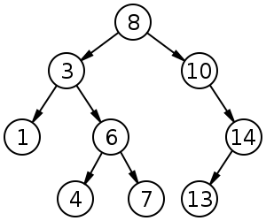

/* 
https://oj.uz/submission/292972
https://oj.uz/submissions?handle=tmwilliamlin168&problem=

https://www.youtube.com/watch?v=kCqf6dvadlQ
https://www.hackerrank.com/contests

https://atcoder.jp/contests/

*/

算法竞赛进阶指南_含目录.pdf
https://drive.google.com/file/d/1rH6Jodk-XSzm6Kdq8Lyzzpx-yOhecbU4/view?usp=sharing
信息学奥赛一本通（C++）第五版.pdf
https://drive.google.com/file/d/14KsgMAQMax9ZHcfIeK9o5Rbwas-mhkhs/view?usp=sharing
剑指OFFER 名企面试官精讲典型编程题 第2版.pdf
https://drive.google.com/file/d/1bLZjeTzLe31xpZxNSXU93bVLTlXI0KNk/view?usp=sharing
C++与数据结构
https://drive.google.com/file/d/1DVbjLIktdJcXvj3-Qn7F0yJQrHvL7zE3/view?usp=sharing

```
#include <bits/stdc++.h>
using namespace std;
#define ll long long
#define fir(i,a,b) for(ll i=a;i<=b;i++)

const int N = 1e5+10;

ll n,m,t,a[N],b[N],s[N],x,y;
ll calc(ll a[], ll n){
fir(i,1,n){
    a[i]-=(a[0]/n);
    s[i]=s[i-1]+a[i];
}
sort(s+1,s+n+1);
ll mid=(n+1)>>1,ans=0;
fir(i,1,n) ans+=abs(s[mid]-s[i]);
return ans;
}

int main(){
    cin>>n>>m>>t;
    fir(i,1,t){scanf("%d%d",&x,&y); a[x]++;b[y]++;}
    fir(i,1,n) a[0]+=a[i];
    fir(i,1,m) b[0]+=b[i];

    ll as=a[0]%n,bs=b[0]%m;
    if(!as && !bs) cout<<"both "<<calc(a,n)+calc(b,m);
    else if(!as) cout<<"row "<<calc(a,n);
    else if(!bs)cout<<"column "<<calc(b,m);
    else cout<<"impossible";

    return 0;
}
```

```
'''
简单快速幂运算
所有可能的排列数减去不发生冲突的排列数就是
答案

'''

MOD = 100003
def pow_mod(a, k, p):
    t = []
    pow_val = 1             # 2的次幂数, 初始是2^0 = 1
    a_pow = a % p           # a^(2 ^ i)的数值, 初始是a^(2^0) = a
    while pow_val <= k:
        t.append(a_pow)
        a_pow = (a_pow*a_pow) % p
        pow_val <<= 1

    ans = 1
    for i in range(len(t)):
        if k & 1:
            ans = (ans * t[i]) % p
        k >>= 1
    return ans


m, n = map(int, input().split())
print( ((m % MOD) * (pow_mod(m, n-1, MOD) - pow_mod(m-1, n-1, MOD))) % MOD )


```


# C++ QUICK REFERENCE / C++ CHEATSHEET
Based on <a href="http://www.pa.msu.edu/~duxbury/courses/phy480/Cpp_refcard.pdf">Phillip M. Duxbury's C++ Cheatsheet</a> and edited by Morten Nobel-Jørgensen.
The cheatsheet focus is both on the language as well as common classes from the standard library.
C++11 additions is inspired by <a href="https://isocpp.org/blog/2012/12/c11-a-cheat-sheet-alex-sinyakov">ISOCPP.org C++11 Cheatsheet</a>).

The goal is to give a concise overview of basic, modern C++ (C++14).

The document is hosted on https://github.com/mortennobel/cpp-cheatsheet. Any comments and feedback are appreciated.

## Preprocessor

```cpp
                            // Comment to end of line
                            /* Multi-line comment */
#include  <stdio.h>         // Insert standard header file
#include "myfile.h"         // Insert file in current directory
#define X some text         // Replace X with some text
#define F(a,b) a+b          // Replace F(1,2) with 1+2
#define X \
 some text                  // Multiline definition
#undef X                    // Remove definition
#if defined(X)              // Conditional compilation (#ifdef X)
#else                       // Optional (#ifndef X or #if !defined(X))
#endif                      // Required after #if, #ifdef
```

## Literals

```cpp
255, 0377, 0xff             // Integers (decimal, octal, hex)
2147483647L, 0x7fffffffl    // Long (32-bit) integers
123.0, 1.23e2               // double (real) numbers
'a', '\141', '\x61'         // Character (literal, octal, hex)
'\n', '\\', '\'', '\"'      // Newline, backslash, single quote, double quote
"string\n"                  // Array of characters ending with newline and \0
"hello" "world"             // Concatenated strings
true, false                 // bool constants 1 and 0
nullptr                     // Pointer type with the address of 0
```

## Declarations

```cpp
int x;                      // Declare x to be an integer (value undefined)
int x=255;                  // Declare and initialize x to 255
short s; long l;            // Usually 16 or 32 bit integer (int may be either)
char c='a';                 // Usually 8 bit character
unsigned char u=255;
signed char s=-1;           // char might be either
unsigned long x =
  0xffffffffL;              // short, int, long are signed
float f; double d;          // Single or double precision real (never unsigned)
bool b=true;                // true or false, may also use int (1 or 0)
int a, b, c;                // Multiple declarations
int a[10];                  // Array of 10 ints (a[0] through a[9])
int a[]={0,1,2};            // Initialized array (or a[3]={0,1,2}; )
int a[2][2]={{1,2},{4,5}};  // Array of array of ints
char s[]="hello";           // String (6 elements including '\0')
std::string s = "Hello"     // Creates string object with value "Hello"
std::string s = R"(Hello
World)";                    // Creates string object with value "Hello\nWorld"
int* p;                     // p is a pointer to (address of) int
char* s="hello";            // s points to unnamed array containing "hello"
void* p=nullptr;            // Address of untyped memory (nullptr is 0)
int& r=x;                   // r is a reference to (alias of) int x
enum weekend {SAT,SUN};     // weekend is a type with values SAT and SUN
enum weekend day;           // day is a variable of type weekend
enum weekend{SAT=0,SUN=1};  // Explicit representation as int
enum {SAT,SUN} day;         // Anonymous enum
enum class Color {Red,Blue};// Color is a strict type with values Red and Blue
Color x = Color::Red;       // Assign Color x to red
typedef String char*;       // String s; means char* s;
const int c=3;              // Constants must be initialized, cannot assign to
const int* p=a;             // Contents of p (elements of a) are constant
int* const p=a;             // p (but not contents) are constant
const int* const p=a;       // Both p and its contents are constant
const int& cr=x;            // cr cannot be assigned to change x
int8_t,uint8_t,int16_t,
uint16_t,int32_t,uint32_t,
int64_t,uint64_t            // Fixed length standard types
auto it = m.begin();        // Declares it to the result of m.begin()
auto const param = config["param"];
                            // Declares it to the const result
auto& s = singleton::instance();
                            // Declares it to a reference of the result
```

## STORAGE Classes

```cpp
int x;                      // Auto (memory exists only while in scope)
static int x;               // Global lifetime even if local scope
extern int x;               // Information only, declared elsewhere
```

## Statements

```cpp
x=y;                        // Every expression is a statement
int x;                      // Declarations are statements
;                           // Empty statement
{                           // A block is a single statement
    int x;                  // Scope of x is from declaration to end of block
}
if (x) a;                   // If x is true (not 0), evaluate a
else if (y) b;              // If not x and y (optional, may be repeated)
else c;                     // If not x and not y (optional)

while (x) a;                // Repeat 0 or more times while x is true

for (x; y; z) a;            // Equivalent to: x; while(y) {a; z;}

for (x : y) a;              // Range-based for loop e.g.
                            // for (auto& x in someList) x.y();

do a; while (x);            // Equivalent to: a; while(x) a;

switch (x) {                // x must be int
    case X1: a;             // If x == X1 (must be a const), jump here
    case X2: b;             // Else if x == X2, jump here
    default: c;             // Else jump here (optional)
}
break;                      // Jump out of while, do, or for loop, or switch
continue;                   // Jump to bottom of while, do, or for loop
return x;                   // Return x from function to caller
try { a; }
catch (T t) { b; }          // If a throws a T, then jump here
catch (...) { c; }          // If a throws something else, jump here
```

## Functions

```cpp
int f(int x, int y);        // f is a function taking 2 ints and returning int
void f();                   // f is a procedure taking no arguments
void f(int a=0);            // f() is equivalent to f(0)
f();                        // Default return type is int
inline f();                 // Optimize for speed
f() { statements; }         // Function definition (must be global)
T operator+(T x, T y);      // a+b (if type T) calls operator+(a, b)
T operator-(T x);           // -a calls function operator-(a)
T operator++(int);          // postfix ++ or -- (parameter ignored)
extern "C" {void f();}      // f() was compiled in C
```

Function parameters and return values may be of any type. A function must either be declared or defined before
it is used. It may be declared first and defined later. Every program consists of a set of a set of global variable
declarations and a set of function definitions (possibly in separate files), one of which must be:

```cpp
int main()  { statements... }     // or
int main(int argc, char* argv[]) { statements... }
```

`argv` is an array of `argc` strings from the command line.
By convention, `main` returns status `0` if successful, `1` or higher for errors.

Functions with different parameters may have the same name (overloading). Operators except `::` `.` `.*` `?:` may be overloaded.
Precedence order is not affected. New operators may not be created.

## Expressions

Operators are grouped by precedence, highest first. Unary operators and assignment evaluate right to left. All
others are left to right. Precedence does not affect order of evaluation, which is undefined. There are no run time
checks for arrays out of bounds, invalid pointers, etc.

```cpp
T::X                        // Name X defined in class T
N::X                        // Name X defined in namespace N
::X                         // Global name X

t.x                         // Member x of struct or class t
p-> x                       // Member x of struct or class pointed to by p
a[i]                        // i'th element of array a
f(x,y)                      // Call to function f with arguments x and y
T(x,y)                      // Object of class T initialized with x and y
x++                         // Add 1 to x, evaluates to original x (postfix)
x--                         // Subtract 1 from x, evaluates to original x
typeid(x)                   // Type of x
typeid(T)                   // Equals typeid(x) if x is a T
dynamic_cast< T>(x)         // Converts x to a T, checked at run time.
static_cast< T>(x)          // Converts x to a T, not checked
reinterpret_cast< T>(x)     // Interpret bits of x as a T
const_cast< T>(x)           // Converts x to same type T but not const

sizeof x                    // Number of bytes used to represent object x
sizeof(T)                   // Number of bytes to represent type T
++x                         // Add 1 to x, evaluates to new value (prefix)
--x                         // Subtract 1 from x, evaluates to new value
~x                          // Bitwise one's complement of x (just flip bits) aka 'compl'
!x                          // true if x is 0, else false (1 or 0 in C)
-x                          // Unary minus
+x                          // Unary plus (default)
&x                          // Address of x
*p                          // Contents of address p (*&x equals x)
new T                       // Address of newly allocated T object
new T(x, y)                 // Address of a T initialized with x, y
new T[x]                    // Address of allocated n-element array of T
delete p                    // Destroy and free object at address p
delete[] p                  // Destroy and free array of objects at p
(T) x                       // Convert x to T (obsolete, use .._cast<T>(x))

x * y                       // Multiply
x / y                       // Divide (integers round toward 0)
x % y                       // Modulo (result has sign of x)

x + y                       // Add, or \&x[y]
x - y                       // Subtract, or number of elements from *x to *y
x << y                      // x shifted y bits to left (x * pow(2, y))
x >> y                      // x shifted y bits to right (x / pow(2, y))

x < y                       // Less than
x <= y                      // Less than or equal to
x > y                       // Greater than
x >= y                      // Greater than or equal to

x & y                       // Bitwise and (3 & 6 is 2)
x ^ y                       // Bitwise exclusive or (3 ^ 6 is 5)
x | y                       // Bitwise or (3 | 6 is 7)
x && y                      // x and then y (evaluates y only if x (not 0))
x || y                      // x or else y (evaluates y only if x is false (0))
x = y                       // Assign y to x, returns new value of x
x += y                      // x = x + y, also -= *= /= <<= >>= &= |= ^=
x ? y : z                   // y if x is true (nonzero), else z
throw x                     // Throw exception, aborts if not caught
x , y                       // evaluates x and y, returns y (seldom used)
```

## Classes

```cpp
class T {                   // A new type
private:                    // Section accessible only to T's member functions
protected:                  // Also accessible to classes derived from T
public:                     // Accessible to all
    int x;                  // Member data
    void f();               // Member function
    void g() {return;}      // Inline member function
    void h() const;         // Does not modify any data members
    int operator+(int y);   // t+y means t.operator+(y)
    int operator-();        // -t means t.operator-()
    T(): x(1) {}            // Constructor with initialization list
    T(const T& t): x(t.x) {}// Copy constructor
    T& operator=(const T& t)
    {x=t.x; return *this; } // Assignment operator
    ~T();                   // Destructor (automatic cleanup routine)
    explicit T(int a);      // Allow t=T(3) but not t=3
    T(float x): T((int)x) {}// Delegate constructor to T(int)
    operator int() const
    {return x;}             // Allows int(t)
    friend void i();        // Global function i() has private access
    friend class U;         // Members of class U have private access
    static int y;           // Data shared by all T objects
    static void l();        // Shared code.  May access y but not x
    class Z {};             // Nested class T::Z
    typedef int V;          // T::V means int
};
void T::f() {               // Code for member function f of class T
    this->x = x;}           // this is address of self (means x=x;)
int T::y = 2;               // Initialization of static member (required)
T::l();                     // Call to static member
T t;                        // Create object t implicit call constructor
t.f();                      // Call method f on object t

struct T {                  // Equivalent to: class T { public:
  virtual void i();         // May be overridden at run time by derived class
  virtual void g()=0; };    // Must be overridden (pure virtual)
class U: public T {         // Derived class U inherits all members of base T
  public:
  void g(int) override; };  // Override method g
class V: private T {};      // Inherited members of T become private
class W: public T, public U {};
                            // Multiple inheritance
class X: public virtual T {};
                            // Classes derived from X have base T directly
```

All classes have a default copy constructor, assignment operator, and destructor, which perform the
corresponding operations on each data member and each base class as shown above. There is also a default no-argument
constructor (required to create arrays) if the class has no constructors. Constructors, assignment, and
destructors do not inherit.

## Templates

```cpp
template <class T> T f(T t);// Overload f for all types
template <class T> class X {// Class with type parameter T
  X(T t); };                // A constructor
template <class T> X<T>::X(T t) {}
                            // Definition of constructor
X<int> x(3);                // An object of type "X of int"
template <class T, class U=T, int n=0>
                            // Template with default parameters
```

## Namespaces

```cpp
namespace N {class T {};}   // Hide name T
N::T t;                     // Use name T in namespace N
using namespace N;          // Make T visible without N::
```

## `memory` (dynamic memory management)

```cpp
#include <memory>           // Include memory (std namespace)
shared_ptr<int> x;          // Empty shared_ptr to a integer on heap. Uses reference counting for cleaning up objects.
x = make_shared<int>(12);   // Allocate value 12 on heap
shared_ptr<int> y = x;      // Copy shared_ptr, implicit changes reference count to 2.
cout << *y;                 // Dereference y to print '12'
if (y.get() == x.get()) {   // Raw pointers (here x == y)
    cout << "Same";  
}  
y.reset();                  // Eliminate one owner of object
if (y.get() != x.get()) { 
    cout << "Different";  
}  
if (y == nullptr) {         // Can compare against nullptr (here returns true)
    cout << "Empty";  
}  
y = make_shared<int>(15);   // Assign new value
cout << *y;                 // Dereference x to print '15'
cout << *x;                 // Dereference x to print '12'
weak_ptr<int> w;            // Create empty weak pointer
w = y;                      // w has weak reference to y.
if (shared_ptr<int> s = w.lock()) { // Has to be copied into a shared_ptr before usage
    cout << *s;
}
unique_ptr<int> z;          // Create empty unique pointers
unique_ptr<int> q;
z = make_unique<int>(16);   // Allocate int (16) on heap. Only one reference allowed.
q = move(z);                // Move reference from z to q.
if (z == nullptr){
    cout << "Z null";
}
cout << *q;
shared_ptr<B> r;
r = dynamic_pointer_cast<B>(t); // Converts t to a shared_ptr<B>

```

## `math.h`, `cmath` (floating point math)

```cpp
#include <cmath>            // Include cmath (std namespace)
sin(x); cos(x); tan(x);     // Trig functions, x (double) is in radians
asin(x); acos(x); atan(x);  // Inverses
atan2(y, x);                // atan(y/x)
sinh(x); cosh(x); tanh(x);  // Hyperbolic sin, cos, tan functions
exp(x); log(x); log10(x);   // e to the x, log base e, log base 10
pow(x, y); sqrt(x);         // x to the y, square root
ceil(x); floor(x);          // Round up or down (as a double)
fabs(x); fmod(x, y);        // Absolute value, x mod y
```

## `assert.h`, `cassert` (Debugging Aid)

```cpp
#include <cassert>        // Include iostream (std namespace)
assert(e);                // If e is false, print message and abort
#define NDEBUG            // (before #include <assert.h>), turn off assert
```

## `iostream.h`, `iostream` (Replaces `stdio.h`)

```cpp
#include <iostream>         // Include iostream (std namespace)
cin >> x >> y;              // Read words x and y (any type) from stdin
cout << "x=" << 3 << endl;  // Write line to stdout
cerr << x << y << flush;    // Write to stderr and flush
c = cin.get();              // c = getchar();
cin.get(c);                 // Read char
cin.getline(s, n, '\n');    // Read line into char s[n] to '\n' (default)
if (cin)                    // Good state (not EOF)?
                            // To read/write any type T:
istream& operator>>(istream& i, T& x) {i >> ...; x=...; return i;}
ostream& operator<<(ostream& o, const T& x) {return o << ...;}
```

## `fstream.h`, `fstream` (File I/O works like `cin`, `cout` as above)


```cpp
#include <fstream>          // Include filestream (std namespace)
ifstream f1("filename");    // Open text file for reading
if (f1)                     // Test if open and input available
    f1 >> x;                // Read object from file
f1.get(s);                  // Read char or line
f1.getline(s, n);           // Read line into string s[n]
ofstream f2("filename");    // Open file for writing
if (f2) f2 << x;            // Write to file
```

## `string` (Variable sized character array)

```cpp
#include <string>         // Include string (std namespace)
string s1, s2="hello";    // Create strings
s1.size(), s2.size();     // Number of characters: 0, 5
s1 += s2 + ' ' + "world"; // Concatenation
s1 == "hello world"       // Comparison, also <, >, !=, etc.
s1[0];                    // 'h'
s1.substr(m, n);          // Substring of size n starting at s1[m]
s1.c_str();               // Convert to const char*
s1 = to_string(12.05);    // Converts number to string
getline(cin, s);          // Read line ending in '\n'
```

## `vector` (Variable sized array/stack with built in memory allocation)

```cpp
#include <vector>         // Include vector (std namespace)
vector<int> a(10);        // a[0]..a[9] are int (default size is 0)
vector<int> b{1,2,3};        // Create vector with values 1,2,3
a.size();                 // Number of elements (10)
a.push_back(3);           // Increase size to 11, a[10]=3
a.back()=4;               // a[10]=4;
a.pop_back();             // Decrease size by 1
a.front();                // a[0];
a[20]=1;                  // Crash: not bounds checked
a.at(20)=1;               // Like a[20] but throws out_of_range()
for (int& p : a)
  p=0;                    // C++11: Set all elements of a to 0
for (vector<int>::iterator p=a.begin(); p!=a.end(); ++p)
  *p=0;                   // C++03: Set all elements of a to 0
vector<int> b(a.begin(), a.end());  // b is copy of a
vector<T> c(n, x);        // c[0]..c[n-1] init to x
T d[10]; vector<T> e(d, d+10);      // e is initialized from d
```

## `deque` (Array stack queue)

`deque<T>` is like `vector<T>`, but also supports:

```cpp
#include <deque>          // Include deque (std namespace)
a.push_front(x);          // Puts x at a[0], shifts elements toward back
a.pop_front();            // Removes a[0], shifts toward front
```

## `utility` (pair)

```cpp
#include <utility>        // Include utility (std namespace)
pair<string, int> a("hello", 3);  // A 2-element struct
a.first;                  // "hello"
a.second;                 // 3
```

## `map` (associative array - usually implemented as binary search trees - avg. time complexity: O(log n))

```cpp
#include <map>            // Include map (std namespace)
map<string, int> a;       // Map from string to int
a["hello"] = 3;           // Add or replace element a["hello"]
for (auto& p:a)
    cout << p.first << p.second;  // Prints hello, 3
a.size();                 // 1
```

## `unordered_map` (associative array - usually implemented as hash table - avg. time complexity: O(1))

```cpp
#include <unordered_map>  // Include map (std namespace)
unordered_map<string, int> a; // Map from string to int
a["hello"] = 3;           // Add or replace element a["hello"]
for (auto& p:a)
    cout << p.first << p.second;  // Prints hello, 3
a.size();                 // 1
```

## `set` (store unique elements - usually implemented as binary search trees - avg. time complexity: O(log n))

```cpp
#include <set>            // Include set (std namespace)
set<int> s;               // Set of integers
s.insert(123);            // Add element to set
if (s.find(123) != s.end()) // Search for an element
    s.erase(123);
cout << s.size();         // Number of elements in set
```

## `unordered_set` (store unique elements - usually implemented as a hash set - avg. time complexity: O(1))

```cpp
#include <unordered_set>  // Include set (std namespace)
unordered_set<int> s;     // Set of integers
s.insert(123);            // Add element to set
if (s.find(123) != s.end()) // Search for an element
    s.erase(123);
cout << s.size();         // Number of elements in set
```

## `algorithm` (A collection of 60 algorithms on sequences with iterators)

```cpp
#include <algorithm>      // Include algorithm (std namespace)
min(x, y); max(x, y);     // Smaller/larger of x, y (any type defining <)
swap(x, y);               // Exchange values of variables x and y
sort(a, a+n);             // Sort array a[0]..a[n-1] by <
sort(a.begin(), a.end()); // Sort vector or deque
reverse(a.begin(), a.end()); // Reverse vector or deque
```

## `chrono` (Time related library)
```cpp
#include <chrono>         // Include chrono
using namespace std::chrono; // Use namespace
auto from =               // Get current time_point
  high_resolution_clock::now();
// ... do some work       
auto to =                 // Get current time_point
  high_resolution_clock::now();
using ms =                // Define ms as floating point duration
  duration<float, milliseconds::period>;
                          // Compute duration in milliseconds
cout << duration_cast<ms>(to - from)
  .count() << "ms";
```

## `thread` (Multi-threading library)
```cpp
#include <thread>         // Include thread
unsigned c = 
  hardware_concurrency(); // Hardware threads (or 0 for unknown)
auto lambdaFn = [](){     // Lambda function used for thread body
    cout << "Hello multithreading";
};
thread t(lambdaFn);       // Create and run thread with lambda
t.join();                 // Wait for t finishes

// --- shared resource example ---
mutex mut;                         // Mutex for synchronization
condition_variable cond;           // Shared condition variable
const char* sharedMes              // Shared resource
  = nullptr;
auto pingPongFn =                  // thread body (lambda). Print someone else's message
  [&](const char* mes){
    while (true){
      unique_lock<mutex> lock(mut);// locks the mutex 
      do {                
        cond.wait(lock, [&](){     // wait for condition to be true (unlocks while waiting which allows other threads to modify)        
          return sharedMes != mes; // statement for when to continue
        });
      } while (sharedMes == mes);  // prevents spurious wakeup
      cout << sharedMes << endl;
      sharedMes = mes;       
      lock.unlock();               // no need to have lock on notify 
      cond.notify_all();           // notify all condition has changed
    }
  };
sharedMes = "ping";
thread t1(pingPongFn, sharedMes);  // start example with 3 concurrent threads
thread t2(pingPongFn, "pong");
thread t3(pingPongFn, "boing");
```

## `future` (thread support library)
```cpp
#include <future>         // Include future
function<int(int)> fib =  // Create lambda function
  [&](int i){
    if (i <= 1){
      return 1;
    }
    return fib(i-1) 
         + fib(i-2);
  };
future<int> fut =         // result of async function
  async(launch::async, fib, 4); // start async function in other thread
// do some other work 
cout << fut.get();        // get result of async function. Wait if needed.
```
# C++ Syntax Cheat Sheet

## Preface
Since the C++ language varies so heavily between versions (e.g. C++0x, C++11, C++17, etc.), I will preface this cheat sheet by saying that the majority of the examples here target C++0x or c++11, as those are the versions that I am most familiar with. I come from the aerospace industry (embedded flight software) in which we purposefully don't use the latest technologies for safety reasons, so most of the code I write is in C++0x and sometimes C++11. Nevertheless, the basic concepts of C++ and object oriented programming still generally apply to both past and future versions of the language.

## Table of Contents

<!-- TOC depthFrom:1 depthTo:6 withLinks:1 updateOnSave:0 orderedList:0 -->

- [C++ Syntax Cheat Sheet](#c-syntax-cheat-sheet)
    - [Table of Contents](#table-of-contents)
    - [1.0 C++ Classes](#10-c-classes)
        - [1.1 Class Syntax](#11-class-syntax)
            - [1.1.1 Class Declaration (`.h` file)](#111-class-declaration-h-file)
            - [1.1.2 Class Definition (`.cpp` file)](#112-class-definition-cpp-file)
            - [1.1.3 Class Utilization (Another `.cpp` file)](#113-class-utilization-another-cpp-file)
            - [1.1.4 Getters and Setters](#114-getters-and-setters)
        - [1.2 Inheritance](#12-inheritance)
            - [1.2.1 `Rectangle` Declaration (`.h` file)](#121-rectangle-declaration-h-file)
            - [1.2.2 `Rectangle` Definition (`.cpp` file)](#122-rectangle-definition-cpp-file)
            - [1.2.3 `Rectangle` Utilization (Another `.cpp` file)](#123-rectangle-utilization-another-cpp-file)
        - [1.3 Class Polymorphism](#13-class-polymorphism)
            - [1.3.1 Motivation](#131-motivation)
            - [1.3.2 Virtual Methods](#132-virtual-methods)
        - [1.4 Special Methods (Constructor, Destructor, ...)](#14-special-methods)
            - [1.4.1 Constructor and Destructor](#141-constructor-and-destructor)
                - [1.4.1.1 Use of `explicit` in Constructors](#1411-use-of-explicit-in-constructors)
                - [1.4.1.2 Member Initializer List](#1412-member-initializer-list)
            - [1.4.2. `new` and `delete`](#142-new-and-delete)
            - [1.4.3. Copy Constructor and Copy Assignment](#143-copy-constructor-and-copy-assignment)
            - [1.4.4. Move Constructor and Move Assignment](#144-move-constructor-and-move-assignment)
        - [1.5 Operator Overloading](#15-operator-overloading)
        - [1.6 Templates](#16-templates)
    - [2.0 General C++ Syntax](#20-general-c-syntax)
        - [2.1 Namespaces](#21-namespaces)
        - [2.2 References/Pointers](#22-references-and-pointers)
        - [2.3 Keywords](#23-keywords)
            - [2.3.1 General keywords](#231-general-keywords)
            - [2.3.2 Storage class specifiers](#232-storage-class-specifiers)
            - [2.3.3  `const` and `dynamic` Cast Conversion](#233-const-and-dynamic-cast-conversion)
        - [2.4 Preprocessor Tokens](#24-preprocessor-tokens)
        - [2.5 Strings ](#25-strings-stdstring)
        - [2.6 Iterators](#26-iterators-stditerator)
        - [2.7 Exceptions](#27-exceptions)
        - [2.8 Lambdas](#28-lambdas)

<!-- /TOC -->


## 1.0 C++ Classes
### 1.1 Class Syntax
#### 1.1.1 Class Declaration (`.h` file)
Here's a simple class representing a polygon, a shape with any number of sides.

The class *declaration* typically goes in the header file, which has the extension `.h` (or, less commonly, `.hpp` to distinguish from C headers). The *declaration* gives the class name, any classes it may extend, declares the members and methods, and declares which members/methods are public, private, or protected. You can think of the declaration as sort of saying: "there will be a thing and here's how it will look like". The declaration is used to inform the compiler about the future essence and use of a particular symbol.

```c++
// File: polygon.h

#include <string>

class Polygon {

// Private members and methods are only accessible via methods in the class definition
private:
    int num_sides;    	// Number of sides

// Protected members and methods are only accessible in the class definition or by classes who extend this class
protected:
    std::string name;   // Name of the polygon

// Public members and methods are accessible to anyone who creates an instance of the class
public:
    // Constructors
    Polygon(const int num_sides, const std::string & name); // <--- This constructor takes the number of sides and name as arguments

    // Getters and Setters
    int GetNumSides(void) const;
    void SetNumSides(const int num_sides);

    std::string & GetName(void) const;
    void SetName(const std::string & name);

}; // <--- Don't forget the semicolon!
```

#### 1.1.2 Class Definition (`.cpp` file)
The class *definition* typically goes in the `.cpp` file. The *definition* extends the declaration by providing an actual implementation of whatever it is that you're building. Continuing the example from the declaration, the definition can be thought of as saying: "Right, that thing I told you briefly about earlier? Here's how it actually functions". The definition thus provides the compileable implementation.

```c++
// File: polygon.cpp

#include <string>	// <--- Required for std::string

#include "polygon.h"    // <--- Obtains the class declaration

// Constructor
// You must scope the method definitions with the class name (Polygon::)
// Also, see the section on the 'explicit' keyword for a warning about constructors with exactly one argument
Polygon::Polygon(const int num_sides, const std::string & name) {
    this->num_sides = num_sides;	// 'this' is a pointer to the instance of the class. Members are accessed via the -> operator
    this->name = name;			// In this case you need to use 'this->...' to avoid shadowing the member variable since the argument shares the same name
}

// Get the number of sides
int Polygon::GetNumSides(void) const {	// The 'const' here tells the compiler that you guarantee that you won't modify the object when this function is called. This allows it to perform optimizations that it otherwise may not be able to do
    return this->num_sides;
}

// Set the number of sides
void Polygon::SetNumSides(const int num_sides) {
    this->num_sides = num_sides;
}

// Get the polygon name
std::string & Polygon::GetName(void) const {
    return this->name;
}

// Set the polygon name
void Polygon::SetName(const std::string & name) {
    this->name = name;
}
```

The getters and setters here don't do much, but you could imagine limiting the number of sides such that it must have at least 3 sides to be a useful polygon, in which case you could enforce that in `Polygon::SetNumSides()`. Of course, you'd also need to modify the constructor, which could then call `SetNumSides()` instead of setting the variable directly.

> NOTE: Regarding the use of `this->` in a class definition, there are places where it's strictly necessary for readability, e.g. when your method parameter shares the exact same name as a member variable, you use `this->` to avoid what's called shadowing. However, some prefer to always use `this->` explicitly regardless of whether it's necessary.

#### 1.1.3 Class Utilization (Another `.cpp` file)
```c++
// File: main.cpp

#include <string>
#include <iostream>

#include "Polygon.h"    // <--- Obtains the class declaration

int main(int argc, char * argv[]) {
    // Create a polygon with 4 sides and the name "Rectangle"
    Polygon polygon = Polygon(4, "Rectangle");

    // Check number of sides -- Prints "Rectangle has 4 sides"
    std::cout << polygon.GetName() << " has " << polygon.GetNumSides() << " sides"<< std::endl;

    // Change number of sides to 3 and rename to "Triangle"
    polygon.SetNumSides(3);
    polygon.SetName("Triangle");
}
```

#### 1.1.4 Getters and Setters
A shortcut often used for Getters/Setters is to define them in the class declaration (`.h`) file as follows:
```c++
// File: car.h

#include <string>

class Car {
private:
    int year;
    std::string make;

public:
    int GetYear(void) const { return this->year; }
    void SetYear(const int year) { this->year = year; }
    std::string & GetMake(void) const { return this->make; }
    void SetMake(const std::string & make) { this->make = make; }
};
```

This is often used for very basic getters and setters, and also for basic constructors. In contrast, you'll nearly always find more complex methods defined in the `.cpp` file. One exception to this is with class templates, in which the entire templated class declaration and definition must reside in the header file.

Another important consideration: If you have getters and setters for all of your members, you may want to reconsider the design of your class. Sometimes having getters and setters for every member is indicative of poor planning of the class design and interface. In particular, setters should be used more thoughtfully. Could a variable be set once in the constructor and left constant thereafter? Does it need to be modified at all? Is it set somewhere else in another method, perhaps even indirectly?

### 1.2 Inheritance
A class can extend another class, meaning that the new class inherits all of the data from the other class, and can also override its methods, add new members, etc. Inheritance is the key feature required for [polymorphism](#13-class-polymorphism).

It is important to note that this feature is often overused by beginners and sometimes unnecessary hierarchies are created, adding to the overally complexity. There are some good alternatives such as [composition](https://en.wikipedia.org/wiki/Composition_over_inheritance) and [aggregation](https://stackoverflow.com/a/269535), although, of course, sometimes inheritance is exactly what is needed.

**Example:** the class `Rectangle` can inherit from the class `Polygon`. You would then say that a `Rectangle` extends from a `Polygon`, or that class `Rectangle` is a sub-class of `Polygon`. In plain English, this means that a `Rectangle` is a more specialized version of a `Polygon`. Thus, all rectangles are polygons, but not all polygons are rectangles.

#### 1.2.1 `Rectangle` Declaration (`.h` file)
```c++
// File: rectangle.h

#include <string>       // <--- Explicitly include the string header, even though polygon.h also includes it

#include "polygon.h"	// <--- You must include the declaration in order to extend the class

// We extend from Polygon by using the colon (:) and specifying which type of inheritance
// will be used (public inheritance, in this case)

class Rectangle : public Polygon {
private:
    int length;
    int width;

    // <--- NOTE: The member variables 'num_sides' and 'name' are already inherited from Polygon
    //            it's as if we sort of get them for free, since we are a sub-class

public:
    // Constructors
    explicit Rectangle(const std::string &name);
    Rectangle(const std::string &name, const int length, const int width);

    // Getters and Setters
    const int GetLength(void) const { return this->length; }
    void SetLength(const int) { this->length = length; }

    const int GetWidth(void) const { return this->width; }
    void SetWidth(const int) { this->width = width; }

    // <--- NOTE: Again, the getters/setters for 'num_sides' and 'name' are already inherited from Polygon

    // Other Methods
    const int Area(void) const;
};
```

> NOTE: The inheritance access specifier (`public`, `protected`, or `private`) is used to determine the [type of inheritance](https://www.tutorialspoint.com/cplusplus/cpp_inheritance.htm). If this is omitted then `private` inheritance is used by default. **Public inheritance is by far the most common type of inheritance**.

#### 1.2.2 `Rectangle` Definition (`.cpp` file)
```c++
// File: rectangle.cpp

#include "rectangle.h"	// <--- Only need to include 'Rectangle', since 'Polygon' is included in 'rectangle.h'

// This constructor calls the superclass (Polygon) constructor and sets the name and number of sides to '4', and then sets the length and width
Rectangle::Rectangle(const std::string &name, const int length, const int width) : Polygon(4, name) {
    this->length = length;
    this->width = width;
}

// This constructor calls the superclass (Polygon) constructor, but sets the length and width to a constant value
// The explicit keyword is used to restrict the use of the constructor. See section below for more detail
explicit Rectangle::Rectangle(const std::string &name) : Polygon(4, name) {
    this->length = 1;
    this->width = 1;
}

// Compute the area of the rectangle
int Rectangle::Area(void) const {
    return length * width;		// <--- Note that you don't explicitly need 'this->', you can directly use the member variables
}
```

#### 1.2.3 `Rectangle` Utilization (Another `.cpp` file)
```c++
// File: main.cpp

#include <iostream>

#include "Rectangle.h"

int main(int argc, char *argv[]) {
    Rectangle rectangle = Rectangle("Square", 6, 6);

    // Prints "Square has 4 sides, and an area of 36"
    std::cout << rectangle.GetName() << " has " << rectangle.GetNumSides() << " sides, and an area of " << rectangle.Area() << std::endl;
}
```

### 1.3 Class Polymorphism
Polymorphism describes a system in which a common interface is used to manipulate objects of different types. In essence various classes can inherit from a common interface through which they make certain guarantees about which methods/variables are available for use. By adhering to this common interface, one can use a pointer to an object of the base interface type to call the methods of any number of extending classes. Using polymorphism one can say "I don't care what type this really is; I know it implements `Foo()` and `Bar()` because it inherits from this interface", which is a pretty nifty feature.

The `virtual` keyword is used to ensure runtime polymorphism for class methods. Additionally, an overriding method can be forced by the compiler by not providing a default implementation in the interface, which is done by setting the method to `= 0`, as will be shown later.

#### 1.3.1 Motivation
Let's consider a similar class hierarchy using shapes as previously discussed. Considering a shape to be any 3 or more sided polygon from which we can compute certain attributes (like the shape's area), let's extend from it to create a rectangle class from which we can set the length/width and a circle class in which you can set the radius. **In both cases, we want to be able to compute the area of the shape.** This is a key observation that we will expand upon later.

For now, this (poorly implemented) shape class will suffice:

```c++
// File: shape.h

#include <cmath> 	// needed for M_PI constant

class Shape {
    // We'll leave Shape empty for now... not very interesting yet
};

class Rectangle : public Shape {
private:
    double length;
    double width;

public:
    // Constructor using a member initializer list instead of assignment in the method body
    Rectangle(const double w, const double l) : width(w), length(l) {}

    // Compute the area of a rectangle
    double Area(void) const {
        return length * width;
    }
};

class Circle : public Shape {
private:
    double radius;

public:
    explicit Circle(double r) : radius(r) {}

    // Compute the area of a circle
    double Area(void) const {
        return M_PI * radius * radius;  // pi*r^2
    }
};
```

> NOTE: As shown here, you can put multiple classes in a single header, although in practice unless you have a good reason for doing so it's probably best to use a separate header file per class.

> NOTE: I'm not using default value initialization for member variables (i.e. `double length = 0;`) and I'm using parentheses `()` instead of braces `{}` for the initializer list since older compilers (pre-C++11) may not support the new syntax.

So, we have our two classes, `Rectangle` and `Circle`, but in this case inheriting from `Shape` isn't really buying us anything. To make use of polymorphism we need to pull the common `Area()` method into the base class as follows, by using virtual methods.

#### 1.3.2 Virtual Methods
Imagine you want to have a pointer to a shape with which you want to compute the area of that shape. For example, maybe you want to hold shapes in some sort of data structure, but you don't want to limit yourself to just rectangles or just circles; you want to support all objects that call themselves a 'Shape'. Something like:

```c++
Rectangle rectangle(2.0, 5.0);
Circle circle(1.0);

// Point to the rectangle
Shape * unknown_shape = &rectangle; // Could point to *any* shape, Rectangle, Circle, Triangle, Dodecagon, etc.

unknown_shape->Area();  // Returns 10.0

// Point to the circle
unknown_shape = &circle;
unknown-shape->Area();  // Returns 3.14...
```

The way to achieve this is to use the `virtual` keyword on the base class methods, which specifies that when a pointer to a base class invokes the method of an object that it points to, it should determine, at runtime, the correct method to invoke. That is, when `unknown_shape` points to a `Rectangle` it invokes `Rectangle::Area()` and if `unknown_shape` points to a `Circle` it invokes `Circle::Area()`.

Virtual methods are employed as follows:

```c++
#include <cmath>

class Shape {
public:
    // Virtual destructor (VERY IMPORTANT, SEE NOTE BELOW)
    virtual ~Area() {}

    // Virtual area method
    virtual double Area() const {
        return 0.0;
    }
};

class Rectangle : public Shape {
private:
    double length;
    double width;

public:
    Rectangle(double w, double l) : width(w), length(l) {}

    // Override the Shape::Area() method with an implementation specific to Rectangle
    double Area() const override {
        return length * width;
    }
};

class Circle : public Shape {
private:
    double radius;

public:
    explicit Circle(double t) : radius(r) {}

    // Override the Shape::Area() method with an implementation specific to Circle
    //
    // NOTE: there is an 'override' keyword that was introduced in C++11 and is optional: it is used
    // to enforce that the method is indeed an overriding method of a virtual base method at compile time
    // and is used as follows:
    double Area() const override {
        return M_PI * radius * radius; // pi*r^2
    }
};
```

> NOTE: It is very important that a default virtual destructor was included after adding the virtual `Area()` method to the base class. Whenever a base class includes even a single virtual method, it must include a virtual destructor so that the correct destructor(s) are called in the correct order when the object is eventually deleted.

This is called runtime polymorphism because the decision of which implementation of the `Area()` method to use is determined during program execution based on the type that the base is pointing at. It is implemented using [the virtual table](https://www.learncpp.com/cpp-tutorial/125-the-virtual-table/) mechanism. In a nutshell: it is a little more expensive to use but it can be immensely useful. There is also compile-time polymorphism. Here is more on the [differences between them](https://www.geeksforgeeks.org/polymorphism-in-c/).

In the example above, if a class extends from `Shape` but does not include an override of `Area()` then calling the `Area()` method will invoke the base class method which (in the implementation above) returns `0.0`.

In some cases, you may want to **enforce** that sub-classes implement this method. This is done by not providing a default implementation, thus making it what is called a *pure virtual* method.

```c++
class Shape {
public:
    virtual ~Area() {}
    virtual double Area() const = 0;
};
```

In general a class with only pure virtual methods and a virtual destructor is called an *abstract class* or *interface* and is typically named as such (e.g. `ButtonInterface`, or similar). An interface class guarantees that all extending classes implement a specific method with a specific method signature.

### 1.4 Special Methods
#### 1.4.1 Constructor and Destructor
All classes have at least one constructor and a destructor, even if they are not explicitly defined. The constructor and destructor
assist in managing the lifetime of the object. The constructor is invoked when an object is created and the destructor is invoked
when an object is destroyed (either by going out of scope or explicitly using `delete`).

The constructor establishes a [class invariant](https://softwareengineering.stackexchange.com/a/32755), a set of assertions guaranteed to be true during the lifetime of the object, which is then removed when the destructor is called.

##### 1.4.1.1 Use of `explicit` in Constructors
The `explicit` keyword should be used in single-argument constructors to avoid a situation in which the constructor is implicitly invoked when a single argument is given in place of an object. Consider the following `Array` class:

```c++
class Array {
private:
    int size;

public:
    // Constructor
    Array(int size) {
        this->size = size;
    }

    // Destructor
    ~Array() {}

    // Print the contents of the array
    Print(const Array & array) {
        // ...
    }
};
```

The following is now legal but ambiguous:
```c++
Array array = 12345;
```

It ends up being the equivalent of this:
```c++
Array array = Array(12345);
```

Perhaps that's okay, but what about the following:
```c++
array.Print(12345);
```

Uh-oh. That's now legal, compileable code, but what does it mean? It is extremely unclear to the user.

To fix this, declare the single-argument `Array` constructor as `explicit`:
```c++
class Array {
    int size;
public:
    explicit Array(int size) {
        this->size = size;
    }

    // ...
};
```

Now you can only use the print method as follows:
```c++
array.Print(Array(12345));
```

and the previous `array.Print(12345)` is now a syntax error.

##### 1.4.1.2 Member Initializer Lists
Member initializer lists allow you to initialize member variables in the definition of a method. This turns out to provide
some performance benefits for class-type member variables, since a call to the default constructor is avoided. For POD (plain old data)
like ints and floats, though, it is the same as initializing them in the body of the method.

```c++
class Car {
private:
    int year;
    int miles;
    std::string make;

public:
    Car(const int year, const int miles, const std::string & make) : year(year), miles(miles), make(make) {}
};
```

Using the initializer list is basically the same as the following more verbose constructor implementation, notwithstanding the note above regarding performance:

```c++
Car(const int year, const int miles, const std::string & make) {
    this->year = year;
    this->miles = miles;
    this->make = make;
}
```

Since C++11 initializer lists have some added functionality and curly braces `{}` can be used instead of parentheses `()` in the
initializer list, but to maintain compatibility with older compilers you may want to use parentheses. The same applies in general
to initialization syntax when creating objects. Many people prefer braces, and in some cases it's necessary (e.g. vector containing [100, 1] or a vector of one hundred 1s?), but to support older compilers you may consider using parentheses.

#### 1.4.2 `new` and `delete`
The `new` and `delete` operators (and their array counterparts, `new[]` and `delete[]`) are operators used to dynamically allocate
memory for objects, much like C's `malloc()` and `free()`.

More on these operators can be found [here](https://www.geeksforgeeks.org/new-and-delete-operators-in-cpp-for-dynamic-memory/).

When manually allocating memory dynamically, it is the responsibility of the programmer to manage the memory and properly
delete objects that have been allocated.

#### 1.4.3 Copy Constructor and Copy Assignment
Copy constructors and copy assigment operators allow one object to be constructed or assigned a copy of another object directly:
```c++
Foo a(10);
Foo b(a);   // (1): Copy via constructor
Foo c = a;	// (2): Copy via assignment operator
```

This is accomplished by supplying a copy constructor and an assigment operator overload, both of which have a special syntax
where they accept a const reference to an object of their same type.

```c++
class Foo {
private:
    int data;

public:
    // Default (no argument) constructor
    Foo() : data(0) {}

    // Single argument constructor
    explicit Foo(const int v) : data(v) {}

    // Copy constructor
    Foo(const Foo & f) : data(f.data) {}

    // Copy assignment operator
    Foo & operator=(const Foo & f) {
        data = f.data;
        return *this;
    }
};
```

Note that the compiler will always provide a default constructor, a default copy constructor, and a default copy assignment operator, so for simple cases (like this trivial example) you will not have to implement them yourself. More info on this can be found [here](https://stackoverflow.com/questions/4172722/what-is-the-rule-of-three).

#### 1.4.4 Move Constructor and Move Assignment
Sometimes instead of performing a copy you instead wish to completely move data from one object to another. This requires the use
of a move constructor and move assignement operator.

```c++
class Movable {
private:
    Foo * data_ptr;

public:
    Movable(Foo data) : data_ptr(new Foo(data)) {}

    // Move constructor
    Movable(Movable && m) {
        // Point to the other object's data
        data_ptr = m.data_ptr;

        // Remove the other object's data pointer by
        // setting it to nullptr
        m.data_ptr = nullptr;
    }

    // Move assignment operator
    Movable & operator=(Movable && m) {
        data_ptr = m.data_ptr;
        m.data_ptr = nullptr;
        return *this;
    }

    ~Movable() {
        delete data_ptr;
    }
};
```

The move constructor and assignment operator can be used as follows:

```c++
Movable Bar() {
    // ...
}

int main() {
    Movable a(Bar());       // Using the move constructor
    Movable b = Bar();		// Using the move assignment operator
}
```

Since `Bar()` creates an object that won't be used elsewhere and is deleted after the call, we can use the move constructor or
move assignment operator to move the data to our object.

A programming idiom called ['copy and swap'](https://stackoverflow.com/questions/3279543/what-is-the-copy-and-swap-idiom) makes use of the move constructor and can be a useful idiom.

### 1.5 Operator Overloading
Operators such as `+`, `-`, `*`, etc. are familiar and ubiquitous when working with simple data types like integers and floating point
numbers. These operators as well as others can also be overloaded to provide a clear syntactic meaning to your own classes. For example,
when working with linear algebra you can overload the `+` operator to perform an element-wise addition of two vectors. Here's a brief
example using complex numbers that allows you to use the `+` and `-` operators to easily add and subtract two complex numbers.

There are two main ways to do operator overloading. The first is using normal member functions. The second uses the `friend` keyword and non-member methods that have access to the private member variables of the class.

Using normal member functions (requires a getter method for the member variables):

```c++
// File: complex.h

class Complex {
private:
    double r = 0.0; // Real part, defaults to 0.0
    double i = 0.0; // Imaginary part, defaults to 0.0

public:
    Complex(const double r, const double i) : r(r), i(i) {}

    // Accessor methods
    double GetReal(void) const { return r; }
    double GetImaginary(void) const { return i; }

    // + Operator
    Complex operator+(const Complex & a, const Complex & b) {
        return Complex(a.GetReal() + b.GetReal(), a.GetImaginary() + b.GetImaginary());
    }

    // - Operator
    Complex operator-(const Complex& a, const Complex& b) {
        return Complex(a.GetReal() - b.GetReal(), a.GetImaginary() - b.GetImaginary());
    }
};
```

Using `friend` methods:

```c++
// File: complex.h

class Complex {
private:
    double r = 0.0; // Real part, defaults to 0.0
    double i = 0.0; // Imaginary part, defaults to 0.0

public:
    Complex(const double r, const double i) : r(r), i(i) {}

    // + Operator (declaration only)
    friend Complex operator+(const Complex & a, const Complex & b);

    // - Operator (declaration only)
    friend Complex operator-(const Complex& a, const Complex& b);
};

// These are NOT member functions
// They can also be defined inside the class body but leaving them outside
// is a clearer reminder that they are not part of the class
Complex operator+(const Complex & a, const Complex & b) {
    return Complex(a.r + b.r, a.i + b.i);
}

Complex operator-(const Complex& a, const Complex& b) {
    return Complex(a.r - b.r, a.i - b.i);
}
```

In either case, the new operators can be used as follows:

```c++
int main() {
    Complex a(1, 2);    //  1 + 2i
    Complex b(5, 3);    //  5 + 3i

    Complex c = a + b;	//  6 + 5i
    Complex d = a - b;	// -4 - 1i
}
```

It's also often useful to overload the output stream operator to provide a custom output string displaying the object's
internal state in a human-readable format. This is done by overloading the `<<` operator and requires using the `<iostream>`
functionality.

```c++
#include <iostream>

class Complex {
private:
    // ...
public:
    // ...

    friend std::ostream & operator<<(std::ostream & os, const Complex & c);
};

// Definition
// Again, this is NOT a member function!
std::ostream & operator<<(std::ostream & os, const Complex & c) {
    os << c.r << " + " << c.i << "i";
    return os;
}

int main() {
    Complex a {1, 2};
    Complex b {5, 3};

    std::cout << a;     // Prints: 1 + 2i
    std::cout << a + b; // Prints: 6 + 5i
}
```

You can also similiarly overload the input stream operator (`>>`), and can read more about the various operators [here](http://en.cppreference.com/w/cpp/language/operators).

### 1.6 Templates
Templates are a very powerful abstraction allowing you to generate compile-time methods/classes/etc. for any number of types while
writing only one implementation.

Say you have a method that adds two floating point number together, and another to add two integers together:

```c++
double Add(const double a, const double b) {
    return a + b;
}

int Add(const int a, const int b) {
    return a + b;
}
```

That's great, but since both floating point numbers and integers implement the `+` operator you can use a template to instead
write one generic implementation of a method that can operate on doubles, ints, floats, and (in this case) any other type that
implements the `+` operator.

A simple templatized version of `Add` would look something like this:

```c++
template <typename T>   // T becomes whatever type is used at compile-time
T Add(const T & a, const T & b) {
    return a + b;   // The type T must support the + operator
}

// Usages
int main() {
    Add<int>(3, 5);		    // int version
    Add<double>(3.2, 5.8);  // double
    Add(3.45f, 5.0f);	    // implicit float version: we leave off the <float> here, since it can deduce the type from the context

    Complex a {1, 2};	    // Custom class
    Complex b {5, 3};
    Add(a, b);	            // Works because we added support for the + operator!
}
```

In this simple example the compiler would generate four different methods, one for each type. Templating allows you to write more
concise and modular code at the expense of generating a larger executable (code bloat).

Templates are especially useful to create class templates. Class templates must be completely defined in a single header file.

```c++
// File: storage.h

template <class T>      // <--- 'class' is synonymous with 'typename'
class Container {
private:
    T data;
public:
    explicit Container(const T & d) : data(d) {}
};

// Usage
int main() {
    Container<int> a(1);
    Container<float> b(10.0f);
    Container<Container<int>> c(a);
}
```

> NOTE: More coming soon on templates...

Read more about templates [here](https://www.geeksforgeeks.org/templates-cpp/) and [here](http://en.cppreference.com/w/cpp/language/templates).

## 2.0 General C++ Syntax
### 2.1 Namespaces
In a large production project you may have thousands of symbols for various types, variables, methods, and so on. To avoid symbol names conflicting
with one another you can use namespaces to logically separate symbol names in to broad categories. Namespaces are an inherent feature of C++; when you
create a class and refer to a method as `ClassName::Method()` you are essentially using a namespace feature intrinsic to classes.

For a brief namespace example, suppose that you have two data structures, both of which implement a `Node` class. In the following code, namespaces
are used to allow the compiler (and the programmer) to distinguish between the two types.

```c++
// File: list.h

namespace list {

template <typename T>
struct Node {
    Node * next;
    Node * prev;
    T data;
};

}; // namespace
```

```c++
// File: bst.h

namespace bst {

template <typename T>
struct Node {
    Node * left;
    Node * right;
    T data;
};

}; // namespace
```

```c++
// File: main.cpp
#include "list.h"
#include "bst.h"

int main() {
    list::Node<int> a;
    bst::Node<int> b;
};
```

The standard C++ library uses the namespace `std`, e.g. `std::cout`, `std::string`, `std::endl`, etc. While you can use a `using namespace foo;` directive to address
symbols directly in the `foo` namespace without prefixing the `foo::` qualifier, this is generally considered bad practice as it pollutes the global namespace and
sort of undermines the point of using namespaces in the first place.

```c++
#include <iostream>
using namespace std;

cout << "Hello, World" << endl;             // <--- BAD: pollutes the global namespace
```

```c++
#include <iostream>

std::cout << "Hello, World" << std::endl;   // <--- GOOD: It's clear that you're using symbols from the standard namespace
```

### 2.2 References and Pointers
Those familiar with C will be very intimately acquainted with pointers. C++ adds the concept of references, which is a powerful way to have *some* of the features of
pointers while avoiding some of the pitfalls. Later versions of C++ also add [smart pointers](https://docs.microsoft.com/en-us/cpp/cpp/smart-pointers-modern-cpp?view=vs-2019),
which allow for better memory management and scoping via `std::unique_ptr`, `std::shared_ptr`, and `std::weak_ptr`, as compared to traditional raw pointers.

Raw pointers in C++ behave exactly the same way as they do in C: a pointer variable stores the address of whatever it is pointing to. You can think of pointers as
essentially storing a link to another piece of data. You can access the data that the pointer points to with the `->` operator, or dereference it with the `*` operator.

References are more akin to an alias. References cannot be `NULL` or `nullptr`, and references cannot be reassigned to reference something else after they have been created.
Additionally, references do not take up extra memory; they share the same address as whatever they reference to. References cannot have multiple levels of indirection (pointers can),
and there is no reference arithmetic like there is for pointers. You can access the underlying data of a reference directly by using the reference itself: that is, if it's a reference
to an integer it can be used as an integer. If it's a reference to a class you can access the class members directly with the `.` operator.

Although pointers are incredibly powerful, references are generally much safer, especially when passing objects to methods using pass-by-reference. It is very common in
C++ code to pass an object as a `const` reference (if the data should be unmutable within the method) or a non-const reference rather than a raw pointer as is required in C.

More on [references vs pointers here](https://stackoverflow.com/a/57492).

In the following code, assume a 32-bit system, in which case the size of a pointer variable is 4 bytes, and that the stack grows towards higher memory addresses.

```c++
// Pointers
int a = 10;                     // Ends up at memory address '0x2A000084', for example
int b = 20;                     // Ends up at memory address '0x2A000088'

int * ptr = nullptr;            // ptr is a separate variable whose type is 'pointer to int' and whose value has been initialized to '0x00000000'
printf("ptr = %p\n");           // Prints: 0x0

ptr = &a;                       // The value of ptr is now the address of the variable 'a'
std::cout << p << std::endl;    // Prints: 0x2a000084
std::cout << *p << std::endl;   // Prints: 10

ptr = &b;                       // The value of ptr is now the address of the variable 'b'
std::cout << p << std::endl;    // Prints: 0x2a000088
std::cout << *p << std::endl;   // Prints: 20
```

```c++
// References
int a = 10;                         // Ends up at memory address '0x2A000084', for example
int b = 20;                         // Ends up at memory address '0x2A000088'

int & ref_a = a;                    // ref_a is an alias of (reference to) the variable a
int & ref_b = b;                    // ref_b is an alias of (reference to) the variable b

std::cout << ref_a << std::endl;    // Prints: 10
std::cout << ref_b << std::endl;    // Prints: 20

std::cout << &ref_a << std::endl;   // Prints: 0x2a000084
std::cout << &ref_b << std::endl;   // Prints: 0x2a000088

ref_a = b;                          // SETS THE VALUE OF 'a' TO THE VALUE OF 'b'!

std::cout << ref_a << std::endl;    // Prints: 20
std::cout << a << std::endl;        // ALSO PRINTS: 20 !

int & ref_c;                        // ERROR! References must be initialized at their declaration
```

Perhaps the most widely used aspect of references is to pass objects by reference (sometimes constant reference) to a method. To avoid hammering the stack with
large objects when you pass them by value it is nearly always preferrable to pass by reference, which is the term used when using either a reference *or* a pointer.
Using a reference allows you to pass any size object by reference, while still allowing you to access the object directly.

```c++
// Pass by reference using a const reference
void Foo(const Bar & bar) {
    int a = bar.GetValue();

    if (bar.SomeMethod()) {
        // ...
    }

    bar.SetValue(10);   // ERROR! Cannot modify a const reference!
}

// Pass by reference using a non-const reference
void Foo(Bar & bar) {
    int a = bar.GetValue();

    if (bar.SomeMethod()) {
        // ...
    }

    bar.SetValue(10);   // Modifies 'bar' and thus whatever 'bar' references
}
```

By passing an object by reference using a reference instead of a pointer you:
* Don't need to check for `NULL` or `nullptr` since references cannot be null
* Can access the referenced object's data directly instead of using the `->` operator or dereferencing a pointer
* Make it clearer which parameters are meant to be *input* parameters and which are meant to be *output* parameters by using
  `const` to denote strictly input parameters
* Gain the benefits of both passing by value and passing by reference since you don't need to use a lot of memory on the stack for your object

Thus, passing by reference using a `const` reference is essentially the same as passing by value, but you avoid copying the object onto the stack. Passing by reference
using a non-const reference is essentially the same as passing by reference using a pointer, but you are guaranteed that it is not null and it's as if the pointer
is effectively dereferenced.

### 2.3 Keywords
[Reference](http://en.cppreference.com/w/cpp/keyword)

#### 2.3.1 General Keywords
[`asm`](http://en.cppreference.com/w/cpp/language/asm)
[`auto`](http://en.cppreference.com/w/cpp/language/auto)
[`const`](http://en.cppreference.com/w/cpp/language/cv)
[`constexpr` (*since C++11*)](http://en.cppreference.com/w/cpp/language/constexpr)
[`explicit`](http://en.cppreference.com/w/cpp/language/explicit)
[`export` (*until C++11*)](http://en.cppreference.com/w/cpp/keyword/export)
[`extern` (*language linkage*)](http://en.cppreference.com/w/cpp/language/language_linkage)
[`friend`](http://en.cppreference.com/w/cpp/language/friend)
[`inline`](http://en.cppreference.com/w/cpp/language/inline)
[`mutable`](http://en.cppreference.com/w/cpp/language/cv)
[`noexcept` (*operator*)](http://en.cppreference.com/w/cpp/language/noexcept)
[`noexcept` (*function specifier*)](http://en.cppreference.com/w/cpp/language/noexcept_spec)
[`nullptr`](http://en.cppreference.com/w/cpp/language/nullptr)
[`override`](http://en.cppreference.com/w/cpp/language/override)
[`static` (*class member specifier*)](http://en.cppreference.com/w/cpp/language/static)
[`template`](http://en.cppreference.com/w/cpp/language/templates)
[`this`](http://en.cppreference.com/w/cpp/language/this)
[`virtual` (*function specifier*)](http://en.cppreference.com/w/cpp/language/virtual)
[`virtual` (*base class specifier*)](http://en.cppreference.com/w/cpp/language/derived_class)
[`volatile`](http://en.cppreference.com/w/cpp/language/cv)

#### 2.3.2 Storage Class Specifiers
[Reference](http://en.cppreference.com/w/cpp/language/storage_duration)
* `auto` (*until C++11*)
* `register` (*until C++17*)
* `static`
* `extern`
* `thread_local` (*since C++11*)

#### 2.3.3 `const` and `dynamic` Cast Conversion
* [`const_cast`](http://en.cppreference.com/w/cpp/language/const_cast)
* [`dynamic_cast`](http://en.cppreference.com/w/cpp/language/dynamic_cast)

### 2.4 Preprocessor Tokens
* `#if`: Preprocessor version of `if(...)`
* `#elif`: Preprocessor version of `else if(...)`
* `#else`: Preprocessor version of `else`
* `#endif`: Used to end an `#if`, `#ifdef`, or `#ifndef`
* `defined()`: Returns true if the macro is defined
* `#ifdef`: Same as `#if defined(...)`
* `#ifndef`: Same as `#if !defined(...)`
* `#define`: Defines a text macro. See [here](http://en.cppreference.com/w/cpp/preprocessor/replace) for full explanation, including macro functions and predefined macros.
* `#undef`: Un-defines a text macro
* `#include`: Includes a source file
* `#line`: Changes the current file name and line number in the preprocessor
* `#error`: Prints an error message and stops compilation
* `#pragma`: Non-standard, can be used instead of header guards (`#ifndef HEADER_H` ...)

### 2.5 Strings (`std::string`)
[Reference](http://en.cppreference.com/w/cpp/string/basic_string)

### 2.6 Iterators (`std::iterator<...>`)
[Reference](http://en.cppreference.com/w/cpp/concept/Iterator)

### 2.7 Exceptions
[Reference](http://en.cppreference.com/w/cpp/error/exception)

### 2.8 Lambdas
[Reference](https://en.cppreference.com/w/cpp/language/lambda)
# C++ Data Structures and Algorithms Cheat Sheet

## Table of Contents

<!-- TOC depthFrom:1 depthTo:6 withLinks:1 updateOnSave:1 orderedList:0 -->

- [C++ Data Structures and Algorithms Cheat Sheet](#c-data-structures-and-algorithms-cheat-sheet)
	- [Table of Contents](#table-of-contents)
	- [1.0 Data Structures](#10-data-structures)
		- [1.1 Overview](#11-overview)
		- [1.2 Vector `std::vector`](#12-vector-stdvector)
		- [1.3 Deque `std::deque`](#13-deque-stddeque)
		- [1.4 List `std::list` and `std::forward_list`](#14-list-stdlist-and-stdforward_list)
		- [1.5 Map `std::map` and `std::unordered_map`](#15-map-stdmap-and-stdunordered_map)
		- [1.6 Set `std::set`](#16-set-stdset)
		- [1.7 Stack `std::stack`](#17-stack-stdstack)
		- [1.8 Queue `std::queue`](#18-queue-stdqueue)
		- [1.9 Priority Queue `std::priority_queue`](#19-priority-queue-stdpriority_queue)
		- [1.10 Heap `std::priority_queue`](#110-heap-stdpriority_queue)
	- [2.0 Trees](#20-trees)
		- [2.1 Binary Tree](#21-binary-tree)
		- [2.2 Balanced Trees](#22-balanced-trees)
		- [2.3 Binary Search](#23-binary-search)
		- [2.4 Depth-First Search](#24-depth-first-search)
		- [2.5 Breadth-First Search](#25-breadth-first-search)
	- [3.0 NP Complete Problems](#30-np-complete-problems)
		- [3.1 NP Complete](#31-np-complete)
		- [3.2 Traveling Salesman Problem](#32-traveling-salesman-problem)
		- [3.3 Knapsack Problem](#33-knapsack-problem)
	- [4.0 Algorithms](#40-algorithms)
		- [4.1 Insertion Sort](#41-insertion-sort)
		- [4.2 Selection Sort](#42-selection-sort)
		- [4.3 Bubble Sort](#43-bubble-sort)
		- [4.4 Merge Sort](#44-merge-sort)
		- [4.5 Quicksort](#45-quicksort)

<!-- /TOC -->


## 1.0 Data Structures
### 1.1 Overview


-------------------------------------------------------
### 1.2 Vector `std::vector`
**Use for**
* Simple storage
* Adding but not deleting
* Serialization
* Quick lookups by index
* Easy conversion to C-style arrays
* Efficient traversal (contiguous CPU caching)

**Do not use for**
* Insertion/deletion in the middle of the list
* Dynamically changing storage
* Non-integer indexing

**Time Complexity**

| Operation    | Time Complexity |
|--------------|-----------------|
| Insert Head  |          `O(n)` |
| Insert Index |          `O(n)` |
| Insert Tail  |          `O(1)` |
| Remove Head  |          `O(n)` |
| Remove Index |          `O(n)` |
| Remove Tail  |          `O(1)` |
| Find Index   |          `O(1)` |
| Find Object  |          `O(n)` |

**Example Code**
```c++
std::vector<int> v;

//---------------------------------
// General Operations
//---------------------------------

// Insert head, index, tail
v.insert(v.begin(), value);             // head
v.insert(v.begin() + index, value);     // index
v.push_back(value);                     // tail

// Access head, index, tail
int head = v.front();       // head
int value = v.at(index);    // index
int tail = v.back();        // tail

// Size
unsigned int size = v.size();

// Iterate
for(std::vector<int>::iterator it = v.begin(); it != v.end(); it++) {
    std::cout << *it << std::endl;
}

// Remove head, index, tail
v.erase(v.begin());             // head
v.erase(v.begin() + index);     // index
v.pop_back();                   // tail

// Clear
v.clear();
```
-------------------------------------------------------
### 1.3 Deque `std::deque`
**Use for**
* Similar purpose of `std::vector`
* Basically `std::vector` with efficient `push_front` and `pop_front`

**Do not use for**
* C-style contiguous storage (not guaranteed)

**Notes**
* Pronounced 'deck'
* Stands for **D**ouble **E**nded **Que**ue

**Example Code**
```c++
std::deque<int> d;

//---------------------------------
// General Operations
//---------------------------------

// Insert head, index, tail
d.push_front(value);                    // head
d.insert(d.begin() + index, value);     // index
d.push_back(value);                     // tail

// Access head, index, tail
int head = d.front();       // head
int value = d.at(index);    // index
int tail = d.back();        // tail

// Size
unsigned int size = d.size();

// Iterate
for(std::deque<int>::iterator it = d.begin(); it != d.end(); it++) {
    std::cout << *it << std::endl;
}

// Remove head, index, tail
d.pop_front();                  // head
d.erase(d.begin() + index);     // index
d.pop_back();                   // tail

// Clear
d.clear();
```
-------------------------------------------------------
### 1.4 List `std::list` and `std::forward_list`
**Use for**
* Insertion into the middle/beginning of the list
* Efficient sorting (pointer swap vs. copying)

**Do not use for**
* Direct access

**Time Complexity**

| Operation    | Time Complexity |
|--------------|-----------------|
| Insert Head  |          `O(1)` |
| Insert Index |          `O(n)` |
| Insert Tail  |          `O(1)` |
| Remove Head  |          `O(1)` |
| Remove Index |          `O(n)` |
| Remove Tail  |          `O(1)` |
| Find Index   |          `O(n)` |
| Find Object  |          `O(n)` |

**Example Code**
```c++
std::list<int> l;

//---------------------------------
// General Operations
//---------------------------------

// Insert head, index, tail
l.push_front(value);                    // head
l.insert(l.begin() + index, value);     // index
l.push_back(value);                     // tail

// Access head, index, tail
int head = l.front();                                           // head
int value = std::next(l.begin(), index);		        // index
int tail = l.back();                                            // tail

// Size
unsigned int size = l.size();

// Iterate
for(std::list<int>::iterator it = l.begin(); it != l.end(); it++) {
    std::cout << *it << std::endl;
}

// Remove head, index, tail
l.pop_front();                  // head
l.erase(l.begin() + index);     // index
l.pop_back();                   // tail

// Clear
l.clear();

//---------------------------------
// Container-Specific Operations
//---------------------------------

// Splice: Transfer elements from list to list
//	splice(iterator pos, list &x)
//  	splice(iterator pos, list &x, iterator i)
//  	splice(iterator pos, list &x, iterator first, iterator last)
l.splice(l.begin() + index, list2);

// Remove: Remove an element by value
l.remove(value);

// Unique: Remove duplicates
l.unique();

// Merge: Merge two sorted lists
l.merge(list2);

// Sort: Sort the list
l.sort();

// Reverse: Reverse the list order
l.reverse();
```
-------------------------------------------------------
### 1.5 Map `std::map` and `std::unordered_map`
**Use for**
* Key-value pairs
* Constant lookups by key
* Searching if key/value exists
* Removing duplicates
* `std::map`
    * Ordered map
* `std::unordered_map`
    * Hash table

**Do not use for**
* Sorting

**Notes**
* Typically ordered maps (`std::map`) are slower than unordered maps (`std::unordered_map`)
* Maps are typically implemented as *binary search trees*

**Time Complexity**

**`std::map`**

| Operation           | Time Complexity |
|---------------------|-----------------|
| Insert              |     `O(log(n))` |
| Access by Key       |     `O(log(n))` |
| Remove by Key       |     `O(log(n))` |
| Find/Remove Value   |     `O(log(n))` |

**`std::unordered_map`**

| Operation           | Time Complexity |
|---------------------|-----------------|
| Insert              |          `O(1)` |
| Access by Key       |          `O(1)` |
| Remove by Key       |          `O(1)` |
| Find/Remove Value   |              -- |

**Example Code**
```c++
std::map<std::string, std::string> m;

//---------------------------------
// General Operations
//---------------------------------

// Insert
m.insert(std::pair<std::string, std::string>("key", "value"));

// Access by key
std::string value = m.at("key");

// Size
unsigned int size = m.size();

// Iterate
for(std::map<std::string, std::string>::iterator it = m.begin(); it != m.end(); it++) {
    std::cout << *it << std::endl;
}

// Remove by key
m.erase("key");

// Clear
m.clear();

//---------------------------------
// Container-Specific Operations
//---------------------------------

// Find if an element exists by key
bool exists = (m.find("key") != m.end());

// Count the number of elements with a certain key
unsigned int count = m.count("key");
```
-------------------------------------------------------
### 1.6 Set `std::set`
**Use for**
* Removing duplicates
* Ordered dynamic storage

**Do not use for**
* Simple storage
* Direct access by index

**Notes**
* Sets are often implemented with binary search trees

**Time Complexity**

| Operation    | Time Complexity |
|--------------|-----------------|
| Insert       |     `O(log(n))` |
| Remove       |     `O(log(n))` |
| Find         |     `O(log(n))` |

**Example Code**
```c++
std::set<int> s;

//---------------------------------
// General Operations
//---------------------------------

// Insert
s.insert(20);

// Size
unsigned int size = s.size();

// Iterate
for(std::set<int>::iterator it = s.begin(); it != s.end(); it++) {
    std::cout << *it << std::endl;
}

// Remove
s.erase(20);

// Clear
s.clear();

//---------------------------------
// Container-Specific Operations
//---------------------------------

// Find if an element exists
bool exists = (s.find(20) != s.end());

// Count the number of elements with a certain value
unsigned int count = s.count(20);
```
-------------------------------------------------------
### 1.7 Stack `std::stack`
**Use for**
* First-In Last-Out operations
* Reversal of elements

**Time Complexity**

| Operation    | Time Complexity |
|--------------|-----------------|
| Push         |          `O(1)` |
| Pop          |          `O(1)` |
| Top          |          `O(1)` |

**Example Code**
```c++
std::stack<int> s;

//---------------------------------
// Container-Specific Operations
//---------------------------------

// Push
s.push(20);

// Size
unsigned int size = s.size();

// Pop
s.pop();

// Top
int top = s.top();
```
-------------------------------------------------------
### 1.8 Queue `std::queue`
**Use for**
* First-In First-Out operations
* Ex: Simple online ordering system (first come first served)
* Ex: Semaphore queue handling
* Ex: CPU scheduling (FCFS)

**Notes**
* Often implemented as a `std::deque`

**Example Code**
```c++
std::queue<int> q;

//---------------------------------
// General Operations
//---------------------------------

// Insert
q.push(value);

// Access head, tail
int head = q.front();       // head
int tail = q.back();        // tail

// Size
unsigned int size = q.size();

// Remove
q.pop();
```
-------------------------------------------------------
### 1.9 Priority Queue `std::priority_queue`
**Use for**
* First-In First-Out operations where **priority** overrides arrival time
* Ex: CPU scheduling (smallest job first, system/user priority)
* Ex: Medical emergencies (gunshot wound vs. broken arm)

**Notes**
* Often implemented as a `std::vector`

**Example Code**
```c++
std::priority_queue<int> p;

//---------------------------------
// General Operations
//---------------------------------

// Insert
p.push(value);

// Access
int top = p.top();  // 'Top' element

// Size
unsigned int size = p.size();

// Remove
p.pop();
```
-------------------------------------------------------
### 1.10 Heap `std::priority_queue`
**Notes**
* A heap is essentially an instance of a priority queue
* A **min** heap is structured with the root node as the smallest and each child subsequently larger than its parent
* A **max** heap is structured with the root node as the largest and each child subsequently smaller than its parent
* A min heap could be used for *Smallest Job First* CPU Scheduling
* A max heap could be used for *Priority* CPU Scheduling

**Max Heap Example (using a binary tree)**


-------------------------------------------------------
## 2.0 Trees
### 2.1 Binary Tree
* A binary tree is a tree with at most two (2) child nodes per parent
* Binary trees are commonly used for implementing `O(log(n))` operations for ordered maps, sets, heaps, and binary search trees
* Binary trees are **sorted** in that nodes with values greater than their parents are inserted to the **right**, while nodes with values less than their parents are inserted to the **left**

**Binary Search Tree**


-------------------------------------------------------
### 2.2 Balanced Trees
* Balanced trees are a special type of tree which maintains its balance to ensure `O(log(n))` operations
* When trees are not balanced the benefit of `log(n)` operations is lost due to the highly vertical structure
* Examples of balanced trees:
    * AVL Trees
    * Red-Black Trees

-------------------------------------------------------
### 2.3 Binary Search
**Idea:**
1. If current element, return
2. If less than current element, look left
3. If more than current element, look right
4. Repeat

**Data Structures:**
* Tree
* Sorted array

**Space:**
* `O(1)`

**Best Case:**
* `O(1)`

**Worst Case:**
* `O(log n)`

**Average:**
* `O(log n)`

**Visualization:**


-------------------------------------------------------
### 2.4 Depth-First Search
**Idea:**
1. Start at root node
2. Recursively search all adjacent nodes and mark them as searched
3. Repeat

**Data Structures:**
* Tree
* Graph

**Space:**
* `O(V)`, `V = number of verticies`

**Performance:**
* `O(E)`, `E = number of edges`

**Visualization:**


-------------------------------------------------------
### 2.5 Breadth-First Search
**Idea:**
1. Start at root node
2. Search neighboring nodes first before moving on to next level

**Data Structures:**
* Tree
* Graph

**Space:**
* `O(V)`, `V = number of verticies`

**Performance:**
* `O(E)`, `E = number of edges`

**Visualization:**


-------------------------------------------------------
## 3.0 NP Complete Problems
### 3.1 NP Complete
* **NP Complete** means that a problem is unable to be solved in **polynomial time**
* NP Complete problems can be *verified* in polynomial time, but not *solved*

-------------------------------------------------------
### 3.2 Traveling Salesman Problem

-------------------------------------------------------
### 3.3 Knapsack Problem

[Implementation](knapsack01-simple/)

-------------------------------------------------------

## 4.0 Algorithms
###  4.1 Insertion Sort
#### Idea
1. Iterate over all elements
2. For each element:
    * Check if element is larger than largest value in sorted array
3. If larger: Move on
4. If smaller: Move item to correct position in sorted array

#### Details
* **Data structure:** Array
* **Space:** `O(1)`
* **Best Case:** Already sorted, `O(n)`
* **Worst Case:** Reverse sorted, `O(n^2)`
* **Average:** `O(n^2)`

#### Advantages
* Easy to code
* Intuitive
* Better than selection sort and bubble sort for small data sets
* Can sort in-place

#### Disadvantages
* Very inefficient for large datasets

#### Visualization


-------------------------------------------------------
### 4.2 Selection Sort
#### Idea
1. Iterate over all elements
2. For each element:
    * If smallest element of unsorted sublist, swap with left-most unsorted element

#### Details
* **Data structure:** Array
* **Space:** `O(1)`
* **Best Case:** Already sorted, `O(n^2)`
* **Worst Case:** Reverse sorted, `O(n^2)`
* **Average:** `O(n^2)`

#### Advantages
* Simple
* Can sort in-place
* Low memory usage for small datasets

#### Disadvantages
* Very inefficient for large datasets

#### Visualization


-------------------------------------------------------
### 4.3 Bubble Sort
#### Idea
1. Iterate over all elements
2. For each element:
    * Swap with next element if out of order
3. Repeat until no swaps needed

#### Details
* **Data structure:** Array
* **Space:** `O(1)`
* **Best Case:** Already sorted `O(n)`
* **Worst Case:** Reverse sorted, `O(n^2)`
* **Average:** `O(n^2)`

#### Advantages
* Easy to detect if list is sorted

#### Disadvantages
* Very inefficient for large datasets
* Much worse than even insertion sort

#### Visualization


-------------------------------------------------------
### 4.4 Merge Sort
#### Idea
1. Divide list into smallest unit (1 element)
2. Compare each element with the adjacent list
3. Merge the two adjacent lists
4. Repeat

#### Details
* **Data structure:** Array
* **Space:** `O(n) auxiliary`
* **Best Case:** `O(nlog(n))`
* **Worst Case:** Reverse sorted, `O(nlog(n))`
* **Average:** `O(nlog(n))`

#### Advantages
* High efficiency on large datasets
* Nearly always O(nlog(n))
* Can be parallelized
* Better space complexity than standard Quicksort

#### Disadvantages
* Still requires O(n) extra space
* Slightly worse than Quicksort in some instances

#### Visualization


-------------------------------------------------------
### 4.5 Quicksort
#### Idea
1. Choose a **pivot** from the array
2. Partition: Reorder the array so that all elements with values *less* than the pivot come before the pivot, and all values *greater* than the pivot come after
3. Recursively apply the above steps to the sub-arrays

#### Details
* **Data structure:** Array
* **Space:** `O(n)`
* **Best Case:** `O(nlog(n))`
* **Worst Case:** All elements equal, `O(n^2)`
* **Average:** `O(nlog(n))`

#### Advantages
* Can be modified to use O(log(n)) space
* Very quick and efficient with large datasets
* Can be parallelized
* Divide and conquer algorithm

#### Disadvantages
* Not stable (could swap equal elements)
* Worst case is worse than Merge Sort

#### Optimizations
* Choice of pivot:
    * Choose median of the first, middle, and last elements as pivot
    * Counters worst-case complexity for already-sorted and reverse-sorted

#### Visualization


```
开放寻址法
#include <cstring>
#include <iostream>

using namespace std;

const int N = 200003, null = 0x3f3f3f3f;

int h[N];

int find(int x)
{
    int t = (x % N + N) % N;
    while (h[t] != null && h[t] != x)
    {
        t ++ ;
        if (t == N) t = 0;
    }
    return t;
}

int main()
{
    memset(h, 0x3f, sizeof h); //memset can't handle vector

    int n;
    scanf("%d", &n);

    while (n -- )
    {
        char op[2];
        int x;
        scanf("%s%d", op, &x);
        if (*op == 'I') h[find(x)] = x;
        else
        {
            if (h[find(x)] == null) puts("No");
            else puts("Yes");
        }
    }

    return 0;
}
拉链法
#include <cstring>
#include <iostream>

using namespace std;

const int N = 100003;

int h[N], e[N], ne[N], idx;

void insert(int x)
{
    int k = (x % N + N) % N;
    e[idx] = x;
    ne[idx] = h[k];
    h[k] = idx ++ ;
}

bool find(int x)
{
    int k = (x % N + N) % N;
    for (int i = h[k]; i != -1; i = ne[i])
        if (e[i] == x)
            return true;

    return false;
}

int main()
{
    int n;
    scanf("%d", &n);

    memset(h, -1, sizeof h);

    while (n -- )
    {
        char op[2];
        int x;
        scanf("%s%d", op, &x);

        if (*op == 'I') insert(x);
        else
        {
            if (find(x)) puts("Yes");
            else puts("No");
        }
    }

    return 0;
}
//negative mod in C++ is different from math definition; need to %N +N %N again
作者：yxc
链接：https://www.acwing.com/activity/content/code/content/45308/
```

data structure 3 first hour is about hash; second hour 1:13:00 later is STL
discretization is a very special case of hash, could have just used hash; no need for discretization; no need to have special item in basic knowledge

william lin tracking - codes save his past contests
lower_bound, upper_bound() must be on sorted vector
https://www.geeksforgeeks.org/upper_bound-and-lower_bound-for-non-increasing-vector-in-c/
https://www.geeksforgeeks.org/upper_bound-and-lower_bound-for-vector-in-cpp-stl/
reverse()
https://www.geeksforgeeks.org/stdreverse-in-c/
summary and take notes - so no need to study again!

quick sort and merge sort are only two sorts he talked about: both
divide and conquer, both recursion

prefix sum - used to get section sum s[l][r]=a[l]+...a[r] by preprocessing an additiona
array s[i]=a[0]+a[1]+...a[i], s[l][r] = s[r]-s[l-1]; prefix sum index starts
from 1 not 0. It takes O(n) time to build, but takes O(1) time to use

difference is the reverse operation of prefix sum;
a[i] to b[i]=a[i]-a[i-1];
O(n) time to get original array a[i] 
use - takes O(1) time to add a constant to a section in middle of 
a[l] to a[r]

the idea is to get prepared first, to get O(1) in use
2d application of prefix sum and difference

325 problems in li yudong book - daka, jinjie; if done IO can do

for 10^6 I/O java is a nightmare; lowered to 10^5 just for java; 
java big array easily leads to OOM	

python to do unique as in c++:     x=list(set(x))


first check data range to decide what algorithm to use - 
100 = n^3 floyd

826 problem -
Problem video list - 
https://www.acwing.com/user/myspace/video/1/14/
Code - 
https://www.acwing.com/activity/content/activity_person/content/1349/9/

Code template
https://www.acwing.com/user/myspace/blog/1/

Leetcode code-
https://www.acwing.com/activity/content/activity_person/content/29799/1/

https://github.com/oeddyo/algorithm
https://botao.hu/

https://github.com/oeddyo/algorithm/blob/master/resources/%E7%89%9B%E4%BA%BA%E8%B0%88ACM%E7%BB%8F%E9%AA%8C(%E5%8C%85%E6%8B%AC%E5%9B%BD%E5%AE%B6%E9%9B%86%E8%AE%AD%E9%98%9F%E8%AE%BA%E6%96%87)/%E5%9B%BD%E5%AE%B6%E9%9B%86%E8%AE%AD%E9%98%9F%E8%AE%BA%E6%96%87/%E5%9B%BD%E5%AE%B6%E9%9B%86%E8%AE%AD%E9%98%9F2007%E8%AE%BA%E6%96%87%E9%9B%86/day2/7.%E8%83%A1%E4%BC%AF%E6%B6%9B%E3%80%8A%E6%9C%80%E5%B0%8F%E5%89%B2%E6%A8%A1%E5%9E%8B%E5%9C%A8%E4%BF%A1%E6%81%AF%E5%AD%A6%E7%AB%9E%E8%B5%9B%E4%B8%AD%E7%9A%84%E5%BA%94%E7%94%A8%E3%80%8B.pdf

Meituan interview one problem - 
https://www.jianshu.com/p/5d10b4cf1753
https://www.jianshu.com/u/c6ad3f2ed2d6
https://mp.weixin.qq.com/s?__biz=MzUyNjQxNjYyMg==&mid=2247484350&idx=1&sn=fc88aa125f5a5269575b4c4d83774f41&chksm=fa0e6c3fcd79e5297257a05b8c75898b4059b1193956c702ff5ef3f2d8d46432bb7484bf6428&token=110841213&lang=zh_CN#rd


da ka
https://www.acwing.com/activity/content/activity_person/content/1349/7/


huo dong - activity
https://www.acwing.com/activity/content/discuss/31/1/


personal space-
https://www.acwing.com/user/myspace/video/1/14/

Cin can filter spaces; scanf %c can't filter space;
Scanf is faster than cin; 

Int/bool %d
Float %f
Double %lf
Char %c

Long long %lld

Xueqiu
https://xueqiu.com/u/1247347556

Basic ideas everyone has, it's how to use/apply that matters

Knapsack 1
https://www.acwing.com/problem/content/video/2/


https://v.douyu.com/author/PDAPVoKO3wxN
Usaco 2060
https://www.acwing.com/problem/41/

Usaco 1339
https://www.acwing.com/problem/27/


FFT in c++
https://www.bilibili.com/video/BV1Y7411W73U

OIer -

https://github.com/Tony031218
https://space.bilibili.com/171431343/album

https://github.com/GolemHerry/manim-on-macOS
http://bhowell4.com/manic-install-tutorial-for-mac/

python manim.py p/old/PeriodicTable/PeriodicTable.py
/Users/rsdata/manim

My websites:
https://sites.google.com/site/mathcounts2020
https://sites.google.com/view/procoding
https://sites.google.com/view/theknowledge-lewis
https://sites.google.com/iu.edu/programming

Douyu yxc AcWing videos - 
https://v.douyu.com/author/PDAPVoKO3wxN
2018-06-18-19pm 数论问题讲解 - euler phi, factor counting
2018-06-25/26-20pm 最小生成树算法及IndeedTokyo笔试题讲解; prim() kruskal(), indeed interview
2018-07-02-20pm 动态规划 - leetcode mostly and one toutiao interview question
2018-07-09-20pm 二分专题
2018-07-16-20pm 暑期LeetCode打卡——Week1，链表(1/2), 22pm 暑期LeetCode打卡——Week1，链表(2/2)

2018-07-23-20pm 暑期LeetCode打卡——Week2，递归(1/2), 22pm; leetcode 17 46 dfs 47 78

2018-07-30-19pm Week3 树专题+KickStart D轮讲解（1/2, 21pm Week3 树专题+KickStart D轮讲解（2/2）
2018-08-06-3 parts Week4 动态规划专题 (5/5)
2018-08-13-19pm Week5 字符串处理专题 (1/2), 21pm
2018-08-20-20pm Week6 二分与单调队列/栈专题(1/2)， 2018-08-20-22pm Week6 二分与单调队列/栈专题(2/2)
2018-08-30 20pm, 22pm Week7 哈希表专题
2018-09-3 20p Week8 动态规划专题II (1/2)
2018-09-10 20pm 22pm Week8 动态规划专题II (1/2); leetcode 专题打卡， 第一，第二期； #19- 复杂度分析

2018-09-17 20pm leetcode 第二期Week1——深搜/宽搜专题, flood fill
2018-09-24-20pm 第二期Week2——位运算专题
2018-10-01-20pm 第二期Week3——贪心专题; leetcode 2nd season has only 3 weeks
2018-10-08 outage
2018-10-15-20pm 背包九讲(1/2), 21pm 背包九讲(1/2)
2018-10-23-20pm 背包九讲(2/2) 
2018/10/23 LeetCode season 3 刷题打卡Week1题目走 2018-10-23 20点场
2018-10-30-20pm 刷题活动第三期Week2 DFS专题 2018-10-30 20点场
2018-11-05 20点场 刷题活动第三期Week3 数学专题 2018-11-05 20点场
2018-11-19 19点场 leetcode 刷题第四期Week1 Google专题 2018-11-19 19点场
2018-11-26 19点场 leetcode 刷题第四期Week2Facebook专题 2018-11-26 19点场
2018-12-03 20点场 leetcode 刷题第四期Week3FGoogle专题 2018-12-03 20点场
2018-12-17 20点场 浅谈排序算法 2018-12-17 20点场
2018-12-24 20点场 浅谈排序算法（下） 2018-12-24 20点场
2018-12-31 17点场 剑指Offer-Week1 2018-12-31 17点场
剑指Offer-Week2 2019-01-07 20点场
剑指Offer-Week3 2019-01-14 19点场
0x00基本算法--0x01 位运算 2019-01-15 19点场
0x00基本算法--0x02递推与递归 2019-01-18 19点场
0x00基本算法--0x03前缀和与差分 2019-01-20 20点场
《剑指Offer》打卡活动——Week4 2019-01-21 20点场,  《剑指Offer》打卡活动——Week4 2019-01-21 22点场
《算法竞赛进阶指南》0x04. 二分 2019-01-22 19点场
《算法竞赛进阶指南》0x05. 排序 2019-01-24 21点场
牛客寒假算法基础集训营1 2019-01-25 20点场
牛客寒假算法基础集训营1 2019-01-26 19点场
算法竞赛进阶指南 0x06 倍增 2019-01-27 21点场
牛客寒假算法基础集训营2讲解 2019-02-02 20点场, 牛客寒假算法基础集训营2讲解 2019-02-02 21点场, 牛客寒假算法基础集训营2讲解 2019-02-02 22点场
牛客寒假算法基础集训营2讲解 2019-02-07 20点场, 牛客寒假算法基础集训营2讲解 2019-02-07 21点场
剑指Offer打卡活动——Week5 2019-02-24 20点场, 剑指Offer打卡活动——Week5 2019-02-24 22点场
算法竞赛进阶指南 0x07 贪心 2019-02-26 19点场, 算法竞赛进阶指南 0x07 贪心 2019-02-26 21点场
算法竞赛进阶指南 0x08 练习 2019-03-03 20点场, 算法竞赛进阶指南 0x08 练习 2019-03-03 22点场
算法竞赛进阶指南 0x08 练习 2019-03-06 18点场, 
蓝桥杯 B 组！ 2019-03-24 21点场, 蓝桥杯 B 组！ 2019-03-24 23点场, 
算法竞赛进阶指南 第二章 总结与练习 2019-05-07 20点场, 算法竞赛进阶指南 第二章 总结与练习 2019-05-07 22点场


2019-02-02, 
19-01-24, Week7 哈希表专题; 
19-01-26 19pm 200k data will blow up stack; don't use dfs recursion; use bfs
https://v.douyu.com/show/DrwnvzygQDlWPNaX 2018-6-18
2019-11-22 has 5-bit numbering

Wfc to fido move
你在乎孩子，TA不在乎你

Week1完成情况：0/14
链表专题07/09 00:00:00 - 07/15 23:59:59
星期一
LeetCode 19. Remove Nth Node From End of List418人打卡
LeetCode 83. Remove Duplicates from Sorted List373人打卡
星期二
LeetCode 206. Reverse Linked List346人打卡
LeetCode 92. Reverse Linked List II300人打卡
星期三
LeetCode 61. Rotate List291人打卡
LeetCode 143. Reorder List252人打卡
星期四
LeetCode 21. Merge Two Sorted Lists269人打卡
LeetCode 160. Intersection of Two Linked Lists258人打卡
星期五
LeetCode 141. Linked List Cycle258人打卡
LeetCode 147. Insertion Sort List239人打卡
星期六
LeetCode 138. Copy List with Random Pointer182人打卡
LeetCode 142. Linked List Cycle II217人打卡
星期天
LeetCode 148. Sort List179人打卡
LeetCode 146. LRU Cache

作者：AcWing
链接：https://www.acwing.com/activity/content/punch_the_clock/1/
来源：AcWing
著作权归作者所有。商业转载请联系作者获得授权，非商业转载请注明出处。

Week2完成情况：0/14
DFS+回溯专题07/16 00:00:00 - 07/22 23:59:59
星期一
LeetCode 17. Letter Combinations of a Phone Number359人打卡
LeetCode 46. Permutations340人打卡
星期二
LeetCode 47. Permutations II311人打卡
LeetCode 78. Subsets313人打卡
星期三
LeetCode 90. Subsets II294人打卡
LeetCode 39. Combination Sum298人打卡
星期四
LeetCode 40. Combination Sum II279人打卡
LeetCode 216. Combination Sum III269人打卡
星期五
LeetCode 22. Generate Parentheses258人打卡
LeetCode 473. Matchsticks to Square215人打卡
星期六
LeetCode 52. N-Queens II184人打卡
LeetCode 37. Sudoku Solver146人打卡
星期天
LeetCode 282. Expression Add Operators102人打卡
LeetCode 301. Remove Invalid Parentheses

链接：https://www.acwing.com/activity/content/punch_the_clock/1/


平衡都是短暂的，不进则退
找不到朋友
炮兵怕碰标兵

google kickstart-
	546	糖果	42.07%	中等
547	滑翔伞	11.76%	简单
548	最有趣的单词搜索	80.00%

Week3完成情况：0/14
树专题07/23 00:00:00 - 07/29 23:59:59
星期一
LeetCode 101. Symmetric Tree307人打卡
LeetCode 104. Maximum Depth of Binary Tree306人打卡
星期二
LeetCode 145. Binary Tree Postorder Traversal266人打卡
LeetCode 105. Construct Binary Tree from Preorder and Inorder Traversal257人打卡
星期三
LeetCode 331. Verify Preorder Serialization of a Binary Tree228人打卡
LeetCode 102. Binary Tree Level Order Traversal248人打卡
星期四
LeetCode 653. Two Sum IV - Input is a BST243人打卡
LeetCode 236. Lowest Common Ancestor of a Binary Tree239人打卡
星期五
LeetCode 543. Diameter of Binary Tree224人打卡
LeetCode 124. Binary Tree Maximum Path Sum206人打卡
星期六
LeetCode 87. Scramble String134人打卡
LeetCode 117. Populating Next Right Pointers in Each Node II170人打卡
星期天
hardest one - LeetCode 99. Recover Binary Search Tree111人打卡
LeetCode 337. House Robber III

没有自己的东西
如果没见过，一般做不出来
没有见过，，所以不知道

trie tree, union find set, heap, 
jichuke - wk3 xitike


```
// 快速排序算法模板
void quick_sort(int q[], int l, int r)
{
    if (l >= r) return;
    
    int i = l - 1, j = r + 1, x = q[l];
    while (i < j)
    {
        do i ++ ; while (q[i] < x);
        do j -- ; while (q[j] > x);
        if (i < j) swap(q[i], q[j]);
        else break;
    }
    quick_sort(q, l, j), quick_sort(q, j + 1, r);
}

// 归并排序算法模板
void merge_sort(int q[], int l, int r)
{
    if (l >= r) return;
    
    int mid = l + r >> 1;
    merge_sort(q, l, mid);
    merge_sort(q, mid + 1, r);
    
    int k = 0, i = l, j = mid + 1;
    while (i <= mid && j <= r)
        if (q[i] < q[j]) tmp[k ++ ] = q[i ++ ];
        else tmp[k ++ ] = q[j ++ ];
    
    while (i <= mid) tmp[k ++ ] = q[i ++ ];
    while (j <= r) tmp[k ++ ] = q[j ++ ];
    
    for (i = l, j = 0; i <= r; i ++, j ++ ) q[i] = tmp[j];
}

// 整数二分算法模板

bool check(int x) {/* ... */} // 检查x是否满足某种性质

// 区间[l, r]被划分成[l, mid]和[mid + 1, r]时使用：
int bsearch_1(int l, int r)
{
    while (l < r)
    {
        int mid = l + r >> 1;
        if (check(mid)) r = mid;    // check()判断mid是否满足性质
        else l = mid + 1;
    }
    return l;
}
// 区间[l, r]被划分成[l, mid - 1]和[mid, r]时使用：
int bsearch_2(int l, int r)
{
    while (l < r)
    {
        int mid = l + r + 1 >> 1;
        if (check(mid)) l = mid;
        else r = mid - 1;
    }
    return l;
}

// 浮点数二分算法模板

bool check(double x) {/* ... */} // 检查x是否满足某种性质

double bsearch_3(double l, double r)
{
    const double eps = 1e-6;   // eps 表示精度，取决于题目对精度的要求
    while (r - l > eps)
    {
        double mid = (l + r) / 2;
        if (check(mid)) r = mid;
        else l = mid;
    }
    return l;
}

// 高精度加法
// C = A + B, A >= 0, B >= 0
vector<int> add(vector<int> &A, vector<int> &B)
{
    if (A.size() < B.size()) return add(B, A);
    
    vector<int> C;
    int t = 0;
    for (int i = 0; i < A.size(); i ++ )
    {
        t += A[i];
        if (i < B.size()) t += B[i];
        C.push_back(t % 10);
        t /= 10;
    }
    
    if (t) C.push_back(t);
    return C;
}

// 高精度减法
// C = A - B, 满足A >= B, A >= 0, B >= 0
vector<int> sub(vector<int> &A, vector<int> &B)
{
    vector<int> C;
    for (int i = 0, t = 0; i < A.size(); i ++ )
    {
        t = A[i] - t;
        if (i < B.size()) t -= B[i];
        C.push_back((t + 10) % 10);
        if (t < 0) t = 1;
        else t = 0;
    }

    while (C.size() > 1 && C.back() == 0) C.pop_back();
    return C;
}

// 高精度乘低精度
// C = A * b, A >= 0, b > 0
vector<int> mul(vector<int> &A, int b)
{
    vector<int> C;
    int t = 0;
    for (int i = 0; i < A.size() || t; i ++ )
    {
        if (i < A.size()) t += A[i] * b;
        C.push_back(t % 10);
        t /= 10;
    }
    
    return C;
}

// 高精度除以低精度
// A / b = C ... r, A >= 0, b > 0
vector<int> div(vector<int> &A, int b, int &r)
{
    vector<int> C;
    r = 0;
    for (int i = A.size() - 1; i >= 0; i -- )
    
	{
        r = r * 10 + A[i];
        C.push_back(r / b);
        r %= b;
    }
    reverse(C.begin(), C.end());
    while (C.size() > 1 && C.back() == 0) C.pop_back();
    return C;
}

// 一维前缀和
// S[i] = a[1] + a[2] + ... a[i]
// a[l] + ... + a[r] = S[r] - S[l - 1]
// 二维前缀和
// S[i, j] = 第i行j列格子左上部分所有元素的和
// 以(x1, y1)为左上角，(x2, y2)为右下角的子矩阵的和为 
// S[x2, y2] - S[x1 - 1, y2] - S[x2, y1 - 1] + S[x1 - 1, y1 - 1]

// 一维差分
// B[i] = a[i] - a[i - 1]
// 给区间[l, r]中的每个数加上c：B[l] += c, B[r + 1] -= c
// 二维差分
// 给以(x1, y1)为左上角，(x2, y2)为右下角的子矩阵中的所有元素加上c：
// S[x1, y1] += c, S[x2 + 1, y1] -= c, S[x1, y2 + 1] -= c, S[x2 + 1, y2 + 1] += c


1， 位运算
	求n的第k位数字: n >> k & 1
	返回n的最后一位1：lowbit(n) = n & -n

2. 双指针算法
	for (int i = 0, j = 0; i < n; i ++ )
	{
		while (j < i && check(i, j)) j ++ ;
		
		// 具体问题的逻辑
	}
	常见问题分类：
		(1) 对于一个序列，用两个指针维护一段区间
		(2) 对于两个序列，维护某种次序，比如归并排序中合并两个有序序列的操作

3. 离散化
	vector<int> alls; // 存储所有待离散化的值
	sort(alls.begin(), alls.end()); // 将所有值排序
	alls.erase(unique(alls.begin(), alls.end()), alls.end());	// 去掉重复元素
	
	// 二分求出x对应的离散化的值
	int find(int x)
	{
		int l = 0, r = alls.size() - 1;
		while (l < r)
		{
			int mid = l + r >> 1;
			if (alls[mid] >= x) r = mid;
			else l = mid + 1;
		}
		return r + 1;
	}


4. 区间合并
	
	// 将所有存在交集的区间合并
	void merge(vector<PII> &segs)
	{
		vector<PII> res;

		sort(segs.begin(), segs.end());

		int st = -2e9, ed = -2e9;
		for (auto seg : segs)
			if (ed < seg.first)
			{
				if (st != -2e9) res.push_back({st, ed});
				st = seg.first, ed = seg.second;
			}
			else ed = max(ed, seg.second);

		if (st != -2e9) res.push_back({st, ed});

		segs = res;
	}


1. 单链表
// head存储链表头，e[]存储节点的值，ne[]存储节点的next指针，idx表示当前用到了哪个节点
int head, e[N], ne[N], idx;

// 初始化
void init()
{
    head = -1;
    idx = 0;
}

// 在链表头插入一个数a
void insert(int a)
{
    e[idx] = a, ne[idx] = head, head = idx ++ ;
}

// 将头结点删除，需要保证头结点存在
void remove()
{
    head = ne[head];
}


2. 双链表
// e[]表示节点的值，l[]表示节点的左指针，r[]表示节点的右指针，idx表示当前用到了哪个节点
int e[N], l[N], r[N], idx;

// 初始化
void init()
{
    //0是左端点，1是右端点
    r[0] = 1, l[1] = 0;
    idx = 2;
}

// 在节点a的右边插入一个数x
void insert(int a, int x)
{
    e[idx] = x;
    l[idx] = a, r[idx] = r[a];
    l[r[a]] = idx, r[a] = idx ++ ;
}

// 删除节点a
void remove(int a)
{
    l[r[a]] = l[a];
    r[l[a]] = r[a];
}


3. 栈
// tt表示栈顶
int stk[N], tt = 0;

// 向栈顶插入一个数
stk[ ++ tt] = x;

// 从栈顶弹出一个数
tt -- ;

// 栈顶的值
stk[tt];

// 判断栈是否为空
if (tt > 0)
{
    
}


4. 队列
// hh 表示队头，tt表示队尾
int q[N], hh = 0, tt = -1;

// 向队尾插入一个数
q[ ++ tt] = x;

// 从队头弹出一个数
hh ++ ;

// 队头的值
q[hh];

// 判断队列是否为空
if (hh <= tt)
{
    
}


5. 单调栈
	常见模型：找出每个数左边离它最近的比它大/小的数
	int tt = 0;
	for (int i = 1; i <= n; i ++ )
	{
		while (tt && check(q[tt], i)) tt -- ;
		stk[ ++ tt] = i;
	}


6. 单调队列
	常见模型：找出滑动窗口中的最大值/最小值
	int hh = 0, tt = -1;
	for (int i = 0; i < n; i ++ )
	{
		while (hh <= tt && check_out(q[hh])) hh ++ ;  // 判断队头是否滑出窗口
		while (hh <= tt && check(q[tt], i)) tt -- ;
		q[ ++ tt] = i;
	}


7. KMP
	求Next数组：
	// s[]是模式串，p[]是模板串, n是s的长度，m是p的长度
	for (int i = 2, j = 0; i <= m; i ++ )
	{
		while (j && p[i] != p[j + 1]) j = ne[j];
		if (p[i] == p[j + 1]) j ++ ;
		ne[i] = j;
	}

	// 匹配
	for (int i = 1, j = 0; i <= n; i ++ )
	{
		while (j && s[i] != p[j + 1]) j = ne[j];
		if (s[i] == p[j + 1]) j ++ ;
		if (j == m)
		{
			j = ne[j];
			// 匹配成功后的逻辑
		}
	}

 1. Trie树

	int son[N][26], cnt[N], idx;
	// 0号点既是根节点，又是空节点
	// son[][]存储树中每个节点的子节点
	// cnt[]存储以每个节点结尾的单词数量

	// 插入一个字符串
	void insert(char *str)
	{
		int p = 0;
		for (int i = 0; str[i]; i ++ )
		{
			int u = str[i] - 'a';
			if (!son[p][u]) son[p][u] = ++ idx;
			p = son[p][u];
		}
		cnt[p] ++ ;
	}

	// 查询字符串出现的次数
	int query(char *str)
	{
		int p = 0;
		for (int i = 0; str[i]; i ++ )
		{
			int u = str[i] - 'a';
			if (!son[p][u]) return 0;
			p = son[p][u];
		}
		return cnt[p];
	}


2. 并查集

	(1)朴素并查集：

		int p[N]; //存储每个点的祖宗节点

		// 返回x的祖宗节点
		int find(int x)
		{
			if (p[x] != x) p[x] = find(p[x]);
			return p[x];
		}

		// 初始化，假定节点编号是1~n
		for (int i = 1; i <= n; i ++ ) p[i] = i;

		// 合并a和b所在的两个集合：
		p[find(a)] = find(b);


	(2)维护size的并查集：

		int p[N], size[N];
		//p[]存储每个点的祖宗节点, size[]只有祖宗节点的有意义，表示祖宗节点所在集合中的点的数量

		// 返回x的祖宗节点
		int find(int x)
		{
			if (p[x] != x) p[x] = find(p[x]);
			return p[x];
		}

		// 初始化，假定节点编号是1~n
		for (int i = 1; i <= n; i ++ )
		{
			p[i] = i;
			size[i] = 1;
		}

		// 合并a和b所在的两个集合：
		p[find(a)] = find(b);
		size[b] += size[a];


	(3)维护到祖宗节点距离的并查集：

		int p[N], d[N];
		//p[]存储每个点的祖宗节点, d[x]存储x到p[x]的距离

		// 返回x的祖宗节点
		int find(int x)
		{
			if (p[x] != x)
			{
				int u = find(p[x]);
				d[x] += d[p[x]];
				p[x] = u;
			}
			return p[x];
		}

		// 初始化，假定节点编号是1~n
		for (int i = 1; i <= n; i ++ )
		{
			p[i] = i;
			d[I] = 0;
		}

		// 合并a和b所在的两个集合：
		p[find(a)] = find(b);
		d[find(a)] = distance; // 根据具体问题，初始化find(a)的偏移量


3. 堆
	// h[N]存储堆中的值, h[1]是堆顶，x的左儿子是2x, 右儿子是2x + 1
	// ph[k]存储第k个插入的点在堆中的位置
	// hp[k]存储堆中下标是k的点是第几个插入的
	int h[N], ph[N], hp[N], size;

	// 交换两个点，及其映射关系
	void heap_swap(int a, int b)
	{
		swap(ph[hp[a]],ph[hp[b]]);
		swap(hp[a], hp[b]);
		swap(h[a], h[b]);
	}

	void down(int u)
	{
		int t = u;
		if (u * 2 <= size && h[u * 2] < h[t]) t = u * 2;
		if (u * 2 + 1 <= size && h[u * 2 + 1] < h[t]) t = u * 2 + 1;
		if (u != t)
		{
			heap_swap(u, t);
			down(t);
		}
	}

	void up(int u)
	{
		while (u / 2 && h[u] < h[u / 2])
		{
			heap_swap(u, u / 2);
			u >>= 1;
		}
	}
	
	// O(n)建堆
	for (int i = n / 2; i; i -- ) down(i);

1. 哈希
	一般哈希
		(1) 拉链法
			int h[N], e[N], ne[N], idx;

			// 向哈希表中插入一个数
			void insert(int x)
			{
				int k = (x % N + N) % N;
				e[idx] = x;
				ne[idx] = h[k];
				h[k] = idx ++ ;
			}

			// 在哈希表中查询某个数是否存在
			bool find(int x)
			{
				int k = (x % N + N) % N;
				for (int i = h[k]; i != -1; i = ne[i])
					if (e[i] == x)
						return true;

				return false;
			}
		
		(2) 开放寻址法
			int h[N];

			// 如果x在哈希表中，返回x的下标；如果x不在哈希表中，返回x应该插入的位置
			int find(int x)
			{
				int t = (x % N + N) % N;
				while (h[t] != null && h[t] != x)
				{
					t ++ ;
					if (t == N) t = 0;
				}
				return t;
			}
	
	字符串哈希
		核心思想：将字符串看成P进制数，P的经验值是131或13331，取这两个值的冲突概率低
		小技巧：取模的数用2^64，这样直接用unsigned long long存储，溢出的结果就是取模的结果
	
		typedef unsigned long long ULL;
		ULL h[N], p[N]; // h[k]存储字符串前k个字母的哈希值, p[k]存储 P^k mod 2^64
		
		// 初始化
		p[0] = 1;
		for (int i = 1; i <= n; i ++ )
		{
			h[i] = h[i - 1] * P + str[i];
			p[i] = p[i - 1] * P;
		}
		
		// 计算子串 str[l ~ r] 的哈希值
		ULL get(int l, int r)
		{
			return h[r] - h[l - 1] * p[r - l + 1];
		}

2. C++ STL简介
	vector, 变长数组，倍增的思想
		size()  返回元素个数
		empty()  返回是否为空
		clear()  清空
		front()/back()
		push_back()/pop_back()
		begin()/end()
		[]
		支持比较运算，按字典序

	pair<int, int>
		first, 第一个元素
		second, 第二个元素
		支持比较运算，以first为第一关键字，以second为第二关键字（字典序）

	string，字符串
		szie()/length()  返回字符串长度
		empty()
		clear()
		substr(起始下标，(子串长度))  返回子串
		c_str()  返回字符串所在字符数组的起始地址

	queue, 队列
		size()
		empty()
		push()  向队尾插入一个元素
		front()  返回队头元素
		back()  返回队尾元素
		pop()  弹出队头元素

	priority_queue, 优先队列，默认是大根堆
		push()  插入一个元素
		top()  返回堆顶元素
		pop()  弹出堆顶元素
		定义成小根堆的方式：priority_queue<int, vector<int>, greater<int>> q;

	stack, 栈
		size()
		empty()
		push()  向栈顶插入一个元素
		top()  返回栈顶元素
		pop()  弹出栈顶元素

	deque, 双端队列
		size()
		empty()
		clear()
		front()/back()
		push_back()/pop_back()
		push_front()/pop_front()
		begin()/end()
		[]

	set, map, multiset, multimap, 基于平衡二叉树（红黑树），动态维护有序序列
		size()
		empty()
		clear()
		begin()/end()
		++, -- 返回前驱和后继，时间复杂度 O(logn)
		
		set/multiset
			insert()  插入一个数
			find()  查找一个数
			count()  返回某一个数的个数
			erase()
				(1) 输入是一个数x，删除所有x   O(k + logn)
				(2) 输入一个迭代器，删除这个迭代器
			lower_bound()/upper_bound()
				lower_bound(x)  返回大于等于x的最小的数的迭代器
				upper_bound(x)  返回大于x的最小的数的迭代器
		map/multimap
			insert()  插入的数是一个pair
			erase()  输入的参数是pair或者迭代器
			find()
			[]   时间复杂度是 O(logn)
			lower_bound()/upper_bound()

	unordered_set, unordered_map, unordered_multiset, unordered_multimap, 哈希表
		和上面类似，增删改查的时间复杂度是 O(1)
		不支持 lower_bound()/upper_bound()， 迭代器的++，--

	bitset, 圧位
		bitset<10000> s;
		~, &, |, ^
		>>, <<
		==, !=
		[]
		
		count()  返回有多少个1
		
		any()  判断是否至少有一个1
		none()  判断是否全为0
		
		set()  把所有位置成1
		set(k, v)  将第k位变成v
		reset()  把所有位变成0
		flip()  等价于~
		flip(k) 把第k位取反

1. 树与图的存储
	树是一种特殊的图，与图的存储方式相同。
	对于无向图中的边ab，存储两条有向边a->b, b->a。
	因此我们可以只考虑有向图的存储。
	
	(1) 邻接矩阵：g[a][b] 存储边a->b
	
	(2) 邻接表：
		
		// 对于每个点k，开一个单链表，存储k所有可以走到的点。h[k]存储这个单链表的头结点
		int h[N], e[N], ne[N], idx;
		
		// 添加一条边a->b
		void add(int a, int b)
		{
			e[idx] = b, ne[idx] = h[a], h[a] = idx ++ ;
		}

2. 树与图的遍历
	(1) 深度优先遍历
		int dfs(int u)
		{
			st[u] = true; // st[u] 表示点u已经被遍历过

			for (int i = h[u]; i != -1; i = ne[i])
			{
				int j = e[i];
				if (!st[j]) dfs(j);
			}
		}
	
	(2) 宽度优先遍历
	
		queue<int> q;
		st[1] = true; // 表示1号点已经被遍历过
		q.push(1);

		while (q.size())
		{
			int t = q.front();
			q.pop();

			for (int i = h[t]; i != -1; i = ne[i])
			{
				int j = e[i];
				if (!s[j])
				{
					st[j] = true; // 表示点j已经被遍历过
					q.push(j);
				}
			}
		}
	
3. 拓扑排序
	bool topsort()
	{
		int hh = 0, tt = -1;

		// d[i] 存储点i的入度
		for (int i = 1; i <= n; i ++ )
			if (!d[i])
				q[ ++ tt] = i;

		while (hh <= tt)
		{
			int t = q[hh ++ ];

			for (int i = h[t]; i != -1; i = ne[i])
			{
				int j = e[i];
				if (-- d[j] == 0)
					q[ ++ tt] = j;
			}
		}

		// 如果所有点都入队了，说明存在拓扑序列；否则不存在拓扑序列。
		return tt == n - 1;
	}

1. 朴素dijkstra算法

	int g[N][N];  // 存储每条边
	int dist[N];  // 存储1号点到每个点的最短距离
	bool st[N];   // 存储每个点的最短路是否已经确定

	// 求1号点到n号点的最短路，如果不存在则返回-1
	int dijkstra()
	{
		memset(dist, 0x3f, sizeof dist);
		dist[1] = 0;
		
		for (int i = 0; i < n - 1; i ++ )
		{
			int t = -1;		// 在还未确定最短路的点中，寻找距离最小的点
			for (int j = 1; j <= n; j ++ )
				if (!st[j] && (t == -1 || dist[t] > dist[j]))
					t = j;
			
			// 用t更新其他点的距离
			for (int j = 1; j <= n; j ++ )
				dist[j] = min(dist[j], dist[t] + g[t][j]);
			
			st[t] = true;
		}
		
		if (dist[n] == 0x3f3f3f3f) return -1;
		return dist[n];
	}


2. 堆优化版dijkstra
	typedef pair<int, int> PII;

	int n;		// 点的数量
	int h[N], w[N], e[N], ne[N], idx;		// 邻接表存储所有边
	int dist[N];		// 存储所有点到1号点的距离
	bool st[N];		// 存储每个点的最短距离是否已确定

	// 求1号点到n号点的最短距离，如果不存在，则返回-1
	int dijkstra()
	{
		memset(dist, 0x3f, sizeof dist);
		dist[1] = 0;
		priority_queue<PII, vector<PII>, greater<PII>> heap;
		heap.push({0, 1});		// first存储距离，second存储节点编号
		
		while (heap.size())
		{
			auto t = heap.top();
			heap.pop();
			
			int ver = t.second, distance = t.first;
			
			if (st[ver]) continue;
			st[ver] = true;
			
			for (int i = h[ver]; i != -1; i = ne[i])
			{
				int j = e[i];
				if (dist[j] > distance + w[i])
				{
					dist[j] = distance + w[i];
					heap.push({dist[j], j});
				}
			}
		}
		
		if (dist[n] == 0x3f3f3f3f) return -1;
		return dist[n];
	}


3. Bellman-Ford算法
	int n, m;		// n表示点数，m表示边数
	int dist[N];		// dist[x]存储1到x的最短路距离

	struct Edge		// 边，a表示出点，b表示入点，w表示边的权重
	{
		int a, b, w;
	}edges[M];

	// 求1到n的最短路距离，如果无法从1走到n，则返回-1。
	int bellman_ford()
	{
		memset(dist, 0x3f, sizeof dist);
		dist[1] = 0;
		
		// 如果第n次迭代仍然会松弛三角不等式，就说明存在一条长度是n+1的最短路径，由抽屉原理，
		// 路径中至少存在两个相同的点，说明图中存在负权回路。
		for (int i = 0; i < n; i ++ )
		{
			for (int j = 0; j < m; j ++ )
			{
				int a = edges[j].a, b = edges[j].b, w = edges[j].w;
				if (dist[b] > dist[a] + w)
					dist[b] = dist[a] + w;
			}
		}
		
		if (dist[n] == 0x3f3f3f3f) return -1;
		return dist[n];
	}


4. spfa 算法（队列优化的Bellman-Ford算法）
	int n;		// 总点数
	int h[N], w[N], e[N], ne[N], idx;		// 邻接表存储所有边
	int dist[N];		// 存储每个点到1号点的最短距离
	bool st[N];		// 存储每个点是否在队列中

	// 求1号点到n号点的最短路距离，如果从1号点无法走到n号点则返回-1
	int spfa()
	{
		memset(dist, 0x3f, sizeof dist);
		dist[1] = 0;
		
		queue<int> q;
		q.push(1);
		st[1] = true;
		
		while (q.size())
		{
			auto t = q.front();
			q.pop();
			
			st[t] = false;
			
			for (int i = h[t]; i != -1; i = ne[i])
			{
				int j = e[i];
				if (dist[j] > dist[t] + w[i])
				{
					dist[j] = dist[t] + w[i];
					if (!st[j])		// 如果队列中已存在j，则不需要将j重复插入
					{
						q.push(j);
						st[j] = true;
					}
				}
			}
		}
		
		if (dist[n] == 0x3f3f3f3f) return -1;
		return dist[n];
	}


5. spfa判断图中是否存在负环
	int n;		// 总点数
	int h[N], w[N], e[N], ne[N], idx;		// 邻接表存储所有边
	int dist[N], cnt[N];		// dist[x]存储1号点到x的最短距离，cnt[x]存储1到x的最短路中经过的点数
	bool st[N];		// 存储每个点是否在队列中

	// 如果存在负环，则返回true，否则返回false。
	bool spfa()
	{
		// 不需要初始化dist数组
		// 原理：如果某条最短路径上有n个点（除了自己），那么加上自己之后一共有n+1个点，
		// 由抽屉原理一定有两个点相同，所以存在环。
	
		queue<int> q;
		for (int i = 1; i <= n; i ++ )
		{
			q.push(i);
			st[i] = true;
		}
		
		while (q.size())
		{
			auto t = q.front();
			q.pop();
			
			st[t] = false;
			
			for (int i = h[t]; i != -1; i = ne[i])
			{
				int j = e[i];
				if (dist[j] > dist[t] + w[i])
				{
					dist[j] = dist[t] + w[i];
					cnt[j] = cnt[t] + 1;
					if (cnt[j] >= n) return true;		
					// 如果从1号点到x的最短路中包含至少n个点（不包括自己），则说明存在环
					if (!st[j])
					{
						q.push(j);
						st[j] = true;
					}
				}
			}
		}
		
		return false;
	}


6. floyd算法

	初始化：
		for (int i = 1; i <= n; i ++ )
			for (int j = 1; j <= n; j ++ )
				if (i == j) d[i][j] = 0;
				else d[i][j] = INF;

	// 算法结束后，d[a][b]表示a到b的最短距离
	void floyd()
	{
		for (int k = 1; k <= n; k ++ )
			for (int i = 1; i <= n; i ++ )
				for (int j = 1; j <= n; j ++ )
					d[i][j] = min(d[i][j], d[i][k] + d[k][j]);
	}

1. prim算法
	int n;		// n表示点数
	int g[N][N];		// 邻接矩阵，存储所有边
	int dist[N];		// 存储其他点到当前最小生成树的距离
	bool st[N];		// 存储每个点是否已经在生成树中


	// 如果图不连通，则返回INF(值是0x3f3f3f3f), 否则返回最小生成树的树边权重之和
	int prim()
	{
		memset(dist, 0x3f, sizeof dist);
		
		int res = 0;
		for (int i = 0; i < n; i ++ )
		{
			int t = -1;
			for (int j = 1; j <= n; j ++ )
				if (!st[j] && (t == -1 || dist[t] > dist[j]))
					t = j;
			
			if (i && dist[t] == INF) return INF;
			
			if (i) res += dist[t];
			st[t] = true;
			
			for (int j = 1; j <= n; j ++ ) dist[j] = min(dist[j], g[t][j]);
		}
		
		return res;
	}


2. Kruskal算法
	int n, m;		// n是点数，m是边数
	int p[N];		// 并查集的父节点数组

	struct Edge		// 存储边
	{
		int a, b, w;
		
		bool operator< (const Edge &W)const
		{
			return w < W.w;
		}
	}edges[M];

	int find(int x)		// 并查集核心操作
	{
		if (p[x] != x) p[x] = find(p[x]);
		return p[x];
	}

	int kruskal()
	{
		sort(edges, edges + m);
		
		for (int i = 1; i <= n; i ++ ) p[i] = i;    // 初始化并查集
		
		int res = 0, cnt = 0;
		for (int i = 0; i < m; i ++ )
		{
			int a = edges[i].a, b = edges[i].b, w = edges[i].w;
			
			a = find(a), b = find(b);
			if (a != b)		// 如果两个连通块不连通，则将这两个连通块合并
			{
				p[a] = b;
				res += w;
				cnt ++ ;
			}
		}
		
		if (cnt < n - 1) return INF;
		return res;
	}


3. 染色法判别二分图
	int n;		// n表示点数
	int h[N], e[M], ne[M], idx;		// 邻接表存储图
	int color[N];		// 表示每个点的颜色，-1表示为染色，0表示白色，1表示黑色

	// 参数：u表示当前节点，father表示当前节点的父节点（防止向树根遍历），c表示当前点的颜色
	bool dfs(int u, int father, int c)
	{
		color[u] = c;
		for (int i = h[u]; i != -1; i = ne[i])
		{
			int j = e[i];
			if (color[j] == -1)
			{
				if (!dfs(j, u, !c)) return false;
			}
			else if (color[j] == c) return false;
		}
		
		return true;
	}

	bool check()
	{
		memset(color, -1, sizeof color);
		bool flag = true;
		for (int i = 1; i <= n; i ++ )
			if (color[i] == -1)
				if (!dfs(i, -1, 0))
				{
					flag = false;
					break;
				}
		return flag;
	}


4. 匈牙利算法
	int n;		// n表示点数
	int h[N], e[M], ne[M], idx;		// 邻接表存储所有边
	int match[N];		// 存储每个点当前匹配的点
	bool st[N];		// 表示每个点是否已经被遍历过
	
	bool find(int x)
	{
		for (int i = h[x]; i != -1; i = ne[i])
		{
			int j = e[i];
			if (!st[j])
			{
				st[j] = true;
				if (match[j] == 0 || find(match[j]))
				{
					match[j] = x;
					return true;
				}
			}
		}
		
		return false;
	}
	
	// 求最大匹配数
	int res = 0;
    for (int i = 1; i <= n; i ++ )
	{
		memset(st, false, sizeof st);
		if (find(i)) res ++ ;
	}

1. 试除法判定质数
bool is_prime(int x)
{
    if (x < 2) return false;
    for (int i = 2; i <= x / i; i ++ )
        if (x % i == 0)
            return false;
    return true;
}


2. 试除法分解质因数
void divide(int x)
{
    for (int i = 2; i <= x / i; i ++ )
        if (x % i == 0)
        {
            int s = 0;
            while (x % i == 0) x /= i, s ++ ;
            cout << i << ' ' << s << endl;
        }
    if (x > 1) cout << x << ' ' << 1 << endl;
    cout << endl;
}


3. 朴素筛法求素数
int primes[N], cnt;		// primes[]存储所有素数
bool st[N];			// st[x]存储x是否被筛掉

void get_primes(int n)
{
    for (int i = 2; i <= n; i ++ )
    {
        if (st[i]) continue;
        primes[cnt ++ ] = i;
        for (int j = i; j <= n; j += i)
            st[j] = true;
    }
}


4. 线性筛法求素数
int primes[N], cnt;		// primes[]存储所有素数
bool st[N];			// st[x]存储x是否被筛掉

void get_primes(int n)
{
    for (int i = 2; i <= n; i ++ )
    {
        if (!st[i]) primes[cnt ++ ] = i;
        for (int j = 0; primes[j] <= n / i; j ++ )
        {
            st[primes[j] * i] = true;
            if (i % primes[j] == 0) break;
        }
    }
}


5. 试除法求所有约数
vector<int> get_divisors(int x)
{
    vector<int> res;
    for (int i = 1; i <= x / i; i ++ )
        if (x % i == 0)
        {
            res.push_back(i);
            if (i != x / i) res.push_back(x / i);
        }
    sort(res.begin(), res.end());
    return res;
}


6. 约数个数和约数之和
	如果 N = p1^c1 * p2^c2 * ... *pk^ck
	约数个数： (c1 + 1) * (c2 + 1) * ... * (ck + 1)
	约数之和： (p1^0 + p1^1 + ... + p1^c1) * ... * (pk^0 + pk^1 + ... + pk^ck)


7. 欧几里得算法
int gcd(int a, int b)
{
    return b ? gcd(b, a % b) : a;
}


8. 求欧拉函数
int phi(int x)
{
    int res = x;
    for (int i = 2; i <= x / i; i ++ )
        if (x % i == 0)
        {
            res = res / i * (i - 1);
            while (x % i == 0) x /= i;
        }
    if (x > 1) res = res / x * (x - 1);
    
    return res;
}


9. 筛法求欧拉函数
int primes[N], cnt;		// primes[]存储所有素数
int euler[N];			// 存储每个数的欧拉函数
bool st[N];			// st[x]存储x是否被筛掉


void get_eulers(int n)
{
    euler[1] = 1;
    for (int i = 2; i <= n; i ++ )
    {
        if (!st[i])
        {
            primes[cnt ++ ] = i;
            euler[i] = i - 1;
        }
        for (int j = 0; primes[j] <= n / i; j ++ )
        {
            int t = primes[j] * i;
            st[t] = true;
            if (i % primes[j] == 0)
            {
                euler[t] = euler[i] * primes[j];
                break;
            }
            euler[t] = euler[i] * (primes[j] - 1);
        }
    }
}


10. 快速幂
求 m^k mod p，时间复杂度 O(logk)。

int qmi(int m, int k, int p)
{
    int res = 1, t = m;
    while (k)
    {
        if (k&1) res = res * t % p;
        t = t * t % p;
        k >>= 1;
    }
    return res;
}


11. 扩展欧几里得算法

// 求x, y，使得ax + by = gcd(a, b)
int exgcd(int a, int b, int &x, int &y)
{
    if (!b)
    {
        x = 1; y = 0;
        return a;
    }
    int d = exgcd(b, a % b, y, x);
    y -= (a/b) * x;
    return d;
}

NIM游戏
	给定N堆物品，第i堆物品有Ai个。两名玩家轮流行动，每次可以任选一堆，取走任意多个物品，可把一堆取光，
	但不能不取。取走最后一件物品者获胜。两人都采取最优策略，问先手是否必胜。
	
	我们把这种游戏称为NIM博弈。把游戏过程中面临的状态称为局面。整局游戏第一个行动的称为先手，第二个行动的称为后手。
	若在某一局面下无论采取何种行动，都会输掉游戏，则称该局面必败。
	所谓采取最优策略是指，若在某一局面下存在某种行动，使得行动后对面面临必败局面，则优先采取该行动。同时，
	这样的局面被称为必胜。我们讨论的博弈问题一般都只考虑理想情况，即两人均无失误，都采取最优策略行动时游戏的结果。
	NIM博弈不存在平局，只有先手必胜和先手必败两种情况。
	
	定理： NIM博弈先手必胜，当且仅当 A1 ^ A2 ^ ... ^ An != 0


公平组合游戏ICG
	若一个游戏满足：
	1. 由两名玩家交替行动；
	2. 在游戏进程的任意时刻，可以执行的合法行动与轮到哪名玩家无关；
	3. 不能行动的玩家判负；
	则称该游戏为一个公平组合游戏。
	NIM博弈属于公平组合游戏，但城建的棋类游戏，比如围棋，就不是公平组合游戏。因为围棋交战双方分别只能落黑子和白子，
	胜负判定也比较复杂，不满足条件2和条件3。


有向图游戏
	给定一个有向无环图，图中有一个唯一的起点，在起点上放有一枚棋子。两名玩家交替地把这枚棋子沿有向边进行移动，
	每次可以移动一步，无法移动者判负。该游戏被称为有向图游戏。
	任何一个公平组合游戏都可以转化为有向图游戏。具体方法是，把每个局面看成图中的一个节点，
	并且从每个局面向沿着合法行动能够到达的下一个局面连有向边。


Mex运算
	设S表示一个非负整数集合。定义mex(S)为求出不属于集合S的最小非负整数的运算，即：
		mex(S) = min{x}, x属于自然数，且x不属于S


SG函数
	在有向图游戏中，对于每个节点x，设从x出发共有k条有向边，分别到达节点y1, y2, ..., yk，
	定义SG(x)为x的后继节点y1, y2, ..., yk 的SG函数值构成的集合再执行mex(S)运算的结果，即：
		SG(x) = mex({SG(y1), SG(y2), ..., SG(yk)})
	特别地，整个有向图游戏G的SG函数值被定义为有向图游戏起点s的SG函数值，即SG(G) = SG(s)。


有向图游戏的和
	设G1, G2, ..., Gm 是m个有向图游戏。定义有向图游戏G，它的行动规则是任选某个有向图游戏Gi，并在Gi上行动一步。
	G被称为有向图游戏G1, G2, ..., Gm的和。
	有向图游戏的和的SG函数值等于它包含的各个子游戏SG函数值的异或和，即：
		SG(G) = SG(G1) ^ SG(G2) ^ ... ^ SG(Gm)


定理
	有向图游戏的某个局面必胜，当且仅当该局面对应节点的SG函数值大于0。
	有向图游戏的某个局面必败，当且仅当该局面对应节点的SG函数值等于0。

```
greedy algorithm has no templates - based on intuition and guess; no templates

Huffman tree - full binary tree
Huffman树

给定N个权值作为N个叶子结点，构造一棵二叉树，若该树的带权路径长度达到最小，称这样的二叉树为最优二叉树，也称为哈夫曼树(Huffman Tree)。
哈夫曼树是带权路径长度最短的树，权值较大的结点离根较近。
————来自百度百科
https://www.geeksforgeeks.org/huffman-coding-using-priority-queue/
https://www.geeksforgeeks.org/huffman-coding-greedy-algo-3/

DP - penultimate step is the key!
algo advanced class - 1 is number triangle; linear DP type of problems
boundary conditions are always tricky to consider - 
yxc videos should be viewed with 1.25x! too slow for 1x


原码true code (sign and magnitude) 补码two's complemental code 反码ones-complement code
Excess 3 code 余3BCD码; True form 原码; Negative number (one’s complement) 反码; Complement number (two’s complement)补码; 
https://www.cnblogs.com/zhangziqiu/archive/2011/03/30/computercode.html
https://www.geeksforgeeks.org/1s-2s-complement-binary-number/
https://en.cppreference.com/w/cpp/language/operator_alternative
https://www.programiz.com/c-programming/bitwise-operators#complement

原码true code 补码complemental code 反码ones-complement code 
移码 offset binary/frame shift  excess/biased notion
https://github.com/daa233/learning-notes/issues/22
阶 符exponent character 阶码exponent-marker 尾数mantissa
https://www.cprogramming.com/tutorial/floating_point/understanding_floating_point_representation.html
https://zh.wikipedia.org/wiki/%E7%A7%BB%E7%A0%81
https://www.coursera.org/lecture/jisuanji-xitong/w2-2-1-yuan-ma-he-yi-ma-biao-shi-KgJxS

基础操作
与运算:&

或运算:|

非运算:~x(按位取反)

异或运算:^ 1.a^a=0 2. 0^a=a

移位运算: 负数移位运算的时候高位会补1
1<<n=2n
n>>x=n2x
补码:
负数:按位取反+1
−x= x+1(x的负数)

正数:本身是自己的补码

初始化整个数组为正无穷memset(f,0x3f,sizeof f)

常用操作
异或操作符合交换律和结合律,因此如果数字重复出现偶数次最后可异或成0,此时如果有一个数只出现1次,那么所有数异或最后会等于只出现一次的数 Acwing73.数组中只出现一次的两个数字
n&-n从低位开始删除第一个1 AcWing26.二进制中1的个数  
某个变量a如果只有1,0两个值那么如果a^=1就可以做到 1变0,0变1 Acwing73.费解的开关
如果要对多个数进行0变1，1变0的操作那么可以对多个数的二进制进行求和然后异或 AcWing 116. 飞行员兄弟
a&1可以用来判断a的奇偶性
(x & (x-1)) == 0 用于判断x是否位2的整数次幂(因为x如果是偶数那么有且仅有最高位为1,那么x-1会使除最高位外全为1,进行与运算那么就全为0)
倍增
思想:所有的数都可以拆成二进制表示

快速幂
[AcWing 89. a^b](https://www.acwing.com/problem/content/91/
ab=a1b1a2b2a4b3……a(2k)bn
bi=0或者1
64位乘法
AcWing 90. 64位整数乘法
a∗b=b个a相加
a∗1=a
a∗2=2a
a∗4=4a
a∗8=8a
b=拆成二进制表示
因此

a∗b=a1b1+a2b2+a4b3+……+a(2k)bn

bi=0或者1

前缀和、差分数组都是从i=1开始,注意考虑边界问题

前缀和
一维前缀和
一般都是插在题目里面使用
sum[i]+=sum[i-1];

二维前缀和
计算方法
sum[i][j]+=sum[i-1][j]+sum[i]j-1[]-sum[i-1][j-1]
计算方法算出来的前缀和是(1，1)到(x，y)的前缀和 所以一般还需要进行枚举对角端点(x1,y1)(x2,y2)(总是会不枚举直接用前缀和了,这样是不对的不能包含所有矩阵)
但是如果确定了length那么就可以直接扫描过符合条件的点,通过前缀和来进行容斥计算
枚举对角端点也可以简化成确定左边界,枚举上下边界和又边界的问题
Acwing 99. 激光炸弹
AcWing 126. 最大的和

离散化
离散化思想:不在乎数字原本大小多少,只在乎数字间的相对大小关系(第一大,第二大....),从而把离散的点聚集起来变成连续的点
适用情况:数字大小常常比数据个数多很多

//离散化方法:
//譬如覆盖一个1-10000中的100个值不离散化可能需要开g[10000],但是离散只需要g[100]和num[100]
for(int i=0;i<n;i++)
{
    cin>>g[i];
    num.push(g[i]);

}
sort(num.begin(),num,end())
num.earse(num.begin(),num,end(),num.end())
for()
{
    int pos=lower_bound(num.begin(),num,end(),g[i])-num.begin();
    num[postion]=g[i];//因题目而定

}
Acwing 99. 赶牛入圈[https://www.acwing.com/activity/content/problem/content/355/1/]

差分
目前遇到的题目较前缀和较少,主要适用于对区间内数字进行统一修改 如:[l,r]区间数字统一+1)

注意一开始差分数组的初始化(依据题目而定)
普通的差分数组第1项为原来值,后面每项D[i]=a[i]-a[i-1] AcWing 100. IncDec序列
根据题目要求一开始全为统一数字那么差分数组每一项应该都是0 AcWing 101.最高的牛
求某项元素操作——>前缀和问题
D[n]——>A[n]——>S[n]

AcWing 858. Prim算法求最小生成树
AnrolsP的头像AnrolsP
25分钟前
题目描述
Prim 和dijkstra 的区别：
Dijkstra
集合：当前以确定的最短距离的点
1.迭代n - 1次，每次寻找不在集合中并且距离最小的节点。
2.找到后放入集合。
3.更新其他节点到起点最短距离。
Prim
集合：当前的生成树（已经在连通块中所有点）
1.迭代n次，每次迭代找到集合外距离最近的点（一开始没有选中一个点，因此迭代n次）。
2.用t更新其他点到集合的距离（dijkstra 算法是更新其他点到到起点的距离）。
3.更新到集合中。
模拟：


