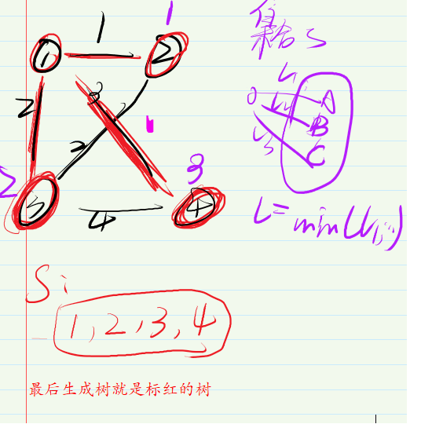

AcWing 858. Prim算法求最小生成树
AnrolsP的头像AnrolsP
25分钟前
题目描述
Prim 和dijkstra 的区别：
Dijkstra
集合：当前以确定的最短距离的点
1.迭代n - 1次，每次寻找不在集合中并且距离最小的节点。
2.找到后放入集合。
3.更新其他节点到起点最短距离。
Prim
集合：当前的生成树（已经在连通块中所有点）
1.迭代n次，每次迭代找到集合外距离最近的点（一开始没有选中一个点，因此迭代n次）。
2.用t更新其他点到集合的距离（dijkstra 算法是更新其他点到到起点的距离）。
3.更新到集合中。
模拟：
